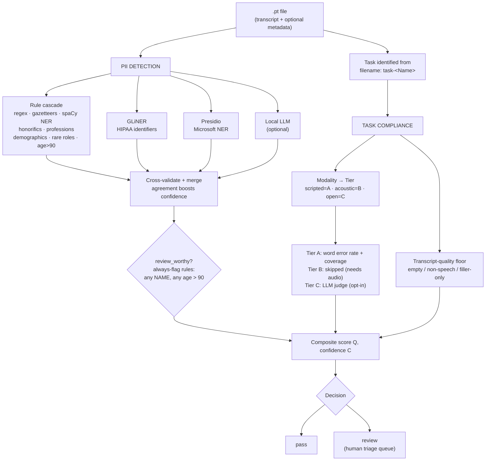

# PII Detection + Task Compliance Pipeline

`pii_compliance_pipeline.py` screens a folder of `.pt` feature files containing ASR
transcripts and answers two questions per recording:

1. **Does this recording contain personally identifying information?** — names, ages over 90,
   dates, locations, contact details, ID numbers, and subtler *quasi-identifiers* that can
   single a participant out.
2. **Did the participant actually do the task they were asked to do?** — did they read the
   passage, sustain the vowel, answer the question, or is the recording empty / off-script?

Each file comes back as **`pass`** (nothing worth a human's time) or **`review`** (a human
should look at it). **Nothing is ever auto-deleted, auto-redacted, or auto-rejected** — the
tool builds a triage queue and a person always makes the final call.

**Everything runs locally.** Transcript text is only ever processed in-process (spaCy / GLiNER /
Presidio) or sent to `localhost` (Ollama). **No transcript text leaves the machine.** The only
network traffic is a one-time download of model weights and gazetteers — never your data.

This implements the two text-level checks — **(3) PII Detection** and **(4) Task Compliance** —
from the poster *"An AI Pipeline for Ensuring Audio Data Quality"* (Ng, Wilke, Johnson, Ghosh),
operationalising the companion proposal *"Unified Framework for PII Detection and Task
Compliance Verification in Clinical Voice Recordings."*

## Two files, and they travel together

| File | What it is |
|---|---|
| `scripts/pii_compliance_pipeline.py` | The pipeline. Self-contained — imports nothing from `senselab`. |
| `scripts/task_reference.json` | 797 task definitions (Bridge2AI acoustic tasks): task → instructions + expected read-aloud prompts. Drives Tier A/B/C routing. |

The JSON is resolved **relative to the script's own folder**, not your working directory, so the
pair runs from anywhere. If it is missing the run **stops** rather than quietly skipping every
scripted-task check — see *Known limitations*.

The script is deliberately standalone: it is a research/ops tool that happens to live in this
repo, not a `senselab` module, and nothing in the package imports it.

## Install

Only `torch` is strictly required (to read the `.pt` files). Every detection engine is
optional and degrades gracefully with a printed notice if absent — run with none of them and
you still get the rule cascade plus task compliance.

```bash
uv sync --extra pii --extra nlp
uv run python -m spacy download en_core_web_lg
```

> **Python version.** spaCy currently publishes wheels for CPython 3.11–3.13 only, so on a
> **3.14** environment `--extra pii` cannot install spaCy or Presidio. The pipeline still runs
> — it prints `[spaCy] not importable` / `[Presidio] not importable` and continues on the rule
> cascade plus GLiNER — but with two of four PII engines silently absent, which will show up as
> lower name/location recall. **Check those two startup lines before trusting a run's numbers.**
> Use a 3.12/3.13 environment for the full engine set.

The optional local LLM additionally needs [Ollama](https://ollama.com) running on
`localhost`, with a model pulled:

```bash
ollama pull gemma4
```

## Quickstart

```bash
uv run python scripts/pii_compliance_pipeline.py --selftest
```

That runs 137 checks on synthetic data in a temp directory. It is **hermetic**: every PII
engine is forced off, the name gazetteer is stubbed and the LLM is disabled, so it makes no
network calls and its verdict does not depend on which optional packages are installed.
`--selftest-full` instead exercises the real spaCy/GLiNER/Presidio load paths — useful, but
it downloads model weights and its result varies with your environment. Then
point it at some data:

```bash
uv run python scripts/pii_compliance_pipeline.py /path/to/pt_files
```

Or set `INPUT_FOLDER` in the CONFIG block and run the file straight from your IDE — see
*Configuration*. Either way you get a JSON report, a CSV summary, and the flagged file list
printed at the end.

> **Sanity check before a big run:** set `MAX_FILES = 20` to process just the first 20 files.

## Configuration

All settings live in **one place**: the `MODES` and `SETTINGS` blocks at the top of the script.
There are no environment variables and no config file. Command-line flags exist for one-off
overrides, but running the file from an IDE uses exactly what is written in those blocks.

`MODES` is the panel of on/off toggles — engines, LLM, precision vs recall posture, always-flag
rules. `SETTINGS` holds paths, model names and thresholds. A `NOTES` section below them records
*why* each default is what it is. Every run prints the modes actually in force, so an IDE run
without a visible command line still tells you what was on.

The one value you must set is `INPUT_FOLDER`. With no input path the script stops immediately
and says so — it does not guess, and it does not scan the working directory.

## Modes — pick your operating point first

This is a **triage screen**, and screens have no single "best" setting. Everything below trades
the same two quantities: **how many real problems you catch** against **how many files a human
has to open**. Nothing here can auto-reject a recording; only the size and purity of the review
queue changes.

Numbers are from the study corpus — **894 recordings, 42 genuinely non-compliant**. Treat them
as the shape of the trade, not as guarantees for your data.

| Mode | How | Catches | Queue | Use when |
|---|---|---|---|---|
| **Precision-first** *(default)* | *(no changes)* | ~12 / 42 | ~13 files, ~92% real | Reviewer time is scarce; you want a short list that's almost all real. |
| **+ open-task judging** | `ENABLE_LLM = True` | **20 / 42** † | ~100 files, ~20% real † | You need free-speech / story-recall tasks checked at all. Adds ~1–2 s per file. |
| **+ recall nets** | `HIGH_RECALL = True` | more | larger | Thin open responses and weak PII should surface too. |
| **+ acoustic with speech** | `RECALL_FLAG_ACOUSTIC = True` | more | much larger | A vowel/breath task that transcribed as words is worth a look. |
| **Maximum recall** | above, plus `RECALL_ACOUSTIC_MAX_CONTENT_WORDS = -1` | ~41 / 42 | ~620 files (~69%) | A missed problem is unacceptable and you will screen most of the corpus. |

† Measured with a previous model (phi4); the default is now gemma4, so treat those two figures
as indicative until re-measured. Every other row is unaffected.

**Do not steer by accuracy.** Only ~5% of this corpus is non-compliant, so a screen that flags
*nothing* scores ~95% and catches nothing.

Two switches are orthogonal to that ladder — combine them with any mode above:

| Switch | Effect |
|---|---|
| `COMPLIANCE_ONLY = True` | Skip PII detection entirely. Much faster (no spaCy/GLiNER/Presidio load). PII is reported as **skipped**, not as clean. |
| `PRECISION_MODE = False` | Drop the PII false-positive guards. Affects PII only, never task compliance. |

## How it works



### Step 1 — Load the transcript

Each `.pt` is loaded exactly as:

```python
data = torch.load(path, map_location="cpu", weights_only=False)
transcription = data["transcription"]
```

Optional keys are used if present and ignored if absent: `task`/`task_id`/`task_name`,
`reference_text`/`reference`/`target_text`, `prompt`/`instruction`/`rubric`, `tier`.

### Step 2 — PII detection: several engines in parallel, then cross-validated

| Engine | Role |
|---|---|
| **Rule cascade** | regex for structured identifiers (SSN, email, phone, URL, MRN), name/place gazetteers, spaCy NER, honorifics, professions, rare-word MISC, self-disclosed **demographics**, **rare roles**, **age > 90**, and a **combinatorial** sliding window catching re-identification from several weak details together |
| **GLiNER** | HIPAA-identifier detector (names, dates, phone/fax, email, SSN, MRN, device/vehicle IDs, URLs, IPs, biometrics, geo) |
| **Presidio** | Microsoft's NER-based PII analyzer |
| **Local LLM** *(optional)* | Independent judgement on ambiguous spans, plus a "do these details *together* identify someone?" call |

Engines run independently and are then merged. Where they agree, confidence is boosted
(`cross_validated: true`); where they disagree the span is surfaced rather than silently
resolved. Categories map onto the annotation-guideline label set: `AGE, NAME, DATE, TIME, ORG,
IDNUM, LOC, PROFESSION, CONTACT, URL, MISC`.

**The key concept — `review_worthy`.** Every detection is recorded in the JSON report, but a
file is only *flagged* if it has at least one review-worthy span. This is the main defence
against drowning reviewers in false alarms. A span is review-worthy when it is a confirmed
direct identifier, **any** name, **any** age over 90, a cross-validated (≥2 engine)
`ORG`/`LOC`/`DATE`/ID, a combinatorial cluster, or a quasi-identifier.

#### Always-flagged identifiers

Two types bypass every precision guard and always route to review:

- **Every personal `NAME`** — regardless of whose it is or how weak the signal. A spoken name
  belongs in the redaction queue, so even a lone common word tagged as a name (`Will`, `May`,
  `Grant`) flags the file. Expect some NER false positives; that's the intended trade. Names
  are still **never** auto-failed. Toggle: `FLAG_ALL_NAMES`. This changes how a detected name
  is *treated*, not whether it is *detected* — a name the NER engines miss can't be flagged.
- **Any age over 90** — at the top of the age distribution the population thins out enough that
  age alone can identify someone. (HIPAA Safe Harbor treats *all* ages over 89 as identifiers —
  set `AGE_REVIEW_OVER_YEARS = 89` for strict alignment.) Catches the phrasings ASR really
  produces: `95 years old`, `97-year-old`, `aged 102`, spelled-out numbers (`ninety-five`,
  `a hundred and two`), plus `in her nineties` / `centenarian`. Non-age numbers
  (`100 percent`, `95 dollars`) are never misread as ages.

#### Quasi-identifiers (the subtle cases)

- **Unusually specific roles.** The motivating real example: a participant mentioning being a
  *professional figure skater* — ethics judged that "a bit too much info". Distinguishing
  qualifiers (*professional / Olympic / former …*) and self-described uncommon occupations flag
  as review-worthy `MISC`. Common jobs ("I'm a teacher", "professional development") are
  deliberately excluded.
- **Self-disclosed demographics.** Gender / gender identity (*"I identify as nonbinary"*) and
  race / ethnicity (*"I'm Black"*) are protected attributes that aid re-identification, so they
  route to review as `MISC`. Deliberately high-precision: only *self-* or *person-anchored*
  mentions fire, so *"black coffee"*, *"Chinese food"* and the rainbow passage's *"white light"*
  all stay clean. Toggle: `DEMOGRAPHIC_PII`.

### Step 3 — Task compliance: identify the task, then route it to the right test

The task is read from the `.pt` **filename's** BIDS-style `task-<Name>` field
(`sub-…_ses-…_task-Rainbow_features.pt` → `Rainbow`), looked up in `task_reference.json`, and
classified into a **modality** that determines how — or whether — compliance can be judged from
text alone:

| Modality | Example tasks | Tier | How it's scored |
|---|---|---|---|
| **scripted** | Rainbow passage, Caterpillar, Cape-V, Harvard sentences | **A** | word error rate + reference coverage against the reference prompt |
| **acoustic** | DDK, max phonation, prolonged vowel, glides, loudness, breath/cough | **B** | **skipped** — non-verbal; a near-empty transcript is *expected* and never failed |
| **open** | free speech, picture description, story recall, fluency | **C** | LLM judge against the task's instruction (needs `ENABLE_LLM`) |

Matching tolerates case, `-`/`_`/space differences, subtype variants (`diadochokinesis-PA`,
`cape-V-sentences-3`) and a trailing `-features`. Sibling variants are resolved most-specific
first, so `Picture-description` never silently pulls in `picture-description-option2`'s prompt.

#### Tier A in detail — "did they read the script?", not "how clean is the ASR?"

Those are very different bars, and conflating them is the single biggest source of false
positives here. On clinical read-aloud speech a **WER of 0.1–0.4 is the normal cost** of
dysphonia, accent, room noise and ASR error on a participant who read the script perfectly
well. Someone who read the *wrong* text lands far higher — 0.6 to over 1.0. So WER is mapped
onto the compliance score through explicit thresholds rather than used raw:

| Word error rate | Score | Decision |
|---|---|---|
| ≤ `TIER_A_WER_REVIEW` (0.50) | 1.0 → 0.9 | **pass** — they read it; the rest is ASR noise |
| 0.50 → `TIER_A_WER_FAIL` (0.80) | 0.9 → 0.5 | **review** — doubtful read |
| > 0.80 | 0.5 → 0.0 | hard fail → **review** — wrong text or no read |

Two further guards stop the two ways WER lies about read speech. **Both can only move a file
towards `pass`** — neither can create a flag, so neither trades away recall:

- **Absolute error floor** (`TIER_A_MIN_WORD_ERRORS`, default 4). WER is a *ratio*, so it
  punishes short references hardest: three misheard words in a 5-word Cape-V sentence is WER
  0.6, while the same three errors in the 64-word rainbow passage is WER 0.05. The short
  sentence is not twelve times less compliant.
- **Reference coverage** (`TIER_A_COVERAGE_PASS`, **off by default**). WER also counts
  *insertions*, so someone who reads correctly then adds anything — "sorry, let me start again",
  an aside to the researcher — can exceed WER 1.0 having said every reference word. Coverage is
  insertion-blind by construction, so it answers *was the script read?* where WER answers *how
  cleanly?*. **This guard is an assumption about your annotators, not about ASR**, which is why
  it ships disabled: in the study corpus reviewers labelled two such recordings `partial`, so
  enabling it turned two catches into misses while rescuing no false positives. Set it to
  `0.90` and re-measure to find out which way your own labels go.

Every Tier A result reports `wer`, `coverage`, `word_errors`, `ref_words`, the
substitution/deletion/insertion split, and which guard (if any) fired — so a reviewer can see
*why* a read passed or was queued.

> **The reference text has to be right.** Tier A is only as good as `task_reference.json`: if a
> task's prompt there isn't the text participants were actually given, *every* recording of that
> task gets a large, near-identical WER and the whole batch lands in the queue. That signature —
> one task, many subjects, the same WER — means a wrong reference, not non-compliant
> participants. Check it before retuning thresholds.

**Transcript-quality floor (always on).** Independent of the task, a degenerate transcript means
the task was never performed — a signal needing no metadata at all:

| Transcript | Outcome |
|---|---|
| empty / whitespace only | hard compliance failure → **review** |
| only non-speech markers (`[noise]`, `(coughing)`) | hard compliance failure → **review** |
| only filler vocalizations (`uh`, `um`) | hard compliance failure → **review** |
| 1–2 content words, or mostly filler | **review** (near-degenerate) |
| real, substantive content | treated as a valid attempt |

This floor is **suppressed for acoustic tasks** (a breath recording has little text by design)
and wherever a Tier A/C score is authoritative, so those are never falsely failed.

### Step 4 — Score and decide

`Q = Σ wᵢ·cᵢ·sᵢ` (weighted quality) and confidence `C = weighted_mean(c)·(1 − λ·std(c))`, so
**disagreement between engines widens the review band** rather than being averaged away.

The three-way logic (`pass` / `review` / `fail`) is computed and then **collapsed to two-way:
`fail` is folded into `review`**, so the final decision is only ever `pass` or `review`. Nothing
is auto-rejected. The underlying severity is still reported per file:

| Field | Meaning |
|---|---|
| `flagged_by_pii` | The file has review-worthy PII. |
| `pii_confirmed` | Stronger: a confirmed direct identifier (`HARD_GATE_PII_LABELS`, default `{IDNUM, CONTACT, URL}`). |
| `flagged_by_compliance` | A task / quality / protocol issue. |
| `compliance_fail` | Stronger: a hard failure (degenerate transcript, missing required step, or score below cutoff). |

A spoken `NAME` is deliberately **not** in `HARD_GATE_PII_LABELS`: it is redactable PII that
belongs in the review queue, not a reject.

### Optional: interview-style protocol steps

Set `PROTOCOL_SPEC` to a spec JSON and the pipeline additionally checks whether required
protocol steps happened (consent obtained, identity confirmed, …) via a keyword/phrase
gazetteer → sequence verification → the LLM on residual steps. This needs curated
`canonical_phrases`, which is why it lives in an optional file. Most per-recording task
compliance does not need it.

## Outputs

| Output | Contents |
|---|---|
| `OUTPUT_JSON` | Full report: every detection, span offsets, per-tier scores, masked preview, and `summary.flagged_files`. |
| `OUTPUT_CSV` | One row per recording: decision, Q/C, PII labels, WER/coverage, quality status. |
| `OUTPUT_FLAGGED_LIST` | Just the flagged file paths, one per line — the plain-text handoff to whatever does review next. |

The flagged list is also printed at the end of every run with a short reason per file
(`pii:confirmed`, `compliance:fail`, …).

## Known limitations — read before trusting the numbers

**This tool reads text only.** Poster steps needing raw audio — **(1) Audio & Environment
Quality**, **(2) Unconsented Speaker Detection**, and **Compliance Tier B** — are reported as
`skipped: requires audio`. That leads to three honest blind spots:

1. **Acoustic-task non-compliance is largely invisible, and this is measurable.** A participant
   who did too few repetitions, or didn't attempt the task, produces a near-empty transcript —
   *identical* to a perfectly compliant breath or vowel recording. Meanwhile compliant
   DDK/counting tasks often *do* transcribe as words. On the study corpus: of ~200 acoustic
   recordings whose transcript is `too_short`, about 5% are the ones humans marked
   non-compliant; of ~76 with an `empty` transcript, roughly 1. **No transcript-level feature
   separates them** — every threshold that catches a miss drags in ~20 compliant files. That is
   why `RECALL_FLAG_ACOUSTIC` is off by default, and why the fix is audio-level analysis
   (energy, repetition counting, duration), not better text thresholds.
2. **"Answered the wrong question" needs the LLM.** Whether a free-speech response actually
   addresses the prompt is a semantic judgement only the Tier C judge can make. By default open
   tasks are carried by the transcript-quality floor alone, which sees only *whether* someone
   spoke. Every open-task miss on the study corpus was a fluent, substantial response that
   simply didn't do what was asked.
3. **Subtle contextual PII can be unflaggable.** Some human `context` judgements rest on details
   no span-level detector can see.

**If the LLM can't be reached** the run prints `[LLM] Ollama not reachable …` or `model … is not
installed` and continues *without* Tier C — which looks exactly like a fast successful run.
Check that line. With the LLM on, budget ~1–2 s per file once warm, so tens of minutes for a few
hundred recordings; pilot with `MAX_FILES` first. The pipeline uses **one** model on purpose:
Ollama holds a limited set resident, so rotating across several forces a disk reload on nearly
every call, and that reload tax dominates runtime.

## Data safety

- The pipeline only ever **reads** `.pt` files, and reads them with torch's **safe
  unpickler** (`weights_only=True`), so a malicious or corrupted `.pt` cannot execute code
  during a scan. `TRUST_INPUT_PICKLES = True` opts out for files you produced yourself.
  Masked previews live in the report and are never written back; nothing is auto-redacted.
- **Outputs are sensitive.** The JSON and CSV contain real subject/session IDs and PII-derived
  content — treat them as sensitive as the recordings. A bare output filename is written
  **beside the input data**, never into the working directory, so running from a repo
  checkout cannot drop them into the source tree; all three default names are also in
  `.gitignore`. Full transcripts are withheld unless `INCLUDE_TRANSCRIPTS = True`: the
  report carries detected spans and a masked preview, but a clean file's transcript is not
  copied verbatim into a document that gets circulated.
- **No participant paths in source.** `INPUT_FOLDER` ships empty; the script stops rather than
  guessing.
- **`--selftest` fabricates its own synthetic data** in a temp directory, so the tool can be
  verified without touching real recordings.
