# The triage DAG, linearized from code, against its own goals

This document is generated by reading `run.py`, every node under `nodes/`, `vocabulary.py`'s
`fold_file_verdict`, `config.py`, and `data/config/default.yaml` directly — not from prior design
prose. Where an older spec doc disagrees with what is written here, the code is authoritative and
the older doc is stale. Re-verify against those files (not against this one) after any change to
them; nothing enforces that this stays current.

Regenerated 2026-09-07 at `f62f716e` from the code rather than by patching the previous text, and
brought forward to 2026-09-12 at `46f73787` — the posteriorgram and Praat preprocessing blocks, the
content-first ruleset, the fourth branch and the QUALITY edge. The glossary below is the first
thing to read: the document's vocabulary is exact, and the exactness is load-bearing.

Re-verified against the code at **`76fe6293`**, seventeen substantive commits on from the reading
above. Five of those changed what a section here asserts rather than only extending it, and each is
called out where it lands:

- **The ruleset now runs inside the graph** (`a8b15900`). TAXONOMY evaluated it over the store it
  was writing and recorded the result; ROUTING carried that selection beside its own, and it decided
  nothing.
- **The ruleset now decides, and the path it replaced is deleted** (stage 2). ROUTING owns the
  evaluation, writes the `ruleset_routing` measurement itself, and selects branches from it.
  TAXONOMY's kind lines, the `kind` entity type, `taxonomy.presence_floor.*`,
  `routing.BRANCH_FOR_KIND` and the parallel `ruleset_will_run` column are gone. **The deleted path
  emitted a constant**: every presence floor was null, so `_line_state` read `unavailable` on every
  line, `_fold_authoritative_line` mapped that to `uncertain`, voice was a hardcoded retired stub,
  and `by_classification = state != ABSENT` therefore made `will_run` true for AIRWAY, SPEECH and
  VOICE on every recording ever measured. Steps 3, 3c, 4 and 7 are rewritten; see
  `../20260912-ruleset-in-pipeline/design.md` for the two-stage staging.
- **QUALITY has a node** (`c3011de8`, `15fb5ece`, `29006b8a`, `a89c36af`, `9d5032f3`). The sentence
  "there is no `nodes/quality.py`" was true of every earlier reading of this document and is now
  false; step 5e is rewritten.
- **A finished run can be extended** (`bb63d659`, `29006b8a`, `44a2e241`, `9d5032f3`, `8b3b60bf`,
  `845651a7`). Five drivers append to — or, in one case, retire from — a completed store what the
  pass that produced it could not, over one shared module and one typed-absence rule; see step 9.
- **`words.onomatopoeic_tokens` is populated** (`77b247a1`), so PREPROCESS now brackets a
  transcribed cough — which removed 888 spurious SPEECH routings.
- **The corpus figures have a file** (`76fe6293`). Every corpus-wide number in step 3c is now read
  out of [`runs/ruleset-score-20260912/ruleset_score.json`](runs/ruleset-score-20260912/ruleset_score.json),
  the scoring run's own output, whose `config_hash` matches the packaged config at this commit. The
  figures that stood here before were an earlier, narrower measurement; step 3c says which is which
  and why both are correct for what they measure.

Spot-checked again on 2026-09-13 at `51967abb`, which corrected eight citations and three claims
about current behaviour: the gap spans below, QUALITY's margin, the `clip_contradiction_margin`
readership, the extend drivers' fingerprint gate, TAXONOMY's third activity step, DDK's `NO_NODE`,
four stale FIGURE line numbers and two stale `vocabulary.py` ones. The section that changed most is
"Background, and the gap spans", which asserted the opposite of what the code does.

**Where this graph is going is designed, and none of it is built.**
[`../20260913-branch-contract-and-hints/design.md`](../20260913-branch-contract-and-hints/design.md)
(2026-09-13) specifies a four-stage pipeline — PREPROCESS → SCREEN → BRANCHES → VERDICT — in which
TAXONOMY and ROUTING merge into one SCREEN node; every branch works to one five-verb contract
(`label`, `contest`, `refine`, `trim`, `propose`, of which only `propose` mints a span entity, and
`refine` covers a span's metadata as well as its extent as of 2026-09-15); the
declaration is resolved from the BIDS sidecar JSON rather than parsed out of a filename; deviations
are written as enumerated facts rather than judgements; and PREPROCESS is required to emit a *clean*
span set rather than the permissive one a recall-first router wants. **Read it as a design.**
Everything below this point describes the graph as it runs today, and the design is cited again at
the three places where this document already records the matching item as owed.

## Glossary

The vocabulary below is used precisely and its terms are not interchangeable. More than one defect
this week came from collapsing a pair of them, **detector into gate** most often of all. Every
example is read off the shipped ruleset (`taxonomy.ruleset` in `data/config/default.yaml`) or off
`routing_analysis/{detectors,ruleset,report,families,labels}.py`; none is invented.

**detector** — a named reading of **one** number out of a recording's evidence, with a polarity and
a sweep grid. **It decides nothing**: every threshold in its grid is scored and none is preferred
(`detectors.py:1-7`). There are **172** in the catalogue, `DETECTORS`. Example:
`airway.residual_energy_fraction` reads `("residual", "energy_fraction")` — the residual stream's
energy as a fraction of `plain` — polarity `above`, swept over a grid derived from that detector's
own distribution in the profile. A detector's `kind` (`airway`, `speech`, `voice`, `cough`, `glide`,
`ddk`) names the reference standard it is scored against, not a branch it commands.

**the three detector states** — a detector is in exactly one of three places and the difference is
what a new profile is allowed to do to it (`detectors.py`, `_check_staged`,
`_check_branch_detectors`):

- **catalogue** — `DETECTORS`, 172 of them, each with a grid derived from the profile.
- **staged** — `STAGED_DETECTORS`, declared before any sweep has profiled it, carrying an empty
  `thresholds` and outside the catalogue. There is **one**: `cough.words_onomatopoeic`. A profile
  that starts carrying its distribution makes the import raise until it is moved into the
  catalogue, which is the whole point of the state.
- **branch-held** — `BRANCH_DETECTORS`, a mapping from a branch to the detectors that branch reads.
  A held detector has been swept and **rejected as a gate**, deliberately; it also carries an empty
  grid, is outside the catalogue, and **no profile moves it anywhere**. That absence of a
  "now profiled" rule is the only thing distinguishing it from a staged one. There are **22**, all
  under `"VOICE"`: nineteen of kind `glide` and three of kind `voice`, every one reading
  `RecordingFeatures.phonation`. They lost to the incumbent singing union as router gates — recall
  0.624 against 0.749, absent on 7,157 recordings against 29 — and were kept because the direction
  they read separates the two glide families by roughly 100x when nothing in the catalogue separates
  them at all. `nodes/voice.py` does not read them yet.

The distinction is not bookkeeping. `UNPROFILED_DETECTORS` used to hold both meanings, and applied
to a measured-and-held detector it turns a recorded decision into an import error the next time the
corpus is profiled.

**gate** — a detector **plus one threshold**, named in `taxonomy.ruleset.gates`, that a branch
routes on. There are **9** declared: eight route and one only flags. **Every gate is a
detector-shaped reading; most detectors are not gates** — 172 catalogue readings, 9 of them pinned
to a cut, and the pinning is the whole difference. `airway.residual_energy_fraction` becomes the gate
`airway.breath` by being fixed at `>= 0.10`; `speech.words_lexical` becomes `speech.lexical` at
`>= 2`; `voice.longest_amplitude_span` becomes `voice.sustained` at `>= 3.0 s`;
`voice.yamnet_chant_peak.plain` becomes `voice.chant` at `>= 0.02`. One gate happens to carry its
detector's own name — `airway.ppg_silent_fraction` — which is spelling, not identity: the detector is
the sweep, the gate is the one point taken off it. One other, `airway.bracketed_event`, reads a
source no detector reads (`BRACKETED_SET` in `ruleset.py`) and carries a cut that was never swept.
**DDK names no gate at all** and routes on `routing.declaration_required` instead; its two former
gates, `ddk.lexical_repetition` (`TRANSCRIPT_REPEAT`, never swept) and `ddk.ppg_segment_rate_per_s`,
were removed once the declaration decided the route.
A gate is evaluated on **every** recording and reports one of `FIRED`, `SILENT` or `UNAVAILABLE`;
`UNAVAILABLE` is a fact about the store, never a negative measurement.

**flag** — a gate listed in `taxonomy.ruleset.branch_flags` instead of `branch_gates`. It is
evaluated, recorded in `gate_outcomes` and named in `RouteEvaluation.flags`, and it **routes
nothing**: it annotates a branch already entered. There is one, `speech.transcript_agreement`
(`words.agreement >= 3`). `load_ruleset` refuses a configuration listing the same gate as both.

**branch** — `AIRWAY`, `SPEECH`, `VOICE`, `DDK`: `vocabulary.BRANCHES`. A gate firing routes the
recording to its branch, and a branch is the authority on its own kind and on no other. Any one of
a branch's gates firing is enough; they are OR'd, never conjoined.

**QUALITY** — in `GRAPH_ORDER`, after `VOICE` and before `REDACT`, and **not** in `BRANCHES`. Every
recording reaches it whatever routed, which is exactly why it cannot be a route: a gate firing on
everything selects nothing. It is a graph edge. It has no entry in `branch_gates`, `branch_flags` or
`reference_family_set`. Emptiness reaches it directly, bypassing the branches. **It now has a node**
(`nodes/quality.py`) and the runner calls it on every path PREPROCESS completed — see step 5e. The
four `quality.*` floors it was declared for are still null and still read by nothing; what it
implements is a consistency audit over PREPROCESS's own records.

**file route state** — `ROUTED`, `EMPTY` or `UNEXPLAINED` (`ruleset.RouteState`, mirrored as
`vocabulary.FILE_ROUTE_STATES` at `vocabulary.py:51`), **exactly one per recording**, replacing a
pair of booleans that could both be false. `ROUTED` is a charge against nothing, `EMPTY` is a charge
against the recording, and only `UNEXPLAINED` — nothing fired and the audio does not say why — is a
charge against the ruleset. It is a store fact: ROUTING writes it as the `state` of the
`ruleset_routing` measurement, and the fold reads it for the `acoustically_empty` discard and the
`UNEXPLAINED` flag (step 7). There is no fourth, null reading: a failure to evaluate now raises.

**branch route state** — `routed`, `declined`, `unavailable` or `ungated`
(`vocabulary.BRANCH_ROUTE_STATES`), **exactly one per branch per recording**, derived from the same
evaluation by `routing._route_states`. `routed` is a gate fired; `declined` is every gate evaluated
and none fired; `unavailable` is no gate fired **and** at least one of that branch's gates could not
be read — a branch that was never judged, not one that declined; `ungated` is a branch that names no
gate at all, which the ruleset never looked at. Do not collapse the four: only `routed` runs the
branch, and only `routed` and `declined` are readings to disagree with, which is why `_agreement`
returns `resolved` for both `unavailable` and `ungated` (step 7). The two resolve for different
reasons and must not be merged — `unavailable` says an instrument failed, `ungated` says none was
configured, and conflating them misleads exactly the reader debugging a route.

**recorded routing** — the `ruleset_routing` measurement ROUTING writes
(`vocabulary.RULESET_ROUTING`, `live_evidence.route_attributes`): file route state, the routed
branches in `BRANCHES` order, every gate's outcome by name, the per-branch `unavailable` mapping,
the flags, the feature sources this configuration consumes, and the stem. **It is what decides
execution.** Every `branch_decision` is derived from it (`routing.py:241`) and VERDICT reads it back
for the file route state (`verdict.py:120`). It carries no `authoritative` field and no `error`
field: both were stage-1 scaffolding for a reading that decided nothing.

**typed absence** vs **failure** — a derivation that *cannot apply* to a recording against one that
*broke*. The typed absences are the exception classes in `extend.UNAVAILABLE`:
`AudioTooShortForAST`, `CrisperWhisperDecoderPositionsExceeded`, `F0RangeUnavailable`,
`PpgsPosteriorgramUnavailable`, `SpanTooShortForYAMNet`. `extend.attempt_derivation` records one of
those as `absent: <Class>: <message>` and **does not fail the row**; any other `OSError`,
`ValueError` or `LookupError` is recorded with its class and message and does. The distinction is
worth a glossary line because getting it wrong has cost a whole corpus pass: 613 of 60,202 rows
"failed" and every Slurm array task exited nonzero, and all 613 were `phonation_tracks` on unvoiced
audio — 271 harvard fragments and 243 airway recordings where no F0 range can be derived. That is
the correct answer to the question, not a failure to answer it. Inside PREPROCESS the same
separation is made by the per-block `try`/`except` (an absent derivative versus a collected hard
failure); inside the ruleset it is `GateOutcome.UNAVAILABLE` against `SILENT`; at the driver level
it is this rule. All three say the same thing and none of them is derivable from the others.

**bypass** — `taxonomy.ruleset.emptiness`: the max tracked-label peak of `enhanced|yamnet` and of
`residual|yamnet` both under `0.2`. It is consulted **only where no gate fired**, as the explanation
for that, never as a precondition that could stop a gate from running. A gate firing on a recording
the bypass would have called empty routes it normally, and that disagreement is a measurement of the
bypass rather than something the evaluation suppresses.

**family** — the elicitation group a BIDS stem's `task-` entity collapses into, by removing trailing
numeric segments only (`families.task_family`). There are **48** across the four declared sets in
`families.py`. Example: `..._task-harvard-sentences-list-10-3` collapses to
`harvard-sentences-list`; a `v2` marker is not numeric, so `respiration-and-cough-breath` and
`respiration-and-cough-v2-breath` stay two families.

**reference standard** — the declared families a branch is **scored** against,
`taxonomy.ruleset.reference_family_set`: `AIRWAY: airway`, `SPEECH: lexical_speech`, `VOICE: voice`,
`DDK: syllable_repetition`. **It routes nothing** — no gate is skipped, relaxed or tightened because
of it — and **it is a proxy, not ground truth**: a recording can genuinely contain content its task
never asked for. 938 of 1,258 `prolonged-vowel` transcripts open with `'One two three'` because the
protocol instructs the count-in, so SPEECH firing there is the gate reading content correctly and
the `extra` it scores is the proxy's error, not the gate's.

**held out by construction** — families dropped from a branch's scored population,
`taxonomy.ruleset.excluded_by_construction`, because they are **neither** positives **nor**
negatives for it. One branch declares one: `SPEECH: syllable_repetition`, **7,989** recordings.
Diadochokinesis *is* speech; it sits outside `lexical_speech` only because that set is the lexical
half. Counting a DDK recording SPEECH routed as a false positive charges the branch for behaving
correctly — over the whole SPEECH branch, holding them out takes specificity from **0.663** to
**0.895**, and for the single gate `speech.lexical >= 2` a threshold sweep puts **71.3%** of its
apparent false positives in DDK families and its DDK-excluded specificity at **0.855**. Those are a
branch figure and a gate figure and are not interchangeable; see step 3c. `score_branches` computes
both 2x2 tables rather than choosing, and `load_ruleset` refuses a branch that holds out families
its own reference set calls positive.

**No branch declares one any more, as of 2026-09-15.** The owner directed that a declared branch be
included in the evaluation rather than held out of another branch's population, so
`reference_family_set.SPEECH` is now `speech` (= `lexical_speech | syllable_repetition`) and
`excluded_by_construction` is null throughout. The mechanism and both validation errors stay; the
refusal above is what would catch a half-applied version of that change. **The specificity figures
in this paragraph are unchanged** — exclusion and multi-label leave the negative side identical,
because the held-out families were all positives, so the branch figure is **0.895** either way and
the gate figure is still **0.855**. The positive side is what changes: the 7,989 recordings become
7,626 credited routings and **363 counted misses** instead of being discarded. The branch table at
the end of this document was measured under the single-label reference and is labelled there.
Derivation: [`../20260915-gate-family-matrix/design.md`](../20260915-gate-family-matrix/design.md).

**polarity** — `above` or `below`: which side of the threshold fires. 152 of the 172 catalogue
detectors are `above` and 20 are `below`. A gate spells the same thing as `op: at_least` / `at_most`, which
`ruleset._POLARITY` maps back onto the polarity vocabulary the recall curve reads. It is not
cosmetic: `ddk.ppg_repetition_lag_segments` scored a flat line at every budget until its polarity
was corrected, which read as a measured null and was not one.

**sweep grid** — the candidate thresholds a detector is scored at (`Detector.thresholds`,
ascending via `sweep_points`). **A grid that fails to cover its feature's range makes a detector
look measured-and-weak when it was never measured.** `airway.praat_phonation_ratio` is the worked
case: 31,464 of its 60,048 readable values sat above the last point of the hand-written proportion
grid, so every threshold in it saw the same undivided block at the top and no cut could separate
anything inside it. The register of ten such grid/feature pairs is in
[`../20260911-praat-ppg-detectors/design.md`](../20260911-praat-ppg-detectors/design.md), "Grids
that may not cover their feature's range".

**No grid is a constant any more, and this failure mode is now refused rather than documented.**
`derive_thresholds` (`detectors.py:314`) builds each grid from that detector's own quantile ladder
in the dated profile under `data/detector_profile/`, unions in the ladders of ungated siblings
reading the same primary feature, and **raises** when the derived grid does not reach the profiled
extreme on the polarity's firing side. Two clamps follow from the same reading: the grid is cut to
`[min, max]` of what the contributing ladders attain, with the pinned cut points and — for a
`score`-unit detector — `taxonomy.consolidation_floor` unioned back in afterwards. Before that
clamp, integer enumeration started at zero whatever the feature reached, so
`ddk.ppg_distinct_phonemes` (polarity `below`, profiled minimum 1) swept a threshold at 0 that fired
on nothing and reported it as a measurement. A grid whose best threshold is its own last entry has
not been swept; it has been truncated.

**detector profile** — the dated table each grid is derived from, one row per detector, carrying
`n`, `availability`, `polarity`, `state`, `min`, `max`, `distinct` and the quantile ladder. It is
**parquet** as of `f73d2581` (`data/detector_profile/2026-09-12.parquet`, 25,224 bytes against the
129 kB JSON it replaced), with its sweep header in the file's key-value metadata rather than in a
row. It is generated, never hand-edited. Note that it is a record of a past sweep and not of the
current catalogue: the shipped profile carries **175** rows against the catalogue's 172, the three
extra being `{airway,speech,voice}.ast_peak.consensus`, which left the catalogue when
`PER_SPAN_CLASSIFIERS` was fixed at `{yamnet, hear}` and AST acquired no per-span pass. Rows the
catalogue does not name are ignored; rows it names and the profile lacks raise.

**availability** — the share of the population whose evidence a detector can read at all
(`RecallCurve.availability`), the complement of `n_unreadable`. **A detector absent on part of the
corpus has a recall ceiling below 1 whatever its threshold**, and `RecallCurve.recall_ceiling` names
that ceiling so a flat curve is not mistaken for a weak one. `airway.ppg_silent_fraction` is absent
on the 2,345 recordings with no consensus transcript and therefore no posteriorgram: availability
**0.963**, ceiling **0.875**. That is why it is OR'd beside `airway.breath`, whose own feature is
absent on 31, rather than replacing it — each reads a population the other cannot.

**over-routing budget** — the false-positive rate a threshold is allowed to spend
(`OVER_ROUTING_BUDGETS` = 2%, 5%, 10%, 20%). A threshold is chosen as **the loosest cut inside a
budget**, tightened back to the strictest cut reaching the same recall, **not** by maximising
Youden's J, **because a router's errors are asymmetric**: an over-routed recording costs a branch
some discarded work, an under-routed one is never seen by anything that could interpret it. J prices
the two the same. `airway.ppg_silent_fraction` shipped at 0.90 — recall 0.499 at a false-positive
rate of 0.042, well inside the 10% budget and so stricter than a router should be — and the criterion
moved it to **0.757**, for recall 0.761, 193 recordings that reached no branch now reaching one, at
1,929 additional branch invocations the branches discard. Each `BudgetPoint` records whether the
budget or availability is what bounds it (`LIMIT_BUDGET` / `LIMIT_AVAILABILITY`).

**kind** — what a branch concludes *about*: `airway`, `speech`, `voice`. It survives in exactly two
places, both of them a branch naming its own subject: `NodeVerdict.kind` on a branch's verdict
entity, and `detectors.Detector.kind` naming the reference standard a detector is scored against. It
is **no longer a state the graph decides**. Nothing writes the `kind` entity type any more, and
`taxonomy.presence_floor.*` and the **evidence lines** that counted stored elements against those
floors are gone with it. The type itself stays in `PROV_TYPE` as historical, so the 62,578 stores
that carry one remain openable — see "the reader's vocabulary" below. Where this document once said "the kind is uncertain", read "the branch has not
concluded"; where it said "the kind is absent", read "the branch found no subject". The fold is
keyed by **branch** throughout, not by kind (`vocabulary.fold_file_verdict`, `vocabulary.py:294`).

**node outcome** vs **file verdict** — `Outcome.PASS/FLAG/FAIL` is what one node concluded;
`Triage.PASS/FLAG/DISCARD` is what should happen to the recording. They are different axes and a
node's outcome is never a file result. Restated below where the fold is described, because this is
the second most-collapsed pair in the document.

## The goal this graph exists to serve

Stated by the project owner: **flag for review** a recorded voice task (coughing, breathing,
speaking, phonation) from people across the lifespan, potentially with voice, respiratory, or other
disorders. Concretely, a file should be flagged when:

1. **the recording is of bad quality** — low SNR, or clipping in task-relevant regions;
2. **it contains other speakers within target-speaker-specific spans**;
3. **the spoken speech contains PII not included in the task itself.**

Goal 2 is not airway/speaker-specific by construction: PREPROCESS's span block is one
foreground-acoustic-event detector for any duration carrying foreground acoustic energy — other
people talking, other sound sources, not only the target speaker — and `span_hear`/`span_yamnet`
attach classifier evidence to each one (`preprocess.py:_spans`, `_span_hear`, `_span_yamnet`).

The graph sorts every file into exactly one of three outcomes: **pass** it through, **flag** it (a
person should look), or **discard** it (unmeasurable, or acoustically empty). Every node below is
read against that.

**Headline finding, stated up front because everything else is downstream of it.** The graph now
**routes on measured content**, and all three triage outcomes are reachable. Until stage 2 they were
not, and the reason is worth keeping: the path that decided execution emitted a constant. Every
`taxonomy.presence_floor.*` was null, so `_line_state` returned `unavailable` on every line;
`_fold_authoritative_line` mapped that to `uncertain`; `voice` had had no evidence source at all
since the phonation-span detector was retired on 2026-09-04 and its line was a hardcoded stub. All
three kinds therefore read `uncertain` on every recording ever measured, `by_classification =
state != ABSENT` was true for all three, and **every branch ran on every file** — the mechanism had
never routed anything because it had never declined anything. TAXONOMY's own `fail` and `pass` were
unreachable with it, so TAXONOMY always wrote `flag`, and that flag reached the fold as a reason,
making `Triage.PASS` and the acoustically-empty `Triage.DISCARD` unreachable too.

Stage 2 deleted that path outright rather than fitting the floors. TAXONOMY now consolidates and
concludes only about what it had to consolidate; ROUTING evaluates the ruleset and selects from it;
and `acoustically_empty` is read off the ruleset's own `EMPTY` state — the emptiness bypass finding
every tracked stream peak under `emptiness.peak_floor` — which is the **first measured** basis that
ground has ever had.

**QUALITY is now a second, independent source of the same flag**, and it does not lift the finding
either — it adds to it. Its verdict enters `fold_file_verdict`'s `reasons` like any other node's
(`reasons = list(node_verdicts)`, `vocabulary.py:363`), so a clip contradiction flags the file on
its own. Its expected count is zero on a fresh run; see step 5e.

**The measured ruleset is now the only mechanism.** `taxonomy.ruleset` and `routing_analysis/`
carry a content-first ruleset scored over 62,547 recordings, which routes 99.2% of the corpus to a
branch. ROUTING evaluates it over the store TAXONOMY left, records the reading as the
`ruleset_routing` measurement under its own node, and writes one `branch_decision` per branch from
it. **There is no second selection.** `BRANCH_FOR_KIND`, `KIND_STATES`, `UNREADABLE`,
`UNCLASSIFIED_BRANCHES`, `_classifications`, `_ruleset_selection` and the `ruleset_will_run` /
`ruleset_route_state` columns are all deleted, and a failure to evaluate the ruleset now raises and
errors the node, because a failure to route *is* a failure to run the graph.

**The presence-floor path is gone from the code, not merely unused.** The `taxonomy.presence_floor`
subtree, `taxonomy.voice_min_duration_s` and `taxonomy.voice_uncertain_duration_s` are out of
`data/config/default.yaml`, and the twelve helpers that folded them are out of `nodes/taxonomy.py`.
No node writes a `kind` entity. `taxonomy.speech_labels` stays, with exactly one reader left:
`nodes/speech.py:589`. `../20260912-ruleset-in-pipeline/design.md` is the staging document. See
step 3c.

**The `kind` entity type stays in `PROV_TYPE` (`prov_store.py:17-38`), and that is deliberate.**
`read_jsonl` validates every entity's `prov_type` against that literal, so removing the member makes
every store written before 2026-09-13 unopenable — all 62,578 of them, and with them all five
`scripts/extend_*` drivers. **"Pre-alpha: delete outright" governs our own API surface, not the
ability to read records already on disk.** The store is append-only and W3C PROV-shaped: a reader
that refuses a record it previously wrote contradicts that premise. Retiring a type from the writer
is the deletion; retiring it from the reader is data loss. The member carries a docstring saying it
is historical, and `prov_store_test.py::test_every_readable_entity_type_round_trips` — parametrised
over the whole literal — is the guard.

## How to read this document

Each step states **what it does**, **what decides something and on which config parameters** (a
parameter is named whenever it changes a decision, not merely a measurement), and **which of the
three goals it serves, if any**. A dotted key like `taxonomy.presence_floor.speech.lexical` is a
path into `data/config/default.yaml`.

`null` there means declared but unmeasured. Which of two readers is used matters and is called out
throughout: `config.require(...)` **raises** on a null, and inside PREPROCESS that raise is caught
and recorded as an absent derivative (`preprocess.py:2634-2637`) while the node still returns
normally; `config.get(...)` returns `None` and the caller carries on **silently**. The second is
the more dangerous of the two. Its worst instance — a null silently deleting the whole ASR span
source — was closed on 2026-09-05 by deleting the key (see PREPROCESS below); the pattern survives
in `taxonomy.speech_labels`, read `get ... or []` by its one remaining reader
(`speech.py:589`), where a null empties the speech family without a word anywhere. It had two
readers until stage 2 deleted TAXONOMY's.

The config is **304 lines, 160 leaf keys, 33 of them null** — three of the thirty-three are the
`excluded_by_construction` entries of the branches that hold nothing out, where null is the value
and not an absence of one. Stage 2 removed six keys from it: the four
`taxonomy.presence_floor.*` leaves, `taxonomy.voice_min_duration_s` and
`taxonomy.voice_uncertain_duration_s`, and renamed `routing.hint_kind_map` to
`routing.hint_branch_map` (its values are branch names now, not kind names). It carries a short `#` description per section and per key and nothing
longer. There is no `derivation:` key: it used to hold 50 kB of
prose, and because the loader hashes the merged mapping that prose sat inside `config_hash`, so
correcting a word of it made two behaviourally identical runs report different identities. The
derivations now live in [`config-derivations.md`](config-derivations.md), keyed by the same section
names, and `#` comments are not hashed.

## The call graph

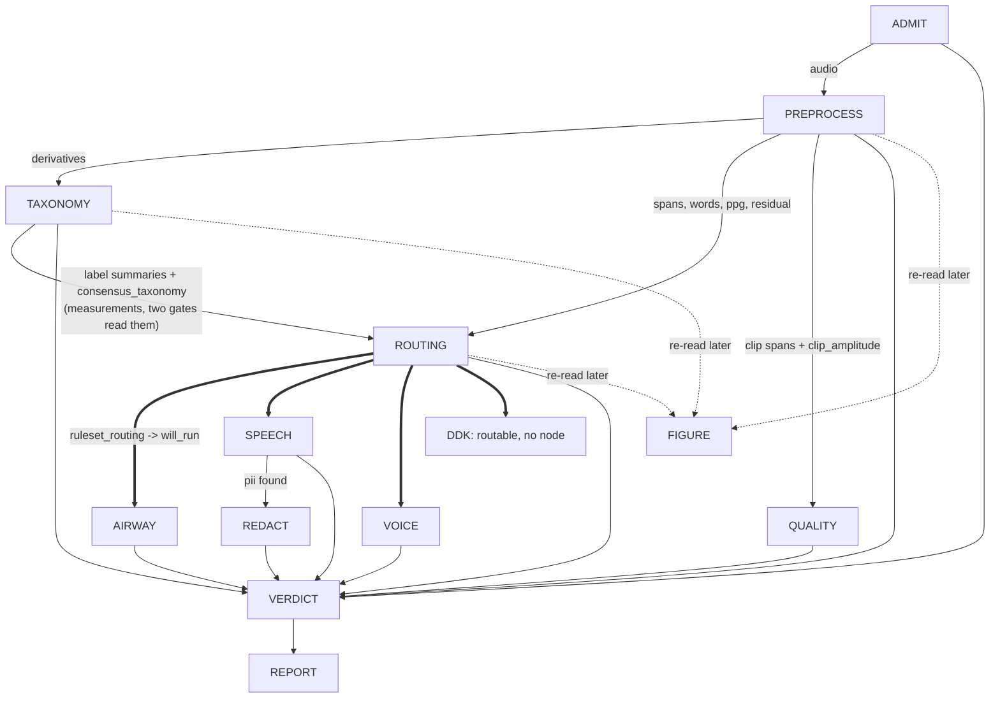

**TAXONOMY's edge into ROUTING carries measurements, not a decision.** It is a real dependency and a
strict ordering requirement — `voice.glide` and `voice.chant` read `plain|yamnet`, which the feature
reader populates from the `yamnet_label_summary` TAXONOMY writes — but nothing TAXONOMY writes
selects a branch. ROUTING's own evaluation of `taxonomy.ruleset` is the single decider, and it is the
only thing on this diagram that is. The second edge TAXONOMY used to have into ROUTING, the
non-authoritative `ruleset_routing` reading, is gone because ROUTING now makes that reading itself.

**DDK is routable and still has no node.** `run._drive_branches` looks a branch up in its dispatch
table rather than indexing it (`run.py:303-305`), so a branch with no implementation is recorded
`SKIPPED` with the note `NO_NODE`, selected or not. ROUTING now writes a `branch_decision` for DDK
like any other branch, and `will_run` is true for it whenever one of its two gates fires. **The
consequence is a flag, and it is the honest one**: the decision says the branch was asked, no verdict
comes back, and the fold emits "DDK was asked to run and never ran". That is scoped to recordings
whose DDK gates actually fire, not to every recording — which is precisely the difference from the
kind-line route rejected in step 5d — and it is the standing argument for building `nodes/ddk.py`.

**QUALITY's edge comes from PREPROCESS, not from the branches.** It is drawn after them in
`GRAPH_ORDER` and called after the branch loop, but it reads no branch output as evidence: its
inputs are ADMIT's `recording` stream entity, PREPROCESS's `clip` spans and PREPROCESS's
`clip_amplitude` measurement. What it takes from the branches is only the list of node names that
had concluded when it read the store, which it records as `preceded_by`. It is not guarded by
routing: a ROUTING that raised leaves every branch `SKIPPED` and QUALITY still runs.

`GRAPH_ORDER` is `("ADMIT", "PREPROCESS", "TAXONOMY", "routing", "AIRWAY", "SPEECH", "VOICE",
"QUALITY", "REDACT", "VERDICT")` and `BRANCHES` is `("AIRWAY", "SPEECH", "VOICE", "DDK")`
(`vocabulary.py:14-33`). **The two lists are not the same list and neither contains the other**:
`QUALITY` is a graph edge every recording reaches and not a branch, and `DDK` is a branch the graph
orders nowhere — see step 5d. REPORT runs after VERDICT and is not in `GRAPH_ORDER` (`run.py:44`).
FIGURE is in neither: the in-tree runner never calls it, though the pipeline as actually run does,
right after TAXONOMY (see step 3b).

**Three places the graph stops short, each of a different kind** (`run.py:_drive_branches`). These
are dependency checks in the runner and are *not* gates in the ruleset's sense — nothing here reads
a threshold:

- **ADMIT** is the initial one. A `fail` leaves every other node `skipped` and only VERDICT runs,
  which is what makes "could not measure" distinguishable from "measured, found nothing".
- **PREPROCESS** cannot flag or fail, but it can raise, and everything after it reads what it
  measured — so a raise skips TAXONOMY, routing, every branch, QUALITY and REDACT.
- **ROUTING** is a dependency check: if it raises, no branch has an authorised decision, so every
  branch is `skipped`. **QUALITY is not behind this check** — it sits after the branch loop and runs
  whatever routing did, because its evidence is PREPROCESS's.

A branch that raises is recorded `errored` and its siblings still run: none reads another's output.

**The two short-stop paths do not record DDK, and the happy path does**, which is a small
inconsistency worth knowing before reading a `run.json`. On the ADMIT-fail and PREPROCESS-fail paths
the runner writes `SKIPPED` for a slice of `GRAPH_ORDER` (`run.py:432`, `:291-292`), and `DDK` is
not in `GRAPH_ORDER`, so it carries no outcome at all there and is absent from
`TriageRunResult.nodes`. On the happy path the branch loop records it `SKIPPED` with
`note: "no node implements this branch"`.

## The linear walk

### 1. ADMIT — is this file measurable at all

Decodes the recording and admits it. **The only rejections are decode failure, zero decoded
frames, all samples zero, and a constant signal** (`admit.py:1-6`; zero frames is its own case at
`:83`, distinct from all-samples-zero). No thresholds, no models, no derived audio, and **no
`flag` outcome** — `pass` or `fail` only (`admit.py:70`, `:102-107`). It reads **no config key at
all**, which it shares with VERDICT alone.

*Goals served*: none directly. It is the precondition for all three.

### 2. PREPROCESS — condition once, measure everything, decide nothing

The one conditioning pass. Every model answering a whole-file question runs here — YAMNet, AST,
HeAR, both recognizers, SQUIM, and FRCRN (a fourth model class, `FRCRN_ID`, `preprocess.py:130`) — and **no
later node re-runs one**, though YAMNet, AST and HeAR each run once *per stream* rather than once
per file (the six `{enhanced,residual}_{yamnet,ast,hear}` block entries) (`preprocess.py:1-16`).

It takes no pass/flag/fail decision, but it is not guaranteed to complete. Each block runs in its
own `try`/`except`: a block whose config value is null, or whose upstream prerequisite is missing,
records that derivative **absent** and the pass continues; any *other* exception is collected and,
after every remaining block has run, re-raised as one summary (`preprocess.py:2630-2644`). So
"unmeasured because unconfigured" and "unmeasured because broken" are different outcomes, and only
the second stops the graph.

The blocks, in execution order (`preprocess.py`, the `blocks` list):

`clip_spans`, `yamnet_scores`, `yamnet_windows`, `silence`, `ast_scores`, `ast_windows`,
`hear_scores`, `hear_windows`, `level`, `disruptions_file`, `asr_crisperwhisper`, `asr_qwen`,
`consensus_transcript`, `phonation_tracks`, `energy_envelope`, `normalized_envelope`,
`spectrogram_wideband`, `spectrogram_narrowband`, `continuity_trace`, `spans`, `residual`,
`enhanced_yamnet`, `enhanced_ast`, `enhanced_hear`, `residual_yamnet`, `residual_ast`,
`residual_hear`, `squim`, `span_hear`, `span_yamnet`, `gammatone`, `ppg_posteriorgram`,
`praat_features`. The six classifier blocks are
`_stream_yamnet`/`_stream_ast`/`_stream_hear` parameterised by stream prefix (`enhanced`,
`residual`); the last two are new and are described below.

**Two blocks read the `enhanced` stream and nothing else: `ppg_posteriorgram` and `praat_features`**
(`ppg_posteriorgram` at `preprocess.py:826`, `praat_features` at `:859`; block entries at
`:2627-2628`). They run last, after `residual` has written the stream they read, and both
are measurements with no boundary decided.

- **`ppg_posteriorgram`** runs `interactiveaudiolab/ppgs` over the enhanced stream resampled to
  `PPGS_SAMPLE_RATE` and writes the frame-major float16 array to
  `derivatives/ppg_posteriorgram.npz` with its phoneme order, seconds-per-frame, duration and
  sampling rate beside it. The entity carries the **path, its SHA-256, its size and its shape** and
  never the array. Its agent records `unresolved_reason` rather than a commit: ppgs ships its
  checkpoint inside the PyPI release, so there is no commit to resolve — the one model in the graph
  where recording nothing is the honest answer. It runs in the `ppgs` subprocess venv, so the run's
  environment record gains that venv's own row.
- **`praat_features`** is Praat/Parselmouth's whole-file set over the same stream, at
  `praat_features.time_step_s` and `praat_features.window_length_s`. Its **forty scalars are
  attributes of the measurement** rather than a sidecar — at that size a file would only add an
  indirection — and a non-finite scalar is written `null`, JSON's only representation of a number
  Praat could not place.

Neither block decides anything, and **no node reads either directly** — but both now reach a
decision, because `taxonomy.ruleset` has a posteriorgram gate and ROUTING evaluates the ruleset
(step 4). `RecordingFeatures.ppg` reduces the posteriorgram to
`PPG_SUMMARY_KEYS` (segment rate, segment duration statistics, distinct phonemes, silent fraction,
the repetition triple) and `RecordingFeatures.praat` carries the scalars.
`airway.ppg_silent_fraction` is the gate. `ddk.ppg_segment_rate_per_s` was a second until DDK moved
to the declaration and both its gates were removed, so `segment_rate_per_s` is now reduced and read
by nothing.

**A third `enhanced`-stream block is owed and does not exist: diarization.** `diariz` and `pyannote`
appear nowhere in `nodes/preprocess.py`; the graph's only diarization is SPEECH's, inside that branch
and scoped to the lexical hull. The owner's instruction is that PREPROCESS gain a block shaped like
`ppg_posteriorgram` — pyannote over each `enhanced` file, writing one whole-file measurement of
whether the recording holds one speaker or more, with an `extend_*` driver for finished runs — so
that *"more than one speaker in this recording"* can be raised as a deviation by the node positioned
to raise it (step 5e). **Owed a code change.** It is not in the block list above, because that list
is read off the code; it is listed as owed in [`preprocess.md`](preprocess.md) § *Derivatives*.
[`../20260913-branch-contract-and-hints/design.md`](../20260913-branch-contract-and-hints/design.md)
§ *Whole-file diarization as a shared derivative* owes the same block, and the **stream** question
an earlier version of this paragraph recorded as open — raw against enhanced, pending a pilot,
because enhancement suppresses the quiet background talker the derivative exists to catch — **was
settled by the owner on 2026-09-15**: diarize both `enhanced` and `residual`, because enhancement
partitions the recording rather than destroying that talker, so a suppressed voice is in `residual`
where it can be analysed directly. Neither the shape nor the stream is in dispute now, and no pilot
is owed. **SPEECH reads the derivative rather than running pyannote itself**, by the owner's decision
of the same date.

**FIGURE draws neither.** `figure.py` mentions no posteriorgram and no Praat scalar anywhere. A PPG
lane exists — `_ppg_panel` / `plot_range_with_ppg` in `audio/tasks/plotting/plotting.py`, whose bars
were made full-height washed bands at `9e171ad0` precisely so that no bar edge could be read as a
probability — but `figure.py` imports no plotting API at all and `plot_range_with_ppg` has no caller
in `src/` or `scripts/`.

**They are no longer the only derivatives with no panel.** The clip work added two more: the
`clip_amplitude` measurement and the `clip_withdrawn` assertions. Live `clip` spans *are* drawn, in
the span lane, and `_clip_extents` keeps only the live ones — so on a fresh store a withdrawn
candidate was never a span entity at all, and on an extended one it is a superseded span the lane
correctly omits. Either way a reader of the PDF sees the clip spans that stand and no trace of the
candidates something denied. `figure._spans` derives each general span's `contains_clip` from those
live extents rather than from its own stored attribute, which is what lets a clip span be retired
later without re-minting every span that overlapped it.

**Residual.** FRCRN_SE_16K (`FRCRN_ID`, `preprocess.py:130`) runs on `plain`
(`_residual`, `preprocess.py:2311`), is cross-correlation lag-aligned via `compute_residual`
(`speech_enhancement/residual.py:176`), and both the aligned enhancement and `plain − g·enhanced`
are written as streams (`preprocess.py:2364`, `:2384`). One `residual` measurement records
`lag_ms`, `gain_db`, `energy_fraction`, `correlation_*`, `peak_dbfs`, `rms_dbfs`, per-band energy
fractions, and the speech preconditions `speech_present`/`n_consensus_words`/
`speech_coverage_fraction` (`preprocess.py:2418-2441`). It decides nothing. No meaning or energy
gate decides whether the streams are written: `speech_present`/`speech_coverage_fraction` are
preconditions on interpretation, not gates (`preprocess.py:2322-2336`, `:2406-2417`), and speech
regions come from `_speech_regions` (`:2293`) — the consensus's lexical words' per-source
timings when a consensus exists, else this pass's own amplitude-source spans, with
`speech_overlap_source` naming which.

`residual.enabled` is **true** in the packaged config (`data/config/default.yaml:209`), so the
block runs by default. When an operator sets it false, `_residual` raises
`ValueError("residual.enabled is false")` (`preprocess.py:2339`) and is recorded as an absent
derivative (`:2634-2637`), and the six stream-classifier blocks then raise
`LookupError(f"{prefix} is absent")` (`:2473`). That absence has a different cause from the
null-threshold absences below and is not the same kind of gap.

Name the twelve `{prefix}_{classifier}_summary_all` / `_summary_speech_free` derivatives
(`_stream_classifier_summaries`, `preprocess.py:2490`). `speech_free` is the windows with
`speech_overlap == 0.0` — no new threshold; each window carries a `speech_overlap` fraction.
The pair exists to separate the enhancer's speech-shaped artefact from real background.

**Streams.** The recognizers, aligner, SQUIM, level and the window classifiers read the plain
resampled signal; the envelope, spans, spectrograms, gammatone and the phonation tracks read the
pre-emphasised one; `disruptions_file` reads the original recording (`preprocess.py:3-7`); and
`enhanced` and `residual` are each read by their own three classifier blocks
(`preprocess.py:2470-2473`). Streams persist as FLAC through one shared writer —
`STREAM_SUFFIX = ".flac"` (`common.py:18`), `write_stream` with `out_of_range="normalize"`
(`common.py:301-323`) — whose returned gain every caller records as the stream entity's
`write_gain` (`preprocess.py:1154`, `:2377`, `:2397`). `plain` additionally records `peak_scale`
from a pre-write peak normalisation (`:1139-1142`); these are the only record that samples were
scaled.

Points that decide something, or that are currently deciding something by omission:

**`clip_spans` is the one block that withdraws a candidate it proposed, and it writes the
amplitudes the audit reads.** `_clip_spans` (`preprocess.py:1195`) runs first, over the
**original** recording before any normalisation. It detects clip events, merges them across
`clipping.merge_gap_ms`, and then applies `reject_contradicted_clips` (`preprocess.py:510`) before
writing anything:

- A clip span asserts *the signal reached its ceiling over this extent*. A sample outside every
  surviving candidate that is louder than a candidate's own peak by more than
  `quality.clip_contradiction_margin` (**0.005**) of that peak denies the assertion — a real ceiling
  truncates everything above it, at any scale.
- `quality.clip_edge_guard_samples` (**3**) excludes that many samples either side of a candidate as
  that run's own decay, so a clip's own shoulder cannot contradict it.
- Withdrawal only *enlarges* the unclipped set, so the split is re-read until it stops moving; each
  round removes at least one candidate, so it terminates within `len(extents)` rounds.
- A withdrawn candidate is written as an **assertion** with `verb: withdraw`, not as an invalidated
  span. A span written and invalidated in the same activity would put a live-looking `clip` entity
  over that extent into the store for any reader that keys by extent rather than by liveness. The
  ids land in the `clip_withdrawn` derivative.

`write_clip_spans` (`preprocess.py:672`) then writes the surviving spans **and**, beside them, one `clip_amplitude`
measurement: the loudest unclipped sample, where it sits, how many samples are unclipped evidence,
the guard used, and — keyed by span id — each span's own peak and how many unclipped samples exceed
it. It is a measurement and not a span attribute because the store is append-only and a finished run
must be able to gain it (step 9). **It exists because QUALITY reads no audio**; the waveform is in
hand exactly once, here.

Both keys live in the `quality:` section and are the only two of its six that anything reads.

**A transcribed cough is now a bracketed token.** `words.onomatopoeic_tokens` shipped null and is
now `[cough, coughs, coughing, 咳, 呵, ahem, hack, khh, kof, cof]`, read by `_consensus`
(`preprocess.py:2103`) with `config.get(...) or []` and handed to `align_sources`, which brackets
each match. The null was not inert: `words.lexical` counted a transcribed cough as speech, and 545
`respiration-and-cough-*` recordings carried `lexical >= 4`, 523 of them also tripping the DDK
repetition gate. The lexicon was measured at `>= 2` tokens over the corpus — sens 0.361, spec 0.999,
1,015 true positives against 81 false — but **PREPROCESS brackets at one token, and the firing rate
of the lexicon at `>= 1` was not measured**. The derivation is in
[`family-taxonomy-ruleset.md`](family-taxonomy-ruleset.md). Two consequences: `cough.words_onomatopoeic`
is staged (never swept, not in `branch_gates`), and **every corpus figure in this document that
involves `words.lexical` predates this change**.

**Raw scores and thresholded labels are two different things, and only one of them survives a
null.** `<classifier>_scores` persists every window's raw score and reads no threshold.
`_windows(classifier)` then folds a **membership rule** over those stored scores into per-window
label sets. The rule is one object, `LabelMembership` in `label_membership.py`, read from the three
`windows.<classifier>` keys — a label is carried when it is in the window's top `label_top_k`
**and** at or above `default_threshold` (or its own `label_thresholds` override). One
implementation, two callers: `_confident_labels` here and `_label_span_statistics` in
`routing_analysis/features.py`, so what PREPROCESS stamps and what the analysis re-derives cannot
drift.

The two loaders are not interchangeable and the difference is where the nulls land:

- `load_label_membership` **requires all three keys**, `label_thresholds` included, and
  `_windows(classifier)` uses it. `windows.{yamnet,hear}.default_threshold` are now **0.2** and
  `label_top_k` is 4 for all three — but `label_thresholds` is null everywhere, so
  **`yamnet_windows`, `ast_windows` and `hear_windows` are still all absent under the packaged
  config**, while the raw scores they were folded from are present. The absent-derivative reason has
  changed; the absence has not.
- `optional_label_membership` reads a null `label_thresholds` as *no override* — the overrides refine
  a floor that is already declared, so their absence is a complete rule rather than a missing one —
  and returns `None` only when `default_threshold` itself is null. `_span_hear` and `_span_yamnet`
  use it, so **both per-span passes now produce a membership** where they used to produce none;
  `windows.ast.default_threshold` is still null, and there is no per-span AST pass at all.

`_span_window_attributes` writes `raw_scores` unconditionally — the model ran, so its output is a
measurement — and writes `labels`/`scores` only when a rule existed, with a `labelled` flag
distinguishing **"no threshold was set"** (`labelled: false`, no labels) from **"nothing cleared the
bar"** (`labelled: true`, empty labels). **The 62,547-recording corpus was produced under the old
nulls**, so every per-span window in it is stamped `labelled: false`; the analysis re-derives
membership from the stored `raw_scores` either way, and nothing needs re-running to read it. A
future run stamps the same membership the analysis derives. The floors moving changes
`config_hash`.

A short span borrows from the whole-file YAMNet pass instead: `_covering_window_attribution`
(`preprocess.py:354`) computes `score[label] = Σ(score_w · overlap_w) / Σ overlap_w` over
whole-file `yamnet_scores` windows intersecting the span. A span shorter than the native window
(`SpanTooShortForYAMNet`) is scored this way and carries `attribution: "covering_windows"`,
`covering_windows_n`, `covering_seconds` (`:1981-1985`); a natively classified span carries
`attribution: "native"` (`:2026`). A short span with no covering window is marked
`no_covering_window`; a missing whole-file pass is `yamnet_scores_absent`. HeAR still centres a
short span in a silent 2 s buffer instead (`:1887`, `span_hear_input`) and writes no
`attribution` field.

AST has the same shape of limit and is handled the same way. Its feature extractor asserts `window_size <= len(waveform)` inside `torchaudio.compliance.kaldi.fbank`, so a trailing window shorter than 400 samples at 16 kHz (25 ms) aborts the pass. `AudioTooShortForAST` (`classification/huggingface.py:23`, raised at `:238`) is a `ValueError`, so the block is recorded as an absence rather than a hard failure and the recording keeps its YAMNet and HeAR results. A file 10.2632 s long yields one full 10.24 s window plus a 371-sample remainder, which is how this arises; it hit 55 of 62,550 recordings before the guard.

**Per-span classification is batched.** Both passes build every span's input first, then make **one
call per classifier** (`_classify_spans_in_batch`, `preprocess.py:273`). A batch is used only
when it returns exactly one result per input — a short return is treated as a failure rather than
aligned by position, since misattributing one span's scores to another is worse than failing — and
a batch that raises falls back to one call per span, recording `"<Error> (after batch failed:
<BatchError>)"` so both facts survive. Input construction stays per span, so HeAR's 2 s buffering
can still refuse one span and have that recorded against it alone. This replaced one subprocess
venv per span: **949.7 s → 176.4 s** on a 79.51 s recording with 91 spans, 182 spawns down to two.

**The span algorithm** (`spans/api.py:propose_spans`), in order:

1. `spans.k_db` (6.0) **proposes**: every maximal run where the envelope has risen `k_db` above the
   floor is one candidate, directly — not a peak later expanded. Nothing crossing yields
   `NoContrast`.
2. `spans.min_separation_ms` (30) merges candidates closer than that into one proposal, **before**
   any walking, so one event's brief dips below `k_db` do not read as several.
3. The onset and offset **walk outward** from each candidate's own edges by an identical rule,
   continuing while the maximum over a `spans.transition_window_ms` (30) window still exceeds
   `floor + k_db`. The walk therefore closes when it finds 30 ms of continuously quiet envelope; a
   shorter dip does not close it. `transition_window_ms` is the *reach*, and it is load-bearing —
   30 ms gives 86 spans on the reference recording, 100 ms gives 45, 300 ms gives 18.
4. `spans.min_duration_ms` (50) discards a walked span shorter than that.
5. Overlapping survivors merge.

`spans.floor_margin_db` was **retired on 2026-09-04**. It had been the walk-stop threshold at 12.0
against a `k_db` of 6.0, and because the stop test was more permissive than the open test, any
sample failing the crossing automatically satisfied the stop — so it could not extend a span at any
value ≥ `k_db`. Substituting `k_db` is behaviour-preserving: 86 spans / 59.77 s before and after,
extents byte-identical on the reference envelope.

**`continuity_trace` is persisted** (`preprocess.py:_continuity_trace`), to
`derivatives/continuity_trace.npz`, with `cut_percentile` and the resolved `cut_level` on the
measurement. It was previously computed inside `_spans`' local scope and left there; writing it out
means a reader draws **the trace these spans were actually proposed from** rather than one
recomputed later against possibly-changed code. `_spans` reads the array back rather than
recomputing it, so the trace and the spans are the same object by construction.

**A null that deleted a span source in silence — resolved 2026-09-05.** `_spans` used to read
`speech.word_gap_ms` with `config.get` and, when it was `None`, simply omit the parameter: no
exception, no absent-derivative record, the ASR span source dropped and PREPROCESS still returning
`pass`. A **388-recording** run over ten subjects produced **7,651 consensus words and zero `asr`
spans**; SPEECH read the same key with `require`, so the same null errored that branch outright on
all **112** recordings of the earlier stage-0 collection
(`config-derivations.md:213-217`). The key is now **deleted outright** rather than given a value:
consensus words arrive
with their own timestamps, so grouping them needs no gap threshold, and
`group_extents_into_runs` merges on adjacency alone (`spans/api.py`). ASR spans exist again, and
the deletion also unblocked SPEECH, which had been `require`-ing the same null key.

**`phonation_tracks` runs under the packaged config.** It used to require a fixed
`voice.f0_range_hz`, which was null; it now requires `voice.f0_search_range_hz` — the wide
`[50.0, 600.0]` each recording's own `[floor, ceiling]` is narrowed from by `derive_f0_range` off
`plain` — and that key is populated, so the block completes and records the derived range on the
measurement. What it measures is F0 over the pre-emphasised stream and the first four formants over
`plain`, per frame: a measurement with no boundary decided. The five surviving `phonation_spans.*`
keys (`hop_s`, `max_formants`, `formant_max_hz`, `formant_window_s`, `formant_preemphasis_hz`) are
its Praat settings and are populated; the eight *detection* keys that used to sit beside them were
deleted with the detector. A fixed range is still expressible, per declared population, through
`voice.f0_range_by_population`, which is null.

*Goals served*: 1 (measures level, SQUIM, disruptions), 2 (the span set and its per-span classifier
evidence), 3 (the consensus transcript PII is scanned from). The posteriorgram and the Praat set
serve none of the three directly; they are routing evidence, and routing serves all three by
deciding which branch gets to look.

### 3. TAXONOMY — consolidate the classifier labels; decide nothing

Runs no model, reads no hint, localises nothing and **decides nothing** (`taxonomy.py:1-10`). It
writes two kinds of file-scoped measurement, both `extent=None`, and concludes only about whether it
had anything to consolidate. Stage 2 removed everything else it used to do: the `kind` entities, the
evidence lines, `SCREENED_KINDS`, the twelve helpers that folded them, and the `ruleset_routing`
reading it took over in stage 1 and handed to ROUTING here.

- **`<classifier>_label_summary`** (`_write_label_summaries`, `taxonomy.py:285`) — per label, peak,
  median and window count over the whole file, read from the verbatim scores sidecar so it needs no
  threshold. One per classifier in `SUMMARISED_CLASSIFIERS` = `("yamnet", "ast", "hear")`
  (`:42`) that produced scores; a classifier that never ran gets no summary, which keeps "absent"
  distinct from "measured nothing". **Its position is a requirement, not a convenience**: two VOICE
  gates read `plain|yamnet`, which the feature reader populates from `yamnet_label_summary`, so a
  ROUTING evaluated before this node would read both `unavailable` and VOICE would never route.
- **`consensus_taxonomy`** (`_write_consensus_taxonomy`, `taxonomy.py:192`) — the per-span labels of
  every per-span classifier (`PER_SPAN_CLASSIFIERS` = `{yamnet: span_yamnet, hear: span_hear}`,
  `:99`) consolidated into one file-level taxonomy for downstream to read instead of re-deriving.
  One row per **ontology node** with `peak`, `peak_by_classifier`, `labels_by_classifier`,
  `classifiers` and `n_classifiers`, ranked by peak. A row is named by the AudioSet display name of
  the node its classifiers' labels denote, so HeAR `Throat Clear` and YAMNet `Throat clearing` are
  one row; `labels_by_classifier` holds each classifier's own spellings. **Disagreement is recorded,
  not resolved**: a label only one vocabulary contains is not a vote against it, so `n_classifiers`
  counts corroboration only. It is a measurement — no floor turning it into present/absent. Nothing
  is written at all when no per-span classifier produced scores, so "no consensus" and "a consensus
  over nothing" stay distinguishable.

`taxonomy.consolidation_floor` (0.2, owner-directed) drops a label scoring under it in
`_consolidate` (`taxonomy.py:165`), for every classifier — a floor only, with no top-K of its own.
The per-span top-4 union that turns into a raster's rows is FIGURE's own choice
(`style.top_labels`, `figure.py:161`), not something `_consolidate` does; with 521 labels, a span
where nothing fires still contributes its four highest, and those are near-zero.

**TAXONOMY's own outcome** (`taxonomy.py:356-361`) is about the consolidation and about nothing else,
because that is the only thing this node now knows: `pass` — "consolidated *N* label(s) from
*classifiers*" — when at least one per-span classifier produced scores, `flag` — "no per-span
classifier produced scores; there was nothing to consolidate" — when none did. The second is worth a
flag rather than a silent pass: with no per-span scores, every label gate ROUTING is about to
evaluate reads `unavailable`, so the file routes on a fraction of the evidence the ruleset was fitted
on. `TaxonomyResult` carries `classifiers: tuple[str, ...]` and `n_labels: int`; its activity steps
are `<classifier>_label_summary` per summarised classifier, `consensus_taxonomy` for the
consolidation (`taxonomy.py:255-263`), and then `conclude` (`:304`, `:351`).

**What is no longer here, and why it was deleted rather than fitted.** `taxonomy.presence_floor.*`
were four nulls, `_line_state` returned `unavailable` whenever `floor is None`,
`_fold_authoritative_line` mapped `unavailable` to `uncertain`, and `_retired_voice_line` was a
hardcoded stub returning `unavailable` with no evidence source at all. So all three kinds read
`uncertain` on every recording this code has ever processed — **the path emitted a constant**, and
fitting four floors would have been fitting thresholds for a classifier nobody had shown was the
right instrument. `taxonomy.speech_labels` survives with one reader, `speech.py:589`;
`taxonomy.voice_min_duration_s` and `taxonomy.voice_uncertain_duration_s` were already read by
nothing and are gone with the rest.

*Goals served*: 2 and 3 indirectly, by giving ROUTING and the branches a consolidated view of what
the classifiers said. It decides nothing itself, which is the point of the measure/decide split this
node sits on the measuring side of.

### 3b. FIGURE — rendering, folded into the preprocessing sequence

`preprocess_figure(store, figure_dir, config, *, run_dir, style=None, stem=None)` (`figure.py:1774`).
Draws PREPROCESS's and TAXONOMY's output from the store — and, since stage 2, ROUTING's decisions
where the kind states used to be: one multi-page PDF, one `taxonomy_summary.json` always written
alongside it, and per-page PNGs only when `style.also_write_pngs` is set (`figure.py:1986`).

**Two things are both true, and the pair is what matters here.** The owner's position is that
figure/PDF generation is part of preprocessing and belongs in the graph as such — every batch driver
that has actually processed a recording, including the recent 388-file batteries, calls
`admit -> preprocess -> taxonomy -> preprocess_figure` in that sequence, with rendering as the final
step (the owner's account of that driver; it lives on cluster scratch, outside this repository, and
its contents are not verifiable from here). Against that: `run_triage` (`run.py`) imports no figure
module and never calls `preprocess_figure` — grep for `figure` in `run.py` returns nothing — and
`scripts/triage_audio.py` calls only `run_triage`. The only caller of `preprocess_figure` inside
`src/`, `scripts/` and `specs/` is `figure_test.py`. **The in-tree runner is the component out of
step with the pipeline as it is actually run, not the other way around.**

**That account is no longer only the owner's: the corpus stores now testify to it.** The completed
62,547-recording pass ran exactly `ADMIT -> PREPROCESS -> TAXONOMY -> FIGURE` — `branch_decision`
and `QUALITY` appear in **0 of 150 sampled stores**. Those stores also now render the cover's route
block as "routing wrote no branch decision", which is the correct reading of them: ROUTING never
ran, so there is nothing to print rather than a set of branches nothing declined. That is the measurement behind the extend
drivers of step 9: every one of them exists because a whole corpus stopped where FIGURE is, and
because the nodes after it read stored outputs and can therefore be run later.

It reads a finished store and **writes nothing back**, so it can be re-invoked over a completed run
directory, the same shape as re-running `report`. It **recomputes nothing**: everything it draws is
a store read or a display transform of one, which is why `continuity_trace` had to be persisted. A
structural AST sweep asserts FIGURE imports no measuring API (`figure_reads_only_test.py:79-92`),
and a second test asserts no `FigureStyle` field name can shadow a pipeline config key
(`figure_test.py:275-288`).

The pipeline configuration is **read and never overridden** — a threshold set to make a panel draw
would produce a picture of a pipeline that is not the one in production. A panel whose element is
absent names the missing derivative and prints the reason the producing node recorded.

**What the PDF contains, page by page:**

| panel | what it shows | store entity / derivative | config key(s) |
| --- | --- | --- | --- |
| cover — SOURCE | the recording's path, wrapped | ADMIT's recorded path (`_source_path`) | none |
| cover — CONSENSUS ALIGNMENT | `consensus_alignment_lines` (`:1568`): algorithm, per-source word counts and timing source, agreement/variant/insertion outcome counts, time-shift fit, word-timing uncertainty | `consensus_transcript` measurement and its word stream | none |
| cover — WHOLE-FILE CLASSIFICATION SUMMARY | built by `_summary_sections` (`:620`), assembled in `summary_panel_lines` (`:887`): each of YAMNet/AST/HeAR's highest-scoring labels over the whole file | `<classifier>_label_summary` (TAXONOMY's fold of `<classifier>_scores`) | none pipeline; `style.summary_labels` caps rows listed |
| cover — ENHANCED — SPEECH ISOLATED BY FRCRN, then RESIDUAL — BACKGROUND AFTER SPEECH REMOVAL | `summary_panel_lines` renders both streams in sequence (`_stream_classifier_block`, `figure.py:783`; titles at `:56`): a gain/enhanced-fraction/residual-energy line, a label summary per classifier over **YAMNet, AST and HeAR** (`_SUMMARISED_CLASSIFIERS`, `figure.py:53`), and a compact speech-free line per classifier (`_stream_speech_free_line`, `:823`) | the `residual` measurement; `{enhanced,residual}_{yamnet,ast,hear}_summary_all` and their `_summary_speech_free` variants | none — all twelve stream summaries now reach the page |
| cover — ROUTE STATES AND GATE OUTCOMES | the last part of `summary_panel_lines` (`:908`), built by `_summary_sections` from `_route_decisions` (`:589`): the file route state, then per branch its route state, whether it runs and whether a hint forced it, its unreadable gates and its fired flags, and finally every gate that fired | ROUTING's `branch_decision` entities and its `ruleset_routing` measurement | none read directly — reflects what `taxonomy.ruleset`'s gates already decided |
| per-page — wideband spectrogram | the speech-analysis spectrogram | `spectrogram_wideband` | `spectrogram.wideband_window_ms`, `spectrogram.hop_ms` (`:1842-1843`) |
| per-page — waveform | conditioned waveform, envelope dBFS trace, floor and `k_db` threshold lines, continuity trace and its rank-cut level | `energy_envelope` (`envelope_dbfs`, `floor_dbfs`), `continuity_trace` | `spans.k_db` (`:1931`) — read here, not by the span lane panel below it |
| per-page — span lane | every live general span (amplitude/continuity/asr/normalization/gap), plus clip-event extents | live `span` entities (`family` absent) and clip-family spans | none read directly — the span algorithm's own keys are already baked into the stored spans |
| per-page — YAMNet raster | the union of each span's top-K YAMNet labels, scored | `span_yamnet` per-span scores | `taxonomy.consolidation_floor` sets the row floor; `style.top_labels` (= 4, `:161`) caps labels per span (`_raster_rows`, `:448`, called `:1849-1850`) |
| per-page — HeAR raster | the same, for HeAR | `span_hear` per-span scores | same as the YAMNet raster above |
| per-page — SQUIM | per-span STOI/PESQ/SI-SDR | per-span `squim` assertions | none (`style.squim_ranges` only sets colour scaling) |
| per-page — consensus ASR / word lane (`_asr_lane_panel`) | each source's own per-word span under the derived extent; agreement words bold, insertions and variants marked | the consensus word stream (from `consensus_transcript`) | none |
| output — `<stem>.pdf` | the cover plus every per-window page above | all rows above | — |
| output — `<stem>__page<NN>.png` | one PNG per page, standalone | the same pages as the PDF | `style.also_write_pngs` (a `FigureStyle` field, not a pipeline config key) |
| output — `taxonomy_summary.json` | the machine-readable form of the whole-file classification summary and the route states — not the cover's SOURCE, CONSENSUS ALIGNMENT or residual lines | the same two blocks as the cover rows above, rebuilt by `taxonomy_summary_lines` (`:703`) | none |

Its own drawing choices live in a `FigureStyle` dataclass, disjoint from anything the pipeline reads.

---

### 3c. The ruleset — what routes a recording, measured, running, and deciding

This subsection used to be a plan headed PROPOSED, then a measurement no node read, then — at
`a8b15900` — a reading recorded beside the path that decided. It is now **the** decision:
`taxonomy.ruleset` in `data/config/default.yaml`, the evaluator in `routing_analysis/ruleset.py`,
and ROUTING evaluating it per recording and selecting from it (step 4).

**The path it replaced emitted a constant, which is why it was deleted rather than fitted.**

| | the presence-floor path (deleted) | the ruleset (running, deciding) |
| --- | --- | --- |
| what it read | `taxonomy.presence_floor.*` over TAXONOMY's evidence lines | eleven gates over `RecordingFeatures` |
| what it produced | every floor null → every line `unavailable` → every kind `uncertain` → **every branch ran on every recording**, on every file this code has ever processed | sens 0.97 / 0.95 / 0.96 / 0.94 across the four branches over 62,547 recordings; 99.2% routed |
| what it selects | — | `will_run` on each `branch_decision` — **this is what executes** |
| what remains of it | nothing: the `kind` entity type, `SCREENED_KINDS`, twelve fold helpers, `BRANCH_FOR_KIND`, `KIND_STATES`, `UNREADABLE`, `UNCLASSIFIED_BRANCHES`, `_classifications`, `_ruleset_selection` and the six config keys are all deleted | — |

[`../20260912-ruleset-in-pipeline/design.md`](../20260912-ruleset-in-pipeline/design.md) is the
staging document: stage 1 made the reading run beside the old path, stage 2 made it decide and
deleted the old path. Its "What stage 2 must delete" section is the item-by-item record of what went.

Everything below is a structural description. The operating points, the firing spreads they were
chosen against, the per-family tables and the enumerated disagreements are in
[`family-taxonomy-ruleset.md`](family-taxonomy-ruleset.md),
[`../20260910-taxonomy-routing-evidence/measurements.md`](../20260910-taxonomy-routing-evidence/measurements.md)
and [`../20260911-praat-ppg-detectors/design.md`](../20260911-praat-ppg-detectors/design.md), and
they are not restated here.

#### Routing is content-first

**Every branch's gates are evaluated on every recording.** The declared family no longer filters
which gates run; it is a reference standard and nothing else. The ruleset used to read the task
family first, resolve it to the branches that family declares, and evaluate only those branches'
gates, with one hand-cut exception for discovered speech. The reversal is the whole change, and the
evidence that forced it is a concrete defect: 74 unambiguous `harvard-sentences-list` read-speech
recordings routed to no branch on their own declared gate and were rescued only by the exception.
`confirming_gates` and `discovery_gates` are deleted, `branch_gates` replaces both, and
`declared_family_set` is renamed `reference_family_set` to say what it now is. Pre-alpha: no
aliases, no flag that restores instruction-first routing.

Three rules follow from it, and they are the ones a reader is most likely to violate:

1. **A reading is evidence.** No detector output is treated as a hallucination or an error because
   it failed some other cut. Where two readings of the same phenomenon disagree, both gates stay and
   the branch routes on either.
2. **The declaration is a prior, never ground truth.** A recording carries whatever the participant
   produced, which is not restricted to what the protocol asked for.
3. **The hint layer is deliberately deferred.** A hint would name which routed branch is the target
   of the elicitation and flag a `missed` or an `extra` as a contradiction. It may never suppress a
   routed branch and no gate's threshold may depend on the family — that would put the instruction
   back into the routing path through a side door.

#### The gates, the flag and the bypass

The diagram is the ruleset's own evaluation, end to end, and it is now the path that executes a
branch: its output is the `ruleset_routing` measurement ROUTING writes, and ROUTING derives every
`branch_decision` from it.

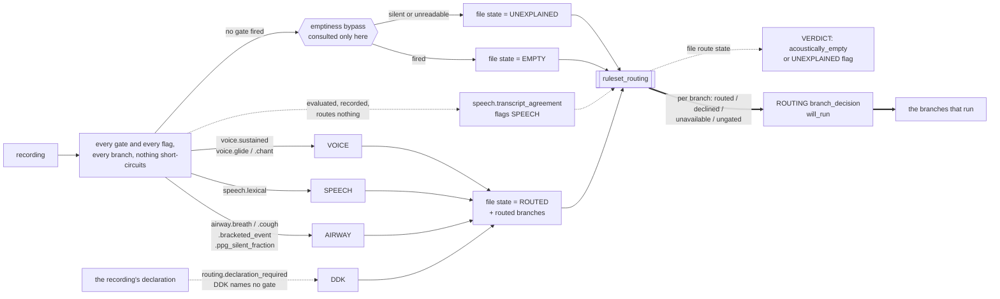

**Every gate reports one of three outcomes and all three are recorded**, so `gate_outcomes` on the
measurement distinguishes a gate that declined (`SILENT`) from one whose evidence was never written
(`UNAVAILABLE`), per branch and **whether or not another gate routed that branch anyway** — that is
a fact about the store, not about the recording.

**QUALITY is deliberately not in this diagram.** Every recording reaches it whatever routed, which
is exactly why it cannot be a route, and since it now has a node its position is a fact about
`run._drive_branches` rather than about the ruleset. See step 5e.

| branch | gates, any one of which routes it | what each reads |
| --- | --- | --- |
| AIRWAY | `airway.breath`, `airway.cough`, `airway.bracketed_event`, `airway.ppg_silent_fraction` | residual energy fraction `>= 0.10`; loudest cough-labelled span `>= 50 dB` over its own floor; one typed bracketed airway token from `taxonomy.airway_bracket_tokens`; posteriorgram frames whose argmax phoneme is `<silent>` `>= 0.757` |
| SPEECH | `speech.lexical` | live consensus words that are not bracketed, any outcome, `>= 2` |
| VOICE | `voice.sustained`, `voice.glide`, `voice.chant` | longest live amplitude span `>= 3.0 s`; YAMNet singing-subtree union peak on `plain` `>= 0.05`; YAMNet `Chant` peak on `plain` `>= 0.02` |
| DDK | none — `routing.declaration_required: [DDK]` | nothing; the declaration routes it, and no content reading can |

**SPEECH routes on ASR words alone.** `words.total` is the wrong field — bracketed tokens fire
almost everywhere, so `total >= 1` scores specificity 0.075 — and the bracketed half is not noise
either: it is airway evidence, with a gate of its own. Two, not one, because a single spurious token
on a held vowel is an ASR artifact: `lexical >= 1` fires on 0.569 of the glide families and `>= 2`
collapses that to 0.065. Two is an artifact boundary, not a max-Youden point, and **3 is the
defensible alternative**; choosing between them is a judgement about which error costs more.

**Agreement is a flag, not a gate.** `speech.transcript_agreement` (`words.agreement >= 3`) is in
`branch_flags`. **It records doubt about *what* was said, not whether speech occurred.** Three
recognizers converging says the transcript is trustworthy; three diverging says it is doubtful. The
lexical count already said whether there was speech. Reading the same recording twice and keeping
only the cases where both readings match measures recognizer concordance, and gating on it was the
defect that discarded the 74 harvard recordings. No downstream consumer reads the flag yet.

**Emptiness is a bypass, not a precondition.** Owner's model: *everything reaches QUALITY after the
other branches, but emptiness reaches QUALITY directly*, and *emptiness is only evaluated if the
other rules have not found a route*. The previous pass asked it first and returned early, so no gate
ran on a recording it called empty and `gate_outcomes` came back empty. Now nothing short-circuits:
every gate and every flag runs, and the bypass is consulted only where none fired, as the
explanation for that. A gate firing on a recording the bypass would have called empty routes it
normally, and **that disagreement is a measurement of the bypass** — do not suppress it, and do not
add a rule letting emptiness veto a gate. The rule itself is unchanged as data: both stream names
and the 0.2 floor stay exactly as they were; only *when* it is consulted has changed.

**Emptiness is ADMIT-shaped and does not live there.** It is a statement that the recording should
not have entered the graph at all, which is ADMIT's question. It sits in the ruleset because that is
where it can be measured against the routed set without re-running the graph. Moving it must carry
the bypass ordering with it: ADMIT runs before any gate, so an ADMIT that discarded on emptiness
would restore the short-circuit this pass removed.

#### The four branches, and why diadochokinesis is one of them

`BRANCHES` gained `DDK`. Diadochokinesis is syllable repetition whose target is a syllable rather
than a word: it holds no lexical content for SPEECH to be the authority on, it is not sustained or
glided phonation for VOICE, and it is not an airway manoeuvre. What it *does* do is fire the lexical
detectors at 92–99%, because a recognizer asked for words on `pa pa pa pa` returns words. Routing it
through SPEECH does not fail loudly; **it succeeds for the wrong reason** and hands a branch a
subject it cannot assess.

`families.py` was not changed for it. `SYLLABLE_REPETITION` already existed and the DDK families are
already inside `DECLARED_KIND["speech"]`; the ruleset reads the narrower set by name, so
`declared_kinds("diadochokinesis-ka")` still returns `{"speech"}` and the existing sweep's reference
standards are unchanged.

`ddk.lexical_repetition` was called `ddk.declared` and was renamed because measurement showed it
only worked when the elicited unit is a dictionary word: `diadochokinesis-buttercup` ("repeat the
**word** /buttercup/") fell through at 1.6%, `diadochokinesis-v2-puh` ("repeat the **syllable** /PA/")
at 24.6%. `ddk.ppg_segment_rate_per_s` was the acoustic gate beside it — a rate of articulatory
change that never had to spell the unit — and it was fitted rather than assumed; the lexical cut of 3
was never swept. **Both are gone**: `routing.declaration_required: [DDK]` made the declaration the
only route into the branch, which left neither gate able to add a route or withhold one.

#### Three outcomes, and only one of them indicts the ruleset

| state | what happened | a charge against | corpus |
| --- | --- | --- | --- |
| `ROUTED` | one or more branches claimed the recording | nothing | 62,023 (99.2%) |
| `EMPTY` | nothing routed, and the audio explains why | the recording | 187 (0.3%) |
| `UNEXPLAINED` | nothing routed, and the audio does not | **the ruleset** | 337 (0.5%) |

There used to be a fourth reading that was not a state: a `ruleset_routing` measurement carrying
`state: null` and a populated `error`, a reading that was never made. It is gone with the stage-1
`try`/`except` — the ruleset decides execution now, so a failure to evaluate it raises, ROUTING
errors, and `run._drive_branches` leaves every branch `SKIPPED`. **The distinction it protected has
moved rather than disappeared**: VERDICT still tells a reading that was never made from a recording
nothing routed, by reading `route_state = None` (no measurement in the store) against
`route_state = "unexplained"` (`verdict._route_state`, `verdict.py:120`), and a corpus scorer that
collapses the two still reports the ruleset as under-covering when the failure is its own.

`RouteState` replaced an `empty`/`fell_through` boolean pair that could both be false and then said
nothing about which of the three had happened. `FamilyTally.states` carries all three keys per family
whether or not the family reached one, and they sum to `recordings`.

**Every corpus-wide figure in this subsection is read out of one file**, the scoring run's own
output: [`runs/ruleset-score-20260912/ruleset_score.json`](runs/ruleset-score-20260912/ruleset_score.json),
`totals.states` for the three above and `branches.<BRANCH>` for the 2x2 below. It carries
`config_hash: 8b659c9d0a0ad97d`, which is the hash `load_triage_config()` returns for the packaged
config at this commit — so the run and the shipped gates are the same gates, and that is checkable
rather than asserted. Quote from this file or say where else you got it.

**Why an older number is still in circulation, and why it is not wrong either.**
[`../20260911-praat-ppg-detectors/design.md`](../20260911-praat-ppg-detectors/design.md) reads
`routed 62,027` / `unexplained 333` / `AIRWAY specificity 0.780` at the same `0.757` cut. That table
measures **one gate's threshold moving, in isolation**, and it predates three changes the run
includes: re-bracketing (which removed 888 spurious SPEECH routings), the label-conditioned cough
gate, and the ontology-identity consensus merge. Same cut, earlier tree. It is correct for what it
measures and must not be edited to match; it simply is not the corpus-wide reading.

The placeholder cut of `0.90` — `routed 61,815`, `unexplained 526` — is neither, and is **not** the
shipped operating point.

`GateOutcome` has three members for the same reason. **`UNAVAILABLE` is not `SILENT`**: an absent
residual measurement is not a residual energy fraction of zero, a run with no YAMNet summary is not a
run with no chant, and a recording with no consensus transcript is not a recording with no repeated
syllable. Collapsing them into a boolean would report a broken or partial store as a negative
measurement, which is the failure mode that makes a scored ruleset look better than it is.
`RouteEvaluation.unavailable` names the unread gates per branch **whether or not another gate routed
the branch anyway**, because that is a fact about the store and not about the recording.

Per-branch, against the reference family sets, from `branches.<BRANCH>` of the run named above:

Measured under the **single-label** reference (`SPEECH: lexical_speech`, `syllable_repetition` held
out), which is what shipped until 2026-09-15. Under the multi-label reference now configured, every
`spec` and `spec-excl` below is unchanged and SPEECH's `spec` reads **0.895** directly; only
SPEECH's positive side moves. See the note at "held out by construction" above.

| branch | sens | spec | spec-excl | held out by construction | reference set |
| --- | --- | --- | --- | --- | --- |
| AIRWAY | 0.972 | 0.779 | 0.779 | none | `airway` |
| SPEECH | 0.954 | 0.663 | **0.895** | `syllable_repetition`, n=7,989 | `lexical_speech` |
| VOICE | 0.957 | 0.736 | 0.736 | none | `voice` |
| DDK | 0.937 | 0.727 | 0.727 | none | `syllable_repetition` |

`spec` is `against_reference.specificity` and `spec-excl` is
`excluding_construction.specificity`; `score_branches` computes both 2x2 tables rather than choosing
between them, and both are in the file. The held-out count is the file's own
`n_held_out` beside `held_out_family_set` — it does not need deriving from a prevalence table. The
three branches that hold nothing out have identical columns, which is the point of printing both: a
reader given one number for SPEECH cannot tell which convention it follows.

**These are branch-level figures. Every gate of the branch is evaluated and any one of them routes
it.** That matters most for SPEECH, where a per-gate figure for the same corpus is in circulation
and is **not** a worse version of this one:

| quantity | sens | spec-excl | what it measures |
| --- | --- | --- | --- |
| SPEECH branch, this run | 0.954 | **0.895** | every SPEECH gate, any one routing |
| `speech.lexical >= 2`, the sweep in [`family-taxonomy-ruleset.md`](family-taxonomy-ruleset.md) | 0.954 | **0.855** | one gate at one point of a threshold sweep |

**Neither supersedes the other and they must never be paired.** The `0.855` is not a stale `0.895`;
they are answers to two different questions, and the difference between them is a category
difference before it is anything else. A branch-level specificity read against a per-gate
sensitivity, or the reverse, is the same shape of error as crossing two rows of a threshold sweep —
which this document has shipped once already. When quoting a specificity, say *whose* it is: a
gate's or a branch's. The sweep's own rows are internally consistent and must also be read whole —
`>= 2` is `0.954 / 0.855`, `>= 3` is `0.932 / 0.877`, `>= 4` is `— / 0.933` — and they additionally
predate re-bracketing, so they cannot be lifted onto this corpus even question-for-question.

**Read SPEECH's two specificities together or neither.** DDK sits outside `lexical_speech` by
construction, and at the shipped cut of 2 **71.3% of `speech.lexical`'s apparent false positives are
diadochokinesis recordings** — that percentage is the sweep's, per-gate. They are speech. Charging
the branch for routing them measures the reference set, not the gate. (Note that
[`family-taxonomy-ruleset.md`](family-taxonomy-ruleset.md) uses the opposite default to this
document and states it explicitly: "every specificity quoted in this section is the DDK-excluded one
unless it says otherwise".)

**The operating point behind every row**: AIRWAY's four gates at `0.10 / 50.0 dB / 1 token / 0.757`,
SPEECH's one at `>= 2`, VOICE's three at `3.0 s / 0.05 / 0.02`, DDK's two at `3 repeats / 10 per
second` — the packaged values, which the run's `config_hash` pins.

The run's `totals.unavailable` is worth reading beside the table, because it is a fact about the
corpus and not about the gates: at least one gate was **unreadable** on 56,505 recordings for
AIRWAY, 2,345 for DDK, 29 for VOICE and **0** for SPEECH. DDK's 2,345 is exactly the
no-consensus-transcript population that has no posteriorgram, and VOICE's 29 is the singing union's
own absence. A gate counted there is neither a positive nor a negative measurement.

An empty recording stays a reference positive for whatever its family declares, so it lands in
`missed` and counts as a false negative. That is the honest reading — a branch genuinely was not
recovered — but it means a corpus with many empties reports a depressed sensitivity for a reason
that has nothing to do with the gates, which is why `states` counts `empty` beside it.

#### What the earlier plan got wrong, corrected in place

| the plan said | what is true now |
| --- | --- |
| the AudioSet ontology is **not in this repository** and any subtree claim is unverified | it is vendored and pinned at `data/classifier_ontology/2026-09-10.json`, generated by `scripts/build_classifier_ontology_map.py` from three commit-pinned artifacts and never hand-edited |
| airway is the `Cough` and `Breathing` subtrees, with `Snoring`, `Sigh`, `Sniff`, `Wheeze`, `Gasp` dropped | airway is the closure of `taxonomy.airway_ontology_roots`, which is **`[Respiratory sounds]`**, minus the nodes no classifier can emit: `Breathing`, `Cough`, `Gasp`, `Pant`, `Sneeze`, `Sniff`, `Snoring`, `Snort`, `Throat clearing`, `Wheeze`. The subtree-minus-exclusion-list question is closed by taking the whole closure; naming a second root widens the AudioSet and the HeAR vocabularies at once |
| corroboration is a hand-written HeAR→AudioSet string map, and six of HeAR's eight labels have no entry | a HeAR label is corroborated by its mapped AudioSet node **or any descendant of it**, read from the profile; `airway.corroboration_overrides` replaces one label's derived set and raises on a label the profile does not map |
| voice should read the chant labels, or the duration, or their conjunction — open | all three VOICE gates ship and are OR'd: `voice.chant` was the best voice separator in the sweep and was sitting unrouted. It was added beside `voice.glide` rather than replacing it, because the two read different constructions of the same evidence |
| speech should not require `outcome: agreement` — proposed | done, and agreement is a flag |
| DDK is not a branch | it is the fourth |

**The second string-match is closed too, 2026-09-12.** `_write_consensus_taxonomy` (step 3) merged
the per-span classifiers on the **exact label string**, so of HeAR's eight labels only `Cough`,
`Sneeze` and `Speech` were spelled as YAMNet spells them; `Baby Cough`, `Breathe`, `Laugh`, `Snore`
and `Throat Clear` had only near-misses (`Breathing`, `Laughter`, `Snoring`, `Throat clearing`) and
could never reach `n_classifiers: 2`. The fold now resolves every label onto the AudioSet node it
denotes before consolidating, names the row by the ontology, and keeps each classifier's own
spellings in `labels_by_classifier`. The design is in
[`../20260910-classifier-ontology-mapping/design.md`](../20260910-classifier-ontology-mapping/design.md).

**And it immediately broke the one consumer that read those rows by name, which `170642d6` fixed.**
`routing_analysis/features.py` keys its consensus peaks on each classifier's own tracked spellings,
so naming a row by its AudioSet node took **four of HeAR's six airway labels** out of the peaks the
detectors look for. `_absorb_measurement` now reads the row's `labels_by_classifier` and records a
peak under **every** spelling that classifier tracks, falling back to the row's ontology name only
when the row carries none it tracks. The general shape is worth keeping in view: consolidating on a
shared identity is right, and every reader that had been keying on the pre-consolidation spelling is
a separate breakage that the consolidation does not announce.

#### What the classifiers cannot do, stated plainly

Unchanged and still measured. YAMNet `Speech` cannot route speech — at the consolidation floor it is
sens 0.997 / spec 0.217 and its per-family firing never drops below 0.560 in any of the 48 families.
AST is the best classifier for speech and still below the ASR rule, and it **cannot corroborate
anything through `consensus_taxonomy`**: `PER_SPAN_CLASSIFIERS` is `{yamnet, hear}` and no `span_ast`
measurement exists anywhere in the tree. The residual is not a speech input. The enhanced stream is
not an airway input — YAMNet's airway family on `enhanced` reaches Youden 0.357 against 0.674 on
`plain`, because enhancement removes the airway content with the noise.

#### Background, and the gap spans

PREPROCESS writes the complement of the **kept** span set as `measure: "gap"` and classifies it like
any other span (`preprocess.py:1568-1596`). `covered` is built from `combined`, the four proposers'
surviving spans, so a gap is the complement of what was kept and not of what was proposed, and a gap
shorter than `spans.min_duration_ms` is not emitted at all (`:1572`, `:1576`).

**A gap span is not held out of any branch, and the section here used to say it was.** Gap spans
carry `signal`, `measure`, `merged_proposals: 0` and `contains_clip` and **no `family` key**
(`preprocess.py:1583-1592`). `family` is written on exactly one kind of span in the whole of
PREPROCESS — the clip spans, at `family: "clip"` (`preprocess.py:707`, `quality.py:58`). AIRWAY
selects on `family is None` (`airway.py:198`), so every gap span is in its evidence set as an
ordinary candidate. They are also in `state["span_ids"]`, which is what the per-span classifiers run
over (`preprocess.py:1596`, `:1600`; `_span_hear` (`:1862`) reads it at `:1874`), so each one carries HeAR windows like any
other span. A gap span whose HeAR windows name `Cough` or `Breathe` is labelled (`airway.py:251-277`)
and counts into `labelled_n` (`:394`) — which is the quantity separating AIRWAY's `pass` from its
`fail` (`airway.py:376-383`). **A gap span can therefore carry the whole airway verdict on its own**,
and step 5a's "excluding any span carrying a `family`" is the same fact stated from the other side.

**The QUALITY framing still holds for the content that is genuinely background.** The branches answer
"is the content the protocol asked for present"; a mains hum is a property of the room, not an event,
and it belongs to QUALITY, which is the node for questions of that shape. QUALITY now has an
implementation and it is not this one: what it implements is a clip-consistency audit over
PREPROCESS's own records. So background that is not airway-shaped still reaches no decision.

**The mechanism cuts against the thesis rather than supporting it.** If background is not a branch's
subject, then a span named "whatever the proposers left over" being full evidence for AIRWAY is a
defect and not a feature — the gap set was introduced to get the background *measured*, and it ended
up letting the background be *concluded on*.
[`../20260913-branch-contract-and-hints/design.md`](../20260913-branch-contract-and-hints/design.md),
part (b), proposes typing gap spans as background precisely so they stay measured and visible while
ceasing to be eligible to be something that happened; it also records the one interaction that leaves
open — a branch-proposed event sitting inside an extent typed background. That is the place to argue
it, not here.

**How often this decides anything is unmeasured.** Nobody has counted, over the corpus, how many
AIRWAY verdicts rest on a gap span rather than on a proposed one.

#### What the ruleset still owes

| item | what is owed |
| --- | --- |
| `airway.cough` | its 50 dB cut is **carried over unswept** onto a population smaller and louder than the one it was fitted on. Re-fitting it from the corpus run is the first thing to do with that run |
| `ddk.lexical_repetition` | **settled by deletion.** Threshold 3 was never swept — no J, no firing spread, no operating point — and the gate was removed with `ddk.ppg_segment_rate_per_s` when DDK moved to `routing.declaration_required`, so the sweep is no longer owed |
| `airway.bracketed_event` | its J came off the 300-character-capped transcript and is a lower bound; the gate must be re-measured from the extracted `bracketed_types` counts |
| `speech.lexical` | 2 against 3 is a judgement no number here settles; a count-grid sweep with DDK held out of the negatives, reporting max- and median-family firing beside J, is what would inform it. The existing sweep predates re-bracketing, so it must be re-run before its `>= 3` and `>= 4` rows can be compared with the branch figures |
| `words.onomatopoeic_tokens` | **populated** at `77b247a1` with the measured cough lexicon, so this is no longer a null. Two things remain owed: the lexicon was fitted at `>= 2` tokens (sens 0.361, spec 0.999) and PREPROCESS brackets at **one**, whose firing rate was never measured; and only the cough set was measured — the manoeuvre transcribed as a word still leaks into SPEECH elsewhere, e.g. 145 `'E.'` in `glides-low-to-high` |
| `cough.words_onomatopoeic` | staged, not swept. It is the sole member of `STAGED_DETECTORS`, outside the catalogue and outside `branch_gates`. The next profile built from the corpus carries its distribution and the import will then demand it be promoted |
| the presence floors | **settled by deletion.** The four `taxonomy.presence_floor.*` nulls are gone from the config and the lines that read them are gone from `nodes/taxonomy.py`; adopting the ruleset retired the question rather than answering it. `taxonomy.speech_labels` is still null and still owed a value, but only by `nodes/speech.py`, which reads it as corroborating evidence inside the branch |
| the agreement between routing and the branches | stage 1's parallel columns are gone with the second selection; the axis that replaces them is `FileVerdict.agreement`, which compares the **route** against what the branch then found (step 7). Nobody has counted that over the corpus yet, and it is the number that says whether a gate over-routes |
| the hint layer | designed above, not implemented — and [`../20260913-branch-contract-and-hints/design.md`](../20260913-branch-contract-and-hints/design.md) now proposes replacing it rather than finishing it: the per-recording facts come from the BIDS sidecar as a `declaration` measurement SCREEN resolves, and that design names three separate reasons the present hint path could not have worked (the sidecar unread, the only populated map raising on load, and its values failing a case-sensitive `BRANCHES` test) |
| a DDK arm | there is no `nodes/ddk.py`; see step 5d |
| the branch-held detectors | 22 of them sit in `BRANCH_DETECTORS["VOICE"]`, swept and deliberately not gated. `nodes/voice.py` does not read one. What a branch would *conclude* from a pitch trajectory is decided nowhere |

### 4. routing — evaluate the ruleset (+ hints) into an execution set

Measures nothing and classifies nothing. It evaluates the family taxonomy ruleset of step 3c over
the store TAXONOMY left, records the reading as the `ruleset_routing` measurement, and turns it into
one `branch_decision` per branch in `BRANCHES` (`routing.py:1-12`). **A hint forces a branch to run;
it never rewrites the reading, never removes a branch and never relaxes a threshold.** Its verdict
is always `pass` — an empty execution set is recorded on the decisions for VERDICT to read, not
flagged here.

**It writes under two activities of its own** (`routing.py:193`, `:205`): step `ruleset_routing`
carries the measurement, step `None` carries the decisions and the verdict. Every decision is
`wasDerivedFrom` the measurement (`:241`) and the decision activity `used` it (`:207`), so the join
from any decision back to the gate outcomes behind it is in the store rather than inferred.

**The rule.** `by_ruleset = route_state == routed`; `by_declaration` is true when the recording's
declared task family names the branch, or a hint tag the map resolves does; `forced_by_declaration`
is true only when `by_declaration` holds **and** the ruleset did not already route it; `will_run` is
the disjunction. That is the whole selection: two additive sources, no second opinion, and no state
that runs a branch for want of evidence. `_route_states` turns the evaluation into one of four per
branch, from the content gates alone:

| branch route state | when | does it run |
| --- | --- | --- |
| `routed` | one of that branch's gates fired | yes |
| `unavailable` | none fired **and** at least one of its gates could not be read | no, unless declared |
| `declined` | none fired and every gate was readable | no, unless declared |
| `ungated` | the branch names no gate, so nothing was read | no, unless declared — DDK's state on every recording |

**`unavailable` does not run the branch, and that is the deliberate reversal.** The deleted path ran
a branch on anything that was not `absent`, which is how a graph that could never read its floors
ran everything. An unreadable gate is now recorded as unreadable and the branch is withheld; VERDICT
tells the two apart in its agreement table (step 7) rather than ROUTING resolving them here.

**Every branch in `BRANCHES` gets a decision, DDK included.** `BRANCH_FOR_KIND` and
`UNCLASSIFIED_BRANCHES` are gone; the loop is over `BRANCHES` itself (`routing.py:215`), so the
four-branch vocabulary and the four-branch decision set are the same set by construction. DDK has no
node, and `run._drive_branches` records it `SKIPPED` with `NO_NODE` whether or not it is selected
(`run.py:300-302`, and the function's own docstring at `:257-259`) — see step 5d
for what that then does to the file verdict.

What each decision entity carries (`routing.py:225-237`):

| attribute | what it is |
| --- | --- |
| `branch` | the branch's name, which is also the name its own verdict is written under |
| `will_run` | whether it was selected |
| `route_state` | `routed` / `declined` / `unavailable` / `ungated` |
| `unavailable_gates` | that branch's gates whose feature could not be read |
| `flag_gates` | that branch's flag gates that fired — annotation, never routing |
| `declared` | the declaration named this branch, however the branch ran |
| `forced_by_declaration` | declared **and** not content-routed: the route the declaration added |
| `declared_family`, `declared_by_family` | which source declared it — the stem's task family, or a hint tag |
| `hint_tags`, `unmapped_tags`, `bad_map_values` | the hint layer's record of itself |
| `why` | `route_<state>` or `route_<state>_forced_by_declaration`, a closed vocabulary |
| `stream` | the stream this pass ran over |

`RoutingResult` carries `runs`, `skipped`, `forced`, `declared`, `empty_set` and `route_state` — the
file-level `routed` / `empty` / `unexplained`. The stage-1 pair `ruleset_runs` / `ruleset_state` is
gone with the second selection.

**A failure to evaluate now fails the node.** `evaluate_live_routes` and `load_ruleset` are called
unguarded (`routing.py:197`). Stage 1 wrapped them, because a reading that decided nothing must not
be able to skip routing, every branch and REDACT; that reasoning inverts the moment the reading
decides, and the `try`/`except`, `failed_route_attributes`, and the `authoritative` and `error`
attributes went with it. A ROUTING that raises leaves every branch `SKIPPED` and the file reaches
VERDICT with a `routing failed` flag — which is the correct outcome for a graph that could not
decide what to run.

Hints reach it through `routing.hint_branch_map` — renamed from `hint_kind_map`, and its values are
**branch** names now — read with `config.get` and **null in the packaged config**, so every declared
tag maps to no branch, forces nothing, and is recorded `unmapped`. A map value that is not a branch
is recorded in `bad_map_values` and the tag still counts as unmapped, so every declared tag lands in
exactly one of `hint_tags` and `unmapped_tags`. Extraction exists (`runs/b2ai-v2/make_hints.py`) but
the map it checks against lives only in that campaign's override. **The hint layer is a re-key, not
a design**: the ruleset's own hint layer (step 3c) is still deferred, and this is the mechanism that
exists, inert.

*Goals served*: none directly; it selects the branches that serve them.

### 5a. AIRWAY — confirm or contest PREPROCESS's per-span HeAR labels

Reads the per-span HeAR labels over the general span set — excluding any span carrying a `family`
— and confirms or contests them (`airway.py:1`). Only clip spans carry a `family`
(`preprocess.py:705-709`), so **the gap spans are in this evidence set**, not held out of it; step 3c's
"Background, and the gap spans" is where that lands. It also reads PREPROCESS's `silence` windows
(`_inside_certified_silence`, `airway.py:31-48`; the windows are gathered at `:200-201` and the test
applied per span at `:269`), the lexical consensus words, which exclude an already-transcribed span
from the evidence set (`_is_transcribed`, `airway.py:69-84`, used `:253`, and again in the
lexical-contamination check at `:343-373`), and YAMNet's whole-file per-window labels, which drive
the confirm/contest verb (`_windows_covering`, `airway.py:51-66`, used `:295`). Config:
`airway.labels_of_interest` (`Cough`, `Breathe`), `taxonomy.classifier_ontology_profile` and
`airway.corroboration_overrides` (which AudioSet classes corroborate which HeAR label — derived
from the classifier-ontology profile, see
[`../20260910-classifier-ontology-mapping/design.md`](../20260910-classifier-ontology-mapping/design.md)),
`taxonomy.airway_ontology_roots`, and `airway.contest_labels` (**null**; when supplied it is
refused, at branch execution, if it intersects the AudioSet airway evidence derived from those roots
rather than the corroboration sets).

**Its own DAG** — every step, what it reads by name and what it writes by verb — is below,
§ *AIRWAY's own DAG*.

*Goals served*: 2.

### 5b. SPEECH — the branch carrying two of the three goals

Runs no ASR and never re-transcribes: PREPROCESS produced the consensus and this branch reads it
(`speech.py:1-16`). Speech spans come from consensus word timings, never the envelope, and pyannote
sees only `[first word start, last word end]`. The second diarizer runs only when pyannote's count
is not 1; separation runs only when `speech.separation_backend` names one (**null**). The target
speaker is identified by a caller-supplied **enrollment**, not by a per-file hint, and an enrollment
is refused rather than compared unless its model and resolved commit are both the probe's. **This
branch marks; it removes nothing.** The PII scan is one `scan_for_pii` call over the consensus
transcript and each recognizer's own transcript together (`speech.py:899-911`); a finding is marked
on every occurrence in the consensus stream.

Null keys that disable paths here: `speech.second_diarizer`, `speech.separation_backend`,
`speech.separation_sound_class`, `speech.target_match_cosine`, `speech.enrollment_model`,
`speech.speech_test_stoi_floor`, `speech.speech_test_si_sdr_floor`, and all three
`speech.nontarget.*` legs (read via an f-string at `speech.py:1058`). It used to `require`
`speech.word_gap_ms` as well, which is why this branch errored on every recording of the 112-file
collection; that key is now deleted and **SPEECH passes under the packaged config**.

**Its own DAG**, nine steps and their inputs, is below, § *SPEECH's own DAG*.

*Goals served*: 2 and 3.

### 6. REDACT — a step of SPEECH, not a fourth branch

Runs only when SPEECH ran **and** its scan found live PII (`run.py:311-318`,
`_speech_found_pii` at `:230`). It reads **four** config keys, every one of them through a module constant
(`redact.py:53-56`) rather than a literal, so a grep for `config.require("redaction` finds none of
them: `redaction.padding_ms` (`require`, `:116`), `redaction.fill` (`require`, `:368`),
`redaction.bleep_hz` (`get`, `:369`) and `pii.required_detectors` (`require`, `:371`).

**`redaction.padding_ms` and `redaction.fill` are both null and both `require`d, so REDACT cannot
run at all — it raises on the first of them it reaches.** It is unreachable by configuration, like
the `pass` and `discard` rows of the fold's ladder. The raise is caught: the call is wrapped in
`_attempt` (`run.py:207`), which records the node `ERRORED` with the message and returns `None`
(`run.py:224`), so the failure is an operational fact about the run and changes no verdict.
`pii.required_detectors` and `redaction.bleep_hz` are populated (`[gliner, presidio, rules]` and
`1000.0`) and are not what stops it. The initial plan uses each PII finding's own extent
(`_extents_from_findings`, `redact.py:160-183`), computed upstream in SPEECH; the **re-plan** widens
to `word_hull(word)` (`redact.py:407`) — the union of the fitted extent and every source's own
reading (`common.py:253-258`) — a deliberate widening for safety. `word_hull` is also read by the
widening gate (`redact.py:279`) and by the verification transcript (`:307`), neither of which plans
an extent.

*Goals served*: 3, in intent. None reached, since the node cannot execute.

### 5c. VOICE — inert, and saying so

Its subject is a store read: every live `span` whose `family` is `phonation` (`voice.py:3-4`,
`_PHONATION_FAMILY` at `:40`). **The detector that proposed those spans was the one removed on
2026-09-04, and nothing proposes them now**, so in production this branch always takes the no-span
path and writes `Outcome.FAIL` with a `why` naming the retirement rather than the bare "no phonation
span in the store" a reader would take for a property of the recording (`voice.py:235-240`).

Its measurement machinery is intact and unreached: HNR, F0 and RMS tracks over the whole stream,
sliced per span. **Its F0 range is no longer a null that would stop it.** It reads
`voice.f0_search_range_hz` — the same populated `[50.0, 600.0]` PREPROCESS narrows from — through
`_f0_range`, which prefers a declared population's range from `voice.f0_range_by_population` when
the hint names one and derives the range off the stream otherwise. `voice.f0_range_ratio_max` and
`voice.task_duration_ranges` are read with `config.get` and null, so the period-doubling check and
the task-duration comparison are both skipped rather than raising.

**One other thing stops this branch, and the runner renders it as an operational fault.** The
population range is `null` in the shipped config (`default.yaml:167`), so `config.get(...) or {}` at
`voice.py:68` is always empty and the deriving path at `:71` always runs, unguarded — there is no
`try` there, `_required` is called unguarded at `:193`, and `voice()` installs no handler, so an
`F0RangeUnavailable` from a recording carrying no derivable pitch leaves the node. It leaves it at
`:193`, **before** the first store write at `:207-219` and before the no-span `FAIL` at `:235-264`,
so nothing at all is recorded: no HNR track, no period marks, no phonation-span measurements, no
`voice_tracks.npz`. The runner catches it in `_attempt` (`run.py:207-227`) and records the node
`ERRORED` (`:223-224`) — the same record a crashed model produces — and VERDICT's fold renders that
as *"errored without a verdict"* (`vocabulary.py:232`), the same phrase a missing model produces.
REPORT cannot separate them either: `_ABSENCE_BY_CLASS` is keyed on the literal strings `ValueError`
and `LookupError` (`report.py:66-69`), so both `F0RangeUnavailable` and `F0RangeFailed` fall through
to `_ABSENCE_ERRORED` (`:70`, applied at `:971`).

**The node's refusal is deliberate and right**, and `voice_test.py:295-311` pins it — *"An
underivable range is an absence; the branch stops rather than inventing a population."* What is
unexamined is what the **runner** does with it. The population that produces an underivable range is
severe dysphonia, whisper and aphonia — the clinical population this triage exists to find — and for
them the most informative absence in the pipeline currently reads as an operational fault. A branch
raising a typed absence and a branch whose model crashed are not the same event, and the runner has
one state for both. **Owed a code change** at the runner, not at the node; no shipped configuration
avoids it, because there is no populated `f0_range_by_population` to take the other path.

**Twenty-two detectors are held for this branch and it reads none of them.**
`BRANCH_DETECTORS["VOICE"]` (glossary: *the three detector states*) carries the pitch-trajectory
readings off `RecordingFeatures.phonation` — monotonicity, semitone range and IQR, the swept
excursion's extent, duration, rate and direction bias, each signed pair at both polarities, plus
three voiced-fraction/seconds/strength readings. They have been swept over all 62,547 recordings and
the owner's decision was to hold them here rather than gate the router on them. `nodes/voice.py`
does not import `routing_analysis`, and what the branch would *conclude* from a trajectory is
decided nowhere. Until it is, "held for VOICE" means held, not used.

**Its own DAG**, with the reached path and the unreached one drawn apart, is below,
§ *VOICE's own DAG*.

*Goals served*: none of the three; it was never one of them.

### 5d. DDK — routed, unbuilt

A branch with no node. `DDK` is in `BRANCHES` and in `taxonomy.ruleset` — a reference family set, a
construction exclusion on SPEECH, two gates and a scored 2x2 — and there is **no `nodes/ddk.py`**,
no `DDK` in `GRAPH_ORDER`, and no entry in `run.py`'s dispatch table.

**Since stage 2 it is selected, not never.** ROUTING loops over `BRANCHES` itself, so DDK gets a
`branch_decision` like any other branch. It was selected on content until `routing.declaration_required:
[DDK]` landed and the two content gates were removed; `will_run` is now true for it exactly when the
declaration names it. Three things then hold, and the third is a real cost this document should not
soften:

- `run._drive_branches` **looks the branch up** rather than indexing its dispatch table
  (`run.py:303-305`); a branch with no implementation is recorded `SKIPPED` carrying
  `note: "no node implements this branch"`, selected or not, and the note reaches `run.json` under a
  `notes` key. Before `a8b15900` that lookup was an index and naming DDK in an execution set would
  have been a `KeyError` that killed the run.
- `TriageRunResult.nodes` is built over `(*GRAPH_ORDER, REPORT, *BRANCHES)`; it was filtered to
  `GRAPH_ORDER`, so DDK's outcome was computed and then silently dropped.
- **A recording whose DDK gates fire now flags.** The decision says the branch was asked, no verdict
  comes back, and `fold_file_verdict` emits `"DDK was asked to run and never ran"` — a `FLAG` reason
  like any other. VERDICT orders its reasons through `GRAPH_ORDER`, which does not name DDK, so the
  reason sorts last rather than being dropped.

**That flag is the honest outcome, and it is scoped.** It fires on recordings that the two gates
select, which is exactly the property the rejected alternative lacked — though the gates and
"syllable-repetition content" are not the same set, measured below. The alternative, recorded here
because it looks obvious: adding `"ddk": "DDK"` to the old
`BRANCH_FOR_KIND`. TAXONOMY wrote no `ddk` kind line, `routing` read a missing line as `uncertain`,
and `uncertain` ran the branch — so DDK would have been selected on *every* recording, flagged every
recording, and entered the fold carrying a `ddk` kind whose state was not `absent`, which alone would
have stopped the `acoustically_empty` discard from ever firing. A branch with no node must not
acquire a default that asserts presence, and must not acquire one asserting absence without evidence
either. Routing it on its own measured gates does neither.

**Measured 2026-09-15 under the gates, and it is why they are gone.** On 13 b2ai v3.1 recordings DDK
routed **5**: the two real DDK recordings via `ddk.ppg_segment_rate_per_s`, and three pure-speech
recordings via `ddk.lexical_repetition` alone, on ordinary function-word repetition. The acoustic gate
made no error on that sample; the unswept lexical gate made every one. The flag was scoped to what the
gates selected and not to what the recordings contained — better than the alternative's "every
recording" and not the same thing as "syllable-repetition content and no others", which is the gap the
declaration now closes by routing only what was declared.
**And it changed no file's outcome**: all five already carried another flag, so the missing node cost
that run a flag *reason* on 38% of it and a flagged *file* on none of it. That is the difference
between an artifact and a defect, and it does not weaken the argument for building the node so much as
relocate it: the case rests on the branch having a subject, not on the flag count.
[`branch-ddk.md`](branch-ddk.md) *The state of this branch* carries the reading;
[`family-taxonomy-ruleset.md`](family-taxonomy-ruleset.md) § *DDK's two gates were lexical and
acoustic, and both were removed* carries the gate values.

One artifact of the half-state is still visible: `report.py` builds `_EVIDENCE_BRANCHES = (*BRANCHES,
"REDACT")`, so `_branch_evidence` emits an always-empty `"DDK"` key in the report JSON. Its
`source_spans` table has no `DDK` entry, which is why that is empty rather than an error.

What an arm would need, and what is now left of the list: `nodes/ddk.py` on the shared node shape
returning a verdict with `kind="ddk"`, entries in `GRAPH_ORDER` and the dispatch table, and a
subject. **The kind line it used to need is off the list** — that was the direction the staging
pointed, and stage 2 took it: ROUTING reads routed branches, so DDK needs no kind line at all. The
acoustic syllable-repetition evidence `ddk.ppg_segment_rate_per_s` read was a routing feature; what a
branch would *conclude* about a rate is decided nowhere. The measurement behind it was 855
declared-DDK recordings that route somewhere and never to DDK, of which the cut at 10 recovered 351 —
and the declaration recovers all 855, which is what removed the gate.

**The path a routed DDK actually takes** — a declaration, a decision, a lookup that finds nothing, a
fold reason — is drawn below, § *DDK's own DAG*.

*Goals served*: none yet.

### 5e. QUALITY — a graph edge every recording reaches, and now a node

In `GRAPH_ORDER` after `VOICE` and before `REDACT`, and **not** in `BRANCHES`. Every recording
reaches it whatever routed, which is precisely why it cannot be a route: a gate firing on everything
selects nothing. Emptiness reaches it directly, bypassing the branches (step 3c).

**`nodes/quality.py` exists** as of `c3011de8`…`9d5032f3`, and the runner calls it
(`run.py:310`). Earlier readings of this document say it does not; they are stale, not describing a
different configuration.

**When it runs.** After the branch loop, on every path PREPROCESS completed — whatever routing
selected, **and whether or not routing itself raised**. It is not behind the routing dependency
check, because its evidence is PREPROCESS's and not any branch's. It is still `SKIPPED` on the
ADMIT-fail and PREPROCESS-fail paths, with the rest of the graph.

**What it may read: stored outputs only.** It decodes no audio, opens no sidecar and re-derives
nothing. Its inputs are the `recording` stream entity's *id* (named, never loaded), PREPROCESS's
live `clip` spans over that signal, and PREPROCESS's `clip_amplitude` measurement. This constraint
is why `write_clip_spans` writes the measurement beside the spans in the first place (step 2), and
it is what makes the node runnable over a finished store (step 9).

**What it checks, and why the expected count is zero.** A clip span asserts the signal reached its
ceiling over that extent; an unclipped sample louder than that ceiling by more than
`quality.clip_contradiction_margin` of it denies the assertion. **`_clip_spans` now applies the same
comparison at detection and never writes a candidate it contradicts**, so on a fresh store this
check is the **audit of that rule** and should find nothing. It does not read whether the rule ran:
a store from the completed corpus, or one whose spans came from anywhere but `_clip_spans`, carries
spans nothing filtered, and an audit that assumed compliance would measure nothing on a fresh store
either. The **edge guard** it reports is the one PREPROCESS recorded on the `clip_amplitude`
measurement (`quality.py:246`), not one QUALITY chose. The **margin** is not: QUALITY reads
`quality.clip_contradiction_margin` from the config itself (`quality.py:239`) and it is that value
the comparison uses (`:271`) and that the activity and the verdict report (`:256`, `:337`). The two
agree only because both read the same key — nothing reconciles them, and a campaign override that
moved the key between a PREPROCESS run and a later `extend_quality.py` pass would audit spans
against a margin they were never detected under.

**What it writes.** One `assertion` per contradiction, `verb: contest`, `claim: clip`,
`reason: clip_above_unclipped_sample`, derived from the span it contests. **PREPROCESS's spans are
never invalidated here**: the store is append-only and the span is PREPROCESS's reading, not
QUALITY's to withdraw. Its verdict is `FLAG` with the contradiction count when there is one, and
otherwise `PASS`, with two distinguishable `PASS` reasons — no clip span at all, against clip spans
that all held. A `FLAG` here is a file-level flag reason (step 7).

**What it refuses.** An absent dependency is an operational fact, not a finding: clip spans with no
`clip_amplitude` measurement beside them **raise**, and the runner records the node `ERRORED`. A
contradiction it *can* measure is always a finding and never a raise.

**And its own conclusion can be retired under it.** `extend_withdraw_clips.py` (step 9) supersedes
QUALITY's `contest` assertions over a span it withdraws, and the verdict drawn from them, writing no
verdict in their place — because a store whose spans no longer contradict anything should not
thereby acquire a positive finding it never measured. That is the one place a QUALITY verdict is not
final.

**What its verdict says about the run it read.** `preceded_by` lists the `node` of every live
verdict other than its own, measured off the store rather than asserted by whoever called it. A
fresh run reaches QUALITY after routing and the branches; the extend driver of step 9 reaches it
after whatever that run actually ran, which on a corpus run that never routed is neither. A
`preceded_by` naming `VERDICT` is how a reader tells that the file fold predates this verdict — the
file verdict is **not** re-folded by that driver, because `fold_file_verdict` folds the runner's
`ran` mapping, which is not a store fact.

**The four `quality.*` floors are still null and still read by nothing in `src/senselab`.**
`stoi_floor`, `pesq_floor`, `disruption_clipped_s_max`, `disruption_dropout_s_max`. **Implementing
the node did not adopt those values**, and the check it does implement is a consistency audit over
the store's own records rather than a quality judgement about the recording. The two keys of the
section that *are* read are not read in the same places: `clip_edge_guard_samples` is PREPROCESS's
alone (`preprocess.py:1037`, `:1213`), and every later reader takes it off the measurement, while
`clip_contradiction_margin` has three independent `config.require` readers — `preprocess.py:1214`,
`quality.py:239` and `extend.py:606`. The packaged config says as much in its own comment
(`default.yaml:273`, "PREPROCESS withdraws on it, QUALITY audits on it"). Goal 1 is the goal this
node exists for, and it remains the goal with the widest gap between what is measured and what
decides.

**Multiple voices in one recording is QUALITY's question, and what it lacks is the input, not the
placement.** The **placement** is already right, for the reason the node's own docstring gives: it
runs *"After every branch, on every path PREPROCESS completed — whatever routing selected ... so
every branch has already written whatever it was going to write"* (`quality.py:3-6`), and it already
reads PREPROCESS's spans together with the measurement behind them — the clip-consistency check is
the worked example, *"the spans say what was asserted, the measurement says what the samples were"*
(`:10-12`). **The missing piece is the input.** There is **no diarization derivative**: `diariz` and
`pyannote` appear nowhere in `nodes/preprocess.py`, and the only diarization in the graph is
SPEECH's, scoped to `[first word start, last word end]`, so a second voice before the participant
starts, after they stop, or in a pause is invisible to it
([`branch-speech.md`](branch-speech.md) § S5). PREPROCESS is owed an extension shaped exactly like
`ppg_posteriorgram`: a block over the `enhanced` stream that runs pyannote and writes one whole-file
diarization measurement — establishing whether the recording holds one speaker or more — with an
`extend_*` driver for finished runs.
[`../20260913-branch-contract-and-hints/design.md`](../20260913-branch-contract-and-hints/design.md)
§ *Whole-file diarization as a shared derivative* already owes that block, and the **stream** choice
is settled: the owner decided on 2026-09-15 that both `enhanced` and `residual` are diarized, because
enhancement partitions the recording rather than destroying a quiet background talker — a voice
suppressed out of `enhanced` is in `residual`, where it can be analysed directly. **No pilot is
owed**, and an earlier version of this paragraph recorded the choice as undecided pending one.
**SPEECH reads that derivative rather than running pyannote itself**, also by owner decision of
2026-09-15. It is recorded as **owed a code change** in step 2's derivative list and in
[`preprocess.md`](preprocess.md) § *Derivatives*. With it, *"more than one speaker in
this recording"* is a deviation QUALITY can raise; without it nothing in the graph states that fact
at the file level.

**The division, plainly: PREPROCESS measures, the branches refine, QUALITY judges.** Diarization is
a shared derivative, so it is measured once where the waveform is in hand; each branch refines and
reviews its own task-specific spans; and QUALITY, running after all of them, judges multi-voice
against the refined spans. **A speaker *identity* question stays with SPEECH** — whose voice this is,
against an enrollment — by the owner's earlier decision; *how many voices are in this recording* is a
recording-level fact, which is the kind QUALITY is placed to judge.
[`branch-quality.md`](branch-quality.md) § Q9 carries the capability.

**Its own DAG**, and what it reads without ever opening audio, is below, § *QUALITY's own DAG*.

*Goals served*: 1, in intent. One internal-consistency check reached; none of the four SQUIM or
disruption tolerances.

### 7. VERDICT — the file-level fold

Maps store facts onto `vocabulary.fold_file_verdict` and writes the result back (`verdict.py:1-6`).
Reads **no config key**. Two axes are kept apart: **triage** (pass/flag/discard) and **release**.

**Everything it folds is now keyed by branch.** `FileVerdict.kinds` became `findings` (what each
branch found), `FileVerdict.screened` became `routes` (what the ruleset made of each branch), and a
new `FileVerdict.route_state` carries the file-level `routed`/`empty`/`unexplained`, or `None` when
ROUTING wrote no evaluation. `BranchDecision` lost `kind` and renamed `kind_state` to `route_state`.
This is a vocabulary change, not a rewiring: the same three questions are asked, of the branch rather
than of a kind TAXONOMY no longer classifies.

It reads three things out of the store: every node's latest live `verdict` entity, every live
`branch_decision`, and the `ruleset_routing` measurement for the file route state
(`_route_state`, `verdict.py:120`). A branch's verdict joins to its decision **by node name**, and
only when that verdict names a `kind` (`vocabulary.py:334-336`) — a branch verdict carrying no kind
has not concluded about a subject, which is exactly what `_node_verdict_from_entity` synthesises for
an outcome no reader can parse, so an unreadable branch verdict flags the file without silently
resolving that branch.

**A branch is the authority on its own subject and on nothing else**: its conclusion stands in
`findings` whatever the ruleset routed, and disagreement is recorded in `agreement` rather than
resolved by precedence. **A branch `fail` is not a file `discard`.** PREPROCESS and ROUTING are
folded from `ran` rather than from a verdict entity, because a node that raised wrote none and would
otherwise be invisible — a silent, evidence-free `pass` would be worse than the flag reported
instead.

The agreement table now compares the **route** against what the branch found (`_agreement`,
`vocabulary.py:256`), which is the quantity that says whether a gate over-routes:

| route | branch found its subject | branch found none | branch did not conclude |
| --- | --- | --- | --- |
| `routed` | `agree` | `mismatch` — the ruleset over-routed | `not_run` |
| `declined` | `mismatch` — the ruleset missed it (the branch ran because a hint forced it) | `agree` | `not_run` |
| `unavailable` | `resolved` | `resolved` | `not_run` |

The triage ladder, in order (`fold_file_verdict`, `vocabulary.py:417-429`):

1. **ADMIT `fail` → `discard`**, ground `unmeasurable`.
2. **any reason is a `flag` → `flag`.**
3. **file route state `EMPTY` → `discard`**, ground `acoustically_empty`. **Reachable, and measured
   for the first time**: it is the emptiness bypass having read every tracked stream peak under
   `emptiness.peak_floor`, not an inference from kinds that could never be anything but `uncertain`.
   The old rule — every resolved kind `absent` — is deleted.
4. otherwise `pass`.

**`UNEXPLAINED` flags, it does not discard.** Nothing routed and the recording was not measurably
empty is a charge against the ruleset, so it appends a ROUTING `FLAG` reason carrying
`vocabulary.UNEXPLAINED_CONTENT` (`vocabulary.py:388`) and the file lands on row 2. Collapsing it
into row 3 would discard the evidence that the gates missed something.

Reasons accumulate rather than being reduced to the deciding one. The list starts as **every node's
own verdict** (`reasons = list(node_verdicts)`, `vocabulary.py:363`) and the fold appends to it: a
PREPROCESS or ROUTING raise, a `bad_map_values` entry, an unread declaration, an `UNEXPLAINED`
recording, a route/branch mismatch (`"mismatch: routing declined SPEECH, it found it"`), a branch
asked to run that stayed silent, and a hint claim nothing found (`"hint mismatch: AIRWAY was declared
and did not find it"`).

**QUALITY's verdict is a reason like any other**, because it arrives in `node_verdicts`. It carries
`kind=None` and its node name is not in `BRANCHES`, so it never enters `by_branch`, never replaces a
route and never appears in the `agreement` table — but a clip contradiction is a file-level `FLAG` on
its own. A `PASS` from it contributes nothing, which is the expected case.

**There is no second selection to hide from the fold.** Stage 1 kept `ruleset_will_run` and
`ruleset_route_state` off `BranchDecision` deliberately, so the fold could not move under a reading
that was not yet trusted. Both columns are gone; the one selection left is the one the fold reads.

### 8. REPORT — render only

Runs last, after VERDICT, on every file and every outcome, and is **the only node writing no
elements** (`report.py:1-8`). Reads the whole store and renders it: one summary and one summary
JSON. A rendering is not evidence, so nothing downstream reads either product to learn a fact the
store does not hold. Both carry element ids, a join key back into the store, so they sit beside it
and never under the release tree. Config: `report.format`, `spectrogram.hop_ms`. Its failure is
recorded beside every other node's and changes no verdict — and a failure carrying artifacts keeps
them, since REPORT writes its JSON before it draws.

**Its schema is `triage-summary/v4`** (`report.py:42`), bumped by stage 2 because the `screening`
block changed shape rather than gaining a field. It now carries `{routes, route_state, findings,
agreement, ruleset}`: the first four come off VERDICT's own entity, and `ruleset` is
`_ruleset_reading` (`report.py:1049`) reading the `ruleset_routing` measurement for the gate
outcomes, the per-branch `unavailable` and `flags`, and the feature sources the configuration
consumed. `screened_kinds`, `resolved_kinds` and `decision_paths` are gone with the evidence lines
they described. The per-branch `routing` block carries `route_state`, `unavailable_gates` and
`flag_gates` in place of `kind_state` and `raw_state` (`_branches`, `:793`).

Two rendered sections changed with it: **ROUTES AND FINDINGS** (`:1608`) replaces the TAXONOMY block,
printing the file route state and then `BRANCH: route=… found=… agreement=… hint=…` per branch; and
**ROUTING GATES** (`:1719`) replaces TAXONOMY DECISION PATH, printing which gates fired, which were
unavailable, how many stayed silent, and which branches a flag gate annotated. The header's support
line reads `routes (<file route state>): BRANCH=state; …` (`:1476`).

### 9. Extending a finished run — not a graph step, and shaped by the graph anyway

Five drivers under `scripts/` change a **completed** run, in place, over one shared module
(`workflows/triage/extend.py`: the run layout, the store read, the atomic replace, the BEP028
re-export, and the manifest slicing a Slurm array shards on). They exist because the corpus pass ran
`ADMIT -> PREPROCESS -> TAXONOMY -> FIGURE` and nothing after it: `branch_decision` and `QUALITY`
appear in **0 of 150 sampled stores**. A sixth reason to run one is a rule that did not exist when
the corpus was written, which is the clip withdrawal below.

| driver | what it does | shape |
| --- | --- | --- |
| `extend_ppg_praat.py` | the `ppg_posteriorgram` and `praat_features` blocks | append; refuses to build the `ppgs` venv rather than racing every other array task for the lock |
| `extend_clip_amplitudes.py` | the `clip_amplitude` measurement QUALITY reads | append; **no clip span is touched and nothing is re-detected** |
| `extend_reprocessed_outputs.py` | `rebracket`, `phonation_tracks`, `consensus_taxonomy` | two rewrites and one append |
| `extend_quality.py` | QUALITY's verdict, by running the node itself | append; run **after** `extend_clip_amplitudes.py`, since spans with no amplitudes beside them are a refusal |
| `extend_withdraw_clips.py` | retires the ~266 clip spans written before the rejection rule existed | supersession; run **after** both of the two above |

**The last one is the rule of step 2 applied backwards, and it is the only driver that retires a
span.** `_clip_spans` has rejected contradicted candidates at detection since `a89c36af`, so a fresh
run never writes one; the stores written before that still do, and
`extend_clip_amplitudes.py` has already put every number the comparison needs into them — so the
withdrawal reads no audio, loads no model and needs no venv. `extend.withdraw_contradicted_clips`
supersedes each denied span, writes the withdrawal in exactly `write_withdrawn_clips`'s vocabulary
(it calls it), and rewrites `clip_amplitude` over the survivors. **Its cleanup is the interesting
part**: `extend_quality.py` has already run, so those ~266 stores are exactly the ones carrying a
QUALITY `flag`, and withdrawing a span without touching QUALITY's reading of it would leave a
`contest` derived from an invalidated span, a verdict counting it, and two live assertions over one
extent sharing `reason: clip_above_unclipped_sample` — a double count. So the contests and the
verdict drawn from them are superseded too, and **no verdict is written in their place**: a run that
no longer carries the finding does not now carry a positive one either. One round is read, not the
fixpoint loop `reject_contradicted_clips` runs, because the stored amplitudes are one round's.

`figure._spans` changed with it: `contains_clip` is now derived from the live clip extents rather
than read from each span's stored attribute, which is what lets a clip span be retired without
re-minting every general span that overlapped it — and so keeps every `span_hear`, `span_yamnet` and
`squim` record pointing at the span id it already had.

Four properties are worth stating, because each is a constraint the graph's own design imposed:

- **A rewrite is an invalidation edge, never a deletion.** The store is append-only, so a
  recomputed measurement retires its predecessor with `wasInvalidatedBy` naming why. Two live
  consolidations of one recording would contradict each other.
- **Re-bracketing a finished run's words does not re-align them.** `44a2e241` re-flags every
  consensus word against `words.onomatopoeic_tokens` from the recognizer readings each word already
  carries; a word whose surface moved is a new entity and the old one is retired, and the
  `consensus_transcript` listing them is retired and rewritten. The alignment is untouched **because
  the key a token groups on is invariant under bracketing** — that invariance is what makes the
  cheap pass correct, and it is the only reason the transcript does not have to be re-aligned.
- **Nothing re-folds the file verdict.** `fold_file_verdict` folds the runner's `ran` mapping, which
  is not a store fact, so a driver cannot honestly reproduce it. QUALITY's `preceded_by` naming
  `VERDICT` is how a reader tells the fold predates the verdict beside it.
- **A pass that changes nothing writes nothing — in four of the five.**
  `extend_clip_amplitudes.py` (`:124`, `:128`), `extend_quality.py` (`:125`, `:129`),
  `extend_reprocessed_outputs.py` (`:210`, `:217`) and `extend_withdraw_clips.py` (`:121`, `:125`)
  each compare the store's fingerprint before and after and skip the rewrite when it is unmoved, so
  a completed slice re-run is a read and a task that dies mid-slice restarts where it stopped.
  **`extend_ppg_praat.py` does not.** It gates on a presence test instead — `pending(store)`
  (`:119-128`, used at `:187-190`) — and then calls `write_store` and `export_prov` unconditionally
  for every run it opened (`:246-247`), so a run whose derivation raised is still rewritten and
  re-exported. Whether that is a defect or the price of the environment capture it also performs is
  **not settled here**; the divergence is what is worth recording.

**The typed-absence rule lives here** and is the reason these drivers report honestly. See the
glossary: `extend.UNAVAILABLE` and `extend.attempt_derivation`. Before it, each driver carried its
own list of words to treat as determinate, and that per-case form is what let one derivation's
absence read as the whole row's failure.

## Inside each branch — the DAG one level down

The call graph above stops at the branch boundary: it shows what routes a branch and where its
verdict goes. What follows is the level below that boundary, one subsection per branch, each read off
that branch's own module. **None of it is a second design.** Where a `branch-*.md` already argues a
point — a capability's specification, a measurement, a change it is owed — this says what the flow
*is* and points there; what a reader will not find below is every capability's argument, which is why
each subsection names the document that carries it.

Four things hold for all five and are stated once rather than five times:

- **No branch reads its own `branch_decision`.** The runner reads it and either calls the branch or
  records it `SKIPPED` (`run.py:302-309`). A branch's evidence is the store PREPROCESS left; ROUTING
  decides only *whether* it is called. Nothing in `airway.py`, `speech.py`, `voice.py` or
  `quality.py` reads `ruleset_routing`.
- **No branch reads another branch's output.** SPEECH is the one that comes closest and it does not:
  the prior spans it collects exclude anything SPEECH itself authored and are used for `used` and
  `wasDerivedFrom` edges only (`speech.py:578-580`, `:894-896`).
- **A branch's subject is a family test over the live spans**, and the three tests are disjoint:
  `family is None` (AIRWAY — the general set *and* the gap spans, since a gap span carries no
  `family` key, `preprocess.py:1588-1596`), `family == "phonation"` (VOICE), `family == "clip"` with
  a matching `signal` (QUALITY). SPEECH tests no family: it mints `family: "speech"` from the
  consensus word timings. Clip spans carry `family: "clip"` (`preprocess.py:705-709`), which is what
  holds them out of AIRWAY's set. **The owner's propose-only decision of 2026-09-16 replaces the
  family test with a family *mint*** — a branch reads the live spans as evidence and proposes its
  own `family: "<branch>"` span — which is what unblocks VOICE, whose test selects a family nothing
  produces. That is intended, not built; see § *The two modes* below.
- **`hint` reaches every branch and decides nothing in any of them.** AIRWAY never reads it and
  QUALITY deletes it (`quality.py:238`); SPEECH reads `target_speaker` only to flag that it is *not*
  read as evidence (`speech.py:536-540`); VOICE reads `metadata["population"]` and
  `metadata["task"]`, and both land on null config keys, so both paths fall through to the derived
  range and to `not_evaluated`.

### The two modes, and how to read what follows — intended, not built

Each subsection below now has two parts, and they are labelled rather than merged.

- **Present** — what the branch's module does today, read off the code, exactly as before.
- **Intended** — the structure the owner settled on 2026-09-15 and 2026-09-16, which none of the
  four branches has yet. **Nothing below is implemented.**

**The intended structure, stated once.** A branch has **exactly two entry points**, and which one
runs is one membership test against the branch's reference family set (`default.yaml:239-243`):

| mode | entry point | when | answers | `done` |
| --- | --- | --- | --- | --- |
| **in family** | `align_<branch>(task_family, store, hints, params)` | the recording's declared family is one this branch owns | *were the expected patterns found, where, and what deviates* | `True` / `False` / `UNDETERMINED` |
| **out of family** | `detect_<branch>(store, params)` | the branch was routed here and the family is not its kind | *where is the evidence of this branch's own speciality* | **always `UNDETERMINED`** |

The per-task variation is **data**: one `Expectation` row per in-family (branch, family) pair, 58
rows over 48 declared families, dispatched over 13 `Pattern` kinds. The rows, the matchers and the
bodies are in [`expected-patterns.md`](expected-patterns.md) § *The code*.

**Both modes write by `propose` only** (the owner, 2026-09-16): a branch mints spans in its own
family, `wasDerivedFrom` the PREPROCESS spans and measurements the extent came from, and **never
edits a span another node proposed**. `label` and `contest` are assertions written *beside* a span,
so both survive unchanged; `refine` is not used by either mode, and `task_extent` becomes a proposed
span with `role: "task_extent"` rather than a `trim` payload.

**What routing hands each mode: one bit, and not the family.** `run.py:302-309` passes `will_run`
implicitly — the branch is called or it is not — plus `(store, "plain", config, hint)`. **No branch
reads its own `branch_decision`, and nothing hands a branch its declared task.** The mode test is
therefore the branch's own, and the declared family reaches it two ways:

- **available today.** ADMIT writes the resolved source path onto the `recording` stream entity
  (`admit.py:101`), and `task_family(task_id_of(stem))` is exported from `routing_analysis`
  (`__init__.py:19`; `families.py:121`, `:134`). A branch can compute its mode from a filename —
  which puts BIDS-stem parsing inside a branch, the thing `AudioHints` exists to prevent.
- **the clean route, and unavailable.** `hints.metadata["task_token"]` is the only carrier of the
  declared task; it is written only by `make_hints.py:381` under this spec's own
  `runs/b2ai-v2/`, and **read by nothing in `src/senselab`**. `AudioHints` has no `task_family` field (`audio_hints.py:149-154`).

Neither route recovers the trailing index, which `task_family` strips (`families.py:143`).

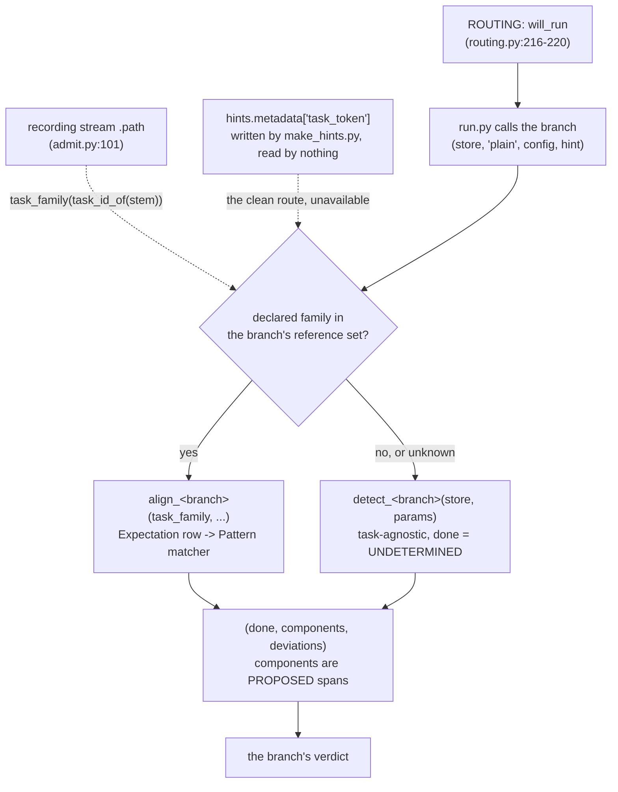

### AIRWAY's own DAG

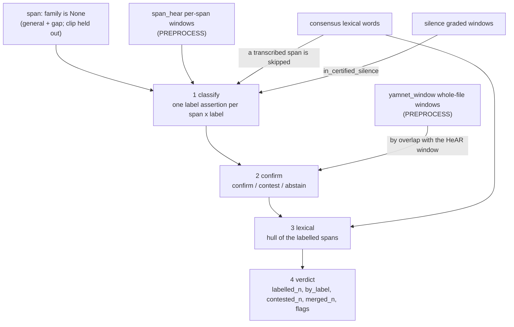

#### Present — what the module does today

**What it reads.** PREPROCESS's `span_hear` measurements keyed by `span_id` (`airway.py:242-245`),
its whole-file `yamnet_window` measurements by overlap (`_windows_covering`, `:51-66`, used `:295`),
the `silence` measurement's graded windows (`:200-201`, applied per span at `:269`), the
`consensus_transcript`'s lexical `word` entities (`_is_transcribed`, `:69-84`, used `:253`), and
`spans_no_contrast` on the no-span path (`:204`). **No TAXONOMY product**: it reads neither a
`*_label_summary` nor `consensus_taxonomy`. Its ROUTING decision is `routed` when any of
`airway.breath`, `airway.cough`, `airway.bracketed_event` or `airway.ppg_silent_fraction` fired.
**It runs no model** — the HeAR and YAMNet passes both happened in PREPROCESS.

**Its steps, in the order the code performs them.**

1. **classify** (`airway.py:231-280`) — for each span that no lexical word overlaps, one `label`
   assertion per `airway.labels_of_interest` label its own `span_hear` windows carry.
2. **confirm** (`:284-341`) — for each label assertion, the YAMNet windows overlapping its HeAR
   window are read: a label in that HeAR label's AudioSet corroboration closure gives `confirm`, one
   in `airway.contest_labels` gives `contest`, and neither gives `abstain`.
3. **lexical** (`:343-373`) — the hull of the labelled spans becomes an `interval`, and a lexical
   word overlapping it produces one `flag` assertion.
4. **outcome** (`:375-400`) — `FAIL` on no label of interest, `FLAG` on any accumulated flag,
   `PASS` otherwise.

**What it writes.** Assertions `label` (`:272`), `confirm` / `contest` (`:306-316`), `abstain`
(`:328-337`) and `flag` with `reason: lexical_contamination` (`:365-369`); one `interval` entity
named `airway_labelled_interval` (`:353-355`); **no measurement and no sidecar**; a verdict carrying
`{labelled_n, by_label, contested_n, merged_n, flags}`. It mints no span and writes none of
`refine`, `trim` or `propose`; `confirm` and `abstain` are outside the contract's five verbs, and
[`branch-airway.md`](branch-airway.md) § *What exists today* carries the owed `confirm` → `label`
migration.

#### Intended: `align_airway` and `detect_airway` — not built

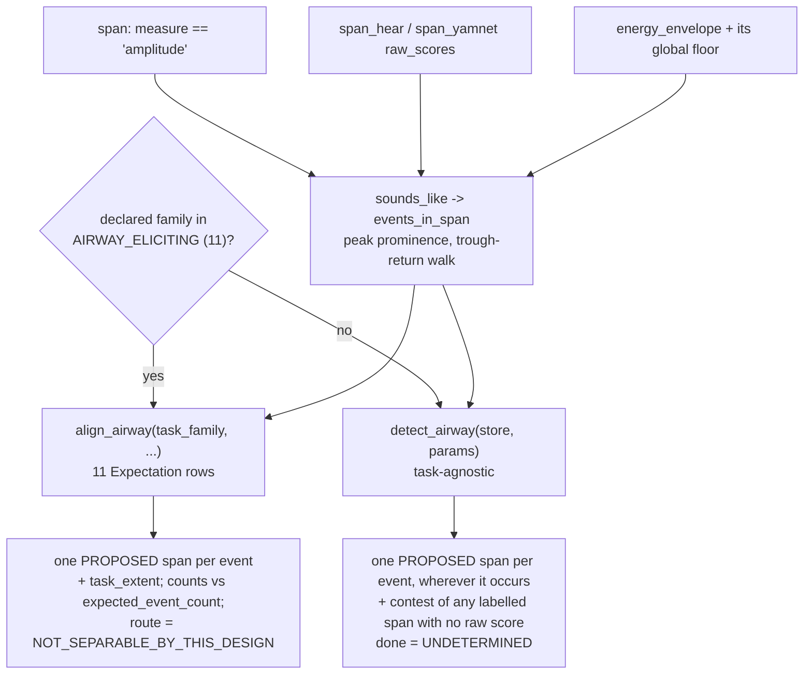

**Where the two modes sit relative to what the branch does today.** Today's `classify` step is the
ancestor of `detect_airway`: it already reads per-span HeAR labels over `family is None` spans and
emits one `label` per (span, label). Three differences.

1. **It counts spans, not events.** `by_label[label] = by_label.get(label, 0) + 1` (`airway.py:280`)
   increments once per (span, label) pair, so a 4 s span holding three coughs counts **1**.
   `events_in_span` — a peak-prominence and trough-return walk over `energy_envelope` with its one
   global floor — is what separates them, and both modes call it.
2. **It proposes no span.** Today AIRWAY *"mints no span and writes none of `refine`, `trim` or
   `propose`"*. Under propose-only both modes mint `family: "airway"` spans, one per event, each
   `wasDerivedFrom` its carrier span plus `energy_envelope`, `span_hear` and `span_yamnet`.
3. **It has no in-family mode at all.** Nothing today reads the declared family, so a
   `respiration-and-cough-cough` recording and a `harvard-sentences-list` recording take the same
   path. `align_airway` is what compares five found events against the instruction's declared five.

**What routing hands each mode.** Its ROUTING decision is `routed` when any of `airway.breath`,
`airway.cough`, `airway.bracketed_event` or `airway.ppg_silent_fraction` fired — and **its gate
evidence is `unavailable` on 56,505 of 62,547 recordings**, so `detect_airway` is the mode that
actually meets the corpus. Neither mode may read `airway.cough` as evidence of a cough: that gate
was selected under a scoped reference and reads **J −0.1398** against `declared_airway` over 61,721
recordings ([`family-taxonomy-ruleset.md:265-268`](family-taxonomy-ruleset.md)), so at its 50 dB cut
it is a loudness detector over an arbitrary recording — which is precisely what `detect_airway` is
handed.

**The eleven in-family rows** are three `Pattern` kinds: `EVENT_SERIES` (eight families),
`EVENT_ALTERNATION` (`voluntary-cough`, where material between coughs is matched as breath rather
than scored off-task) and `SOUND_COVERAGE` (the two uncounted durational `-breath` families). **Five**
of them carry `unviable=(("route", …),)`, because the nasal-versus-oral determination is
`NOT_SEPARABLE_BY_THIS_DESIGN`, and a sixth — `v2-hardcough` — carries
`unviable=(("effort_absolute", …),)` for the same reason `loudness` v1 does.

**State: implemented and running.** Its per-capability status (A1–A7), the off-task flag's three
owed changes, the selector widening A5 would need, and the 56,505-of-62,547 `unavailable` gate
figure are in [`branch-airway.md`](branch-airway.md).

### SPEECH's own DAG

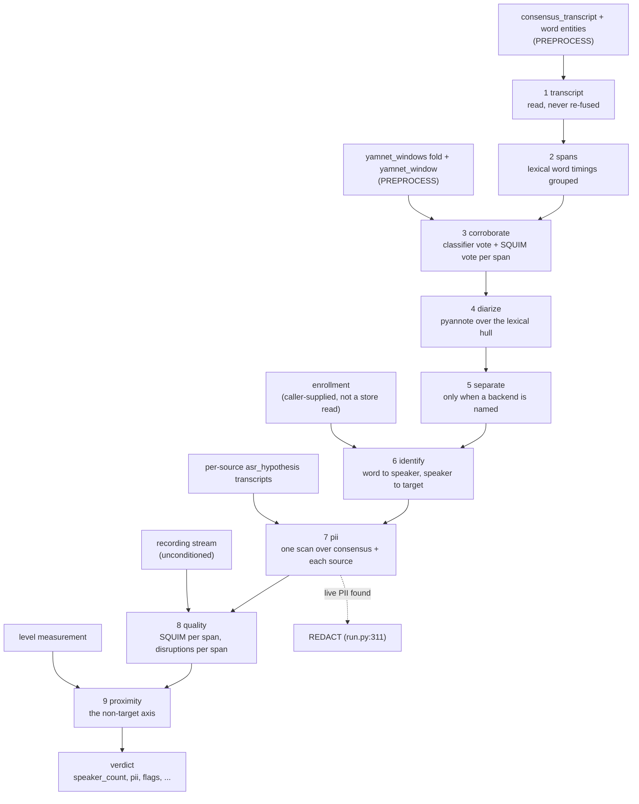

#### Present — what the module does today

**What it reads.** The `consensus_transcript` measurement and the live `word` entities it lists
(`speech.py:518-527`), each source's own `asr_hypothesis` transcript (`_hypotheses`, `:256`), the
`yamnet_windows` fold and the per-window `yamnet_window` measurements (`:581-588`), the `level`
measurement for the proximity reference (`:1040-1043`), the `plain` stream and the unconditioned
`recording` stream (`:511-512`), and the prior spans of any family for derivation edges only. **No
TAXONOMY product**: `taxonomy.speech_labels` is a config key, not TAXONOMY's output, and
`speech.py:589` is its one remaining reader. Its ROUTING decision is `routed` when `speech.lexical`
fired; `speech.transcript_agreement` is a flag gate and annotates without routing. Its spans are
**its own**: it reads no family and derives `family: "speech"` spans from the lexical word timings.

**Its steps** are the nine the module names, in design order: transcript (`:517`), spans (`:571`),
corroborate (`:577`), diarize (`:641`), separate (`:704`), identify (`:774`), PII (`:900`), quality
(`:991`), proximity (`:1036`). Three are conditional and two of those never fire under the packaged
config: the second diarizer only when pyannote's count is not 1 **and** `speech.second_diarizer` is
set (null), separation only when `speech.separation_backend` names a backend (null), and the
enrollment comparison only when a caller supplies an enrollment.

**What it writes.** `span` entities of `family: "speech"`, one per grouped run of lexical words
(`:879-891`) — the only branch that mints in its own family today; assertions `attribute`, one per
word, speaker or `None` with a `straddles` / `unassigned` note (`:790-794`), and `label` with
`label: "pii"` on every word an occurrence covers (`:958-962`); entities `interval`
(`diarization_interval`), `speaker` per diarized segment, `enrollment`, `target_match` per diarized
speaker, and `pii` per located occurrence; measurements `pii_scan`, and per span `squim`,
`disruptions` and `proximity`; `separated_{index}` streams with their FLAC sidecars when separation
runs. Its verdict carries `{speaker_count, diarization, words_n, speech_s, nontarget_speech_s, pii,
second_diarizer, separation, flags}`. `attribute` is the highest-volume verb in the store and is not
one of the contract's five ([`branch-speech.md`](branch-speech.md) § S6).

#### Intended: `align_speech` and `detect_speech` — not built

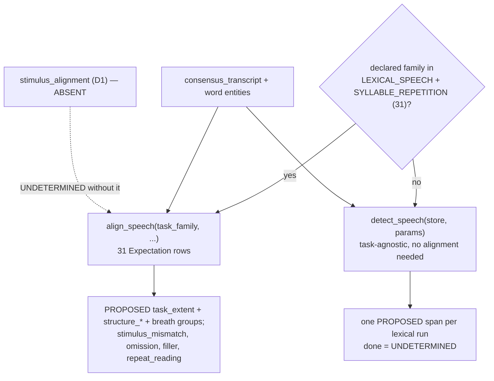

**Where the two modes sit relative to the nine steps.** Steps 1–2 — read the consensus, group the
lexical word timings into runs — are the shared input of both modes, and the `family: "speech"` span
SPEECH already mints at `speech.py:879-891` is already a propose in its own family, so **SPEECH is
the branch closest to the intended shape**. What is missing is everything after the extent: nothing
compares the transcript against what was asked. Steps 3–9 (corroborate, diarize, separate, identify,
PII, quality, proximity) are orthogonal to the two modes and run under both.

- **`align_speech`** adds the comparison. Its 31 rows are four `Pattern` kinds: `ORDERED_TOKENS`
  (read text, passages, Stroop, the `hey` families, both `buttercup` families), `FREE_RESPONSE`
  (`free-speech*`, `story-recall*`, `cinderella-story`, `productive-vocabulary`,
  `picture-description*`, `open-response-questions`), `ITEM_LIST` (`animal-fluency`, both
  `random-item-generation`), and `NO_LEXICAL` for the eight non-`buttercup` syllable-repetition
  families — where the expectation is that **nothing lexical occurs**, so the correct output is
  **no proposed span at all**.
- **`detect_speech`** is what runs on an AIRWAY- or VOICE-declared recording. It needs **no
  alignment**: nothing lexical is expected, so every lexical word is the finding. It proposes a
  `family: "speech"` span per lexical run and returns `UNDETERMINED`.

**One function disappears rather than moving.** The earlier design had a `detect_count_in` for
SPEECH's row over `prolonged-vowel`. `prolonged-vowel` is `VOICE_ELICITING`, so SPEECH is out of
family there and `detect_speech` marks `one two three` as a lexical run like any other; the
*evaluation* of the prescribed count-in belongs to `align_voice`, through that row's `tokens` field.

**What routing hands each mode.** `routed` when `speech.lexical` fired;
`speech.transcript_agreement` is a flag gate and annotates without routing. The reference set is
`reference_family_set.SPEECH: speech` = `lexical_speech | syllable_repetition` (`default.yaml:241`),
which is the membership test both modes read.

**State: implemented and running**, and the only branch carrying two of the three goals. What it
measures and does not conclude on — S3's stimulus conformance, S4's connected-speech measures, S5's
hull-scoped speaker count, the null-gated non-target axis and the never-selected separation — is in
[`branch-speech.md`](branch-speech.md).

### VOICE's own DAG

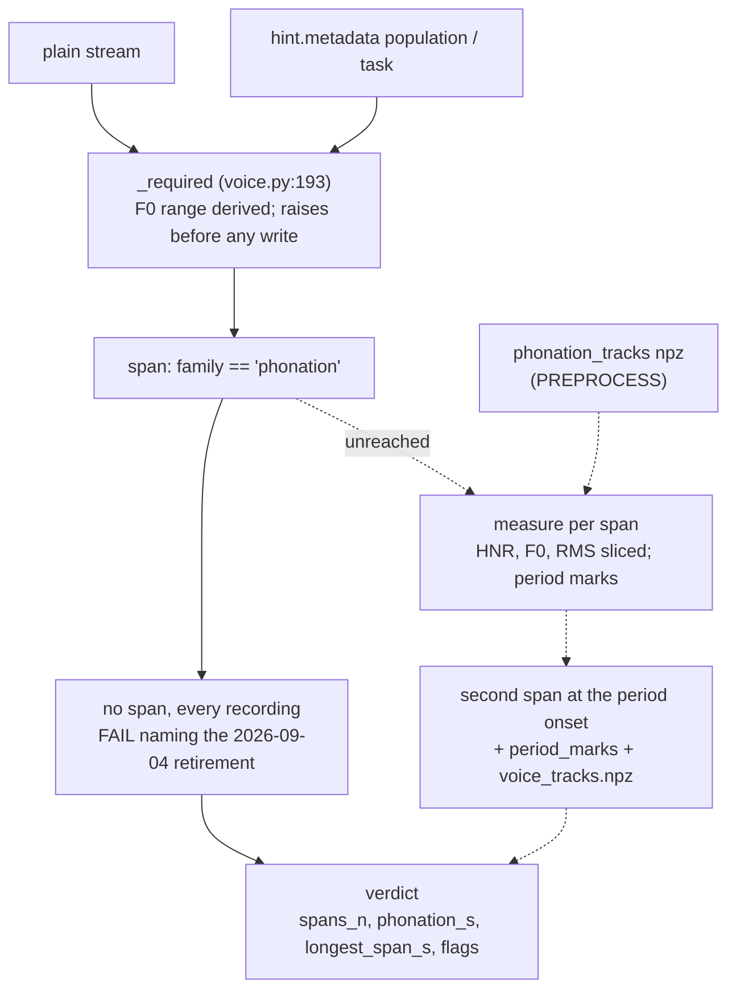

#### Present — what the module does today

**What it reads.** Every live `span` whose `family` is `phonation` (`voice.py:227-231`,
`_PHONATION_FAMILY` at `:40`) — **and nothing proposes one**, so the subject is empty on every
recording. On the unreached path it reads the `phonation_tracks` measurement and its npz
(`:275-279`, a `LookupError` when absent), and it takes `energy_envelope` and `silence` as `used`
edges only (`:222-225`). **No TAXONOMY product is read**, though the retired proposer was
TAXONOMY's: the module's own docstring still names TAXONOMY as the current proposer (`voice.py:3-4`)
and the no-span `why` still says the branch is pending a rework onto `consensus_taxonomy`
(`:236-239`) — both now contradicted by the owner's settled flow
([`branch-voice.md`](branch-voice.md) § *VOICE refines and reviews spans*), and **owed a code
change**. Its ROUTING decision is `routed` when `voice.sustained`, `voice.glide` or `voice.chant`
fired, and the first of those reads the longest **`amplitude`** span — a span family VOICE's own
selector does not admit.

**Its steps.** Resolve the stream (`:192`); resolve every `require` key and the F0 range at entry
(`:193`), which on a recording with no derivable pitch raises **before the first store write**;
open the analysis activity (`:208-225`); select the phonation spans (`:227-234`); take the no-span
`FAIL` (`:235-264`). The steps past that point — the whole-stream HNR/F0/RMS tracks sliced per span,
the per-span period marks, the concatenated `voice_tracks.npz`, the task-duration reading — are
intact and unreached.

**What it writes today: a verdict and nothing else.** Every store write of substance sits downstream
of the no-span return: a second `span` per input span, re-keyed to the period-aligned onset
(`:333-346`), a `period_marks` measurement per span (`:352`), the `voice_tracks` measurement with
`derivatives/voice_tracks.npz` (`:366-388`), and a verdict carrying `{spans_n, phonation_s,
longest_span_s, longest_span_criterion, production, ambiguous_spans_n, marks_skipped_short_n,
task_range, gate_interval, flags}`. It writes **no assertion at all** — no verb of the contract's
five — and the re-mint at `:333-346` was read, until 2026-09-16, as precisely what the contract
replaces with a `refine`. Under the owner's propose-only decision it is instead the shape that
survives: a branch minting its own span and naming what it came from. See § *Intended* below.

#### Intended: `align_voice` and `detect_voice` — not built, and the mode that unblocks the branch

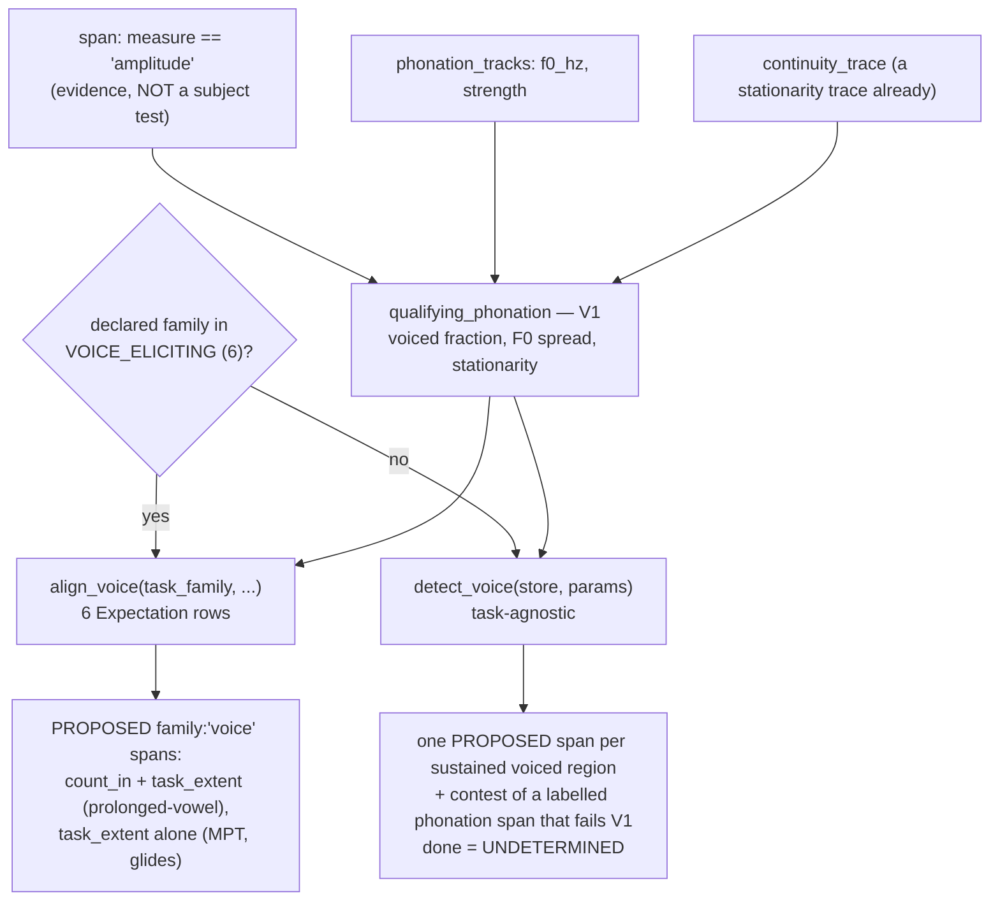

**This is the change that makes VOICE implementable at all.** Today the branch selects
`family == "phonation"` spans (`voice.py:227-231`), **nothing proposes one** since the detector was
retired on 2026-09-04, and every recording therefore takes the no-span `FAIL` at `:235-264` — while
the gate that routed it there, `voice.sustained`, read the longest **`amplitude`** span. Under
propose-only the amplitude spans stop being a subject test and become **evidence**:
`qualifying_phonation` reads them plus `phonation_tracks` and `continuity_trace`, and VOICE mints
its own `family: "voice"` span over what qualifies, naming the carrier in `wasDerivedFrom`. The
selector problem, the label-stamping question of `branch-conventions.md:61-71` and the refinability
question all dissolve at once.

**The re-mint at `voice.py:333-346` is the closest thing in the tree to today's intended shape** —
a second `span` entity, same family, start moved to the first period mark — and it carries no verb
at all. Under propose-only that becomes a `family: "voice"` propose, and the two populations are
then distinguished by family rather than by `onset_kind`, which is why
`report.py:291`'s `_spans_of_family(..., voice=...)` split becomes unnecessary. It has five call
sites — `:673`, `:688`, `:715`, `:1153`, `:1154` — of which three pass `voice=` (`:673`
`voice=False`, `:715` and `:1154` `voice=True`).

**What each mode proposes.** `align_voice` on `prolonged-vowel` proposes **two** spans — `count_in`
over the matched `one two three`, carrying `excluded_from_measurement=True`, and `task_extent` over
the voiced run — because only the second is the voice measurement, and today every Praat scalar is
taken over count-in plus silence plus vowel. On `maximum-phonation-time` it proposes **one**: the v1
inhale is airway evidence, so VOICE records `inhale_expected_in_file` as a count and `detect_airway`,
which runs on the same recording, proposes the span over it.

**What routing hands each mode.** `routed` when `voice.sustained`, `voice.glide` or `voice.chant`
fired. VOICE is routed to **22,277 recordings against 8,306 declaring a voice family, 14,332 of them
declaring none** (`runs/ruleset-score-20260912/ruleset_score.json`, `extra.VOICE`), so `detect_voice`
is the mode that meets **64%** of its own corpus — and it shares `qualifying_phonation`
with the in-family mode rather than being a placeholder beside it.

**Six families, not ten.** `VOICE_ELICITING` is `glides-high-to-low`, `glides-low-to-high`,
`high-to-low`, `maximum-phonation-time`, `maximum-phonation-time-v2`, `prolonged-vowel`
(`families.py:78-87`). **`cape-v-sentences`, `-v2`, `loudness` and `loudness-v2` are
`LEXICAL_SPEECH`** (`families.py:31-55`), so the corpus's one deliberate voice-quality instrument and
its cheapest effort measure are **out of family for VOICE today** and reach it only through
`detect_voice`, which evaluates no task. Their rows are written and held in
`VOICE_EXPECTATIONS_PENDING_DECLARATION`; moving them is a `families.py` decision, not a branch one.

**State: implemented and failing on every recording**, and one state worse on pitchless audio, where
`F0RangeUnavailable` leaves the node before any record exists and the runner renders the most
informative absence in the pipeline as an operational fault (step 5c). The 6-of-13 measurement, the
22 held detectors, and V1–V8 are in [`branch-voice.md`](branch-voice.md).

### DDK's own DAG

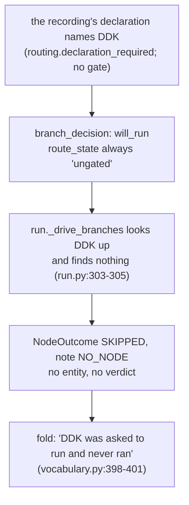

#### Present — what the module does today

**What it reads: nothing.** There is no `nodes/ddk.py`, no `DDK` in `GRAPH_ORDER` and no entry in
the dispatch table (`run.py:297-301`); `DDK` is in `BRANCHES` (`vocabulary.py:31`) and in
`taxonomy.ruleset`, which is the whole of its existence. **Its internal steps: none.** **What it
writes: nothing** — not an entity, not a measurement, not a verdict. Its only record is the runner's
`NodeOutcome(state=SKIPPED, note=NO_NODE)` and, downstream of that, one `FLAG` reason in the file
fold.

#### Intended: `align_ddk` and `detect_ddk` — not built, and neither is the branch

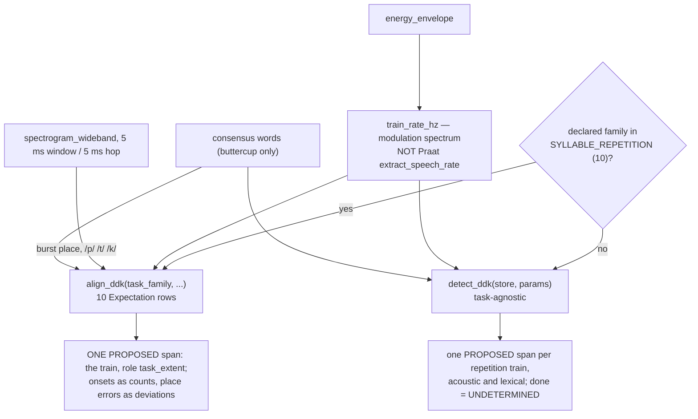

**There is nothing to sit these beside.** DDK reads nothing, has no internal steps and writes
nothing; `run.py:304-305` marks it `SKIPPED` with `NO_NODE` whether or not routing selected it,
because the `call is None` arm precedes the `in selected` test. Both modes below are therefore
entirely intended.

**The ten in-family rows** are three `Pattern` kinds: `SYLLABLE_TRAIN` (the six single-syllable
families), `SYLLABLE_SEQUENCE` (`pataka` and `puhtuhkuh`, whose expected cycle
`("labial", "alveolar", "velar")` is **data**, so a four-place train would be a row and not a
rewrite) and `ORDERED_TOKENS` (both `buttercup` families, the only DDK rows with a lexical pattern —
dispatched to the same token matcher SPEECH uses).

**One span per recording, not one per syllable.** `align_ddk` proposes the **train** as
`role: "task_extent"`; rate, inter-onset interval variability and sequence collapse are statistics
over the onset series, and one span per syllable would add roughly 30 per recording over 7,989
recordings carrying no measurement of their own. The onsets travel as a `counts` entry; a syllable
that is not the one the sequence expected travels as a `syllable_sequence_mismatch` deviation with
its own extent, which needs no span.

**What routing hands each mode.** Nothing routes DDK but the declaration: `branch_gates.DDK` is
empty and `routing.declaration_required: [DDK]` decides. Two gates used to — `ddk.lexical_repetition
>= 3` (threshold **UNMEASURED**) and `ddk.ppg_segment_rate_per_s >= 10` — and under them DDK was
routed to **22,363 recordings against the 7,989 that declare a DDK family, 14,878 of them
declaring none** ([`branch-ddk.md:20`](branch-ddk.md)), which is why they were removed. Under the
declaration the routed set is the declared set, so `align_ddk` is the whole of
what a built branch would do: it proposes a
`family: "ddk"` span over every rapid repetition train it finds — acoustically from the envelope
modulation spectrum, lexically over any token repeated often enough — and asserts nothing about the
task, because repetition occurs in ordinary speech as a stutter, a false start or a repeated word.

**State: no node**, and routed on content since ruleset stage 2. What a node would need, what the
flag costs and the 5-of-13 / 22,363-of-corpus scope readings are in step 5d above and in
[`branch-ddk.md`](branch-ddk.md), which also carries D1–D6 and the emit block a built branch would
fill.

### QUALITY's own DAG

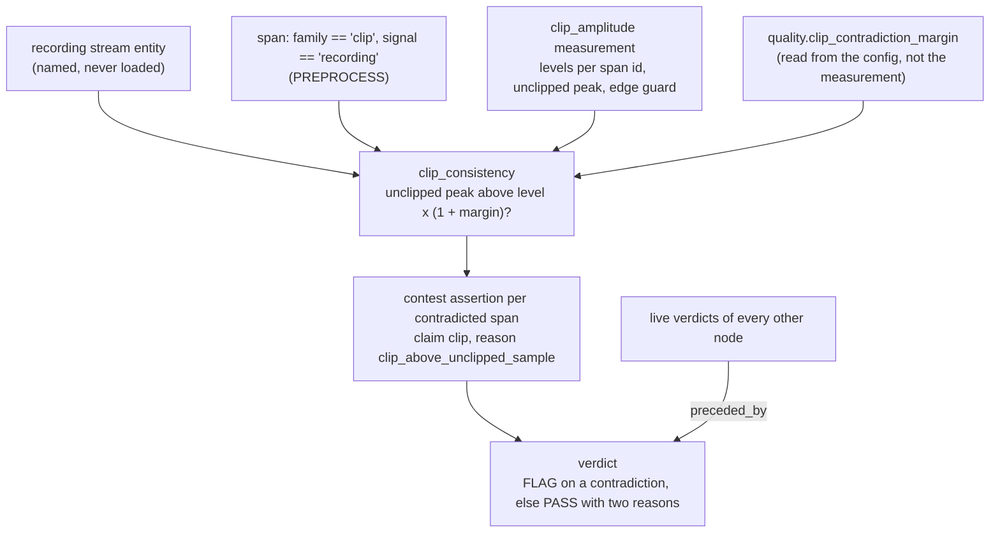

#### Present — what the module does today

**What it reads: stored records only.** The `recording` stream entity's id without loading it
(`_stream_id`, `quality.py:133-153`), PREPROCESS's live `clip` spans over that signal (`clip_spans`,
`:156-177`), the `clip_amplitude` measurement beside them (`:180-200`, a `LookupError` when clip
spans exist without it), and the `node` of every other live verdict for `preceded_by` (`:115-130`).
It reads **no PREPROCESS derivative that needs audio, no TAXONOMY product and no branch output as
evidence** — what it takes from the branches is only the list of names that had concluded. It has no
ROUTING decision at all: it is not in `BRANCHES`, has no entry in `branch_gates`, and the runner
calls it unconditionally at `run.py:310`, after the branch loop at `:302`.

**Its steps.** Read the margin from the config (`:239`, `require`); name the stream; read
`preceded_by`; select the clip spans and their amplitudes (`:244-249`), taking the edge guard from
the measurement rather than choosing one; open the `clip_consistency` activity (`:251-264`); compare
each span's own level against the loudest unclipped sample (`:270-283`); write one assertion per
contradiction; fold the outcome (`:304-317`).

**What it writes.** One `assertion` per contradiction — `verb: contest`, `claim: clip`,
`reason: clip_above_unclipped_sample`, derived from the span it contests (`:286-302`) — and its
verdict. **No span, no measurement, no sidecar**, and it never invalidates PREPROCESS's reading. Its
verdict is `FLAG` with the contradiction count, or `PASS` with one of two distinguishable reasons;
on a fresh store the expected count is zero, because `_clip_spans` applies the same comparison at
detection.

#### Intended: `detect_quality` — one mode, and it is the out-of-family one

**QUALITY has no `align_quality`, and cannot have one.** It is not in `BRANCHES`
(`vocabulary.py:31`); `vocabulary.py:29` calls it *"the terminal node every recording reaches,
whatever routed. A graph edge, never a branch."* It has **no `branch_decision`**, no entry in
`branch_gates`, and the runner calls it unconditionally at `run.py:310` — after the branch loop at
`:302`, over the **`recording`** stream rather than `plain`. Its `KIND` is `None`
(`quality.py:57`), so the file-level fold never joins its verdict to a branch (`vocabulary.py:335`
filters on `verdict.kind is not None`), and it deletes the hint it is handed (`quality.py:238`).

**So QUALITY is never handed a task and can never be in family.** Its single entry point is the
*out-of-family* mode by construction: task-agnostic, `done = UNDETERMINED`, marking what it is expert
in wherever it occurs. Giving it an in-family mode would need a family whose declared expectation is
a quality property, and no such family exists — the closest thing in the corpus is
`respiration-and-cough-v2-hardcough`'s hygiene clause, *"do not cover your mouth or place your hand
between your mouth and the microphone"*, which is an expectation **about the recording** attached to
an AIRWAY task.

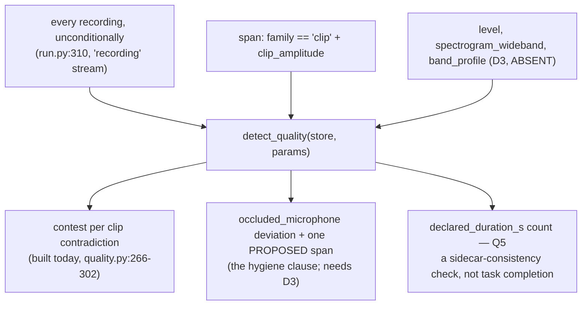

**What changes relative to today: two additions and no removals.** The clip-consistency check stays
exactly as built, and it **proposes nothing** — it contests PREPROCESS's own reading, which is an
assertion beside a span rather than an edit to it. Added: the hygiene clause's level-and-tilt
finding, which proposes at most **one** `family: "quality"` span and only when it fires; and the
`declared_duration_s` count, whose natural home Q5 is and which several tasks in
[`expected-patterns.md`](expected-patterns.md) want. The hygiene clause needs `band_profile` (D3),
which nothing writes, so it emits `NOT_SEPARABLE_BY_THIS_DESIGN` until that exists.

**State: implemented and running**, one capability of the nine its document now lists. Q1 is built;
Q2, Q3, Q5–Q9 are not and Q4 moved to the corpus-level node. Three of the unbuilt ones wait on a
PREPROCESS derivative nothing writes yet — the bandwidth spectrum (Q2), the capture-chain signature
(Q8), and the diarization the multi-voice question needs (Q9, and step 5e).
[`branch-quality.md`](branch-quality.md) carries all of them.

## Summary: the three goals against what actually decides them

| goal | measured | decides anything | where it stops |
| --- | --- | --- | --- |
| 1. bad quality | yes — SQUIM, level, `disruptions_file`, per-span SQUIM, forty Praat scalars, and now per-span and whole-file clip amplitudes | **one internal-consistency check, and nothing about the recording** | QUALITY exists and runs (step 5e), but what it decides is whether PREPROCESS's own clip spans contradict PREPROCESS's own amplitudes — a store-consistency audit whose expected count is zero. `quality.stoi_floor`, `quality.pesq_floor`, `quality.disruption_clipped_s_max` and `quality.disruption_dropout_s_max` are still null and still read by **nothing in `src/senselab`** |
| 2. other speakers | yes — the general span set, per-span HeAR/YAMNet, diarization | **yes, for which branch looks** | the ruleset of step 3c now decides which branch is asked, so a recording no longer reaches every branch by default. What it still does not decide is what SPEECH then concludes about a second speaker: `speech.target_match_cosine` and `speech.nontarget.*` are null, so the enrolled path is unreachable by design. And the diarization named here is SPEECH's, over the lexical hull only: there is **no whole-file diarization derivative**, so *how many voices are in this recording* is stated nowhere, by any node (steps 2 and 5e) |
| 3. PII | yes — the consensus transcript and each recognizer's own transcript are scanned in one call | **yes** | the one goal fully wired to a decision, and the only one whose acting node cannot run: `redaction.padding_ms` and `redaction.fill` are null and both `require`d, so REDACT raises. SPEECH marks PII; nothing releases a redacted product |

## What each run records about itself

The store is `ProvStore` (`utils/prov_store.py`), modelled on W3C PROV: entities, activities, agents
and PROV's own relations, append-only, so merging two stores is a set union and order-independent.

Seven things it now records that a reader of an older run will not find:

- **Checksums.** Every entity carrying a `path` gets a SHA-256 with `size_bytes` and `mtime_ns`,
  computed in the process that wrote the file (`CHECKSUM_KEY`, `prov_store.py:41`). The input
  recording is digested **before and after** the decode; a mismatch fails ADMIT rather than
  recording a digest for bytes the pipeline never read. Detection, not prevention — the source tree
  is not ours to lock.
- **Environment.** One `environment` record per run for the host and one per subprocess venv
  actually used (`ENVIRONMENT_KIND`, `prov_store.py:33`), each with its Python version and the
  versions of a declared package set plus a digest of the full listing. This exists because the
  venvs do not agree: a 62,550-recording run recorded host torch 2.11.0 against `clearvoice-cpu`
  and `crisperwhisper-cpu` on 2.14.0+cpu and `qwen-asr-cpu` on 2.8.0+cpu, with `yamnet`/`hear` on
  TensorFlow 2.21.0 and no torch at all. The `ppgs` venv joins that list on every run that reaches
  `ppg_posteriorgram`.
- **An agent that says why it has no commit.** Every model agent records a resolved commit; the
  ppgs agent records `unresolved_reason` instead — its checkpoint ships inside the PyPI release, so
  no commit exists to resolve. Recording a SHA while loading through something that is not one is
  the only outcome worse than recording nothing, and this is the place the graph would have had to.
- **A BEP028 PROV-O JSON-LD projection.** `utils/prov_bep028.py` serialises a written `store.jsonl`
  into the four BIDS-Prov files (`_io`, `_act`, `_soft`, `_env`) without re-running anything.
- **A candidate the detector took back.** `clip_withdrawn` assertions, `verb: withdraw`, one per clip
  candidate an unclipped sample denied — over the extent it was proposed at. A proposal that was
  never written and never recorded is indistinguishable from one that was never made.
- **The amplitudes a later node reads instead of the signal.** The `clip_amplitude` measurement:
  whole-file unclipped peak and its position, the unclipped sample count, the guard applied, and
  every surviving span's own peak keyed by span id.
- **What the ruleset routed, and on which gates.** The `ruleset_routing` measurement ROUTING writes:
  the file route state, the routed branches, every gate's outcome by name, the per-branch unreadable
  gates and fired flags, and the feature sources the configuration consumed. Every `branch_decision`
  is `wasDerivedFrom` it, so the execution set is traceable to the gate readings behind it rather
  than only asserted.

The store is written once, at the end of a run. A process that dies mid-recording therefore records
nothing at all, which is why a stalled task leaves no evidence of where it stopped. **A finished
store is not immutable, though** — the extend drivers of step 9 read it back, append, and replace
`run/store.jsonl` atomically before re-exporting `prov/`. Because the store is append-only and a
rewrite is an invalidation edge, that is a merge and not a mutation, and a driver whose derivations
change nothing leaves the file byte-identical.

## Cross-cutting tensions

**"Every recording flags" was true and is no longer.** Stated as a tension because it was the
largest one in this document for as long as the presence-floor path decided: the verdict carried no
discriminating information for any file ADMIT accepted, and anything reading triage verdicts
downstream was reading a constant. Stage 2 removed the mechanism, so all three triage outcomes are
now reachable. **Nobody has re-measured the distribution over the corpus**, and until someone does,
the honest statement is "reachable", not "observed".

**One routing runs and it decides.** The ruleset of step 3c routes 99.2% of the corpus on content,
and `nodes/routing.py` selects from it. The second selection is deleted, not merely unused. What the
deletion moved rather than settled is the *comparison*: `FileVerdict.agreement` now scores the route
against what the branch found, per branch per recording, and nobody has counted it over the corpus.
That count is what would say whether `airway.cough`'s unswept 50 dB cut or `speech.lexical`'s 2-vs-3
judgement is costing anything.

**A branch can be routed with no node behind it.** DDK is the case and the flag it produces is
deliberate (step 5d), but it is a standing tension rather than a closed question: the graph now
asserts, per recording, that it found content it has no instrument for.

**`require` and `get` are not interchangeable, and the choice is currently inconsistent.** The
`windows.<classifier>` triple is read by two loaders on purpose now — `load_label_membership`
(`require` on all three keys, so the whole-file folds stay absent on a null `label_thresholds`) and
`optional_label_membership` (a null override is no override, so the per-span passes run). The
per-span behaviour is the intended one and the whole-file fold has not been brought to it.
`taxonomy.speech_labels` is `get ... or []` in its one remaining reader (`speech.py:589`), so a
null empties the speech family without a word anywhere; it had two until stage 2 deleted TAXONOMY's.
`residual.enabled` is `require`d and true by default, so an intentionally-off block reports through
the same absent-derivative channel as an unmeasured null.

**Six keys are read by nothing**: the four `quality.*` floors, which **implementing** the node did
not adopt any more than declaring it did; and `voice.hint_tags` and `speech.hint_tags`, both
self-described "unread as of v2" — `routing.py`'s own `hint_tags` is a local built from
`hint_branch_map`, not this key. It was eight; stage 2 deleted `taxonomy.voice_min_duration_s` and
`taxonomy.voice_uncertain_duration_s`, orphaned by the voice retirement, which is what pre-alpha
says to do with the remaining six. They are the only written record of decisions nobody built. The
two keys the `quality:` section gained, `clip_contradiction_margin` and `clip_edge_guard_samples`,
are **not** among them: PREPROCESS reads and applies both.

**`taxonomy.ruleset` is read in the graph and acted on in it.** `routing_analysis/ruleset.py`,
`scripts/score_taxonomy_ruleset.py` and `nodes/routing.py` through `live_evidence`; the last of
those turns it into the execution set.
Note that its mappings are **schema**, not data: `DATA_MAP_PATHS` does not name them, so a campaign
override may change a gate's threshold but may not add a gate.

**Hints are extractable but inert.** `routing.hint_branch_map` is null in the packaged config, so a
correctly extracted hint forces nothing. Stage 2 re-keyed it from kinds to branches and changed
nothing else about it, deliberately: the hint layer is a later design, and re-keying was the minimum
that kept it callable once kinds stopped existing. See [`benchmarks/open.md`](benchmarks/open.md), "Hints:
mapping, extraction and vocabulary". The ruleset's own hint layer is deferred by design, not by a
null. That later design now exists —
[`../20260913-branch-contract-and-hints/design.md`](../20260913-branch-contract-and-hints/design.md) —
and it does not finish the hint layer so much as supersede it, reading the protocol's own `task_name`,
`speech_type` and `stimulus_text` out of the BIDS sidecars into a `declaration` SCREEN resolves.
Nothing of it is implemented.

**Three id namespaces stay distinct.** A gate's name, a detector's name and a branch's name are not
interchangeable even where two of them are spelled the same — `airway.ppg_silent_fraction` is both a
detector (a sweep) and a gate (one point off it), and `AIRWAY` is neither. See the glossary.

**An absence has three different spellings in three different layers, and none is derivable from the
others.** PREPROCESS's absent derivative against its collected hard failure; the ruleset's
`GateOutcome.UNAVAILABLE` against `SILENT`; and `extend.UNAVAILABLE` against everything else a
derivation may raise. Add a fourth and it must say which of the three it is. The cost of collapsing
one has been paid twice: a boolean gate outcome reports a partial store as a negative measurement,
and a driver without the typed-absence rule reported 613 correct answers as failures and exited
nonzero on every array task.

## Branch authority, not shown as edges

The mermaid graph shows execution order. It does not show that **each branch is the authority on
its own subject and no other** — AIRWAY on `airway`, SPEECH on `speech`, VOICE on `voice`, and DDK
on nothing yet, because it has no node. A branch's conclusion stands in `FileVerdict.findings` for
its own branch whatever the ruleset routed, and the disagreement is recorded as a `mismatch` reason
rather than resolved by precedence. No branch reads another's output, which is why a branch that
raises does not stop its siblings.

It also does not show that **QUALITY is an edge rather than a branch**. It is not in `BRANCHES`, so
it never enters `by_branch`; its verdict carries `kind=None`; it is reached by every recording
including the ones the emptiness bypass explains, and it is in `GRAPH_ORDER` for exactly that
reason. Having a node has not made it a branch: it enters the file fold as a flag reason and never
as a finding.
