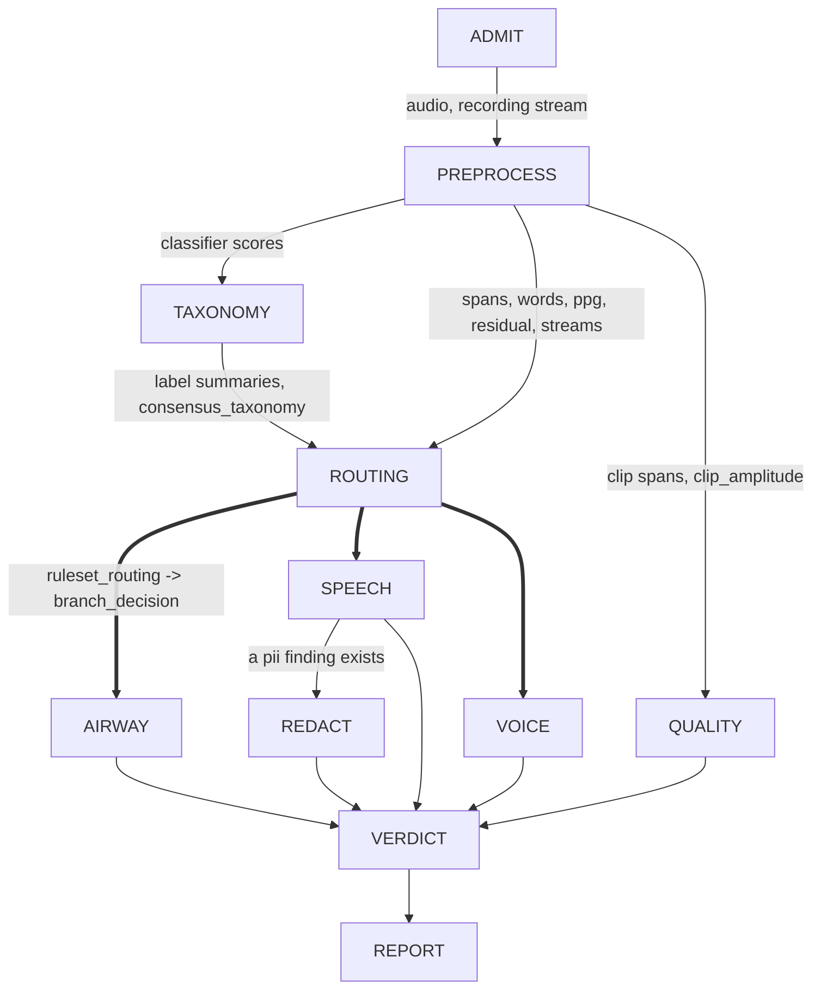

# The triage graph

What each node is responsible for, in the order the runner drives them, and what the file-level fold
does with what they report. Read this to understand the shape; every measurement, derivation and
operating point is in a sibling document and is linked from here rather than repeated.

**The code is authoritative.** `run.py`, `vocabulary.py`, `nodes/` and `data/config/default.yaml`
under `src/senselab/audio/workflows/triage/` decide what the graph does; nothing enforces that this
file stays current, so verify against them and correct this text when it drifts.

## The goal

Flag for review a recorded voice task — coughing, breathing, speaking, phonation — from people
across the lifespan, potentially with voice, respiratory or other disorders. A file should be
flagged when:

1. the recording is of bad quality — low SNR, or clipping in task-relevant regions;
2. it contains other speakers inside target-speaker spans;
3. the spoken speech contains PII the task did not ask for.

Every file ends in exactly one of three states: **pass**, **flag** (a person should look), or
**discard** (unmeasurable, or acoustically empty).

## Vocabulary

These terms are not interchangeable and collapsing a pair of them has cost real time.

**detector** — a named reading of one number out of a recording's evidence, with a polarity and a
sweep grid, in `routing_analysis/detectors.py`. **It decides nothing**: every threshold in its grid
is scored and none is preferred. A detector's `kind` names the reference standard it is scored
against, not a branch it commands.

**gate** — a detector **plus one threshold**, named in `taxonomy.ruleset.gates`, that a branch
routes on. Most detectors are not gates; the pinning to a cut is the whole difference. A gate is
evaluated on every recording and answers `FIRED`, `SILENT` or `UNAVAILABLE`. `UNAVAILABLE` is a fact
about the store, never a negative measurement.

**flag gate** — a gate listed in `taxonomy.ruleset.branch_flags` instead of `branch_gates`. It is
evaluated and recorded and it **routes nothing**; it annotates a branch already entered.
`load_ruleset` refuses a configuration listing the same gate as both.

**branch** — one of the three in `vocabulary.BRANCHES`: `AIRWAY`, `SPEECH`, `VOICE`. Each is the
authority on its own kind and no other, and each mints spans into its own `family` and no other
(`branches.BRANCH_FAMILY`; `dispatch` raises on a trespass).

**the two modes** — a branch has exactly two entry points. `align_<branch>` evaluates a declared
task of the branch's own kind against what the instruction asked for. `detect_<branch>` marks the
branch's speciality on a task of any other kind and **evaluates nothing** — `dispatch` raises if it
returns anything but `UNDETERMINED`. The declaration picks the mode; it never supplies the answer.

**report vs. verdict** — a branch returns a `BranchReport`: task conformance, typed deviations,
unmeasured operating points, and the spans it proposed into the store. **It carries no outcome.**
The deciding nodes — ADMIT, PREPROCESS, TAXONOMY, `routing`, REDACT — write a `NodeVerdict` carrying
an `Outcome`. VERDICT folds both into the one `FileVerdict`.

**conformance** — `True`, `False`, or `UNDETERMINED`, plus a referent saying what it is about:
`TASK` (the instruction the recording declares — what the three branches report) or
`STORE_ASSERTIONS` (the store's own records — what QUALITY reports, never about a participant).

**deviation** — a typed departure by the speaker, from the closed set `branches.DEVIATION_TYPES`.
Recorded per node and folded into nothing under the shipped policy.

**DDK is not a branch.** It was dissolved into SPEECH. `nodes/ddk.py` is an instrument module with
no node function: SPEECH's `align` arm routes the `SYLLABLE_REPETITION` families to it, and every
measurement it mints is written by `speech()` into the `speech` family. See
[`ddk-dissolved-into-speech.md`](ddk-dissolved-into-speech.md).

## The graph



`vocabulary.GRAPH_ORDER` is the runner's order: ADMIT, PREPROCESS, TAXONOMY, routing, AIRWAY,
SPEECH, VOICE, QUALITY, REDACT, VERDICT. REPORT runs after VERDICT and is outside that tuple.

### What the runner does with a failure

`run.py` holds no thresholds and decides nothing. It records per node whether the call completed, was
skipped or raised, and hands that mapping to VERDICT — the only place `errored` can come from, since
a node that raised wrote no verdict and the store cannot tell it from one never asked to run.

Three nodes are dependency gates:

- **ADMIT fails** → every other node is `SKIPPED` and only VERDICT runs. This is what makes "could
  not measure" distinguishable from "measured and found nothing".
- **PREPROCESS raises** → TAXONOMY, routing, every branch and REDACT are `SKIPPED`; nothing
  downstream has evidence to read. The file still reaches VERDICT.
- **routing raises** → every branch is `SKIPPED`; no branch has an authorised decision to act on.

Every other node's failure is captured rather than propagated, and the store is persisted either way.
A branch that raises is `ERRORED` and its siblings still run: none of them reads another's output.

A branch is `SKIPPED` for three different reasons and the state alone says none of them apart, so the
runner carries a note: `NO_NODE` for a branch nothing implements, `WITHHELD_CRITICAL` for a run that
hit a critical failure, and no note for a route the ruleset simply declined.

### One run's directories

```
<out_dir>/sub-<label>/ses-<label>/<stem>_<UTC stamp>/
  run/        store.jsonl, run.json, streams/, derivatives/
  released/   REDACT's cleared pair, empty unless it cleared one
  summary/    REPORT's summary.json and summary.{png,pdf}
```

`released/` is created empty on every run and never reused. `summary/` sits beside the store rather
than under `released/`: both its products carry element ids, which join back into the store.

## The nodes

### ADMIT — is this file measurable at all

Reads the file bytes; reads no config and no hint. Writes the `recording` stream entity and one
verdict. Concludes `PASS` or `FAIL` only — no flag. A `FAIL` names one of: file not found, decode
failure, zero frames, every sample zero, constant value per channel, or the file changed while it was
being read. Detail: [`admit.md`](admit.md).

### PREPROCESS — condition once, measure everything, decide nothing

The largest node. It resamples, conditions and derives, writing five streams — `plain`,
`preemphasised`, `normalized`, `enhanced`, `residual` — and some forty derivative blocks as sidecars
under `run/derivatives/` with a measurement each: envelopes, spectrograms, spans, clipping,
classifier scores (YAMNet, AST, HeAR) per stream and per span, ASR hypotheses and the consensus
transcript, stimulus alignment, Praat features, phonation tracks, posteriorgram, gammatone, SQUIM,
diarization.

It always concludes `PASS`, listing the derivatives that were absent; an absent derivative is
recorded, never raised on. It can still raise after running every block if a block failed with
something other than a `ValueError` or `LookupError`, and that raise is a dependency gate.

`diarization.streams` is `[enhanced]` — one stream, one `enhanced_diarization` measurement.

Detail: [`preprocess.md`](preprocess.md), [`band-profile-d3.md`](band-profile-d3.md),
[`transcript-alignment.md`](transcript-alignment.md),
[`stimulus-alignment.md`](stimulus-alignment.md),
[`consensus-asr-redesign.md`](consensus-asr-redesign.md).

### TAXONOMY — consolidate the classifier labels

Reads the three classifiers' score measurements and their sidecars, plus the per-span `span_yamnet`
and `span_hear` measurements. Writes one `{classifier}_label_summary` measurement each and one
`consensus_taxonomy`. Reads no hint. Concludes `PASS` when any classifier contributed, `FLAG` when
none did — there was nothing to consolidate. It routes nothing and mints no spans.
Detail: [`taxonomy.md`](taxonomy.md).

### routing — evaluate the ruleset into an execution set

Evaluates `taxonomy.ruleset` over the store TAXONOMY left, writes the reading as the
`ruleset_routing` measurement, and writes one `branch_decision` entity per branch from it. A declared
task family, or a hint tag `routing.hint_branch_map` resolves, adds a branch whatever its gates read;
it skips no gate and rewrites no route state.

Per-branch route states (`BRANCH_ROUTE_STATES`): `routed`, `declined`, `unavailable` (every gate
unreadable), `ungated` (the branch names no gate), `unjudged` (VERDICT's own reading of a branch
routing wrote no decision for). File-level (`FILE_ROUTE_STATES`): `routed`, `empty` (the emptiness
bypass found every tracked stream peak under `emptiness.peak_floor`), `unexplained`, `unreadable`.

Its own verdict is `PASS` on every path, the empty execution set and the critical failure included.
Detail: [`routing.md`](routing.md), [`family-taxonomy-ruleset.md`](family-taxonomy-ruleset.md),
[`../20260912-ruleset-in-pipeline/design.md`](../20260912-ruleset-in-pipeline/design.md),
[`critical-failure.md`](critical-failure.md).

### AIRWAY — cough and breath events, against what the task asked for

Subject: PREPROCESS's spans plus the HeAR and YAMNet per-span evidence, the energy envelope and the
raw `hear_scores` windows. It does not read the `airway.cough` routing gate — a branch does not take
the router's word for its own subject.

Writes `airway`-family spans (`<label_set>_event`, `<kind>_run`, `breath_event`, `task_extent`),
counts and measures, `truncation` and `off_task_extent` deviations, and contests a span whose raw
score never clears `branch.score_min`.

Its `SOUND_COVERAGE` matcher reports `breath_coverage_fraction` over the declared duration and
answers `UNDETERMINED` unconditionally: nothing in the design decides a sustained breathing task from
a duty cycle over HeAR's 2 s grid. That fraction is read by no gate, and `branch.breath_coverage_min`
is **deleted**, not left null.

Detail: [`branch-airway.md`](branch-airway.md),
[`airway-implementation.md`](airway-implementation.md),
[`airway-flag-grounds.md`](airway-flag-grounds.md).

### SPEECH — the branch carrying two of the three goals

Subject: the consensus transcript and its words, the diarization derivative, YAMNet windows, the
`plain` and `recording` streams. It runs no ASR and no diarizer of its own.

Writes `speech`-family spans (`task_extent`, `structure_*`, `phrase_run_*`, `lexical_run_*`,
`speech_run_*`, `speaker_turn_*`), speaker and enrollment entities, target-match, separated streams,
`squim` / `disruptions` / `proximity` measurements, the deviations `filler`, `omission`,
`repeat_reading`, `repeated_item`, `stimulus_mismatch`, `truncation` and `off_task_extent`, and the
`pii` findings that gate REDACT.

**Syllable repetition runs here.** A declared `SYLLABLE_REPETITION` family takes `align_ddk`, whose
instrument is a probabilistic phoneme-template decode: class posteriors read off the posteriorgram,
emissions floored and log-taken, a cyclic template topology of per-position sub-state chains, and a
Viterbi decode over it. A second, independent envelope-modulation rate is reported beside it; nothing
folds the two, and nothing folds the decoded count against the declared one. The envelope mints no
span; the decode mints `task_extent`. Detail: [`ddk-template-decode.md`](ddk-template-decode.md),
[`ddk-instrument-over-asr.md`](ddk-instrument-over-asr.md),
[`ddk-cycle-counting.md`](ddk-cycle-counting.md).

**The PII scan is conditional.** It runs only where the participant said something the task did not
ask for: `speech()` builds a haystack from the stimulus text and the declared carrier, and scans only
when a lexical word falls outside it or the declared family invites disclosure. Otherwise it writes a
`pii_scan` measurement with `scanned: False` and a reason — a recording whose every word is in its
own prompt is not unscanned by omission. Detail:
[`../20260919-pii-against-the-stimulus`](../20260919-pii-against-the-stimulus).

Detail: [`branch-speech.md`](branch-speech.md),
[`branch-speech-implementation.md`](branch-speech-implementation.md).

### VOICE — sustained phonation, off the evidence it routes on

Subject: PREPROCESS's `amplitude` spans, qualified by `phonation_tracks` and `continuity_trace` —
the same evidence the route was decided on. Writes `voice`-family spans (`count_in`, `task_extent`,
`phonation`), and deviations `omission`, `truncation`, `repeat_attempt`, `lexical_content`,
`sweep_direction_mismatch`.

**Conformance here is `True` or `UNDETERMINED` and never `False`**: these instruments can establish
that a sustained production happened, not that none did. Every amplitude span a qualifier discards
surfaces as a `carrier_rejected` measurement over that span's extent, whose value is the gate's own
name — `production_min_s`, `lexical_separator`, `no_track_over_carrier`, `voiced_fraction_min`,
`f0_spread_max_semitones`, `continuity_min`, `no_monotone_run`, `dominant_segment_min_fraction` — so
a reader can tell an absent production from a discarded one. A discarded carrier is a reading of the
branch's own instrument, not a departure by the speaker, so it is a measure and never a deviation. A
gate whose operating point is unmeasured is not applied.

Detail: [`branch-voice.md`](branch-voice.md),
[`branch-voice-implementation.md`](branch-voice-implementation.md),
[`voice-flag-grounds.md`](voice-flag-grounds.md).

### QUALITY — the terminal node every recording reaches

Not a branch: it has no route, no kind and no subject to find. It is called after the branch loop on
every path PREPROCESS completed, whatever routing selected and whether or not routing itself raised.

It reads stored outputs only — entities and their attributes. It decodes no audio, opens no sidecar
and re-derives nothing, so its position in the order is the only thing deciding what it sees. Its
check is clip consistency: a clip span asserts the signal reached its ceiling over that extent, and a
sample outside every clip span louder than that ceiling contradicts the assertion. Each contradiction
is an `assertion` entity derived from the span it contests; the span is never invalidated, because
the store is append-only and the span is PREPROCESS's reading, not QUALITY's to withdraw.

It is the one reporting node whose `conformance_of` is `STORE_ASSERTIONS` rather than `TASK`. An
absent dependency — clip spans with no `clip_amplitude` measurement beside them — raises, because
that is operational and not a finding. Detail: [`branch-quality.md`](branch-quality.md),
[`../20260912-quality-clip-consistency/design.md`](../20260912-quality-clip-consistency/design.md).

### REDACT — a step of SPEECH, not a fourth branch

Runs only when SPEECH ran and left a live `pii` finding. Reads those findings, the `pii_scan`
measurement (absent ⇒ raise), the consensus transcript and words, and `hint.expected_speech` for
exemptions. Writes `redaction` spans, `exempt` assertions, a `redaction_exemptions` measurement, the
`redacted` stream, and — when the optional re-read runs — `redaction_llm_review` measurements and one
`redaction_llm_annotation`.

Concludes `FAIL` (the scan was incomplete, or findings survived), `FLAG` (the re-scan was incomplete)
or `PASS`. **Its outcome is the sole input to the release axis**; the LLM re-read only annotates.
Released artifacts — `audio.wav`, `transcript.txt`, `consensus.json` — go to `released/` on `PASS`
alone. Detail: [`redact.md`](redact.md), [`llm-check.md`](llm-check.md).

### VERDICT — the file-level fold

`vocabulary.fold_file_verdict`. Reads every live verdict, every `branch_report`, the span count per
node and family, the `branch_decision` entities, `ruleset_routing`, `redaction_llm_annotation`, the
declared task family, and the `verdict.*` config as a `FoldPolicy`. Writes exactly one verdict entity
carrying `FileVerdict.record()`. It is the graph's only decision about the recording.

**Two axes, and they do not touch.**

| axis | values | decided from |
| --- | --- | --- |
| `triage` | `pass`, `flag`, `discard` | every contributing ground below |
| `release` | `releasable`, `withheld`, `not_assessed` | REDACT's own outcome, and nothing else |

Resolution order: ADMIT `FAIL` → `discard` on ground `unmeasurable`; else any flag ground → `flag`;
else file route state `empty` → `discard` on ground `acoustically_empty`; else `pass`. The two
discard grounds are kept apart because a consumer that cannot tell them apart treats an empty
recording as a broken one.

**What a branch contributes, and what it does not.** Conformance `False` is the one claim a reporting
node makes that becomes a flag. `True` contributes nothing, and `UNDETERMINED` contributes nothing
either — `detect_*` evaluates no task and answers `UNDETERMINED` by construction, so flagging it
would flag the corpus. The spans are what the branch *found* and are the branch side of the agreement
table; no span count is a flag by itself. Deviations are recorded and folded into nothing.

**Flag grounds.** PREPROCESS or routing errored; `routing.hint_branch_map` naming a non-branch; a
declaration supplied that no branch decision survived to read; file route state `unexplained` or
`unreadable`; a critical absence (a branch not one of whose gates could be read); an LLM redaction
re-read reporting residue; a reported non-conformance, under `conformance_flags` as overridden per
family by `conformance_flags_by_family`; an unmeasured operating point a body asked for, under
`unmeasured_points_flag`; a branch asked to run that left no report; a declared branch that did not
find its kind (`claimed_not_found`).

**One direction of a route mismatch flags, not both.** A branch routed to a recording holding none of
its kind found nothing because there was nothing — routing is lenient by design and the branch is
right. Only the reverse — the ruleset declined and the branch found it anyway — is a ground. Both
readings stay in `agreement` either way.

**The fold is task-aware.** Every conformance ground is read against `declared_family`, because what
a missing conformance *means* is not the same question on a prolonged vowel as on a story recall.

`FileVerdict.record()` is categorical throughout — outcomes, states, type names and config paths,
never transcript text or a detected string — so a corpus of these aggregates without reopening a
store. Detail: [`verdict.md`](verdict.md), `config-derivations.md` § verdict.

### REPORT — render only

Writes two products into `summary/` and no store elements: `summary.json` (schema
`triage-summary/v7`) and `summary.{png,pdf}`. JSON first, so a drawing failure still leaves a
complete product. It writes no verdict — a rendering is not evidence — and its own failure changes no
decision, because the store was already persisted. Detail: [`report.md`](report.md),
[`summary-is-the-figure.md`](summary-is-the-figure.md), [`branch-figure.md`](branch-figure.md).

## Invariants

The rules a change to this package must not break. Each is enforced in code or in a test.

1. **A branch reports; VERDICT decides.** No branch writes an `Outcome`; `common.write_report`
   reserves the key.
2. **A branch mints into its own family and no other.** `dispatch` raises on a trespass.
3. **The out-of-family mode answers `UNDETERMINED`.** `dispatch` raises on anything else.
4. **The store is append-only.** A superseded reading is invalidated by an edge, never deleted, and
   one node never withdraws another's span.
5. **An absent dependency raises; a measurement that could not be taken is recorded.** A node that
   cannot read what it needs is an operational fact, not a finding about the recording.
6. **No transcript text and no detected string reaches a verdict**, a report detail or the corpus
   fold. Controlled vocabulary only.
7. **A model load passes a resolved commit SHA, never a ref.** Enforced by
   `src/tests/utils/revision_pinning_guard_test.py`.

## Beyond one run

**Extending a finished run.** Drivers under `scripts/extend_*.py` append to — or retire from — a
completed store what the pass that produced it could not, over one shared module (`extend.py`) and
one typed-absence rule that separates a derivation which *cannot apply* to a recording from one that
*failed*. Not a graph step. Detail:
[`../20260912-extend-reprocessed-outputs/design.md`](../20260912-extend-reprocessed-outputs/design.md).

**Folding a corpus.** `corpus_report.py` reads a tree of `FileVerdict.record()` rows and counts them
— how many flagged, on what ground, which deviations, which gates nobody could read — without
reopening a store. Detail: [`corpus-level-node.md`](corpus-level-node.md).

## Configuration

One versioned YAML, `data/config/default.yaml`, with a `#` description per section and per key and
nothing longer. An override is a partial YAML deep-merged over it; the merged mapping's hash is
`config_hash`, stamped into every artifact. There is no `derivation:` key — the derivations are in
[`config-derivations.md`](config-derivations.md), keyed by the same section names, because `#`
comments are not hashed and prose inside the mapping made two behaviourally identical runs report
different identities.

`null` means declared but unmeasured. Two readers, and the difference matters: `config.require`
**raises** on a null — inside PREPROCESS that raise is caught and recorded as an absent derivative —
while `config.get` returns `None` and the caller carries on silently. A branch never refuses over an
unmeasured operating point: `BranchParams.point` records it in `params.missing`, emits an
`unmeasured_operating_points` measurement, and leaves the dependent conformance `UNDETERMINED`.

## Where the detail lives

| Subject | Document |
| --- | --- |
| The branch contract, the two modes, expectations | [`branch-conventions.md`](branch-conventions.md), [`expected-patterns.md`](expected-patterns.md), [`branch-foundation.md`](branch-foundation.md) |
| The ruleset, its gates and their operating points | [`family-taxonomy-ruleset.md`](family-taxonomy-ruleset.md), [`readable-rulesets.md`](readable-rulesets.md) |
| Every config value's derivation | [`config-derivations.md`](config-derivations.md) |
| Per-node design | [`admit.md`](admit.md), [`preprocess.md`](preprocess.md), [`taxonomy.md`](taxonomy.md), [`routing.md`](routing.md), [`redact.md`](redact.md), [`verdict.md`](verdict.md), [`report.md`](report.md) |
| Per-branch design | [`branch-airway.md`](branch-airway.md), [`branch-speech.md`](branch-speech.md), [`branch-voice.md`](branch-voice.md), [`branch-quality.md`](branch-quality.md) |
| Flag grounds, measured per branch | [`airway-flag-grounds.md`](airway-flag-grounds.md), [`voice-flag-grounds.md`](voice-flag-grounds.md) |
| The syllable-train instrument | [`ddk-template-decode.md`](ddk-template-decode.md), [`ddk-dissolved-into-speech.md`](ddk-dissolved-into-speech.md) |
| The store's shape | [`store.md`](store.md), [`../20260908-triage-prov-bep028`](../20260908-triage-prov-bep028) |
| Capability coverage against the goals | [`capability-map.md`](capability-map.md) |
| Where the graph is going | [`../20260913-branch-contract-and-hints/design.md`](../20260913-branch-contract-and-hints/design.md) |
