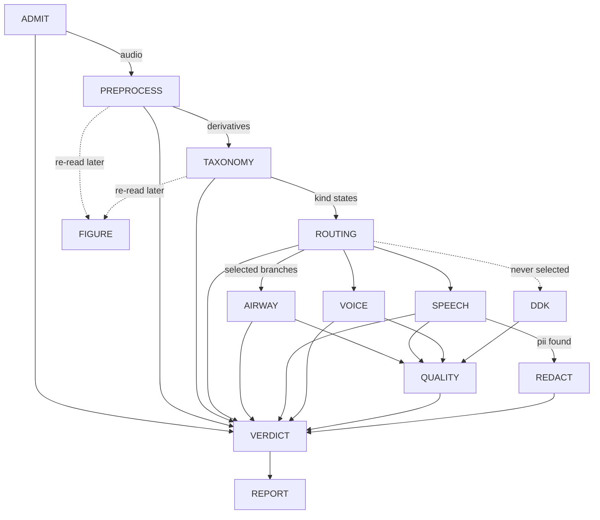
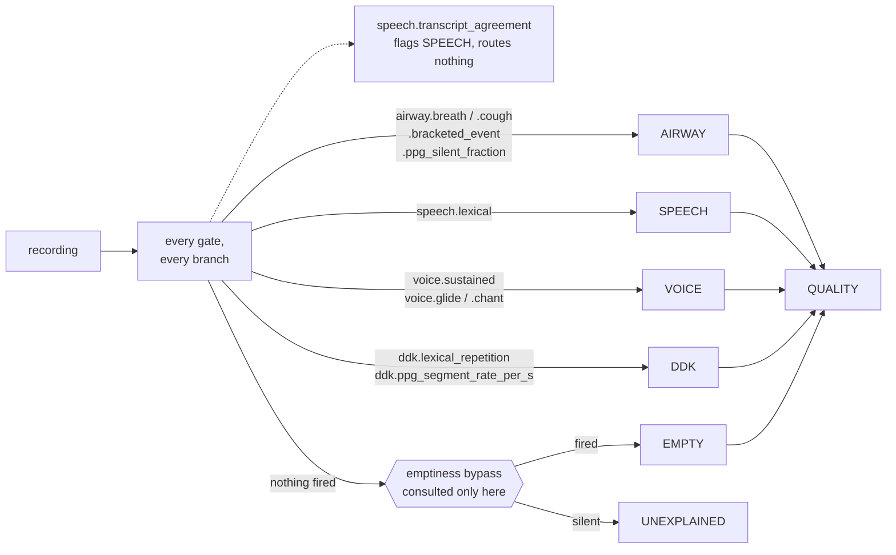

# The triage DAG, linearized from code, against its own goals

This document is generated by reading `run.py`, every node under `nodes/`, `vocabulary.py`'s
`fold_file_verdict`, `config.py`, and `data/config/default.yaml` directly — not from prior design
prose. Where an older spec doc disagrees with what is written here, the code is authoritative and
the older doc is stale. Re-verify against those files (not against this one) after any change to
them; nothing enforces that this stays current.

Regenerated 2026-09-07 at `f62f716e` from the code rather than by patching the previous text, and
brought forward to 2026-09-12 at `46f73787` — the posteriorgram and Praat preprocessing blocks, the
content-first ruleset, the fourth branch and the QUALITY edge. The glossary below is new and is the
first thing to read: the document's vocabulary is exact, and the exactness is load-bearing.

## Glossary

The vocabulary below is used precisely and its terms are not interchangeable. More than one defect
this week came from collapsing a pair of them, **detector into gate** most often of all. Every
example is read off the shipped ruleset (`taxonomy.ruleset` in `data/config/default.yaml`) or off
`routing_analysis/{detectors,ruleset,report,families,labels}.py`; none is invented.

**detector** — a named reading of **one** number out of a recording's evidence, with a polarity and
a sweep grid. **It decides nothing**: every threshold in its grid is scored and none is preferred
(`detectors.py:1-7`). There are **175**, in `DETECTORS`. Example:
`airway.residual_energy_fraction` reads `("residual", "energy_fraction")` — the residual stream's
energy as a fraction of `plain` — polarity `above`, over the fourteen points of `FRACTION_GRID`. A
detector's `kind` (`airway`, `speech`, `voice`, `cough`, `glide`, `ddk`) names the reference standard
it is scored against, not a branch it commands.

**gate** — a detector **plus one threshold**, named in `taxonomy.ruleset.gates`, that a branch
routes on. There are **11** declared: ten route and one only flags. **Every gate is a
detector-shaped reading; most detectors are not gates** — 175 readings, 11 of them pinned to a cut,
and the pinning is the whole difference. `airway.residual_energy_fraction` becomes the gate
`airway.breath` by being fixed at `>= 0.10`; `speech.words_lexical` becomes `speech.lexical` at
`>= 2`; `voice.longest_amplitude_span` becomes `voice.sustained` at `>= 3.0 s`;
`voice.yamnet_chant_peak.plain` becomes `voice.chant` at `>= 0.02`. Two gates happen to carry their
detector's own name — `airway.ppg_silent_fraction` and `ddk.ppg_segment_rate_per_s` — which is
spelling, not identity: the detector is the sweep, the gate is the one point taken off it. Two
others, `airway.bracketed_event` and `ddk.lexical_repetition`, read sources no detector reads
(`BRACKETED_SET`, `TRANSCRIPT_REPEAT` in `ruleset.py`) and carry cuts that were never swept.
A gate is evaluated on **every** recording and reports one of `FIRED`, `SILENT` or `UNAVAILABLE`;
`UNAVAILABLE` is a fact about the store, never a negative measurement.

**flag** — a gate listed in `taxonomy.ruleset.branch_flags` instead of `branch_gates`. It is
evaluated, recorded in `gate_outcomes` and named in `RouteEvaluation.flags`, and it **routes
nothing**: it annotates a branch already entered. There is one, `speech.transcript_agreement`
(`words.agreement >= 3`). `load_ruleset` refuses a configuration listing the same gate as both.

**branch** — `AIRWAY`, `SPEECH`, `VOICE`, `DDK`: `vocabulary.BRANCHES`. A gate firing routes the
recording to its branch, and a branch is the authority on its own kind and on no other. Any one of
a branch's gates firing is enough; they are OR'd, never conjoined.

**QUALITY** — in `GRAPH_ORDER`, after `VOICE` and before `REDACT`, and **not** in `BRANCHES`. Every
recording reaches it whatever routed, which is exactly why it cannot be a route: a gate firing on
everything selects nothing. It is a graph edge. It has no entry in `branch_gates`, `branch_flags` or
`reference_family_set`, there is no `nodes/quality.py`, and the runner records it `SKIPPED` on every
path. Emptiness reaches it directly, bypassing the branches.

**route state** — `ROUTED`, `EMPTY` or `UNEXPLAINED` (`ruleset.RouteState`), **exactly one per
recording**, replacing a pair of booleans that could both be false. `ROUTED` is a charge against
nothing, `EMPTY` is a charge against the recording, and only `UNEXPLAINED` — nothing fired and the
audio does not say why — is a charge against the ruleset. It is the number to drive the gates from.

**bypass** — `taxonomy.ruleset.emptiness`: the max tracked-label peak of `enhanced|yamnet` and of
`residual|yamnet` both under `0.2`. It is consulted **only where no gate fired**, as the explanation
for that, never as a precondition that could stop a gate from running. A gate firing on a recording
the bypass would have called empty routes it normally, and that disagreement is a measurement of the
bypass rather than something the evaluation suppresses.

**family** — the elicitation group a BIDS stem's `task-` entity collapses into, by removing trailing
numeric segments only (`families.task_family`). There are **48** across the four declared sets in
`families.py`. Example: `..._task-harvard-sentences-list-10-3` collapses to
`harvard-sentences-list`; a `v2` marker is not numeric, so `respiration-and-cough-breath` and
`respiration-and-cough-v2-breath` stay two families.

**reference standard** — the declared families a branch is **scored** against,
`taxonomy.ruleset.reference_family_set`: `AIRWAY: airway`, `SPEECH: lexical_speech`, `VOICE: voice`,
`DDK: syllable_repetition`. **It routes nothing** — no gate is skipped, relaxed or tightened because
of it — and **it is a proxy, not ground truth**: a recording can genuinely contain content its task
never asked for. 938 of 1,258 `prolonged-vowel` transcripts open with `'One two three'` because the
protocol instructs the count-in, so SPEECH firing there is the gate reading content correctly and
the `extra` it scores is the proxy's error, not the gate's.

**held out by construction** — families dropped from a branch's scored population,
`taxonomy.ruleset.excluded_by_construction`, because they are **neither** positives **nor**
negatives for it. One branch declares one: `SPEECH: syllable_repetition`. Diadochokinesis *is*
speech; it sits outside `lexical_speech` only because that set is the lexical half. Counting a DDK
recording SPEECH routed as a false positive charges the branch for behaving correctly — at the
shipped cut of 2, **71.3%** of `speech.lexical`'s apparent false positives are diadochokinesis, and
holding them out takes specificity from **0.633** to **0.855**. `score_branches` reports both 2x2
tables rather than choosing, and `load_ruleset` refuses a branch that holds out families its own
reference set calls positive.

**polarity** — `above` or `below`: which side of the threshold fires. 155 of the 175 detectors are
`above` and 20 are `below`. A gate spells the same thing as `op: at_least` / `at_most`, which
`ruleset._POLARITY` maps back onto the polarity vocabulary the recall curve reads. It is not
cosmetic: `ddk.ppg_repetition_lag_segments` scored a flat line at every budget until its polarity
was corrected, which read as a measured null and was not one.

**sweep grid** — the candidate thresholds a detector is scored at (`Detector.thresholds`,
ascending via `sweep_points`). **A grid that fails to cover its feature's range makes a detector
look measured-and-weak when it was never measured.** `airway.praat_phonation_ratio` is the worked
case: 31,464 of its 60,048 readable values sit above `PROPORTION_GRID`'s last point, so every
threshold in the grid saw the same undivided block at the top and no cut could separate anything
inside it. A register of ten such grid/feature pairs — read off the grid constants against each
feature's own bounds, and explicitly *not* confirmed against the corpus — is in
[`../20260911-praat-ppg-detectors/design.md`](../20260911-praat-ppg-detectors/design.md), "Grids
that may not cover their feature's range". A grid whose best threshold is its own last entry has not
been swept; it has been truncated.

**availability** — the share of the population whose evidence a detector can read at all
(`RecallCurve.availability`), the complement of `n_unreadable`. **A detector absent on part of the
corpus has a recall ceiling below 1 whatever its threshold**, and `RecallCurve.recall_ceiling` names
that ceiling so a flat curve is not mistaken for a weak one. `airway.ppg_silent_fraction` is absent
on the 2,345 recordings with no consensus transcript and therefore no posteriorgram: availability
**0.963**, ceiling **0.875**. That is why it is OR'd beside `airway.breath`, whose own feature is
absent on 31, rather than replacing it — each reads a population the other cannot.

**over-routing budget** — the false-positive rate a threshold is allowed to spend
(`OVER_ROUTING_BUDGETS` = 2%, 5%, 10%, 20%). A threshold is chosen as **the loosest cut inside a
budget**, tightened back to the strictest cut reaching the same recall, **not** by maximising
Youden's J, **because a router's errors are asymmetric**: an over-routed recording costs a branch
some discarded work, an under-routed one is never seen by anything that could interpret it. J prices
the two the same. `airway.ppg_silent_fraction` shipped at 0.90 — recall 0.499 at a false-positive
rate of 0.042, well inside the 10% budget and so stricter than a router should be — and the criterion
moved it to **0.757**, for recall 0.761, 193 recordings that reached no branch now reaching one, at
1,929 additional branch invocations the branches discard. Each `BudgetPoint` records whether the
budget or availability is what bounds it (`LIMIT_BUDGET` / `LIMIT_AVAILABILITY`).

**kind**, **evidence line** — TAXONOMY's own vocabulary, older than the ruleset's and not the same
thing. A **kind** (`speech`, `airway`, `voice`) is folded to `present`, `absent` or `uncertain` from
named **evidence lines**, each counting stored elements against a `taxonomy.presence_floor`. A
branch has a kind; a gate does not. Nothing in the fold reads `taxonomy.ruleset`.

**node outcome** vs **file verdict** — `Outcome.PASS/FLAG/FAIL` is what one node concluded;
`Triage.PASS/FLAG/DISCARD` is what should happen to the recording. They are different axes and a
node's outcome is never a file result. Restated below where the fold is described, because this is
the second most-collapsed pair in the document.

## The goal this graph exists to serve

Stated by the project owner: **flag for review** a recorded voice task (coughing, breathing,
speaking, phonation) from people across the lifespan, potentially with voice, respiratory, or other
disorders. Concretely, a file should be flagged when:

1. **the recording is of bad quality** — low SNR, or clipping in task-relevant regions;
2. **it contains other speakers within target-speaker-specific spans**;
3. **the spoken speech contains PII not included in the task itself.**

Goal 2 is not airway/speaker-specific by construction: PREPROCESS's span block is one
foreground-acoustic-event detector for any duration carrying foreground acoustic energy — other
people talking, other sound sources, not only the target speaker — and `span_hear`/`span_yamnet`
attach classifier evidence to each one (`preprocess.py:_spans`, `_span_hear`, `_span_yamnet`).

The graph sorts every file into exactly one of three outcomes: **pass** it through, **flag** it (a
person should look), or **discard** it (unmeasurable, or acoustically empty). Every node below is
read against that.

**Headline finding, stated up front because everything else is downstream of it.** Today the graph
**flags every recording it can measure**, whatever that recording contains. `voice` has had no
evidence source since the phonation-span detector was retired on 2026-09-04, so its line is always
`unavailable` and its kind always `uncertain` (`taxonomy.py:311`, `:603`). TAXONOMY's `fail`
("every kind is absent") and `pass` ("nothing uncertain") are therefore both unreachable
(`taxonomy.py:634-641`), TAXONOMY always writes `flag`, and that flag reaches the file fold as a
reason, so `Triage.PASS` and the acoustically-empty `Triage.DISCARD` are unreachable too
(`vocabulary.py`, `fold_file_verdict`'s ladder). `Triage.DISCARD` remains reachable by one route
only: an ADMIT `fail`, which is tested before the flag row. Two tests pin the unreachability rather
than asserting outcomes that cannot occur (`TestTheOutcome`, `taxonomy_test.py:216`, at `:227` and
`:256`). This lifts when voice is
reworked onto `consensus_taxonomy`; it is a consequence of the retirement, not of any recording.

**The measured replacement exists and is not wired in.** `taxonomy.ruleset` and
`routing_analysis/` carry a content-first ruleset scored over 62,547 recordings, which routes
99.2% of the corpus to a branch. **No node reads any of it**: `nodes/taxonomy.py` is untouched,
every `taxonomy.presence_floor` is still null, and `nodes/routing.py` still selects branches from
the kind states above. The ruleset is a measurement of what routing *would* do, held one commit
away from the graph — see step 3c.

## How to read this document

Each step states **what it does**, **what decides something and on which config parameters** (a
parameter is named whenever it changes a decision, not merely a measurement), and **which of the
three goals it serves, if any**. A dotted key like `taxonomy.presence_floor.speech.lexical` is a
path into `data/config/default.yaml`.

`null` there means declared but unmeasured. Which of two readers is used matters and is called out
throughout: `config.require(...)` **raises** on a null, and inside PREPROCESS that raise is caught
and recorded as an absent derivative (`preprocess.py:1947-1961`) while the node still returns
normally; `config.get(...)` returns `None` and the caller carries on **silently**. The second is
the more dangerous of the two. Its worst instance — a null silently deleting the whole ASR span
source — was closed on 2026-09-05 by deleting the key (see PREPROCESS below); the pattern survives
in `taxonomy.speech_labels`, read `get ... or []` by both its readers, where a null empties the
speech family without a word anywhere.

The config is **306 lines, 164 leaf keys, 40 of them null** — three of the forty are the
`excluded_by_construction` entries of the branches that hold nothing out, where null is the value
and not an absence of one. It carries a short `#` description per section and per key and nothing
longer. There is no `derivation:` key: it used to hold 50 kB of
prose, and because the loader hashes the merged mapping that prose sat inside `config_hash`, so
correcting a word of it made two behaviourally identical runs report different identities. The
derivations now live in [`config-derivations.md`](config-derivations.md), keyed by the same section
names, and `#` comments are not hashed.

## The call graph

`GRAPH_ORDER` is `("ADMIT", "PREPROCESS", "TAXONOMY", "routing", "AIRWAY", "SPEECH", "VOICE",
"QUALITY", "REDACT", "VERDICT")` and `BRANCHES` is `("AIRWAY", "SPEECH", "VOICE", "DDK")`
(`vocabulary.py:14-31`). **The two lists are not the same list and neither contains the other**:
`QUALITY` is a graph edge every recording reaches and not a branch, and `DDK` is a branch the graph
does not yet order — see step 5d. REPORT runs after VERDICT and is not in `GRAPH_ORDER` (`run.py:41`).
FIGURE is in neither: the in-tree runner never calls it, though the pipeline as actually run does,
right after TAXONOMY (see step 3b).

**Three places the graph stops short, each of a different kind** (`run.py:_drive_branches`). These
are dependency checks in the runner and are *not* gates in the ruleset's sense — nothing here reads
a threshold:

- **ADMIT** is the initial one. A `fail` leaves every other node `skipped` and only VERDICT runs,
  which is what makes "could not measure" distinguishable from "measured, found nothing".
- **PREPROCESS** cannot flag or fail, but it can raise, and everything after it reads what it
  measured — so a raise skips TAXONOMY, routing, every branch, QUALITY and REDACT.
- **ROUTING** is a dependency check: if it raises, no branch has an authorised decision, so every
  branch is `skipped`.

A branch that raises is recorded `errored` and its siblings still run: none reads another's output.
`QUALITY` is recorded `SKIPPED` after the branch loop on the happy path as well, so every path
agrees rather than the node being absent on some of them.

## The linear walk

### 1. ADMIT — is this file measurable at all

Decodes the recording and admits it. **The only rejections are decode failure, zero decoded
frames, all samples zero, and a constant signal** (`admit.py:1-6`; zero frames is its own case at
`:83`, distinct from all-samples-zero). No thresholds, no models, no derived audio, and **no
`flag` outcome** — `pass` or `fail` only (`admit.py:70`, `:102-107`). It reads **no config key at
all**, which it shares with VERDICT alone.

*Goals served*: none directly. It is the precondition for all three.

### 2. PREPROCESS — condition once, measure everything, decide nothing

The one conditioning pass. Every model answering a whole-file question runs here — YAMNet, AST,
HeAR, both recognizers, SQUIM, and FRCRN (a fourth model class, `preprocess.py:1661`) — and **no
later node re-runs one**, though YAMNet, AST and HeAR each run once *per stream* rather than once
per file (`preprocess.py:1936-1941`) (`preprocess.py:1-16`).

It takes no pass/flag/fail decision, but it is not guaranteed to complete. Each block runs in its
own `try`/`except`: a block whose config value is null, or whose upstream prerequisite is missing,
records that derivative **absent** and the pass continues; any *other* exception is collected and,
after every remaining block has run, re-raised as one summary (`preprocess.py:1947-1961`). So
"unmeasured because unconfigured" and "unmeasured because broken" are different outcomes, and only
the second stops the graph.

The blocks, in execution order (`preprocess.py`, the `blocks` list):

`clip_spans`, `yamnet_scores`, `yamnet_windows`, `silence`, `ast_scores`, `ast_windows`,
`hear_scores`, `hear_windows`, `level`, `disruptions_file`, `asr_crisperwhisper`, `asr_qwen`,
`consensus_transcript`, `phonation_tracks`, `energy_envelope`, `normalized_envelope`,
`spectrogram_wideband`, `spectrogram_narrowband`, `continuity_trace`, `spans`, `residual`,
`enhanced_yamnet`, `enhanced_ast`, `enhanced_hear`, `residual_yamnet`, `residual_ast`,
`residual_hear`, `squim`, `span_hear`, `span_yamnet`, `gammatone`, `ppg_posteriorgram`,
`praat_features`. The six classifier blocks are
`_stream_yamnet`/`_stream_ast`/`_stream_hear` parameterised by stream prefix (`enhanced`,
`residual`); the last two are new and are described below.

**Two blocks read the `enhanced` stream and nothing else: `ppg_posteriorgram` and `praat_features`**
(`preprocess.py:434-560`, block entries at `:2157-2158`). They run last, after `residual` has
written the stream they read, and both are measurements with no boundary decided.

- **`ppg_posteriorgram`** runs `interactiveaudiolab/ppgs` over the enhanced stream resampled to
  `PPGS_SAMPLE_RATE` and writes the frame-major float16 array to
  `derivatives/ppg_posteriorgram.npz` with its phoneme order, seconds-per-frame, duration and
  sampling rate beside it. The entity carries the **path, its SHA-256, its size and its shape** and
  never the array. Its agent records `unresolved_reason` rather than a commit: ppgs ships its
  checkpoint inside the PyPI release, so there is no commit to resolve — the one model in the graph
  where recording nothing is the honest answer. It runs in the `ppgs` subprocess venv, so the run's
  environment record gains that venv's own row.
- **`praat_features`** is Praat/Parselmouth's whole-file set over the same stream, at
  `praat_features.time_step_s` and `praat_features.window_length_s`. Its **forty scalars are
  attributes of the measurement** rather than a sidecar — at that size a file would only add an
  indirection — and a non-finite scalar is written `null`, JSON's only representation of a number
  Praat could not place.

Neither block decides anything, and no node reads either. Both are read by `routing_analysis`:
`RecordingFeatures.ppg` reduces the posteriorgram to `PPG_SUMMARY_KEYS` (segment rate, segment
duration statistics, distinct phonemes, silent fraction, the repetition triple) and
`RecordingFeatures.praat` carries the scalars. Two of the detectors over them are gates today —
`airway.ppg_silent_fraction` and `ddk.ppg_segment_rate_per_s`. **FIGURE draws neither**, so the two
newest derivatives are the only ones with no panel.

**Residual.** FRCRN_SE_16K (`FRCRN_ID`, `preprocess.py:102`) runs on `plain`
(`preprocess.py:1630-1775`), is cross-correlation lag-aligned via `compute_residual`
(`speech_enhancement/residual.py:176`), and both the aligned enhancement and `plain − g·enhanced`
are written as streams (`preprocess.py:1687`, `:1707`). One `residual` measurement records
`lag_ms`, `gain_db`, `energy_fraction`, `correlation_*`, `peak_dbfs`, `rms_dbfs`, per-band energy
fractions, and the speech preconditions `speech_present`/`n_consensus_words`/
`speech_coverage_fraction` (`preprocess.py:1737-1759`). It decides nothing. No meaning or energy
gate decides whether the streams are written: `speech_present`/`speech_coverage_fraction` are
preconditions on interpretation, not gates (`preprocess.py:1640-1655`, `:1737-1759`), and speech
regions come from `_speech_regions` (`:1612-1628`) — the consensus's lexical words' per-source
timings when a consensus exists, else this pass's own amplitude-source spans, with
`speech_overlap_source` naming which.

`residual.enabled` is **true** in the packaged config (`data/config/default.yaml:209`), so the
block runs by default. When an operator sets it false, `_residual` raises
`ValueError("residual.enabled is false")` (`preprocess.py:1657-1658`) and is recorded as an absent
derivative (`:1951-1954`), and the six stream-classifier blocks then raise
`LookupError(f"{prefix} is absent")` (`:1792`). That absence has a different cause from the
null-threshold absences below and is not the same kind of gap.

Name the twelve `{prefix}_{classifier}_summary_all` / `_summary_speech_free` derivatives
(`_stream_classifier_summaries`, `preprocess.py:1822-1851`). `speech_free` is the windows with
`speech_overlap == 0.0` (`:1833`) — no new threshold; each window carries a `speech_overlap`
fraction (`:1797`). The pair exists to separate the enhancer's speech-shaped artefact from real
background.

**Streams.** The recognizers, aligner, SQUIM, level and the window classifiers read the plain
resampled signal; the envelope, spans, spectrograms, gammatone and the phonation tracks read the
pre-emphasised one; `disruptions_file` reads the original recording (`preprocess.py:3-7`); and
`enhanced` and `residual` are each read by their own three classifier blocks
(`preprocess.py:1789-1793`). Streams persist as FLAC through one shared writer —
`STREAM_SUFFIX = ".flac"` (`common.py:18`), `write_stream` with `out_of_range="normalize"`
(`common.py:301-323`) — whose returned gain every caller records as the stream entity's
`write_gain` (`preprocess.py:435`, `:1696`, `:1716`). `plain` additionally records `peak_scale`
from a pre-write peak normalisation (`:420-423`); these are the only record that samples were
scaled.

Points that decide something, or that are currently deciding something by omission:

**Raw scores and thresholded labels are two different things, and only one of them survives a
null.** `<classifier>_scores` persists every window's raw score and reads no threshold.
`_windows(classifier)` then folds a **membership rule** over those stored scores into per-window
label sets. The rule is one object, `LabelMembership` in `label_membership.py`, read from the three
`windows.<classifier>` keys — a label is carried when it is in the window's top `label_top_k`
**and** at or above `default_threshold` (or its own `label_thresholds` override). One
implementation, two callers: `_confident_labels` here and `_label_span_statistics` in
`routing_analysis/features.py`, so what PREPROCESS stamps and what the analysis re-derives cannot
drift.

The two loaders are not interchangeable and the difference is where the nulls land:

- `load_label_membership` **requires all three keys**, `label_thresholds` included, and
  `_windows(classifier)` uses it. `windows.{yamnet,hear}.default_threshold` are now **0.2** and
  `label_top_k` is 4 for all three — but `label_thresholds` is null everywhere, so
  **`yamnet_windows`, `ast_windows` and `hear_windows` are still all absent under the packaged
  config**, while the raw scores they were folded from are present. The absent-derivative reason has
  changed; the absence has not.
- `optional_label_membership` reads a null `label_thresholds` as *no override* — the overrides refine
  a floor that is already declared, so their absence is a complete rule rather than a missing one —
  and returns `None` only when `default_threshold` itself is null. `_span_hear` and `_span_yamnet`
  use it, so **both per-span passes now produce a membership** where they used to produce none;
  `windows.ast.default_threshold` is still null, and there is no per-span AST pass at all.

`_span_window_attributes` writes `raw_scores` unconditionally — the model ran, so its output is a
measurement — and writes `labels`/`scores` only when a rule existed, with a `labelled` flag
distinguishing **"no threshold was set"** (`labelled: false`, no labels) from **"nothing cleared the
bar"** (`labelled: true`, empty labels). **The 62,547-recording corpus was produced under the old
nulls**, so every per-span window in it is stamped `labelled: false`; the analysis re-derives
membership from the stored `raw_scores` either way, and nothing needs re-running to read it. A
future run stamps the same membership the analysis derives. The floors moving changes
`config_hash`.

A short span borrows from the whole-file YAMNet pass instead: `_covering_window_attribution`
(`preprocess.py:330-363`) computes `score[label] = Σ(score_w · overlap_w) / Σ overlap_w` over
whole-file `yamnet_scores` windows intersecting the span. A span shorter than the native window
(`SpanTooShortForYAMNet`) is scored this way and carries `attribution: "covering_windows"`,
`covering_windows_n`, `covering_seconds` (`:1227-1254`); a natively classified span carries
`attribution: "native"` (`:1291`). A short span with no covering window is marked
`no_covering_window`; a missing whole-file pass is `yamnet_scores_absent`. HeAR still centres a
short span in a silent 2 s buffer instead (`:1119-1121`, `span_hear_input`) and writes no
`attribution` field.

AST has the same shape of limit and is handled the same way. Its feature extractor asserts `window_size <= len(waveform)` inside `torchaudio.compliance.kaldi.fbank`, so a trailing window shorter than 400 samples at 16 kHz (25 ms) aborts the pass. `AudioTooShortForAST` (`classification/huggingface.py:23`, raised at `:238`) is a `ValueError`, so the block is recorded as an absence rather than a hard failure and the recording keeps its YAMNet and HeAR results. A file 10.2632 s long yields one full 10.24 s window plus a 371-sample remainder, which is how this arises; it hit 55 of 62,550 recordings before the guard.

**Per-span classification is batched.** Both passes build every span's input first, then make **one
call per classifier** (`_classify_spans_in_batch`, `preprocess.py:248-280`). A batch is used only
when it returns exactly one result per input — a short return is treated as a failure rather than
aligned by position, since misattributing one span's scores to another is worse than failing — and
a batch that raises falls back to one call per span, recording `"<Error> (after batch failed:
<BatchError>)"` so both facts survive. Input construction stays per span, so HeAR's 2 s buffering
can still refuse one span and have that recorded against it alone. This replaced one subprocess
venv per span: **949.7 s → 176.4 s** on a 79.51 s recording with 91 spans, 182 spawns down to two.

**The span algorithm** (`spans/api.py:propose_spans`), in order:

1. `spans.k_db` (6.0) **proposes**: every maximal run where the envelope has risen `k_db` above the
   floor is one candidate, directly — not a peak later expanded. Nothing crossing yields
   `NoContrast`.
2. `spans.min_separation_ms` (30) merges candidates closer than that into one proposal, **before**
   any walking, so one event's brief dips below `k_db` do not read as several.
3. The onset and offset **walk outward** from each candidate's own edges by an identical rule,
   continuing while the maximum over a `spans.transition_window_ms` (30) window still exceeds
   `floor + k_db`. The walk therefore closes when it finds 30 ms of continuously quiet envelope; a
   shorter dip does not close it. `transition_window_ms` is the *reach*, and it is load-bearing —
   30 ms gives 86 spans on the reference recording, 100 ms gives 45, 300 ms gives 18.
4. `spans.min_duration_ms` (50) discards a walked span shorter than that.
5. Overlapping survivors merge.

`spans.floor_margin_db` was **retired on 2026-09-04**. It had been the walk-stop threshold at 12.0
against a `k_db` of 6.0, and because the stop test was more permissive than the open test, any
sample failing the crossing automatically satisfied the stop — so it could not extend a span at any
value ≥ `k_db`. Substituting `k_db` is behaviour-preserving: 86 spans / 59.77 s before and after,
extents byte-identical on the reference envelope.

**`continuity_trace` is persisted** (`preprocess.py:_continuity_trace`), to
`derivatives/continuity_trace.npz`, with `cut_percentile` and the resolved `cut_level` on the
measurement. It was previously computed inside `_spans`' local scope and left there; writing it out
means a reader draws **the trace these spans were actually proposed from** rather than one
recomputed later against possibly-changed code. `_spans` reads the array back rather than
recomputing it, so the trace and the spans are the same object by construction.

**A null that deleted a span source in silence — resolved 2026-09-05.** `_spans` used to read
`speech.word_gap_ms` with `config.get` and, when it was `None`, simply omit the parameter: no
exception, no absent-derivative record, the ASR span source dropped and PREPROCESS still returning
`pass`. A **388-recording** run over ten subjects produced **7,651 consensus words and zero `asr`
spans**; SPEECH read the same key with `require`, so the same null errored that branch outright on
all **112** recordings of the earlier stage-0 collection
(`config-derivations.md:213-217`). The key is now **deleted outright** rather than given a value:
consensus words arrive
with their own timestamps, so grouping them needs no gap threshold, and
`group_extents_into_runs` merges on adjacency alone (`spans/api.py`). ASR spans exist again, and
the deletion also unblocked SPEECH, which had been `require`-ing the same null key.

**`phonation_tracks` runs under the packaged config.** It used to require a fixed
`voice.f0_range_hz`, which was null; it now requires `voice.f0_search_range_hz` — the wide
`[50.0, 600.0]` each recording's own `[floor, ceiling]` is narrowed from by `derive_f0_range` off
`plain` — and that key is populated, so the block completes and records the derived range on the
measurement. What it measures is F0 over the pre-emphasised stream and the first four formants over
`plain`, per frame: a measurement with no boundary decided. The five surviving `phonation_spans.*`
keys (`hop_s`, `max_formants`, `formant_max_hz`, `formant_window_s`, `formant_preemphasis_hz`) are
its Praat settings and are populated; the eight *detection* keys that used to sit beside them were
deleted with the detector. A fixed range is still expressible, per declared population, through
`voice.f0_range_by_population`, which is null.

*Goals served*: 1 (measures level, SQUIM, disruptions), 2 (the span set and its per-span classifier
evidence), 3 (the consensus transcript PII is scanned from). The posteriorgram and the Praat set
serve none of the three directly; they are routing evidence, and routing serves all three by
deciding which branch gets to look.

### 3. TAXONOMY — fold the evidence into speech/airway/voice, and consolidate the labels

Runs no model, reads no hint, and localises nothing (`taxonomy.py:1-27`). Each kind's rule reads
named **evidence lines**; each line counts stored elements against its own floor; a line whose
derivative never reached the store is `unavailable`, which makes its kind **uncertain, never
absent**.

| kind | lines | source | floor |
| --- | --- | --- | --- |
| `speech` | `acoustic` | whole-file pooled `yamnet_windows` + `ast_windows` | `taxonomy.presence_floor.speech.acoustic` (**null**) |
| | `lexical` | consensus words | `taxonomy.presence_floor.speech.lexical` (**null**) |
| `airway` | `health_acoustic` | per-span `span_hear` | `taxonomy.presence_floor.airway.health_acoustic` (**null**) |
| | `acoustic` | per-span `span_yamnet` | `taxonomy.presence_floor.airway.acoustic` (**null**) |
| `voice` | `phonation` | **none — retired** | n/a |

Which classifier labels count as speech at all is `taxonomy.speech_labels`, **null**, read as
`config.get(...) or []` in both readers (`taxonomy.py:564`, `speech.py:588`). So the speech family
is the empty set and the `acoustic` line has no label that could express its kind — a second,
independent reason it cannot report, on top of its own null floor. None of that decides the kind,
though: **speech's state is decided by the lexical line alone**. `_fold_speech_lines`
(`taxonomy.py:293-310`) is a thin wrapper over `_fold_authoritative_line(lines, "lexical")`, so the
acoustic line — and so `taxonomy.speech_labels` — has no effect on the state and is recorded as
corroboration only.

**Airway's lines read per-span measurements, not the pooled whole-file windows** that speech's
`acoustic` line uses. A span already carrying a live consensus word is excluded from both, since
ASR is strictly stronger content evidence and an ASR-explained span is not airway evidence whatever
HeAR or YAMNet also say about it. The two are **not** folded by equal-weight agreement:
`health_acoustic` (HeAR, the domain-specific detector) is authoritative and `acoustic` (YAMNet
alone) only corroborates — `_fold_authoritative_line` (`taxonomy.py:233`), the same
authoritative/corroboration shape as speech above. Corroboration count is never read as evidence
strength: a span's `corroborated_by` says other *sources* proposed something overlapping it, not
that its *content* is more certain.

**Airway's two lines now have something to read, and the fold is unchanged.**
`windows.{yamnet,hear}.default_threshold` moving off null means `_span_label_evidence` finds a
`labels` list on a future run's per-span windows where it used to find `labelled: false` and read
`unavailable`. The four presence floors are still null, so `_line_state` still returns `unavailable`
on every line and no kind's state changes. The evidence arrived; the floor deciding what it means
did not.

**Voice's line is a placeholder that says so.** `_retired_voice_line` (`taxonomy.py:311-336`)
returns `state: unavailable`, `evidence: 0`, and a `why` naming the retirement — "the phonation-span
source was retired; voice is pending a rework onto consensus_taxonomy". The `why` exists so a report
or figure prints a deliberate gap rather than a bare `uncertain` a reader would take for evidence.
`taxonomy.voice_min_duration_s` and `taxonomy.voice_uncertain_duration_s` are now read by nothing.

Two **file-scoped measurements** are written here, both `extent=None`:

- **`<classifier>_label_summary`** (`_write_label_summaries`, `taxonomy.py:502`) — per label, peak,
  median and window count over the whole file, read from the verbatim scores sidecar so it needs no
  threshold. A classifier that never ran gets no summary, which keeps "absent" distinct from
  "measured nothing".
- **`consensus_taxonomy`** (`_write_consensus_taxonomy`, `taxonomy.py:433`) — the per-span labels of
  every per-span classifier (`PER_SPAN_CLASSIFIERS` = `{yamnet: span_yamnet, hear: span_hear}`,
  `:380`) consolidated into one file-level taxonomy for downstream to read instead of re-deriving.
  One row per label with `peak`, `peak_by_classifier`, `classifiers` and `n_classifiers`, ranked by
  peak. **Disagreement is recorded, not resolved**: a label only one vocabulary contains is not a
  vote against it, so `n_classifiers` counts corroboration only. It is a measurement — no floor
  turning it into present/absent. Empty when no per-span classifier produced scores, so "no
  consensus" and "a consensus over nothing" stay distinguishable.

`taxonomy.consolidation_floor` (0.2, owner-directed) drops a label scoring under it in
`_consolidate` (`taxonomy.py:406`), for every classifier — a floor only, with no top-K of its own.
The per-span top-4 union that turns into a raster's rows is FIGURE's own choice
(`style.top_labels`, `figure.py:165`, used at `:1800-1801`), not something `_consolidate` does; with
521 labels, a span where nothing fires still contributes its four highest, and those are near-zero.

**TAXONOMY's own outcome** (`taxonomy.py:634-641`): `fail` when every kind is absent, `flag` when
any is uncertain, `pass` otherwise. As above, only `flag` is reachable today.

*Goals served*: 2, by deciding whether the airway/speech content is there at all. The floors that
would let it decide are all null.

### 3b. FIGURE — rendering, folded into the preprocessing sequence

`preprocess_figure(store, figure_dir, config, *, run_dir, style=None, stem=None)` (`figure.py:1725`).
Draws PREPROCESS's and TAXONOMY's output from the store: one multi-page PDF, one
`taxonomy_summary.json` always written alongside it, and per-page PNGs only when
`style.also_write_pngs` is set (`figure.py:1936-1946`).

**Two things are both true, and the pair is what matters here.** The owner's position is that
figure/PDF generation is part of preprocessing and belongs in the graph as such — every batch driver
that has actually processed a recording, including the recent 388-file batteries, calls
`admit -> preprocess -> taxonomy -> preprocess_figure` in that sequence, with rendering as the final
step (the owner's account of that driver; it lives on cluster scratch, outside this repository, and
its contents are not verifiable from here). Against that: `run_triage` (`run.py`) imports no figure
module and never calls `preprocess_figure` — grep for `figure` in `run.py` returns nothing — and
`scripts/triage_audio.py` calls only `run_triage`. The only caller of `preprocess_figure` inside
`src/`, `scripts/` and `specs/` is `figure_test.py`. **The in-tree runner is the component out of
step with the pipeline as it is actually run, not the other way around.**

It reads a finished store and **writes nothing back**, so it can be re-invoked over a completed run
directory, the same shape as re-running `report`. It **recomputes nothing**: everything it draws is
a store read or a display transform of one, which is why `continuity_trace` had to be persisted. A
structural AST sweep asserts FIGURE imports no measuring API (`figure_reads_only_test.py:77-92`),
and a second test asserts no `FigureStyle` field name can shadow a pipeline config key
(`figure_test.py:273-283`).

The pipeline configuration is **read and never overridden** — a threshold set to make a panel draw
would produce a picture of a pipeline that is not the one in production. A panel whose element is
absent names the missing derivative and prints the reason the producing node recorded.

**What the PDF contains, page by page:**

| panel | what it shows | store entity / derivative | config key(s) |
| --- | --- | --- | --- |
| cover — SOURCE | the recording's path, wrapped | ADMIT's recorded path (`_source_path`) | none |
| cover — CONSENSUS ALIGNMENT | `consensus_alignment_lines` (`:1519-1580`): algorithm, per-source word counts and timing source, agreement/variant/insertion outcome counts, time-shift fit, word-timing uncertainty | `consensus_transcript` measurement and its word stream | none |
| cover — WHOLE-FILE CLASSIFICATION SUMMARY | part of `summary_panel_lines` (`:840-861`): each of YAMNet/AST/HeAR's highest-scoring labels over the whole file | `<classifier>_label_summary` (TAXONOMY's fold of `<classifier>_scores`) | none pipeline; `style.summary_labels` caps rows listed |
| cover — ENHANCED — SPEECH ISOLATED BY FRCRN, then RESIDUAL — BACKGROUND AFTER SPEECH REMOVAL | `summary_panel_lines` renders both streams in sequence (`_stream_classifier_block`, `figure.py:787`; titles at `:64`): a gain/enhanced-fraction/residual-energy line, a label summary per classifier over **YAMNet, AST and HeAR** (`_SUMMARISED_CLASSIFIERS`, `figure.py:61`), and a compact speech-free line per classifier (`_stream_speech_free_line`, `:827`, `style.speech_free_labels` at `:177`) | the `residual` measurement; `{enhanced,residual}_{yamnet,ast,hear}_summary_all` and their `_summary_speech_free` variants | none — all twelve stream summaries now reach the page |
| cover — KIND STATES AND EVIDENCE LINES | the last part of `summary_panel_lines`: each kind's folded state, its evidence lines against their floors, and the reason behind any `unavailable` | TAXONOMY's `kind` entities | none read directly here — reflects whatever `taxonomy.presence_floor.*` etc. already decided |
| per-page — wideband spectrogram | the speech-analysis spectrogram | `spectrogram_wideband` | `spectrogram.wideband_window_ms`, `spectrogram.hop_ms` (`:1780`, `:1793-1794`) |
| per-page — waveform | conditioned waveform, envelope dBFS trace, floor and `k_db` threshold lines, continuity trace and its rank-cut level | `energy_envelope` (`envelope_dbfs`, `floor_dbfs`), `continuity_trace` | `spans.k_db` (`:1882`) — read here, not by the span lane panel below it |
| per-page — span lane | every live general span (amplitude/continuity/asr/normalization/gap), plus clip-event extents | live `span` entities (`family` absent) and clip-family spans | none read directly — the span algorithm's own keys are already baked into the stored spans |
| per-page — YAMNet raster | the union of each span's top-K YAMNet labels, scored | `span_yamnet` per-span scores | `taxonomy.consolidation_floor` (`:1798`) sets the row floor; `style.top_labels` (= 4, `:165`) caps labels per span (`_raster_rows`, `:1800-1801`) |
| per-page — HeAR raster | the same, for HeAR | `span_hear` per-span scores | same as the YAMNet raster above |
| per-page — SQUIM | per-span STOI/PESQ/SI-SDR | per-span `squim` assertions | none (`style.squim_ranges` only sets colour scaling) |
| per-page — consensus ASR / word lane (`_asr_lane_panel`) | each source's own per-word span under the derived extent; agreement words bold, insertions and variants marked | the consensus word stream (from `consensus_transcript`) | none |
| output — `<stem>.pdf` | the cover plus every per-window page above | all rows above | — |
| output — `<stem>__page<NN>.png` | one PNG per page, standalone | the same pages as the PDF | `style.also_write_pngs` (a `FigureStyle` field, not a pipeline config key) |
| output — `taxonomy_summary.json` | the machine-readable form of the whole-file classification summary and kind states — not the cover's SOURCE, CONSENSUS ALIGNMENT or residual lines | the same two blocks as the cover rows above, rebuilt by `taxonomy_summary_lines` (`:702`) | none |

Its own drawing choices live in a `FigureStyle` dataclass, disjoint from anything the pipeline reads.

---

### 3c. The ruleset — what routes a recording, measured and not yet wired in

This subsection used to be a plan headed PROPOSED. It is now data and code: `taxonomy.ruleset` in
`data/config/default.yaml` and the evaluator over it in `routing_analysis/ruleset.py`, scored over
the 62,547-recording corpus. What has *not* changed is that **no node reads it**. `nodes/taxonomy.py`
is untouched, every `taxonomy.presence_floor` is null, and `nodes/routing.py` still selects branches
from the kind states of step 3. Adopting the ruleset is a later step, and until it happens the
behaviour of the running graph is the one described above: every recording flags.

Everything below is a structural description. The operating points, the firing spreads they were
chosen against, the per-family tables and the enumerated disagreements are in
[`family-taxonomy-ruleset.md`](family-taxonomy-ruleset.md),
[`../20260910-taxonomy-routing-evidence/measurements.md`](../20260910-taxonomy-routing-evidence/measurements.md)
and [`../20260911-praat-ppg-detectors/design.md`](../20260911-praat-ppg-detectors/design.md), and
they are not restated here.

#### Routing is content-first

**Every branch's gates are evaluated on every recording.** The declared family no longer filters
which gates run; it is a reference standard and nothing else. The ruleset used to read the task
family first, resolve it to the branches that family declares, and evaluate only those branches'
gates, with one hand-cut exception for discovered speech. The reversal is the whole change, and the
evidence that forced it is a concrete defect: 74 unambiguous `harvard-sentences-list` read-speech
recordings routed to no branch on their own declared gate and were rescued only by the exception.
`confirming_gates` and `discovery_gates` are deleted, `branch_gates` replaces both, and
`declared_family_set` is renamed `reference_family_set` to say what it now is. Pre-alpha: no
aliases, no flag that restores instruction-first routing.

Three rules follow from it, and they are the ones a reader is most likely to violate:

1. **A reading is evidence.** No detector output is treated as a hallucination or an error because
   it failed some other cut. Where two readings of the same phenomenon disagree, both gates stay and
   the branch routes on either.
2. **The declaration is a prior, never ground truth.** A recording carries whatever the participant
   produced, which is not restricted to what the protocol asked for.
3. **The hint layer is deliberately deferred.** A hint would name which routed branch is the target
   of the elicitation and flag a `missed` or an `extra` as a contradiction. It may never suppress a
   routed branch and no gate's threshold may depend on the family — that would put the instruction
   back into the routing path through a side door.

#### The gates, the flag and the bypass

| branch | gates, any one of which routes it | what each reads |
| --- | --- | --- |
| AIRWAY | `airway.breath`, `airway.cough`, `airway.bracketed_event`, `airway.ppg_silent_fraction` | residual energy fraction `>= 0.10`; loudest cough-labelled span `>= 50 dB` over its own floor; one typed bracketed airway token from `taxonomy.airway_bracket_tokens`; posteriorgram frames whose argmax phoneme is `<silent>` `>= 0.757` |
| SPEECH | `speech.lexical` | live consensus words that are not bracketed, any outcome, `>= 2` |
| VOICE | `voice.sustained`, `voice.glide`, `voice.chant` | longest live amplitude span `>= 3.0 s`; YAMNet singing-subtree union peak on `plain` `>= 0.05`; YAMNet `Chant` peak on `plain` `>= 0.02` |
| DDK | `ddk.lexical_repetition`, `ddk.ppg_segment_rate_per_s` | largest repeat count of any normalised transcript token `>= 3`; contiguous argmax-phoneme segments per second `>= 10` |

**SPEECH routes on ASR words alone.** `words.total` is the wrong field — bracketed tokens fire
almost everywhere, so `total >= 1` scores specificity 0.075 — and the bracketed half is not noise
either: it is airway evidence, with a gate of its own. Two, not one, because a single spurious token
on a held vowel is an ASR artifact: `lexical >= 1` fires on 0.569 of the glide families and `>= 2`
collapses that to 0.065. Two is an artifact boundary, not a max-Youden point, and **3 is the
defensible alternative**; choosing between them is a judgement about which error costs more.

**Agreement is a flag, not a gate.** `speech.transcript_agreement` (`words.agreement >= 3`) is in
`branch_flags`. **It records doubt about *what* was said, not whether speech occurred.** Three
recognizers converging says the transcript is trustworthy; three diverging says it is doubtful. The
lexical count already said whether there was speech. Reading the same recording twice and keeping
only the cases where both readings match measures recognizer concordance, and gating on it was the
defect that discarded the 74 harvard recordings. No downstream consumer reads the flag yet.

**Emptiness is a bypass, not a precondition.** Owner's model: *everything reaches QUALITY after the
other branches, but emptiness reaches QUALITY directly*, and *emptiness is only evaluated if the
other rules have not found a route*. The previous pass asked it first and returned early, so no gate
ran on a recording it called empty and `gate_outcomes` came back empty. Now nothing short-circuits:
every gate and every flag runs, and the bypass is consulted only where none fired, as the
explanation for that. A gate firing on a recording the bypass would have called empty routes it
normally, and **that disagreement is a measurement of the bypass** — do not suppress it, and do not
add a rule letting emptiness veto a gate. The rule itself is unchanged as data: both stream names
and the 0.2 floor stay exactly as they were; only *when* it is consulted has changed.

**Emptiness is ADMIT-shaped and does not live there.** It is a statement that the recording should
not have entered the graph at all, which is ADMIT's question. It sits in the ruleset because that is
where it can be measured against the routed set without re-running the graph. Moving it must carry
the bypass ordering with it: ADMIT runs before any gate, so an ADMIT that discarded on emptiness
would restore the short-circuit this pass removed.

#### The four branches, and why diadochokinesis is one of them

`BRANCHES` gained `DDK`. Diadochokinesis is syllable repetition whose target is a syllable rather
than a word: it holds no lexical content for SPEECH to be the authority on, it is not sustained or
glided phonation for VOICE, and it is not an airway manoeuvre. What it *does* do is fire the lexical
detectors at 92–99%, because a recognizer asked for words on `pa pa pa pa` returns words. Routing it
through SPEECH does not fail loudly; **it succeeds for the wrong reason** and hands a branch a
subject it cannot assess.

`families.py` was not changed for it. `SYLLABLE_REPETITION` already existed and the DDK families are
already inside `DECLARED_KIND["speech"]`; the ruleset reads the narrower set by name, so
`declared_kinds("diadochokinesis-ka")` still returns `{"speech"}` and the existing sweep's reference
standards are unchanged.

`ddk.lexical_repetition` was called `ddk.declared` and is renamed because measurement shows it only
works when the elicited unit is a dictionary word: `diadochokinesis-buttercup` ("repeat the **word**
/buttercup/") falls through at 1.6%, `diadochokinesis-v2-puh` ("repeat the **syllable** /PA/") at
24.6%. `ddk.ppg_segment_rate_per_s` is the acoustic gate beside it — a rate of articulatory change
that never had to spell the unit — and it was fitted rather than assumed. The lexical cut of 3 has
never been swept.

#### Three outcomes, and only one of them indicts the ruleset

| state | what happened | a charge against | corpus |
| --- | --- | --- | --- |
| `ROUTED` | one or more branches claimed the recording | nothing | 62,027 (99.2%) |
| `EMPTY` | nothing routed, and the audio explains why | the recording | 187 (0.3%) |
| `UNEXPLAINED` | nothing routed, and the audio does not | **the ruleset** | 333 (0.5%) |

`RouteState` replaced an `empty`/`fell_through` boolean pair that could both be false and then said
nothing about which of the three had happened. `FamilyTally.states` carries all three keys per family
whether or not the family reached one, and they sum to `recordings`.

`GateOutcome` has three members for the same reason. **`UNAVAILABLE` is not `SILENT`**: an absent
residual measurement is not a residual energy fraction of zero, a run with no YAMNet summary is not a
run with no chant, and a recording with no consensus transcript is not a recording with no repeated
syllable. Collapsing them into a boolean would report a broken or partial store as a negative
measurement, which is the failure mode that makes a scored ruleset look better than it is.
`RouteEvaluation.unavailable` names the unread gates per branch **whether or not another gate routed
the branch anyway**, because that is a fact about the store and not about the recording.

Per-branch, against the reference family sets:

| branch | sensitivity | specificity | held out by construction |
| --- | --- | --- | --- |
| AIRWAY | 0.972 | 0.780 | — |
| SPEECH | 0.954 | 0.633, or **0.855** excluding DDK | `syllable_repetition` |
| VOICE | 0.957 | 0.736 | — |
| DDK | 0.937 | 0.727 | — |

**Read SPEECH's two specificities together or neither.** The reference set is `lexical_speech`, DDK
sits outside it by construction, and at the shipped cut of 2 **71.3% of the false positives are
diadochokinesis recordings**. They are speech. Charging the branch for routing them measures the
reference set, not the gate. `score_branches` reports both tables rather than choosing.

An empty recording stays a reference positive for whatever its family declares, so it lands in
`missed` and counts as a false negative. That is the honest reading — a branch genuinely was not
recovered — but it means a corpus with many empties reports a depressed sensitivity for a reason
that has nothing to do with the gates, which is why `states` counts `empty` beside it.

#### What the earlier plan got wrong, corrected in place

| the plan said | what is true now |
| --- | --- |
| the AudioSet ontology is **not in this repository** and any subtree claim is unverified | it is vendored and pinned at `data/classifier_ontology/2026-09-10.json`, generated by `scripts/build_classifier_ontology_map.py` from three commit-pinned artifacts and never hand-edited |
| airway is the `Cough` and `Breathing` subtrees, with `Snoring`, `Sigh`, `Sniff`, `Wheeze`, `Gasp` dropped | airway is the closure of `taxonomy.airway_ontology_roots`, which is **`[Respiratory sounds]`**, minus the nodes no classifier can emit: `Breathing`, `Cough`, `Gasp`, `Pant`, `Sneeze`, `Sniff`, `Snoring`, `Snort`, `Throat clearing`, `Wheeze`. The subtree-minus-exclusion-list question is closed by taking the whole closure; naming a second root widens the AudioSet and the HeAR vocabularies at once |
| corroboration is a hand-written HeAR→AudioSet string map, and six of HeAR's eight labels have no entry | a HeAR label is corroborated by its mapped AudioSet node **or any descendant of it**, read from the profile; `airway.corroboration_overrides` replaces one label's derived set and raises on a label the profile does not map |
| voice should read the chant labels, or the duration, or their conjunction — open | all three VOICE gates ship and are OR'd: `voice.chant` was the best voice separator in the sweep and was sitting unrouted. It was added beside `voice.glide` rather than replacing it, because the two read different constructions of the same evidence |
| speech should not require `outcome: agreement` — proposed | done, and agreement is a flag |
| DDK is not a branch | it is the fourth |

**One string-match survives, and it is not the corroboration one.** `_write_consensus_taxonomy`
(step 3) still merges the per-span classifiers on the **exact label string**, so of HeAR's eight
labels only `Cough`, `Sneeze` and `Speech` are spelled as YAMNet spells them; `Baby Cough`,
`Breathe`, `Laugh`, `Snore` and `Throat Clear` have only near-misses (`Breathing`, `Laughter`,
`Snoring`, `Throat clearing`) and can never reach `n_classifiers: 2`. The ontology profile is
exactly what would fix it, and `consensus_taxonomy` does not read it.

#### What the classifiers cannot do, stated plainly

Unchanged and still measured. YAMNet `Speech` cannot route speech — at the consolidation floor it is
sens 0.997 / spec 0.217 and its per-family firing never drops below 0.560 in any of the 48 families.
AST is the best classifier for speech and still below the ASR rule, and it **cannot corroborate
anything through `consensus_taxonomy`**: `PER_SPAN_CLASSIFIERS` is `{yamnet, hear}` and no `span_ast`
measurement exists anywhere in the tree. The residual is not a speech input. The enhanced stream is
not an airway input — YAMNet's airway family on `enhanced` reaches Youden 0.357 against 0.674 on
`plain`, because enhancement removes the airway content with the noise.

#### Background, and the gap spans

Unchanged. PREPROCESS writes the complement of the proposed span set as `measure: "gap"` and
classifies it like any other span. **Background is neither a kind nor a branch**: the kinds answer
"is the content the protocol asked for present"; a mains hum is a property of the room. It belongs
to QUALITY, which is the node that now exists for questions of that shape and has no implementation.

#### What the ruleset still owes

| item | what is owed |
| --- | --- |
| `airway.cough` | its 50 dB cut is **carried over unswept** onto a population smaller and louder than the one it was fitted on. Re-fitting it from the corpus run is the first thing to do with that run |
| `ddk.lexical_repetition` | threshold 3 has **never been swept**: no J, no firing spread, no operating point |
| `airway.bracketed_event` | its J came off the 300-character-capped transcript and is a lower bound; the gate must be re-measured from the extracted `bracketed_types` counts |
| `speech.lexical` | 2 against 3 is a judgement no number here settles; a `COUNT_GRID` sweep with DDK held out of the negatives, reporting max- and median-family firing beside J, is what would inform it |
| `words.onomatopoeic_tokens` | null. While it is, the manoeuvre transcribed as a word leaks into SPEECH: 145 `'E.'` in `glides-low-to-high` alone. The candidate tokens are readable off the corpus; choosing them is the owner's |
| the presence floors | the four `taxonomy.presence_floor.*` nulls and `taxonomy.speech_labels`. Nothing in TAXONOMY can decide while they stand, and adopting the ruleset is what would retire the question rather than answer it |
| the hint layer | designed above, not implemented |
| a DDK arm | there is no `nodes/ddk.py`; see step 5d |

### 4. routing — turn classification (+ hints) into an execution set

Measures nothing and classifies nothing: it reads TAXONOMY's `kind` elements and the caller's hints
and writes one `branch_decision` per branch (`routing.py:1-8`). **A hint forces a branch to run; it
never rewrites the classification, never removes a branch and never relaxes a threshold.** Its
verdict is always `pass` — an empty execution set is recorded on the decisions for VERDICT to read,
not flagged here.

The rule: `by_classification = state != absent`; `forced_by_hint` is true only when the hint named
the kind **and** classification did not already select it; `will_run` is the disjunction. Since no
kind can be `absent` while voice is uncertain and the floors are null, **every branch this node
knows about runs on every recording** today.

**This node knows about three branches, and `BRANCHES` has four.** It iterates `BRANCH_FOR_KIND`,
which is `{airway: AIRWAY, speech: SPEECH, voice: VOICE}` — there is no `ddk` kind, so `DDK` can
never be selected, no `branch_decision` is written for it, and the runner's loop records it
`SKIPPED` on every path. It does not raise: `run.py`'s dispatch table has no `DDK` entry, and the
only reason that is not a `KeyError` is that nothing can put `DDK` in the selected set. See step 5d.

**This node reads none of the ruleset of step 3c.** No gate, no threshold, no family: the two
routings are different mechanisms measured on different populations, and only this one runs.

Hints reach it through `routing.hint_kind_map`, read with `config.get` and **null in the packaged
config** — so every declared tag maps to no kind, forces nothing, and is recorded `unmapped`.
Extraction exists (`runs/b2ai-v2/make_hints.py`) but the map it checks against lives only in that
campaign's override. The ruleset's deferred hint layer is a separate, later design (step 3c); this
one is the hint mechanism that exists, and it is inert.

*Goals served*: none directly; it selects the branches that serve them.

### 5a. AIRWAY — confirm or contest PREPROCESS's per-span HeAR labels

Reads the per-span HeAR labels over the general span set — excluding any span carrying a `family`
— and confirms or contests them (`airway.py:1`). It also reads PREPROCESS's `silence` windows
(`_inside_certified_silence`, `airway.py:26`; the windows are gathered at `:161-164` and the test
applied per span at `:232`), the lexical consensus words, which exclude an already-transcribed span
from the evidence set (`_is_transcribed`, `airway.py:64-79`, used `:216`, and again in the
lexical-contamination check at `:306-336`), and YAMNet's whole-file per-window labels, which drive
the confirm/contest verb (`_windows_covering`, `airway.py:46-61`, used `:258`). Config:
`airway.labels_of_interest` (`Cough`, `Breathe`), `airway.corroboration_profile` and
`airway.corroboration_overrides` (which AudioSet classes corroborate which HeAR label — derived
from the classifier-ontology profile, see
[`../20260910-classifier-ontology-mapping/design.md`](../20260910-classifier-ontology-mapping/design.md)),
`taxonomy.airway_ontology_roots`, and `airway.contest_labels` (**null**; when supplied it is
refused, at branch execution, if it intersects the AudioSet airway evidence derived from those roots
rather than the corroboration sets).

*Goals served*: 2.

### 5b. SPEECH — the branch carrying two of the three goals

Runs no ASR and never re-transcribes: PREPROCESS produced the consensus and this branch reads it
(`speech.py:1-16`). Speech spans come from consensus word timings, never the envelope, and pyannote
sees only `[first word start, last word end]`. The second diarizer runs only when pyannote's count
is not 1; separation runs only when `speech.separation_backend` names one (**null**). The target
speaker is identified by a caller-supplied **enrollment**, not by a per-file hint, and an enrollment
is refused rather than compared unless its model and resolved commit are both the probe's. **This
branch marks; it removes nothing.** The PII scan is one `scan_for_pii` call over the consensus
transcript and each recognizer's own transcript together (`speech.py:899-911`); a finding is marked
on every occurrence in the consensus stream.

Null keys that disable paths here: `speech.second_diarizer`, `speech.separation_backend`,
`speech.separation_sound_class`, `speech.target_match_cosine`, `speech.enrollment_model`,
`speech.speech_test_stoi_floor`, `speech.speech_test_si_sdr_floor`, and all three
`speech.nontarget.*` legs (read via an f-string at `speech.py:1058`). It used to `require`
`speech.word_gap_ms` as well, which is why this branch errored on every recording of the 112-file
collection; that key is now deleted and **SPEECH passes under the packaged config**.

*Goals served*: 2 and 3.

### 6. REDACT — a step of SPEECH, not a fourth branch

Runs only when SPEECH ran **and** its scan found live PII (`run.py:261-268`,
`_speech_found_pii`). It reads **four** config keys, every one of them through a module constant
(`redact.py:53-56`) rather than a literal, so a grep for `config.require("redaction` finds none of
them: `redaction.padding_ms` (`require`, `:116`), `redaction.fill` (`require`, `:368`),
`redaction.bleep_hz` (`get`, `:369`) and `pii.required_detectors` (`require`, `:371`).

**`redaction.padding_ms` and `redaction.fill` are both null and both `require`d, so REDACT cannot
run at all — it raises on the first of them it reaches.** It is unreachable by configuration, like
the `pass` and `discard` rows of the fold's ladder. The raise is caught: the call is wrapped in
`_attempt` (`run.py:262-266`), which records the node `ERRORED` with the message and returns `None`
(`run.py:185-187`), so the failure is an operational fact about the run and changes no verdict.
`pii.required_detectors` and `redaction.bleep_hz` are populated (`[gliner, presidio, rules]` and
`1000.0`) and are not what stops it. The initial plan uses each PII finding's own extent
(`_extents_from_findings`, `redact.py:160-183`), computed upstream in SPEECH; the **re-plan** widens
to `word_hull(word)` (`redact.py:407`) — the union of the fitted extent and every source's own
reading (`common.py:253-258`) — a deliberate widening for safety. `word_hull` is also read by the
widening gate (`redact.py:279`) and by the verification transcript (`:307`), neither of which plans
an extent.

*Goals served*: 3, in intent. None reached, since the node cannot execute.

### 5c. VOICE — inert, and saying so

Its subject is a store read: every live `span` whose `family` is `phonation` (`voice.py:3-4`,
`_PHONATION_FAMILY` at `:38`). **The detector that proposed those spans was the one removed on
2026-09-04, and nothing proposes them now**, so in production this branch always takes the no-span
path and writes `Outcome.FAIL` with a `why` naming the retirement rather than the bare "no phonation
span in the store" a reader would take for a property of the recording (`voice.py:231-237`).

Its measurement machinery is intact and unreached: HNR, F0 and RMS tracks over the whole stream,
sliced per span. **Its F0 range is no longer a null that would stop it.** It reads
`voice.f0_search_range_hz` — the same populated `[50.0, 600.0]` PREPROCESS narrows from — through
`_f0_range`, which prefers a declared population's range from `voice.f0_range_by_population` when
the hint names one and derives the range off the stream otherwise. `voice.f0_range_ratio_max` and
`voice.task_duration_ranges` are read with `config.get` and null, so the period-doubling check and
the task-duration comparison are both skipped rather than raising. **Nothing but the missing span
source stops this branch now.**

*Goals served*: none of the three; it was never one of them.

### 5d. DDK — declared, unbuilt

A branch with no node. `DDK` is in `BRANCHES` and in `taxonomy.ruleset` — a reference family set, a
construction exclusion on SPEECH, two gates and a scored 2x2 — and there is **no `nodes/ddk.py`**,
no `ddk` kind in `routing.BRANCH_FOR_KIND`, no `DDK` in `GRAPH_ORDER`, and no entry in `run.py`'s
dispatch table. The branch is consequently never selected, always recorded `SKIPPED`, and reported
nowhere: `verdict.py` orders through `GRAPH_ORDER`, which does not name it.

One artifact of the half-state is visible: `report.py` builds `_EVIDENCE_BRANCHES = (*BRANCHES,
"REDACT")`, so `_branch_evidence` emits an always-empty `"DDK"` key in the report JSON. Its
`source_spans` table has no `DDK` entry, which is why that is empty rather than an error.

What an arm would need, none of it done: the four structural entries above, and a subject — the
acoustic syllable-repetition evidence `ddk.ppg_segment_rate_per_s` reads is a routing feature, not a
branch's measurement of the manoeuvre.

*Goals served*: none yet.

### 5e. QUALITY — a graph edge every recording reaches

In `GRAPH_ORDER` after `VOICE` and before `REDACT`, and **not** in `BRANCHES`. Every recording
reaches it whatever routed, which is precisely why it cannot be a route: a gate firing on everything
selects nothing. Emptiness reaches it directly, bypassing the branches (step 3c).

**There is no `nodes/quality.py`.** The runner has no dispatch entry for it and records it `SKIPPED`
after the branch loop, so the ADMIT-fail path, the PREPROCESS-fail path and the happy path all agree
rather than the node being absent on some of them. `verdict.py`'s `_GRAPH_ORDER` is
`GRAPH_ORDER[:-1]`, so `FileVerdict.ran` already carried `QUALITY: skipped` from the store's own
reading with or without the runner's line, and `report.py` orders node rows by `GRAPH_ORDER`, so a
`QUALITY` row reads `skipped`.

The `quality:` config section — `stoi_floor`, `pesq_floor`, `disruption_clipped_s_max`,
`disruption_dropout_s_max` — is still null and still read by nothing in `src/senselab`. **Declaring
the node did not adopt those values.** Goal 1 is the goal this node exists for, and it is the goal
with the widest gap between what is measured and what decides.

*Goals served*: 1, in intent. None reached.

### 7. VERDICT — the file-level fold

Maps store facts onto `vocabulary.fold_file_verdict` and writes the result back (`verdict.py:1-6`).
Reads **no config key**. Two axes are kept apart: **triage** (pass/flag/discard) and **release**.

**A branch is the authority on its own kind and on nothing else**: its conclusion stands in `kinds`
whatever TAXONOMY classified, and disagreement is recorded in `agreement` rather than resolved by
precedence. **A branch `fail` is not a file `discard`.** PREPROCESS and ROUTING are folded from
`ran` rather than from a verdict entity, because a node that raised wrote none and would otherwise
be invisible — a silent, evidence-free `pass` would be worse than the flag reported instead.

The triage ladder, in order (`fold_file_verdict`):

1. **ADMIT `fail` → `discard`**, ground `unmeasurable`. The only reachable discard today.
2. **any reason is a `flag` → `flag`.** Always true at present.
3. every resolved kind `absent` → `discard`, ground `acoustically_empty`. **Unreachable.**
4. otherwise `pass`. **Unreachable.**

Reasons accumulate rather than being reduced to the deciding one: a PREPROCESS or ROUTING raise, a
`bad_map_values` entry, an unread declaration, a classification/branch mismatch, a branch asked to
run that stayed silent, and a hint claim nothing found. `_agreement` (`vocabulary.py:216-236`)
returns `resolved`, not `mismatch`, when TAXONOMY classified `uncertain` — so today's `FLAG` comes
from TAXONOMY's own verdict entity, not from this mismatch reason, which cannot currently fire.

### 8. REPORT — render only

Runs last, after VERDICT, on every file and every outcome, and is **the only node writing no
elements** (`report.py:1-8`). Reads the whole store and renders it: one summary and one summary
JSON. A rendering is not evidence, so nothing downstream reads either product to learn a fact the
store does not hold. Both carry element ids, a join key back into the store, so they sit beside it
and never under the release tree. Config: `report.format`, `spectrogram.hop_ms`. Its failure is
recorded beside every other node's and changes no verdict — and a failure carrying artifacts keeps
them, since REPORT writes its JSON before it draws.

## Summary: the three goals against what actually decides them

| goal | measured | decides anything | where it stops |
| --- | --- | --- | --- |
| 1. bad quality | yes — SQUIM, level, `disruptions_file`, per-span SQUIM, and now forty Praat scalars | **no** | QUALITY is a declared node with no implementation (step 5e); `quality.stoi_floor`, `quality.pesq_floor`, `quality.disruption_clipped_s_max` and `quality.disruption_dropout_s_max` are read by **nothing in `src/senselab`** |
| 2. other speakers | yes — the general span set, per-span HeAR/YAMNet, diarization | partially | every `taxonomy.presence_floor.*` is null, so no kind can be `present` or `absent`; `speech.target_match_cosine` and `speech.nontarget.*` are null, so the enrolled path is unreachable by design. The ruleset of step 3c is the measured replacement for the first half of that and no node reads it |
| 3. PII | yes — the consensus transcript and each recognizer's own transcript are scanned in one call | **yes** | the one goal fully wired to a decision, and the only one whose acting node cannot run: `redaction.padding_ms` and `redaction.fill` are null and both `require`d, so REDACT raises. SPEECH marks PII; nothing releases a redacted product |

## What each run records about itself

The store is `ProvStore` (`utils/prov_store.py`), modelled on W3C PROV: entities, activities, agents
and PROV's own relations, append-only, so merging two stores is a set union and order-independent.

Four things it now records that a reader of an older run will not find:

- **Checksums.** Every entity carrying a `path` gets a SHA-256 with `size_bytes` and `mtime_ns`,
  computed in the process that wrote the file (`CHECKSUM_KEY`, `prov_store.py:41`). The input
  recording is digested **before and after** the decode; a mismatch fails ADMIT rather than
  recording a digest for bytes the pipeline never read. Detection, not prevention — the source tree
  is not ours to lock.
- **Environment.** One `environment` record per run for the host and one per subprocess venv
  actually used (`ENVIRONMENT_KIND`, `prov_store.py:33`), each with its Python version and the
  versions of a declared package set plus a digest of the full listing. This exists because the
  venvs do not agree: a 62,550-recording run recorded host torch 2.11.0 against `clearvoice-cpu`
  and `crisperwhisper-cpu` on 2.14.0+cpu and `qwen-asr-cpu` on 2.8.0+cpu, with `yamnet`/`hear` on
  TensorFlow 2.21.0 and no torch at all. The `ppgs` venv joins that list on every run that reaches
  `ppg_posteriorgram`.
- **An agent that says why it has no commit.** Every model agent records a resolved commit; the
  ppgs agent records `unresolved_reason` instead — its checkpoint ships inside the PyPI release, so
  no commit exists to resolve. Recording a SHA while loading through something that is not one is
  the only outcome worse than recording nothing, and this is the place the graph would have had to.
- **A BEP028 PROV-O JSON-LD projection.** `utils/prov_bep028.py` serialises a written `store.jsonl`
  into the four BIDS-Prov files (`_io`, `_act`, `_soft`, `_env`) without re-running anything.

The store is written once, at the end of a run. A process that dies mid-recording therefore records
nothing at all, which is why a stalled task leaves no evidence of where it stopped.

## Cross-cutting tensions

**Every recording flags.** Restated because it subsumes the table above: until voice is reworked,
the verdict carries no discriminating information for any file that ADMIT accepts. Anything reading
triage verdicts downstream is reading a constant.

**Two routings exist and only the weaker one runs.** The ruleset of step 3c routes 99.2% of the
corpus on content and is read by no node; `nodes/routing.py` routes on kind states that cannot
become `absent` and runs every branch it knows about on everything. The gap between them is the
single largest open item in this document, and it is not a defect in either piece — it is the step
nobody has taken.

**`require` and `get` are not interchangeable, and the choice is currently inconsistent.** The
`windows.<classifier>` triple is read by two loaders on purpose now — `load_label_membership`
(`require` on all three keys, so the whole-file folds stay absent on a null `label_thresholds`) and
`optional_label_membership` (a null override is no override, so the per-span passes run). The
per-span behaviour is the intended one and the whole-file fold has not been brought to it.
`taxonomy.speech_labels` is `get ... or []` in both its readers (`taxonomy.py`, `speech.py`), so a
null empties the speech family without a word anywhere. `residual.enabled` is `require`d and true
by default, so an intentionally-off block reports through the same absent-derivative channel as an
unmeasured null.

**Eight keys are read by nothing**: the four `quality.*`, which QUALITY's declaration did not
adopt; `taxonomy.voice_min_duration_s` and `taxonomy.voice_uncertain_duration_s`, orphaned by the
voice retirement; and `voice.hint_tags` and `speech.hint_tags`, both self-described "unread as of
v2" — `routing.py`'s own `hint_tags` is a local built from `hint_kind_map`, not this key. Pre-alpha
says delete outright; they are the only written record of decisions nobody built.

**A ninth section is read by nothing *in the graph*, which is a different statement.**
`taxonomy.ruleset` is read by `routing_analysis/ruleset.py` and by
`scripts/score_taxonomy_ruleset.py`, and by no node. It is not an orphan; it is a measurement
waiting on adoption. Note that its mappings are **schema**, not data: `DATA_MAP_PATHS` does not name
them, so a campaign override may change a gate's threshold but may not add a gate.

**Hints are extractable but inert.** `routing.hint_kind_map` is null in the packaged config, so a
correctly extracted hint forces nothing. See [`benchmarks/open.md`](benchmarks/open.md), "Hints:
mapping, extraction and vocabulary". The ruleset's own hint layer is deferred by design, not by a
null.

**Three id namespaces stay distinct.** A gate's name, a detector's name and a branch's name are not
interchangeable even where two of them are spelled the same — `airway.ppg_silent_fraction` is both a
detector (a sweep) and a gate (one point off it), and `AIRWAY` is neither. See the glossary.

## Branch authority, not shown as edges

The mermaid graph shows execution order. It does not show that **each branch is the authority on
its own kind and no other** — AIRWAY on `airway`, SPEECH on `speech`, VOICE on `voice`, and DDK on
nothing yet, because it has no node. A branch's conclusion replaces TAXONOMY's classification for
its own kind in the file verdict, and the disagreement is recorded as a `mismatch` reason rather
than resolved by precedence. No branch reads another's output, which is why a branch that raises
does not stop its siblings.

It also does not show that **QUALITY is an edge rather than a branch**. It is the authority on no
kind, it is reached by every recording including the ones the emptiness bypass explains, and it is
in `GRAPH_ORDER` for exactly that reason.
