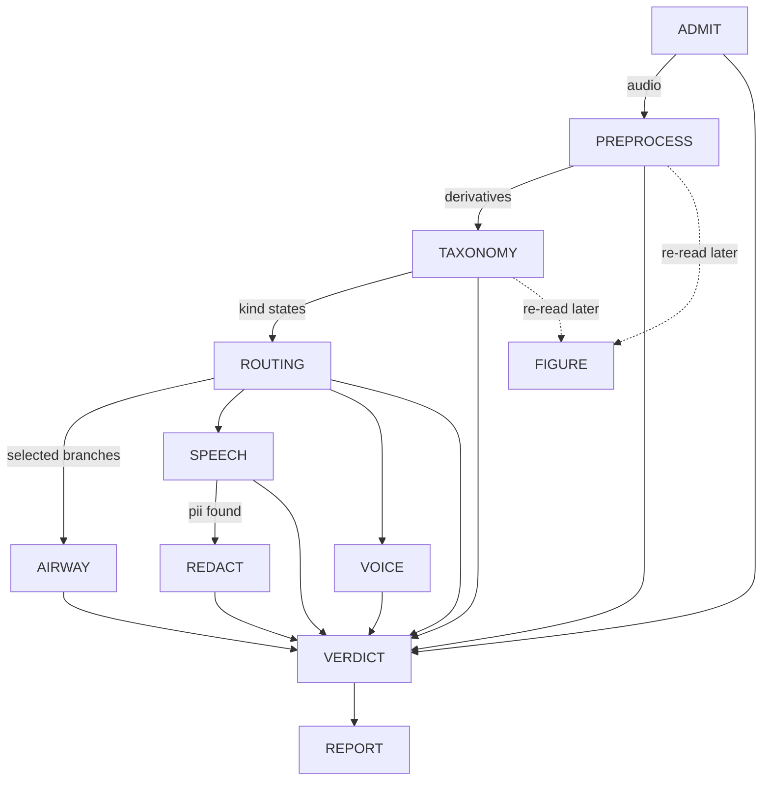

# The triage DAG, linearized from code, against its own goals

This document is generated by reading `run.py`, every node under `nodes/`, `vocabulary.py`'s
`fold_file_verdict`, `config.py`, and `data/config/default.yaml` directly — not from prior design
prose. Where an older spec doc disagrees with what is written here, the code is authoritative and
the older doc is stale. Re-verify against those files (not against this one) after any change to
them; nothing enforces that this stays current.

Regenerated 2026-09-05 at `673c43e0`, from the code rather than by patching the previous text.

## The goal this graph exists to serve

Stated by the project owner: **flag for review** a recorded voice task (coughing, breathing,
speaking, phonation) from people across the lifespan, potentially with voice, respiratory, or other
disorders. Concretely, a file should be flagged when:

1. **the recording is of bad quality** — low SNR, or clipping in task-relevant regions;
2. **it contains other speakers within target-speaker-specific spans**;
3. **the spoken speech contains PII not included in the task itself.**

Goal 2 is not airway/speaker-specific by construction: PREPROCESS's span block is one
foreground-acoustic-event detector for any duration carrying foreground acoustic energy — other
people talking, other sound sources, not only the target speaker — and `span_hear`/`span_yamnet`
attach classifier evidence to each one (`preprocess.py:_spans`, `_span_hear`, `_span_yamnet`).

The graph sorts every file into exactly one of three outcomes: **pass** it through, **flag** it (a
person should look), or **discard** it (unmeasurable, or acoustically empty). Every node below is
read against that.

**Headline finding, stated up front because everything else is downstream of it.** Today the graph
**flags every recording it can measure**, whatever that recording contains. `voice` has had no
evidence source since the phonation-span detector was retired on 2026-09-04, so its line is always
`unavailable` and its kind always `uncertain` (`taxonomy.py:313`, `:605`). TAXONOMY's `fail`
("every kind is absent") and `pass` ("nothing uncertain") are therefore both unreachable
(`taxonomy.py:636-643`), TAXONOMY always writes `flag`, and that flag reaches the file fold as a
reason, so `Triage.PASS` and the acoustically-empty `Triage.DISCARD` are unreachable too
(`vocabulary.py`, `fold_file_verdict`'s ladder). `Triage.DISCARD` remains reachable by one route
only: an ADMIT `fail`, which is tested before the flag row. Two tests pin the unreachability rather
than asserting outcomes that cannot occur (`taxonomy_test.py:215-232`). This lifts when voice is
reworked onto `consensus_taxonomy`; it is a consequence of the retirement, not of any recording.

## How to read this document

Each step states **what it does**, **what decides something and on which config parameters** (a
parameter is named whenever it changes a decision, not merely a measurement), and **which of the
three goals it serves, if any**. A dotted key like `taxonomy.presence_floor.speech.lexical` is a
path into `data/config/default.yaml`.

`null` there means declared but unmeasured. Which of two readers is used matters and is called out
throughout: `config.require(...)` **raises** on a null, and inside PREPROCESS that raise is caught
and recorded as an absent derivative (`preprocess.py:1483-1497`) while the node still returns
normally; `config.get(...)` returns `None` and the caller carries on **silently**. The second is
the more dangerous of the two, and one instance of it is currently deleting a whole span source —
see PREPROCESS below, "A null that deletes a span source in silence".

The config is **208 lines, 106 keys, 39 of them null**. It carries a short `#` description per
section and per key and nothing longer. There is no `derivation:` key: it used to hold 50 kB of
prose, and because the loader hashes the merged mapping that prose sat inside `config_hash`, so
correcting a word of it made two behaviourally identical runs report different identities. The
derivations now live in [`config-derivations.md`](config-derivations.md), keyed by the same section
names, and `#` comments are not hashed.

## The call graph

`GRAPH_ORDER` is `("ADMIT", "PREPROCESS", "TAXONOMY", "routing", "AIRWAY", "SPEECH", "VOICE",
"REDACT", "VERDICT")` and `BRANCHES` is `("AIRWAY", "SPEECH", "VOICE")` (`vocabulary.py:14-18`).
REPORT runs after VERDICT and is not in `GRAPH_ORDER` (`run.py:41`, `:391`). FIGURE is in neither:
it is not called by the runner at all (see step 9).

**Three gates, each of a different kind** (`run.py:333-346`, `_drive_branches`):

- **ADMIT** is the initial gate. A `fail` leaves every other node `skipped` and only VERDICT runs,
  which is what makes "could not measure" distinguishable from "measured, found nothing".
- **PREPROCESS** cannot flag or fail, but it can raise, and everything after it reads what it
  measured — so a raise skips TAXONOMY, routing, every branch and REDACT (`run.py:243-247`).
- **ROUTING** is a dependency gate: if it raises, no branch has an authorised decision, so every
  branch is `skipped` (`run.py:249-259`).

A branch that raises is recorded `errored` and its siblings still run: none reads another's output.

## The linear walk

### 1. ADMIT — is this file measurable at all

Decodes the recording and admits it. **The only rejections are decode failure, all samples zero,
and a constant signal** (`admit.py:1-6`). No thresholds, no models, no derived audio, and **no
`flag` outcome** — `pass` or `fail` only (`admit.py:70`, `:102-107`). It reads **no config key at
all**, which it shares with VERDICT alone.

*Goals served*: none directly. It is the precondition for all three.

### 2. PREPROCESS — condition once, measure everything, decide nothing

The one conditioning pass. Every model answering a whole-file question runs here — YAMNet, AST,
HeAR, both recognizers, SQUIM — and **no later node re-runs one** (`preprocess.py:1-16`).

It takes no pass/flag/fail decision, but it is not guaranteed to complete. Each block runs in its
own `try`/`except`: a block whose config value is null, or whose upstream prerequisite is missing,
records that derivative **absent** and the pass continues; any *other* exception is collected and,
after every remaining block has run, re-raised as one summary (`preprocess.py:1483-1497`). So
"unmeasured because unconfigured" and "unmeasured because broken" are different outcomes, and only
the second stops the graph.

The blocks, in execution order (`preprocess.py`, the `blocks` list):

`clip_spans`, `yamnet_scores`, `yamnet_windows`, `silence`, `ast_scores`, `ast_windows`,
`hear_scores`, `hear_windows`, `level`, `disruptions_file`, `asr_crisperwhisper`, `asr_qwen`,
`consensus_transcript`, `phonation_tracks`, `energy_envelope`, `normalized_envelope`,
`spectrogram_wideband`, `spectrogram_narrowband`, `continuity_trace`, `spans`, `squim`,
`span_hear`, `span_yamnet`, `gammatone`.

**Streams.** The recognizers, aligner, SQUIM, level and the window classifiers read the plain
resampled signal; the envelope, spans, spectrograms, gammatone and the phonation tracks read the
pre-emphasised one; `disruptions_file` reads the original recording (`preprocess.py:3-7`).

Points that decide something, or that are currently deciding something by omission:

**Raw scores and thresholded labels are two different things, and only one of them survives a
null.** `<classifier>_scores` persists every window's raw score and reads no threshold.
`_windows(classifier)` then folds thresholds over those stored scores into per-window label sets —
and it uses `config.require(f"windows.{classifier}.default_threshold")` (`preprocess.py:769`). All
three thresholds are null, so **`yamnet_windows`, `ast_windows` and `hear_windows` are all absent
under the packaged config**, while the raw scores they were folded from are present.

**The per-span passes no longer share that fate.** `_span_hear` (`preprocess.py:1014`) and
`_span_yamnet` (`:1085`) read the same key with `config.get`, so they run whatever the
configuration says. `_span_window_attributes` (`:228-266`) then writes `raw_scores`
unconditionally — the model ran, so its output is a measurement — and writes `labels`/`scores` only
when a threshold existed, with a `labelled` flag distinguishing **"no threshold was set"**
(`labelled: false`, no labels) from **"nothing cleared the bar"** (`labelled: true`, empty labels).
This asymmetry between the per-span passes and the whole-file fold is deliberate on the per-span
side and simply not yet applied on the other; it is why airway's lines have data today and
speech's `acoustic` line does not.

**Per-span classification is batched.** Both passes build every span's input first, then make **one
call per classifier** (`_classify_spans_in_batch`, `preprocess.py:194-225`). A batch is used only
when it returns exactly one result per input — a short return is treated as a failure rather than
aligned by position, since misattributing one span's scores to another is worse than failing — and
a batch that raises falls back to one call per span, recording `"<Error> (after batch failed:
<BatchError>)"` so both facts survive. Input construction stays per span, so HeAR's 2 s buffering
can still refuse one span and have that recorded against it alone. This replaced one subprocess
venv per span: **949.7 s → 176.3 s** on a 79.51 s recording with 91 spans, 182 spawns down to two.

**The span algorithm** (`spans/api.py:propose_spans`), in order:

1. `spans.k_db` (6.0) **proposes**: every maximal run where the envelope has risen `k_db` above the
   floor is one candidate, directly — not a peak later expanded. Nothing crossing yields
   `NoContrast`.
2. `spans.min_separation_ms` (30) merges candidates closer than that into one proposal, **before**
   any walking, so one event's brief dips below `k_db` do not read as several.
3. The onset and offset **walk outward** from each candidate's own edges by an identical rule,
   continuing while the maximum over a `spans.transition_window_ms` (30) window still exceeds
   `floor + k_db`. The walk therefore closes when it finds 30 ms of continuously quiet envelope; a
   shorter dip does not close it. `transition_window_ms` is the *reach*, and it is load-bearing —
   30 ms gives 86 spans on the reference recording, 100 ms gives 45, 300 ms gives 18.
4. `spans.min_duration_ms` (50) discards a walked span shorter than that.
5. Overlapping survivors merge.

`spans.floor_margin_db` was **retired on 2026-09-04**. It had been the walk-stop threshold at 12.0
against a `k_db` of 6.0, and because the stop test was more permissive than the open test, any
sample failing the crossing automatically satisfied the stop — so it could not extend a span at any
value ≥ `k_db`. Substituting `k_db` is behaviour-preserving: 86 spans / 59.77 s before and after,
extents byte-identical on the reference envelope.

**`continuity_trace` is persisted** (`preprocess.py:_continuity_trace`), to
`derivatives/continuity_trace.npz`, with `cut_percentile` and the resolved `cut_level` on the
measurement. It was previously computed inside `_spans`' local scope and left there; writing it out
means a reader draws **the trace these spans were actually proposed from** rather than one
recomputed later against possibly-changed code. `_spans` reads the array back rather than
recomputing it, so the trace and the spans are the same object by construction.

**A null that deletes a span source in silence.** `_spans` reads `speech.word_gap_ms` with
`config.get` and, when it is `None`, simply **omits the parameter** (`preprocess.py:600`). No
exception, no absent-derivative record: the ASR span source is dropped and PREPROCESS still returns
`pass`. Measured over 112 recordings: **1,951 spans — 1,858 amplitude, 72 continuity, 21
unlabelled, and zero `asr`.** This is the clearest instance of the `require`/`get` distinction
mattering, and it is invisible in the verdict.

**`phonation_tracks` does not run under the packaged config.** It requires `voice.f0_range_hz`
(`preprocess.py:1284`), which is null, so it raises and is recorded absent. What it *would* measure
is F0 over the pre-emphasised stream and the first four formants over `plain`, per frame — a
measurement with no boundary decided. The five surviving `phonation_spans.*` keys (`hop_s`,
`max_formants`, `formant_max_hz`, `formant_window_s`, `formant_preemphasis_hz`) are its Praat
settings and are populated; the eight *detection* keys that used to sit beside them were deleted
with the detector.

*Goals served*: 1 (measures level, SQUIM, disruptions), 2 (the span set and its per-span classifier
evidence), 3 (the consensus transcript PII is scanned from).

### 3. TAXONOMY — fold the evidence into speech/airway/voice, and consolidate the labels

Runs no model, reads no hint, and localises nothing (`taxonomy.py:1-27`). Each kind's rule reads
named **evidence lines**; each line counts stored elements against its own floor; a line whose
derivative never reached the store is `unavailable`, which makes its kind **uncertain, never
absent**.

| kind | lines | source | floor |
| --- | --- | --- | --- |
| `speech` | `acoustic` | whole-file pooled `yamnet_windows` + `ast_windows` | `taxonomy.presence_floor.speech.acoustic` (**null**) |
| | `lexical` | consensus words | `taxonomy.presence_floor.speech.lexical` (**null**) |
| `airway` | `health_acoustic` | per-span `span_hear` | `taxonomy.presence_floor.airway.health_acoustic` (**null**) |
| | `acoustic` | per-span `span_yamnet` | `taxonomy.presence_floor.airway.acoustic` (**null**) |
| `voice` | `phonation` | **none — retired** | n/a |

Which classifier labels count as speech at all is `taxonomy.speech_labels`, **null**, read as
`config.get(...) or []` in both readers (`taxonomy.py:566`, `speech.py:530`). So the speech family
is the empty set and the `acoustic` line has no label that could express its kind — a second,
independent reason it cannot report, on top of its own null floor.

**Airway's lines read per-span measurements, not the pooled whole-file windows** that speech's
`acoustic` line uses. A span already carrying a live consensus word is excluded from both, since
ASR is strictly stronger content evidence and an ASR-explained span is not airway evidence whatever
HeAR or YAMNet also say about it. The two are **not** folded by equal-weight agreement:
`health_acoustic` (HeAR, the domain-specific detector) is authoritative and `acoustic` (YAMNet
alone) only corroborates — `_fold_authoritative_line` (`taxonomy.py:235`). Corroboration count is
never read as evidence strength: a span's `corroborated_by` says other *sources* proposed something
overlapping it, not that its *content* is more certain.

**Voice's line is a placeholder that says so.** `_retired_voice_line` (`taxonomy.py:313-338`)
returns `state: unavailable`, `evidence: 0`, and a `why` naming the retirement — "the phonation-span
source was retired; voice is pending a rework onto consensus_taxonomy". The `why` exists so a report
or figure prints a deliberate gap rather than a bare `uncertain` a reader would take for evidence.
`taxonomy.voice_min_duration_s` and `taxonomy.voice_uncertain_duration_s` are now read by nothing.

Two **file-scoped measurements** are written here, both `extent=None`:

- **`<classifier>_label_summary`** (`_write_label_summaries`, `taxonomy.py:504`) — per label, peak,
  median and window count over the whole file, read from the verbatim scores sidecar so it needs no
  threshold. A classifier that never ran gets no summary, which keeps "absent" distinct from
  "measured nothing".
- **`consensus_taxonomy`** (`_write_consensus_taxonomy`, `taxonomy.py:435`) — the per-span labels of
  every per-span classifier (`PER_SPAN_CLASSIFIERS` = `{yamnet: span_yamnet, hear: span_hear}`,
  `:382`) consolidated into one file-level taxonomy for downstream to read instead of re-deriving.
  One row per label with `peak`, `peak_by_classifier`, `classifiers` and `n_classifiers`, ranked by
  peak. **Disagreement is recorded, not resolved**: a label only one vocabulary contains is not a
  vote against it, so `n_classifiers` counts corroboration only. It is a measurement — no floor
  turning it into present/absent. Empty when no per-span classifier produced scores, so "no
  consensus" and "a consensus over nothing" stay distinguishable.

`taxonomy.consolidation_floor` (0.1, owner-directed) drops a label scoring under it, **for every
classifier**. On the reference recording it took the YAMNet raster's per-file union of each span's
top-4 from 17 rows to 2 (`Silence`, `Speech`): with 521 labels, a span where nothing fires still
contributes its four highest, and those are near-zero.

**TAXONOMY's own outcome** (`taxonomy.py:636-643`): `fail` when every kind is absent, `flag` when
any is uncertain, `pass` otherwise. As above, only `flag` is reachable today.

*Goals served*: 2, by deciding whether the airway/speech content is there at all. The floors that
would let it decide are all null.

### 4. routing — turn classification (+ hints) into an execution set

Measures nothing and classifies nothing: it reads TAXONOMY's `kind` elements and the caller's hints
and writes one `branch_decision` per branch (`routing.py:1-8`). **A hint forces a branch to run; it
never rewrites the classification, never removes a branch and never relaxes a threshold.** Its
verdict is always `pass` — an empty execution set is recorded on the decisions for VERDICT to read,
not flagged here.

The rule (`routing.py:178-187`): `by_classification = state != absent`; `forced_by_hint` is true
only when the hint named the kind **and** classification did not already select it; `will_run` is
the disjunction. Since no kind can be `absent` while voice is uncertain and the floors are null,
**every branch runs on every recording** today.

Hints reach it through `routing.hint_kind_map` (`routing.py:160`), read with `config.get` and
**null in the packaged config** — so every declared tag maps to no kind, forces nothing, and is
recorded `unmapped`. Extraction exists (`runs/b2ai-v2/make_hints.py`) but the map it checks against
lives only in that campaign's override.

*Goals served*: none directly; it gates the branches that serve them.

### 5a. AIRWAY — confirm or contest PREPROCESS's per-span HeAR labels

Reads the per-span HeAR labels over the general span set and confirms or contests them
(`airway.py:1`). Config: `airway.labels_of_interest` (`Cough`, `Breathe`), `airway.confirmation_map`
(which YAMNet labels confirm which HeAR label), `taxonomy.audioset_airway_labels`, and
`airway.contest_labels` (**null**; when supplied it is refused at load if it intersects the
confirmation map).

*Goals served*: 2.

### 5b. SPEECH — the branch carrying two of the three goals

Runs no ASR and never re-transcribes: PREPROCESS produced the consensus and this branch reads it
(`speech.py:1-12`). Speech spans come from consensus word timings, never the envelope, and pyannote
sees only `[first word start, last word end]`. The second diarizer runs only when pyannote's count
is not 1; separation runs only when `speech.separation_backend` names one (**null**). The target
speaker is identified by a caller-supplied **enrollment**, not by a per-file hint, and an enrollment
is refused rather than compared unless its model and resolved commit are both the probe's. **This
branch marks; it removes nothing.**

Null keys that disable paths here: `speech.second_diarizer`, `speech.separation_backend`,
`speech.separation_sound_class`, `speech.target_match_cosine`, `speech.enrollment_model`,
`speech.speech_test_stoi_floor`, `speech.speech_test_si_sdr_floor`, and all three
`speech.nontarget.*` legs (read via an f-string at `speech.py:997`). `speech.word_gap_ms` is
`require`d here (`:117`) — so unlike PREPROCESS, SPEECH **raises** on it rather than proceeding
quietly.

*Goals served*: 2 and 3.

### 6. REDACT — a step of SPEECH, not a fourth branch

Runs only when SPEECH ran **and** its scan found live PII (`run.py:261-268`,
`_speech_found_pii`). It reads **four** config keys, every one of them through a module constant
(`redact.py:51-54`) rather than a literal, so a grep for `config.require("redaction` finds none of
them: `redaction.padding_ms` (`require`, `:114`), `redaction.fill` (`require`, `:375`),
`redaction.bleep_hz` (`get`, `:376`) and `pii.required_detectors` (`require`, `:378`).

**`redaction.padding_ms` and `redaction.fill` are both null and both `require`d, so REDACT cannot
run at all — it raises on the first of them it reaches.** It is unreachable by configuration, like
the `pass` and `discard` rows of the fold's ladder. The raise is caught: the call is wrapped in
`_attempt` (`run.py:262-266`), which records the node `ERRORED` with the message and returns `None`
(`run.py:185-187`), so the failure is an operational fact about the run and changes no verdict.
`pii.required_detectors` and `redaction.bleep_hz` are populated (`[gliner, presidio, rules]` and
`1000.0`) and are not what stops it.

*Goals served*: 3, in intent. None reached, since the node cannot execute.

### 5c. VOICE — inert, and saying so

Its subject is a store read: every live `span` whose `family` is `phonation` (`voice.py:3-4`,
`_PHONATION_FAMILY` at `:38`). **The detector that proposed those spans was the one removed on
2026-09-04, and nothing proposes them now**, so in production this branch always takes the no-span
path and writes `Outcome.FAIL` with a `why` naming the retirement rather than the bare "no phonation
span in the store" a reader would take for a property of the recording (`voice.py:231-237`).

Its measurement machinery is intact and unreached: HNR, F0 and RMS tracks over the whole stream,
sliced per span. `voice.f0_range_hz` is `require`d at `voice.py:68` and is null.

*Goals served*: none of the three; it was never one of them.

### 7. VERDICT — the file-level fold

Maps store facts onto `vocabulary.fold_file_verdict` and writes the result back (`verdict.py:1-6`).
Reads **no config key**. Two axes are kept apart: **triage** (pass/flag/discard) and **release**.

**A branch is the authority on its own kind and on nothing else**: its conclusion stands in `kinds`
whatever TAXONOMY classified, and disagreement is recorded in `agreement` rather than resolved by
precedence. **A branch `fail` is not a file `discard`.** PREPROCESS and ROUTING are folded from
`ran` rather than from a verdict entity, because a node that raised wrote none and would otherwise
be invisible — a silent, evidence-free `pass` would be worse than the flag reported instead.

The triage ladder, in order (`fold_file_verdict`):

1. **ADMIT `fail` → `discard`**, ground `unmeasurable`. The only reachable discard today.
2. **any reason is a `flag` → `flag`.** Always true at present.
3. every resolved kind `absent` → `discard`, ground `acoustically_empty`. **Unreachable.**
4. otherwise `pass`. **Unreachable.**

Reasons accumulate rather than being reduced to the deciding one: a PREPROCESS or ROUTING raise, a
`bad_map_values` entry, an unread declaration, a classification/branch mismatch, a branch asked to
run that stayed silent, and a hint claim nothing found.

### 8. REPORT — render only

Runs last, after VERDICT, on every file and every outcome, and is **the only node writing no
elements** (`report.py:1-8`). Reads the whole store and renders it: one summary and one summary
JSON. A rendering is not evidence, so nothing downstream reads either product to learn a fact the
store does not hold. Both carry element ids, a join key back into the store, so they sit beside it
and never under the release tree. Config: `report.format`, `spectrogram.hop_ms`. Its failure is
recorded beside every other node's and changes no verdict — and a failure carrying artifacts keeps
them, since REPORT writes its JSON before it draws.

### 9. FIGURE — a renderer the runner does not call

`preprocess_figure(store, figure_dir, config, *, run_dir, style=None, stem=None)`
(`figure.py:1297`). Draws PREPROCESS's and TAXONOMY's output from the store, one image per page.

**It is deliberately not wired into `run_triage`** — `run.py` does not import it, and grep finds no
mention of `figure` there. It reads a finished store and **writes nothing back**, so it can be
re-invoked over a completed run directory, the same shape as re-running `report`.

It **recomputes nothing**: everything it draws is a store read or a display transform of one, which
is why `continuity_trace` had to be persisted. A structural test sweeps FIGURE's imports and fails
on anything that measures.

The pipeline configuration is **read and never overridden** — a standing rule, because a threshold
set to make a panel draw would produce a picture of a pipeline that is not the one in production. A
panel whose element is absent names the missing derivative and prints the reason the producing node
recorded. Config: `spans.k_db`, `spectrogram.wideband_window_ms`, `spectrogram.hop_ms`,
`taxonomy.consolidation_floor` (`figure.py:1359-1360`), and `speech.word_gap_ms` (read only to
explain the empty ASR span lane).

Its own drawing choices live in a `FigureStyle` dataclass, disjoint from anything the pipeline
reads, and a test asserts no style field name can shadow a pipeline key.

## Summary: the three goals against what actually decides them

| goal | measured | decides anything | where it stops |
| --- | --- | --- | --- |
| 1. bad quality | yes — SQUIM, level, `disruptions_file`, per-span SQUIM | **no** | `quality.stoi_floor`, `quality.pesq_floor`, `quality.disruption_clipped_s_max`, `quality.disruption_dropout_s_max` are read by **nothing in `src/senselab`**; the gate they describe is unimplemented |
| 2. other speakers | yes — the general span set, per-span HeAR/YAMNet, diarization | partially | every `taxonomy.presence_floor.*` is null, so no kind can be `present` or `absent`; the ASR span source is silently absent; `speech.target_match_cosine` and `speech.nontarget.*` are null, so the enrolled path is unreachable by design |
| 3. PII | yes — the consensus transcript is scanned once | **yes** | the one goal fully wired to a decision, and the only one whose acting node cannot run: `redaction.padding_ms` and `redaction.fill` are null and both `require`d, so REDACT raises. SPEECH marks PII; nothing releases a redacted product |

## Cross-cutting tensions

**Every recording flags.** Restated because it subsumes the table above: until voice is reworked,
the verdict carries no discriminating information for any file that ADMIT accepts. Anything reading
triage verdicts downstream is reading a constant.

**`require` and `get` are not interchangeable, and the choice is currently inconsistent.**
`speech.word_gap_ms` is `get` in PREPROCESS (deleting a span source in silence) and `require` in
SPEECH (raising). `windows.*.default_threshold` is `require` in the whole-file fold (three
derivatives absent) and `get` in the per-span passes (raw scores kept). `taxonomy.speech_labels` is
`get ... or []` in both its readers (`taxonomy.py:566`, `speech.py:530`), so a null empties the
speech family without a word anywhere. The per-span behaviour is the intended one; the others have
not been brought to it.

**Six keys are read by nothing**: the four `quality.*`, plus `taxonomy.voice_min_duration_s` and
`taxonomy.voice_uncertain_duration_s`, orphaned by the voice retirement. Pre-alpha says delete
outright; they are the only written record of gates nobody built.

**Hints are extractable but inert.** `routing.hint_kind_map` is null in the packaged config, so a
correctly extracted hint forces nothing. See [`benchmarks/open.md`](benchmarks/open.md), "Hints:
mapping, extraction and vocabulary".

## Branch authority, not shown as edges

The mermaid graph shows execution order. It does not show that **each branch is the authority on
its own kind and no other** — AIRWAY on `airway`, SPEECH on `speech`, VOICE on `voice`. A branch's
conclusion replaces TAXONOMY's classification for its own kind in the file verdict, and the
disagreement is recorded as a `mismatch` reason rather than resolved by precedence. No branch reads
another's output, which is why a branch that raises does not stop its siblings.
