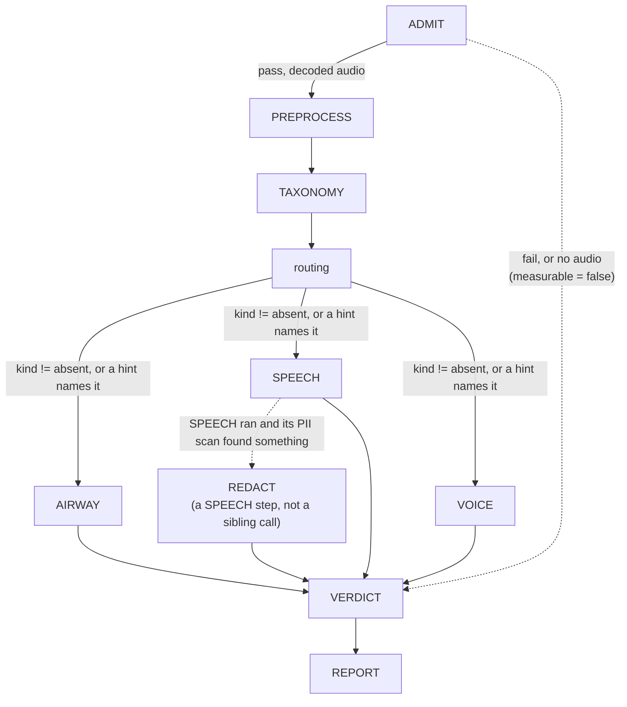

# The triage DAG, as the code runs it

Generated from `run.py::run_triage`/`_drive_branches`, `vocabulary.py::GRAPH_ORDER`/`BRANCHES`, and
`nodes/routing.py::routing`, not from design intent — every edge below is a specific line in one of
those three files. Re-verify against them (not against this file) after a change to any of the three;
nothing enforces that this diagram stays current.

Solid edges are unconditional; dashed edges are the two places the next step is genuinely optional.
`ADMIT`'s dashed edge and its solid edge are mutually exclusive on one run, not both traversed.

## What each edge actually is, in code

- **`ADMIT → PREPROCESS`** only when `measurable` is true (`run.py::run_triage`): `admitted is not
  None`, `admitted.verdict.outcome is not Outcome.FAIL`, and `admitted.audio is not None`. Any other
  case skips straight past `PREPROCESS`, `TAXONOMY`, `routing`, all three branches and `REDACT` —
  every name in `GRAPH_ORDER[1:-1]` is marked `SKIPPED` in one loop, not stepped through and refused
  individually.
- **`routing → {AIRWAY, SPEECH, VOICE}`** — three independent decisions, not one. `routing()` reads
  TAXONOMY's `kind` element for each of `speech`/`airway`/`voice`. A branch runs unless its kind was
  classified `absent`; `present`, `uncertain`, an unreadable state string, and *no classification at
  all* (TAXONOMY never wrote one) all count as "not absent" and run the branch — only an explicit
  `absent` withholds it, and even that is overridden when a caller's hint names that kind's tag
  (`forced_by_hint`). This is `will_run = by_classification or forced_by_hint` in
  `nodes/routing.py::routing`, and it is why the branches are drawn from `routing` independently
  rather than through one shared gate: each can be forced or withheld on its own kind without
  touching the other two. A `routing` call that itself raises leaves `selected` empty, so every
  branch is recorded `SKIPPED` too (`run.py::_drive_branches`) — a failed routing call withholds
  every branch, it does not fall back to running them.
- **`SPEECH → REDACT`** — `REDACT` is not a fourth branch; it is a conditional step
  `_drive_branches` takes after `SPEECH`, gated on two things both being true: `"SPEECH" in
  selected` (routing chose to run it) and `_speech_found_pii(store)` (at least one live `pii` entity
  is in the store after SPEECH's scan). Neither condition alone is sufficient — a run where SPEECH
  was skipped, or ran and found nothing, records `REDACT` as `SKIPPED` without calling it.
- **`{AIRWAY, SPEECH, VOICE, REDACT} → VERDICT`** — unconditional. `VERDICT` folds the `ran` state
  (`COMPLETED`/`SKIPPED`/`ERRORED`) of every node ahead of it, so a node that raised is folded
  differently from one that was never asked to run; `VERDICT` itself is called even when every branch
  was skipped or `ADMIT` failed.
- **`VERDICT → REPORT`** — unconditional and outcome-independent. `REPORT` runs after `VERDICT`
  whether or not `VERDICT` itself raised (`folded` may be `None`); it writes no elements and its own
  failure changes no verdict, per `report.py`'s own module docstring.

## Branch authority, not shown as edges

Nothing routes data *between* `AIRWAY`, `SPEECH` and `VOICE` — the diagram has no edges among them
because there are none in the code. Per `vocabulary.py::fold_file_verdict`'s docstring: "a branch is
the authority on its own kind and on nothing else" — its conclusion stands in `kinds` whatever
`TAXONOMY` classified, and a disagreement is recorded in `agreement` (`mismatch`) rather than
resolved by precedence between the two. That rule lives in the fold `VERDICT` calls, not in the call
graph above.
