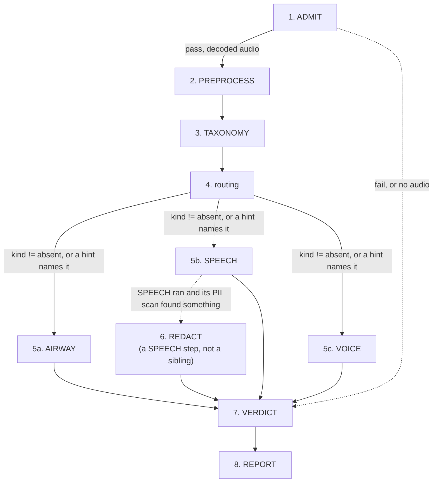

# The triage DAG, linearized from code, against its own goals

This document is generated by reading `run.py`, every node under `nodes/`, `vocabulary.py`'s
`fold_file_verdict`, `config.py`, and `data/config/default.yaml` directly — not from prior design
prose. Where an older spec doc disagrees with what is written here, the code is authoritative and
the older doc is stale. Re-verify against those files (not against this one) after any change to
them; nothing enforces that this stays current.

## The goal this graph exists to serve

Stated by the project owner: **flag for review** a recorded voice task (coughing, breathing,
speaking, phonation) from people across the lifespan, potentially with voice, respiratory, or other
disorders. Concretely, a file should be flagged when:

1. **the recording is of bad quality** — low SNR, or clipping in task-relevant regions;
2. **it contains other speakers within target-speaker-specific spans**;
3. **the spoken speech contains PII not included in the task itself.**

Goal 2 is no longer airway/speaker-specific by construction: PREPROCESS's span block (see node 2
below) is one foreground-acoustic-event detector for any duration carrying foreground acoustic
energy — other people talking, other sound sources, not only the target speaker — and `span_hear`/
`span_yamnet` attach classifier evidence to each one. Verified against `nodes/preprocess.py`'s
`_spans`/`_span_hear`/`_span_yamnet`.

The graph's job is to sort every file into exactly one of three outcomes: **pass** it through (needs
no further review), **flag** it (the workflow cannot determine cleanly, a person should look), or
**discard** it (should not be analyzed at all — unmeasurable, or acoustically empty). Every node
below is read against this: what role does it play toward one of the three flagging criteria, or
toward the pass/flag/discard sort itself, or toward neither.

**Headline finding, stated up front because it recurs below**: of the three flagging goals, only
goal 3 (PII) is fully wired to a decision today. Goal 1 (quality) is measured everywhere but gates
nothing — the code says so in its own comments. Goal 2 (other speakers) has a precise mechanism that
is currently inert under the packaged config, and falls back to a much cruder signal. See the summary
table at the end.

## How to read this document

Each step below states, in order: **what it does**, **what decides something and on what config
parameters** (a parameter is called out explicitly whenever it changes a decision, not just a
measurement), and **which of the three goals it serves, if any**. A config path like
`taxonomy.presence_floor.speech.lexical` is a dotted key into
`data/config/default.yaml`; `null` there means the parameter is declared but unmeasured, and reading
it via `config.require(...)` raises rather than silently defaulting — nothing in this graph runs on
an invented number.

## The call graph



Solid edges are unconditional; dashed edges are the two places the next step is genuinely optional.
The exact triggering conditions are in `run.py::run_triage`/`_drive_branches` and
`nodes/routing.py::routing` — see the earlier edge-by-edge account below the linear walk if you need
the precise code citation for each arrow.

## The linear walk

### 1. ADMIT — is this file measurable at all

**Role:** gate. Three exact, structural checks against the decoded waveform: `shape[-1] == 0` (no
frames), `not any(x != 0)` (every sample exactly zero), `all(x == x[:, :1])` (every sample equals the
first — no variance). Any decode exception also fails.

**Decision parameters: none.** This is the only node in the graph with zero config keys — by design,
per its own module docstring ("No thresholds, no `flag` outcome"). Anything with genuine ambiguity
(near-silence, low SNR, heavy clipping — real recordings with real content that happens to be poor
quality) is deliberately **not** judged here; it passes through to be measured properly downstream.
ADMIT only rejects what is unambiguous by construction.

**Serves the stated goals:** none directly. It feeds the discard axis: an ADMIT `fail` is the only
path to `Triage.DISCARD` with `discard_ground: "unmeasurable"` (`vocabulary.py::fold_file_verdict`).

### 2. PREPROCESS — condition the audio, measure everything once, decide nothing

**Role:** the one conditioning pass. Every model that answers a whole-file question runs exactly
here (YAMNet, AST, HeAR, both ASR recognizers); no later node re-runs one. It takes no pass/flag/fail
decision of its own — but, since a real cross-block dependency exists (spectral continuity reuses the
narrowband spectrogram block's own output, below), it is not guaranteed to complete. A derivative
whose config value is unmeasured (a null default) or whose own upstream prerequisite is missing is
recorded `absent`, exactly as before; anything else accumulates instead, and once every block has
been attempted `preprocess` raises one exception summarizing all of them, rather than returning. That
raise is caught the same way any other node's is (`run.py::_attempt`), and `_drive_branches` responds
by skipping TAXONOMY, routing and every branch — none of them has anything to read — straight to
VERDICT, which records the failure as a `flag` reason rather than an evidence-free `pass`.

Each block below still runs in its own try/except, with its own config, but "independent" now means
only that a block's *soft* failure (the two kinds above) never reaches another block — one block's
unexpected exception does not stop the rest of the loop from being attempted, but it does end the
node's own run once the loop finishes:

| derivative | config parameters |
|---|---|
| resample + downmix | `resample.target_hz` |
| pre-emphasis | `preemphasis.enabled`, `preemphasis.coefficient` |
| clip-event spans (`family="clip"`), ClipDaT over the *original* recording | `clipping.near_threshold`, `clipping.leniency_samples`, `clipping.minimum_extreme`, `clipping.min_duration_ms`, `clipping.merge_gap_ms` — the last two null in the packaged config |
| dynamically-normalized signal + its own energy envelope/floor | `normalization.macro_smoothing.window_s`, `.micro_smoothing.window_s` (`MedianSmoothing`, chosen over Butterworth because a zero-phase Butterworth rings on a word's onset), `.envelope_smoothing.window_s`/`.percentile` (`PercentileSmoothing`, the envelope actually used for span detection), `.target_dr_db`, `.compression_ratio`, `.macro_target_dbfs`, `.gain_smoothing.window_s` (`MedianSmoothing` — a resonant Butterworth could not settle to a short event's own gain within the event), `.floor_dbfs`, `.ceiling`; floor is `floor.percentile`, the 10th percentile of this envelope, a single global value for the whole recording rather than a rolling window |
| foreground-acoustic-event span proposals, flagged `contains_clip` on overlap with a clip span | `spans.k_db`, `spans.floor_margin_db`, `spans.transition_window_ms`, `spans.min_duration_ms`, `spans.min_separation_ms` for the amplitude sources (primary from the pre-emphasised envelope, always available; supplementary from the normalized envelope where it exists) — the threshold crossing itself generates each candidate directly (a maximal run where the envelope has risen `k_db` above the floor), not a peak later expanded outward; `spectral_continuity.smoothing.window_s` and `spans.continuity_margin`/`.continuity_floor_margin`/`.continuity_min_duration_ms` for a third source, spectral continuity over the wideband spectrogram block's own already-computed magnitude array (reused directly, not recomputed — see the spectrograms row below; wideband rather than narrowband for its shorter analysis window, giving continuity finer temporal resolution to place a transition against), added for sustained tonal/harmonic production (glides, phonation) an amplitude gate alone can miss — measured directly to work for glides and phonation-like sustains and NOT to discriminate breath from background on the one breathing recording tested. Absent whenever `spectrogram_wideband` itself is, a real cross-block dependency (see PREPROCESS's own role note above). A fourth source, ASR, reads the consensus transcript's own word timings (see the consensus-transcript row below) and groups them into runs by `speech.word_gap_ms` — no threshold or floor at all, since a recognizer transcribing a stretch as speech is itself the evidence; absent whenever `speech.word_gap_ms` is unmeasured (null in the packaged config) or `consensus_transcript` itself is. Each source only adds a candidate no earlier source already covers; onset and offset walk by the identical rule for every threshold-based source (stop within the source's own margin of its own floor, sustained for `transition_window_ms`) — ASR's own extents need no such walk. One span mechanism for any vocal task, no `family` distinguishing which downstream branch a span is "for" — `contains_clip` is the only per-span flag PREPROCESS itself asserts, alongside `measure` naming which source (`amplitude`, `continuity` or `asr`) proposed it |
| per-span quality: `squim` (STOI/PESQ/SI-SDR, on the *plain* signal) | none tunable; a span SQUIM refuses is recorded `unmeasured`, never padded |
| per-span quality: `span_hear` (on the *normalized* signal, AIRWAY's own per-span buffer/native-window split, raw scores only) | `windows.hear.default_threshold`, `windows.hear.label_thresholds` |
| per-span quality: `span_yamnet` (on the *normalized* signal, no buffering — YAMNet has no fixed-window constraint) | `windows.yamnet.default_threshold`, `windows.yamnet.label_thresholds`, `yamnet.top_k` |
| YAMNet / AST / HeAR window scores | `yamnet.top_k`; `windows.ast.win_length_s`/`hop_s`/`top_k`; `windows.hear.hop_s` — verified against `default.yaml`: `windows.ast.win_length_s`/`hop_s` are AST's owner-directed 10.24 s window, `windows.hear.hop_s` is HeAR's fixed 2 s window, both already model-native |
| per-window label membership | `windows.{yamnet,ast,hear}.default_threshold`, `windows.{yamnet,ast,hear}.label_thresholds` — **all six null in the packaged config**, so every window's label set is empty until an override supplies at least one |
| silence | `yamnet.silence_threshold` |
| **file-level quality: `level`** (peak/RMS dBFS, LUFS) | none — plain measurement |
| **file-level quality: `disruptions_file`** (clipping, dropouts, discontinuities), on the *original* recording | `disruptions.clip_headroom`, `disruptions.min_clip_run`, `disruptions.min_dropout_ms`, `disruptions.discontinuity_local_factor`, `disruptions.discontinuity_window_ms` |
| both ASR recognizers' own transcripts | none decision-relevant |
| consensus transcript (`fuse_consensus_words`) + `word`/`event` entities | `words.onomatopoeic_tokens` (null). A recognizer that brackets a non-lexical event (e.g. CrisperWhisper's `[COUGH]`) and one that transcribes it as a plain word (Qwen's `cough`) already vote as one word — `_normalize_word` strips brackets as punctuation — and the fused text now deterministically keeps the bracketed form regardless of which recognizer the fold visits first (`speech_to_text_ensemble/api.py`'s `_is_bracketed_token`); only a wholly-unbracketed reading still depends on `words.onomatopoeic_tokens` to become an `event` |
| F0/formant tracks (`phonation_tracks`) — measurement only, no boundary decided; sustained-phonation and glide span *detection* moved to TAXONOMY this session (owner-directed), which reads this measurement back — see TAXONOMY's own table below | `voice.f0_range_hz`, `phonation_spans.hop_s`/`.max_formants`/`.formant_max_hz`/`.formant_window_s`/`.formant_preemphasis_hz` |
| spectrograms (wideband/narrowband), gammatone | fixed window/hop keys, none decision-relevant; wideband's own magnitude array is also read directly by the spans block above, so it now runs before `spans` in block order |

Dynamic-range normalization is `envelope.dynamic_range_normalize` — a slow (`macro_smoothing`) and a
fast (`micro_smoothing`) envelope of the same signal via `hilbert_envelope_dbfs`, their difference
compressed toward `target_dr_db`, macro-leveled toward `macro_target_dbfs`, smoothed once more
(`gain_smoothing.window_s`, `MedianSmoothing`) and applied to the original waveform with a `ceiling`
safety clamp. Clip detection
(`clipping.*`, ClipDaT) runs on the *original* recording before this, on the stated assumption that
gain was fixed during recording — normalization only redistributes level, so a genuinely clipped
sample stays clipped through it rather than being smoothed away.

Still open, not implemented: the idea that PREPROCESS "could simply generate continuity signals"
instead of relying on consensus-transcript text for onomatopoeic detection — a larger architectural
question than the bracket-preservation fix above, and not pursued here.

**Serves the stated goals:** this is where **all** the raw evidence for goal 1 (`level`,
`disruptions_file`, per-span `squim`) is measured — but PREPROCESS itself makes no judgment on any of
it. It is where goal 3's substrate (the consensus transcript SPEECH will scan) is produced. Goal 2 is
served directly here too: `spans`, `clip_spans` and their `span_hear`/`span_yamnet` evidence are the
general foreground-acoustic-event mechanism referenced above — one span mechanism for any vocal task,
still unjudged (PREPROCESS decides nothing), never airway-only.

### 3. TAXONOMY — fold PREPROCESS's evidence into speech/airway/voice presence

**Role:** the first real classification. Pure fold over stored evidence — runs no model, reads no
hint — with one localising exception: sustained-phonation/glide span *detection*, moved here from
PREPROCESS this session (owner-directed). PREPROCESS measures F0 and formant tracks over the whole
stream and decides no boundary (`phonation_tracks`, see PREPROCESS's own table above); TAXONOMY reads
that measurement back and runs the same detector (`propose_phonation_spans`,
`propose_word_aligned_phonation_spans`, unchanged) over it, writing `family="phonation"` spans exactly
as PREPROCESS used to. VOICE reads those spans by `family` alone and does not care which node wrote
them. Every other kind reads named evidence **lines**, each line counting stored elements against its
own floor:

| kind | lines | decision parameters |
|---|---|---|
| speech | `lexical` (consensus word count) — **authoritative**; `acoustic` (YAMNet+AST windows carrying a speech-family label) — corroboration only | `taxonomy.presence_floor.speech.lexical`, `taxonomy.presence_floor.speech.acoustic`, `taxonomy.speech_labels` — **all three null** |
| airway | `health_acoustic` (HeAR windows), `acoustic` (YAMNet+AST windows) — both must agree to resolve | `taxonomy.presence_floor.airway.health_acoustic`, `taxonomy.presence_floor.airway.acoustic`, `taxonomy.audioset_airway_labels`, `taxonomy.hear_airway_labels` |
| voice | `phonation` (longest phonation span duration alone, over the spans TAXONOMY itself just localised) | `taxonomy.voice_min_duration_s`, `taxonomy.voice_uncertain_duration_s` — **both null**; span detection itself reads `phonation_spans.*` (seven of eight keys null) |

A line whose derivative never reached the store, or whose floor is null, reads `unavailable` — which
makes the *line* uncertain, never absent; a kind is `absent` only when every one of its lines
genuinely counted evidence below floor.

**TAXONOMY's own outcome — the first place "any uncertain kind flags the file" happens:**

```python
if all(state == ABSENT for state in states.values()):
    outcome = FAIL           # "every kind is absent"
elif any(state == UNCERTAIN for state in states.values()):
    outcome = FLAG           # "uncertain: <comma-joined list>"
else:
    outcome = PASS
```

Every uncertain kind is weighted identically here — speech, airway and voice each independently
trigger the same `FLAG` with no priority among them. Under the packaged config, with every presence
floor null, **every kind reads `uncertain` on every file that has any evidence at all**, so TAXONOMY
flags nearly universally until floors are fit.

**Serves the stated goals:** none of the three directly — this classifies *content type*, not
quality, speaker identity, or PII. It matters to this document because its uniform-uncertainty fold
is the mechanism behind an observed report where a "voice uncertain" reading flagged a file despite a
clean, unambiguous speech transcript — see "Cross-cutting tension" below.

### 4. routing — turn classification (+ hints) into an execution set

**Role:** decides **which of the three branches run**; classifies nothing itself, always `PASS`.

**Decision parameter:** `routing.hint_kind_map` (null by default) — maps a caller's declared
`may_contain` tags / `speech_type` to a kind. **The rule, per kind, independently:**

```
kind != absent  ->  branch runs
kind == absent  ->  branch runs only if a hint names that kind (forced_by_hint)
```

`present`, `uncertain`, an unreadable state string, and *no classification at all* all count as "not
absent" and run the branch — only an explicit `absent` withholds it. A `routing()` call that itself
raises withholds every branch (recorded `SKIPPED`), and VERDICT folds that into a `FLAG` naming the
routing failure.

**Serves the stated goals:** gates whether SPEECH (the branch carrying goals 1–3's machinery) runs at
all. If TAXONOMY classifies `speech` as `absent` and no hint claims it, SPEECH never runs and none of
the three goals can be evaluated for that file.

### 5a. AIRWAY — re-evaluate candidate spans with HeAR, confirm or contest

**Role:** four steps — re-evaluate PREPROCESS's envelope-peak spans with HeAR in isolation, ask
YAMNet to confirm or contest the same extent, check for lexical contamination (a consensus word
inside the labelled interval), conclude.

**Decision parameters:** `airway.labels_of_interest`, `airway.confirmation_map` (which YAMNet labels
confirm which HeAR label), `airway.k_db`/`airway.k_db_by_task` (falls back to the shared
`spans.k_db` = 18.0 dB), `airway.k_margin_db` (null — the near-gate flag is inert while null),
`airway.contest_labels` (null; refused at load if it ever overlaps `taxonomy.audioset_airway_labels`),
`windows.hear.default_threshold`/`label_thresholds`.

AIRWAY still selects its input by matching the stored `k_db` attribute value on PREPROCESS's spans
(`airway.py:189`), not by any span-level "family" — a mechanism this session's PREPROCESS change did
not touch. Two consequences, deliberately left as the next stage's decisions rather than folded into
this one: PREPROCESS's one span mechanism now runs entirely inside the `normalization.*`-dependent
block, so under the packaged default config (every `normalization.*` key null) PREPROCESS emits no
spans at all and AIRWAY has nothing to match against; and value-matching itself assumes exactly one
k_db was used file-wide, which stops being true the moment `airway.k_db`/`airway.k_db_by_task`
diverges from the shared `spans.k_db` PREPROCESS proposed at. AIRWAY re-deriving its own gate from
`peak_over_floor_db` on the generic spans, rather than re-matching a threshold PREPROCESS happened to
propose at, is the fix; not made here.

**Serves the stated goals: none.** AIRWAY is entirely about cough/breath event detection and
label-conflict resolution — a content-classification concern, orthogonal to quality, other speakers,
or PII.

### 5b. SPEECH — the branch that actually carries two of the three goals

**Role:** nine steps, reading the consensus transcript PREPROCESS already produced (re-transcribes
nothing). This is the only branch relevant to goals 1–3, so each step is mapped explicitly:

| step | what it does | decision parameters | goal |
|---|---|---|---|
| 1. transcript | reads the consensus words | — | — |
| 2. spans | groups words into speech spans by gap | `speech.word_gap_ms` (**null**) | — |
| 3. corroborate | YAMNet-coverage vote and SQUIM vote on "is this span really speech"; a disagreement flags | `yamnet.coverage_threshold`, `speech.speech_test_stoi_floor`/`speech_test_si_sdr_floor` (**both null** → SQUIM vote is `not_evaluated`, YAMNet alone decides) | content corroboration, not goal 1 |
| 4. diarize | pyannote over `[first word, last word]`; a second diarizer only if count ≠ 1 | `speech.second_diarizer` (null) | **goal 2** — the crude signal: `speaker_count != 1` flags unconditionally, whether or not any target/enrollment is known |
| 5. separation | measurement-gated; no backend runs by default | `speech.separation_backend`, `speech.separation_sound_class` (both null) | — |
| 6. identify | attributes each word to a diarized speaker by timing overlap; matches an optional enrollment by cosine similarity | `speech.enrollment_model`, `speech.target_match_cosine` (**null** — an enrollment is refused rather than compared while null) | **goal 2**, precise form |
| 7. pii | one scan of the consensus transcript; marks every occurrence | `pii.required_detectors` (populated: `[gliner, presidio, rules]`) | **goal 3** |
| 8. quality | SQUIM + `disruptions` **per speech span**, on the original recording | `quality.stoi_floor`, `quality.pesq_floor`, `quality.disruption_clipped_s_max`, `quality.disruption_dropout_s_max` — all four **declared, all four null, all four read by nothing in the codebase** | **goal 1 — measured, never decided** |
| 9. proximity / non-target axis | per-span level, spectral tilt, direct-to-reverberant ratio against the file's own reference level | `speech.nontarget.level_db`/`tilt_db_per_octave`/`d_to_r_db` (**all three null**) | **goal 2**, precise form |

**Goal 1, precisely:** step 8's own name and its parameters exist entirely for "is this recording bad
quality" — and the code's own comment reads *"reported, never gating."* No threshold on SQUIM or
disruption counts ever produces a flag here. The config file's own derivation text confirms this
independently: *"SPEECH's quality fail is unreachable by design until [`quality.*`] are measured.
Reserved: read by nothing yet; SPEECH step 8 reports without gating until these are measured AND
wired."* Verified by search: no file in this codebase reads `quality.stoi_floor`,
`quality.pesq_floor`, or either `quality.disruption_*` key. **Goal 1 has no implementation today** —
the evidence exists in the store, but nothing turns it into pass/flag/discard.

**Goal 2, precisely:** the *precise* mechanism the stated goal describes — "other speakers within
target-speaker-specific spans" — is steps 6 and 9 together: identify which spans belong to the
enrolled target, measure the *other* material's level/tilt/reverberance against the file's own
reference, and sum `nontarget_speech_s`. But `speech.nontarget.*`'s three cuts are all null, so
`nontarget_speech_s` is written `None` rather than computed (confirmed directly: this session's own
Rainbow-Passage run reported `nontarget_speech_s=` empty). What's actually live today is the cruder
step-4 signal — `speaker count != 1` — which flags *any* multi-speaker recording, with no reference to
whether the extra speaker falls inside a target-specific span, and regardless of whether an enrollment
was ever supplied. **Goal 2 is partially implemented**: real signal exists, but only the coarse form
is currently load-bearing.

**Goal 3, precisely:** step 7's `_decide_pii` flags whenever PII is found in the target speaker's
speech, in speech whose speaker cannot be resolved (nothing to exempt it), or when any required
detector didn't run. This *is* wired end to end into a decision. One gap against the stated wording:
**"not included in the task itself" is not implemented.** `_decide_pii` never reads `hint` or the
task token — every PII finding is treated identically regardless of whether the task legitimately
elicits it (e.g. a name given during a `Story-recall` task). Goal 3 is implemented for "any PII
found," not for "PII outside what the task called for."

### 6. REDACT — a step of SPEECH, not a fourth branch

**Role:** runs only when SPEECH ran **and** its PII scan found something (`run.py::_speech_found_pii`
gates it; it is not in `vocabulary.BRANCHES`). Plans padded/merged redaction extents, applies the
declared fill, re-scans the *redacted text* (no re-transcription) to verify nothing survived, and
only then releases an artifact pair.

**Decision parameters:** `redaction.padding_ms` and `redaction.fill` are both **required** — reading
either while null raises `ValueError` — and both are **null in the packaged config**. `pii.required_detectors`
governs completeness of both the original and the verification scan.

**This is goal 3's enforcement half**, and it is currently **blocked by config**: under the packaged
default, `redact()` cannot run to completion at all (it raises before doing anything) until a caller
supplies `redaction.padding_ms` and `redaction.fill` in an override. The b2ai-v2 campaign override
does supply both, so this is a config-completeness gap for the *packaged* default specifically, not a
missing mechanism.

**Serves the stated goals:** goal 3, exclusively — the physical redaction step.

### 5c. VOICE — phonation measurement, not one of the three goals

**Role:** measures HNR, F0, and glottal period marks over the phonation spans in the store (TAXONOMY
proposes them now, not PREPROCESS — see TAXONOMY's own section above; VOICE reads by `family` alone
and does not care which node wrote them); classifies nothing new (it measures the `voice` kind
TAXONOMY already classified). Runs no model AIRWAY/SPEECH share.

**Decision parameters:** `voice.f0_range_hz`/`voice.f0_range_by_population` (population-selectable —
`hint.metadata["population"]` picks an override key), `voice.f0_range_ratio_max` (refused at load,
not run-and-flagged, if the declared range would make the period-doubling check vacuous),
`phonation.period_doubling_factor`, `voice.task_duration_ranges` (null).

**Serves the stated goals: none.** This branch is entirely about characterising phonation quality
(jitter/shimmer/HNR-adjacent measures via period marks), not about recording quality, other speakers,
or PII.

### 7. VERDICT — the file-level fold; the second place "any flag flags the file" happens

**Role:** the only node that concludes a `Triage` (not an `Outcome`). Reads every other node's
verdict, `routing`'s decisions, and TAXONOMY's classification; writes nothing new to measure. No
config parameters of its own — a pure fold, in `vocabulary.py::fold_file_verdict`.

**The ladder, in order, exactly as coded:**

```python
if admit.outcome is FAIL:
    triage = DISCARD; ground = "unmeasurable"
elif any(reason.outcome is FLAG for reason in reasons):
    triage = FLAG                                   # uniform — every flag reason counts equally
elif all(kind_state == ABSENT for kind_state in resolved.values()):
    triage = DISCARD; ground = "acoustically_empty"
else:
    triage = PASS
```

`reasons` is every contributing `NodeVerdict` **plus** synthesized ones: a mismatch between what
TAXONOMY classified and what a branch concluded, a branch asked to run that never wrote a verdict
(errored or silently completed without one), a hint that claimed a kind the branch didn't find, a bad
`routing.hint_kind_map` entry, or an unread declaration. Every one of these — including TAXONOMY's own
"uncertain: voice" flag from step 3 above — is weighted identically in the `any(... is FLAG ...)` test.
**There is no priority among flag reasons anywhere in this fold.**

`Release` is folded separately and only from REDACT: `RELEASABLE` iff REDACT's own outcome was
`PASS`, `WITHHELD` on anything else, `NOT_ASSESSED` when REDACT never ran (no PII found, or SPEECH
itself didn't run).

**Serves the stated goals:** this is the sort itself — every upstream signal for goals 1–3 (where
implemented) lands here as a `FLAG` reason, with no goal-specific handling.

### 8. REPORT — render only

**Role:** runs after VERDICT on every outcome, including an ADMIT refusal; writes no elements. Not a
decision node. Out of scope for this document — see `report.md`.

## Summary: the three goals against what actually decides them

| Goal | Implementing step(s) | Decision parameters | Status |
|---|---|---|---|
| 1. Bad quality (low SNR, clipping in task-relevant regions) | SPEECH step 8 "quality" | `quality.stoi_floor`, `quality.pesq_floor`, `quality.disruption_clipped_s_max`, `quality.disruption_dropout_s_max` | **Not implemented.** Measured per span, never gates. Confirmed by grep: none of the four keys is read anywhere in the node code. |
| 2. Other speaker(s) within target-specific spans | SPEECH steps 4, 6, 9 | Precise form: `speech.nontarget.level_db`/`tilt_db_per_octave`/`d_to_r_db` (all null → `nontarget_speech_s` is `None`). Live fallback: unconditional `speaker_count != 1` | **Partially implemented.** Only the coarse, target-agnostic signal is currently load-bearing. |
| 3. PII not included in the task | SPEECH step 7 + REDACT | `pii.required_detectors` (populated); `redaction.padding_ms`/`redaction.fill` (both required, both null in the packaged default) | **Implemented for "any PII."** No task-awareness (`hint` is never read by `_decide_pii`), so "not included in the task itself" is not distinguished. REDACT itself is config-blocked under the packaged default until an override supplies padding/fill. |

## Cross-cutting tension, surfaced this session

TAXONOMY (step 3) and VERDICT (step 7) both flag uniformly on **any** uncertain kind / **any** flag
reason, with no ordering between them. A file with an unambiguous, clean speech transcript can still
be flagged solely because `voice`'s single evidence line (`taxonomy.voice_min_duration_s`) reads
`uncertain` — observed directly in this session's own single-file run
(`task-Rainbow-Passage`: `TAXONOMY: uncertain: voice`, despite SPEECH concluding cleanly). A proposed
change — voice's uncertainty should only contribute to the file decision when airway *and* speech are
*also* uncertain, rather than independently — is not implemented anywhere in the code today; it would
require changing either TAXONOMY's `elif any(state == UNCERTAIN ...)` fold (step 3) or how VERDICT
weighs reasons in its `any(... is FLAG ...)` test (step 7). Not decided in this document — recorded
here as the open question it is.

## Branch authority, not shown as edges

Nothing routes data *between* AIRWAY, SPEECH and VOICE — there are no edges among them in the code.
Per `fold_file_verdict`'s own docstring: "a branch is the authority on its own kind and on nothing
else" — its conclusion stands in `kinds` whatever TAXONOMY classified, and a disagreement is recorded
in `agreement` (`mismatch`) rather than resolved by precedence between the two.
