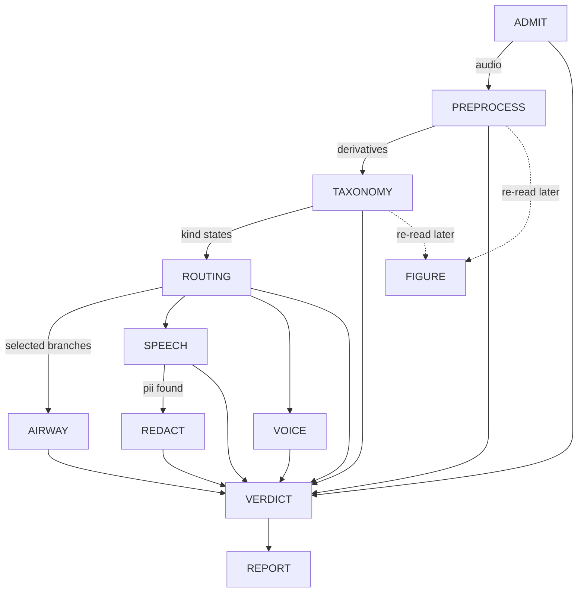
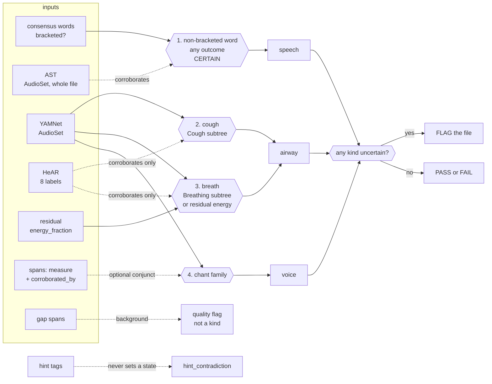

# The triage DAG, linearized from code, against its own goals

This document is generated by reading `run.py`, every node under `nodes/`, `vocabulary.py`'s
`fold_file_verdict`, `config.py`, and `data/config/default.yaml` directly — not from prior design
prose. Where an older spec doc disagrees with what is written here, the code is authoritative and
the older doc is stale. Re-verify against those files (not against this one) after any change to
them; nothing enforces that this stays current.

Regenerated 2026-09-07 at `f62f716e`, from the code rather than by patching the previous text.

## The goal this graph exists to serve

Stated by the project owner: **flag for review** a recorded voice task (coughing, breathing,
speaking, phonation) from people across the lifespan, potentially with voice, respiratory, or other
disorders. Concretely, a file should be flagged when:

1. **the recording is of bad quality** — low SNR, or clipping in task-relevant regions;
2. **it contains other speakers within target-speaker-specific spans**;
3. **the spoken speech contains PII not included in the task itself.**

Goal 2 is not airway/speaker-specific by construction: PREPROCESS's span block is one
foreground-acoustic-event detector for any duration carrying foreground acoustic energy — other
people talking, other sound sources, not only the target speaker — and `span_hear`/`span_yamnet`
attach classifier evidence to each one (`preprocess.py:_spans`, `_span_hear`, `_span_yamnet`).

The graph sorts every file into exactly one of three outcomes: **pass** it through, **flag** it (a
person should look), or **discard** it (unmeasurable, or acoustically empty). Every node below is
read against that.

**Headline finding, stated up front because everything else is downstream of it.** Today the graph
**flags every recording it can measure**, whatever that recording contains. `voice` has had no
evidence source since the phonation-span detector was retired on 2026-09-04, so its line is always
`unavailable` and its kind always `uncertain` (`taxonomy.py:311`, `:603`). TAXONOMY's `fail`
("every kind is absent") and `pass` ("nothing uncertain") are therefore both unreachable
(`taxonomy.py:634-641`), TAXONOMY always writes `flag`, and that flag reaches the file fold as a
reason, so `Triage.PASS` and the acoustically-empty `Triage.DISCARD` are unreachable too
(`vocabulary.py`, `fold_file_verdict`'s ladder). `Triage.DISCARD` remains reachable by one route
only: an ADMIT `fail`, which is tested before the flag row. Two tests pin the unreachability rather
than asserting outcomes that cannot occur (`TestTheOutcome`, `taxonomy_test.py:216`, at `:227` and
`:256`). This lifts when voice is
reworked onto `consensus_taxonomy`; it is a consequence of the retirement, not of any recording.

## How to read this document

Each step states **what it does**, **what decides something and on which config parameters** (a
parameter is named whenever it changes a decision, not merely a measurement), and **which of the
three goals it serves, if any**. A dotted key like `taxonomy.presence_floor.speech.lexical` is a
path into `data/config/default.yaml`.

`null` there means declared but unmeasured. Which of two readers is used matters and is called out
throughout: `config.require(...)` **raises** on a null, and inside PREPROCESS that raise is caught
and recorded as an absent derivative (`preprocess.py:1947-1961`) while the node still returns
normally; `config.get(...)` returns `None` and the caller carries on **silently**. The second is
the more dangerous of the two. Its worst instance — a null silently deleting the whole ASR span
source — was closed on 2026-09-05 by deleting the key (see PREPROCESS below); the pattern survives
in `taxonomy.speech_labels`, read `get ... or []` by both its readers, where a null empties the
speech family without a word anywhere.

The config is **215 lines, 108 keys, 38 of them null**. It carries a short `#` description per
section and per key and nothing longer. There is no `derivation:` key: it used to hold 50 kB of
prose, and because the loader hashes the merged mapping that prose sat inside `config_hash`, so
correcting a word of it made two behaviourally identical runs report different identities. The
derivations now live in [`config-derivations.md`](config-derivations.md), keyed by the same section
names, and `#` comments are not hashed.

## The call graph

`GRAPH_ORDER` is `("ADMIT", "PREPROCESS", "TAXONOMY", "routing", "AIRWAY", "SPEECH", "VOICE",
"REDACT", "VERDICT")` and `BRANCHES` is `("AIRWAY", "SPEECH", "VOICE")` (`vocabulary.py:14-18`).
REPORT runs after VERDICT and is not in `GRAPH_ORDER` (`run.py:41`, `:391`). FIGURE is in neither:
the in-tree runner never calls it, though the pipeline as actually run does, right after TAXONOMY
(see step 3b).

**Three gates, each of a different kind** (`run.py:333-346`, `_drive_branches`):

- **ADMIT** is the initial gate. A `fail` leaves every other node `skipped` and only VERDICT runs,
  which is what makes "could not measure" distinguishable from "measured, found nothing".
- **PREPROCESS** cannot flag or fail, but it can raise, and everything after it reads what it
  measured — so a raise skips TAXONOMY, routing, every branch and REDACT (`run.py:243-247`).
- **ROUTING** is a dependency gate: if it raises, no branch has an authorised decision, so every
  branch is `skipped` (`run.py:249-260`).

A branch that raises is recorded `errored` and its siblings still run: none reads another's output.

## The linear walk

### 1. ADMIT — is this file measurable at all

Decodes the recording and admits it. **The only rejections are decode failure, zero decoded
frames, all samples zero, and a constant signal** (`admit.py:1-6`; zero frames is its own case at
`:83`, distinct from all-samples-zero). No thresholds, no models, no derived audio, and **no
`flag` outcome** — `pass` or `fail` only (`admit.py:70`, `:102-107`). It reads **no config key at
all**, which it shares with VERDICT alone.

*Goals served*: none directly. It is the precondition for all three.

### 2. PREPROCESS — condition once, measure everything, decide nothing

The one conditioning pass. Every model answering a whole-file question runs here — YAMNet, AST,
HeAR, both recognizers, SQUIM, and FRCRN (a fourth model class, `preprocess.py:1661`) — and **no
later node re-runs one**, though YAMNet, AST and HeAR each run once *per stream* rather than once
per file (`preprocess.py:1936-1941`) (`preprocess.py:1-16`).

It takes no pass/flag/fail decision, but it is not guaranteed to complete. Each block runs in its
own `try`/`except`: a block whose config value is null, or whose upstream prerequisite is missing,
records that derivative **absent** and the pass continues; any *other* exception is collected and,
after every remaining block has run, re-raised as one summary (`preprocess.py:1947-1961`). So
"unmeasured because unconfigured" and "unmeasured because broken" are different outcomes, and only
the second stops the graph.

The blocks, in execution order (`preprocess.py`, the `blocks` list):

`clip_spans`, `yamnet_scores`, `yamnet_windows`, `silence`, `ast_scores`, `ast_windows`,
`hear_scores`, `hear_windows`, `level`, `disruptions_file`, `asr_crisperwhisper`, `asr_qwen`,
`consensus_transcript`, `phonation_tracks`, `energy_envelope`, `normalized_envelope`,
`spectrogram_wideband`, `spectrogram_narrowband`, `continuity_trace`, `spans`, `residual`,
`enhanced_yamnet`, `enhanced_ast`, `enhanced_hear`, `residual_yamnet`, `residual_ast`,
`residual_hear`, `squim`, `span_hear`, `span_yamnet`, `gammatone`. The six classifier blocks are
`_stream_yamnet`/`_stream_ast`/`_stream_hear` (`preprocess.py:1853`, `:1872`, `:1893`) parameterised
by stream prefix (`enhanced`, `residual`).

**Residual.** FRCRN_SE_16K (`FRCRN_ID`, `preprocess.py:102`) runs on `plain`
(`preprocess.py:1630-1775`), is cross-correlation lag-aligned via `compute_residual`
(`speech_enhancement/residual.py:176`), and both the aligned enhancement and `plain − g·enhanced`
are written as streams (`preprocess.py:1687`, `:1707`). One `residual` measurement records
`lag_ms`, `gain_db`, `energy_fraction`, `correlation_*`, `peak_dbfs`, `rms_dbfs`, per-band energy
fractions, and the speech preconditions `speech_present`/`n_consensus_words`/
`speech_coverage_fraction` (`preprocess.py:1737-1759`). It decides nothing. No meaning or energy
gate decides whether the streams are written: `speech_present`/`speech_coverage_fraction` are
preconditions on interpretation, not gates (`preprocess.py:1640-1655`, `:1737-1759`), and speech
regions come from `_speech_regions` (`:1612-1628`) — the consensus's lexical words' per-source
timings when a consensus exists, else this pass's own amplitude-source spans, with
`speech_overlap_source` naming which.

`residual.enabled` is **true** in the packaged config (`data/config/default.yaml:209`), so the
block runs by default. When an operator sets it false, `_residual` raises
`ValueError("residual.enabled is false")` (`preprocess.py:1657-1658`) and is recorded as an absent
derivative (`:1951-1954`), and the six stream-classifier blocks then raise
`LookupError(f"{prefix} is absent")` (`:1792`). That absence has a different cause from the
null-threshold absences below and is not the same kind of gap.

Name the twelve `{prefix}_{classifier}_summary_all` / `_summary_speech_free` derivatives
(`_stream_classifier_summaries`, `preprocess.py:1822-1851`). `speech_free` is the windows with
`speech_overlap == 0.0` (`:1833`) — no new threshold; each window carries a `speech_overlap`
fraction (`:1797`). The pair exists to separate the enhancer's speech-shaped artefact from real
background.

**Streams.** The recognizers, aligner, SQUIM, level and the window classifiers read the plain
resampled signal; the envelope, spans, spectrograms, gammatone and the phonation tracks read the
pre-emphasised one; `disruptions_file` reads the original recording (`preprocess.py:3-7`); and
`enhanced` and `residual` are each read by their own three classifier blocks
(`preprocess.py:1789-1793`). Streams persist as FLAC through one shared writer —
`STREAM_SUFFIX = ".flac"` (`common.py:18`), `write_stream` with `out_of_range="normalize"`
(`common.py:301-323`) — whose returned gain every caller records as the stream entity's
`write_gain` (`preprocess.py:435`, `:1696`, `:1716`). `plain` additionally records `peak_scale`
from a pre-write peak normalisation (`:420-423`); these are the only record that samples were
scaled.

Points that decide something, or that are currently deciding something by omission:

**Raw scores and thresholded labels are two different things, and only one of them survives a
null.** `<classifier>_scores` persists every window's raw score and reads no threshold.
`_windows(classifier)` then folds thresholds over those stored scores into per-window label sets —
and it uses `config.require(f"windows.{classifier}.default_threshold")` (`preprocess.py:888`). All
three thresholds are null, so **`yamnet_windows`, `ast_windows` and `hear_windows` are all absent
under the packaged config**, while the raw scores they were folded from are present.

**The per-span passes no longer share that fate.** `_span_hear` (`preprocess.py:1116`) and
`_span_yamnet` (`:1185`) read the same key with `config.get`, so they run whatever the
configuration says. `_span_window_attributes` (`:282-327`) then writes `raw_scores`
unconditionally — the model ran, so its output is a measurement — and writes `labels`/`scores` only
when a threshold existed, with a `labelled` flag distinguishing **"no threshold was set"**
(`labelled: false`, no labels) from **"nothing cleared the bar"** (`labelled: true`, empty labels).
This asymmetry between the per-span passes and the whole-file fold is deliberate on the per-span
side and simply not yet applied on the other; it is why airway's lines have data today and
speech's `acoustic` line does not.

A short span borrows from the whole-file YAMNet pass instead: `_covering_window_attribution`
(`preprocess.py:330-363`) computes `score[label] = Σ(score_w · overlap_w) / Σ overlap_w` over
whole-file `yamnet_scores` windows intersecting the span. A span shorter than the native window
(`SpanTooShortForYAMNet`) is scored this way and carries `attribution: "covering_windows"`,
`covering_windows_n`, `covering_seconds` (`:1227-1254`); a natively classified span carries
`attribution: "native"` (`:1291`). A short span with no covering window is marked
`no_covering_window`; a missing whole-file pass is `yamnet_scores_absent`. HeAR still centres a
short span in a silent 2 s buffer instead (`:1119-1121`, `span_hear_input`) and writes no
`attribution` field.

AST has the same shape of limit and is handled the same way. Its feature extractor asserts `window_size <= len(waveform)` inside `torchaudio.compliance.kaldi.fbank`, so a trailing window shorter than 400 samples at 16 kHz (25 ms) aborts the pass. `AudioTooShortForAST` (`classification/huggingface.py:23`, raised at `:238`) is a `ValueError`, so the block is recorded as an absence rather than a hard failure and the recording keeps its YAMNet and HeAR results. A file 10.2632 s long yields one full 10.24 s window plus a 371-sample remainder, which is how this arises; it hit 55 of 62,550 recordings before the guard.

**Per-span classification is batched.** Both passes build every span's input first, then make **one
call per classifier** (`_classify_spans_in_batch`, `preprocess.py:248-280`). A batch is used only
when it returns exactly one result per input — a short return is treated as a failure rather than
aligned by position, since misattributing one span's scores to another is worse than failing — and
a batch that raises falls back to one call per span, recording `"<Error> (after batch failed:
<BatchError>)"` so both facts survive. Input construction stays per span, so HeAR's 2 s buffering
can still refuse one span and have that recorded against it alone. This replaced one subprocess
venv per span: **949.7 s → 176.4 s** on a 79.51 s recording with 91 spans, 182 spawns down to two.

**The span algorithm** (`spans/api.py:propose_spans`), in order:

1. `spans.k_db` (6.0) **proposes**: every maximal run where the envelope has risen `k_db` above the
   floor is one candidate, directly — not a peak later expanded. Nothing crossing yields
   `NoContrast`.
2. `spans.min_separation_ms` (30) merges candidates closer than that into one proposal, **before**
   any walking, so one event's brief dips below `k_db` do not read as several.
3. The onset and offset **walk outward** from each candidate's own edges by an identical rule,
   continuing while the maximum over a `spans.transition_window_ms` (30) window still exceeds
   `floor + k_db`. The walk therefore closes when it finds 30 ms of continuously quiet envelope; a
   shorter dip does not close it. `transition_window_ms` is the *reach*, and it is load-bearing —
   30 ms gives 86 spans on the reference recording, 100 ms gives 45, 300 ms gives 18.
4. `spans.min_duration_ms` (50) discards a walked span shorter than that.
5. Overlapping survivors merge.

`spans.floor_margin_db` was **retired on 2026-09-04**. It had been the walk-stop threshold at 12.0
against a `k_db` of 6.0, and because the stop test was more permissive than the open test, any
sample failing the crossing automatically satisfied the stop — so it could not extend a span at any
value ≥ `k_db`. Substituting `k_db` is behaviour-preserving: 86 spans / 59.77 s before and after,
extents byte-identical on the reference envelope.

**`continuity_trace` is persisted** (`preprocess.py:_continuity_trace`), to
`derivatives/continuity_trace.npz`, with `cut_percentile` and the resolved `cut_level` on the
measurement. It was previously computed inside `_spans`' local scope and left there; writing it out
means a reader draws **the trace these spans were actually proposed from** rather than one
recomputed later against possibly-changed code. `_spans` reads the array back rather than
recomputing it, so the trace and the spans are the same object by construction.

**A null that deleted a span source in silence — resolved 2026-09-05.** `_spans` used to read
`speech.word_gap_ms` with `config.get` and, when it was `None`, simply omit the parameter: no
exception, no absent-derivative record, the ASR span source dropped and PREPROCESS still returning
`pass`. A **388-recording** run over ten subjects produced **7,651 consensus words and zero `asr`
spans**; SPEECH read the same key with `require`, so the same null errored that branch outright on
all **112** recordings of the earlier stage-0 collection
(`config-derivations.md:213-217`). The key is now **deleted outright** rather than given a value:
consensus words arrive
with their own timestamps, so grouping them needs no gap threshold, and
`group_extents_into_runs` merges on adjacency alone (`spans/api.py`). ASR spans exist again, and
the deletion also unblocked SPEECH, which had been `require`-ing the same null key.

**`phonation_tracks` does not run under the packaged config.** It requires `voice.f0_range_hz`
(`preprocess.py:1445`), which is null, so it raises and is recorded absent. What it *would* measure
is F0 over the pre-emphasised stream and the first four formants over `plain`, per frame — a
measurement with no boundary decided. The five surviving `phonation_spans.*` keys (`hop_s`,
`max_formants`, `formant_max_hz`, `formant_window_s`, `formant_preemphasis_hz`) are its Praat
settings and are populated; the eight *detection* keys that used to sit beside them were deleted
with the detector.

*Goals served*: 1 (measures level, SQUIM, disruptions), 2 (the span set and its per-span classifier
evidence), 3 (the consensus transcript PII is scanned from).

### 3. TAXONOMY — fold the evidence into speech/airway/voice, and consolidate the labels

Runs no model, reads no hint, and localises nothing (`taxonomy.py:1-27`). Each kind's rule reads
named **evidence lines**; each line counts stored elements against its own floor; a line whose
derivative never reached the store is `unavailable`, which makes its kind **uncertain, never
absent**.

| kind | lines | source | floor |
| --- | --- | --- | --- |
| `speech` | `acoustic` | whole-file pooled `yamnet_windows` + `ast_windows` | `taxonomy.presence_floor.speech.acoustic` (**null**) |
| | `lexical` | consensus words | `taxonomy.presence_floor.speech.lexical` (**null**) |
| `airway` | `health_acoustic` | per-span `span_hear` | `taxonomy.presence_floor.airway.health_acoustic` (**null**) |
| | `acoustic` | per-span `span_yamnet` | `taxonomy.presence_floor.airway.acoustic` (**null**) |
| `voice` | `phonation` | **none — retired** | n/a |

Which classifier labels count as speech at all is `taxonomy.speech_labels`, **null**, read as
`config.get(...) or []` in both readers (`taxonomy.py:564`, `speech.py:588`). So the speech family
is the empty set and the `acoustic` line has no label that could express its kind — a second,
independent reason it cannot report, on top of its own null floor. None of that decides the kind,
though: **speech's state is decided by the lexical line alone**. `_fold_speech_lines`
(`taxonomy.py:293-310`) is a thin wrapper over `_fold_authoritative_line(lines, "lexical")`, so the
acoustic line — and so `taxonomy.speech_labels` — has no effect on the state and is recorded as
corroboration only.

**Airway's lines read per-span measurements, not the pooled whole-file windows** that speech's
`acoustic` line uses. A span already carrying a live consensus word is excluded from both, since
ASR is strictly stronger content evidence and an ASR-explained span is not airway evidence whatever
HeAR or YAMNet also say about it. The two are **not** folded by equal-weight agreement:
`health_acoustic` (HeAR, the domain-specific detector) is authoritative and `acoustic` (YAMNet
alone) only corroborates — `_fold_authoritative_line` (`taxonomy.py:233`), the same
authoritative/corroboration shape as speech above. Corroboration count is never read as evidence
strength: a span's `corroborated_by` says other *sources* proposed something overlapping it, not
that its *content* is more certain.

**Voice's line is a placeholder that says so.** `_retired_voice_line` (`taxonomy.py:311-336`)
returns `state: unavailable`, `evidence: 0`, and a `why` naming the retirement — "the phonation-span
source was retired; voice is pending a rework onto consensus_taxonomy". The `why` exists so a report
or figure prints a deliberate gap rather than a bare `uncertain` a reader would take for evidence.
`taxonomy.voice_min_duration_s` and `taxonomy.voice_uncertain_duration_s` are now read by nothing.

Two **file-scoped measurements** are written here, both `extent=None`:

- **`<classifier>_label_summary`** (`_write_label_summaries`, `taxonomy.py:502`) — per label, peak,
  median and window count over the whole file, read from the verbatim scores sidecar so it needs no
  threshold. A classifier that never ran gets no summary, which keeps "absent" distinct from
  "measured nothing".
- **`consensus_taxonomy`** (`_write_consensus_taxonomy`, `taxonomy.py:433`) — the per-span labels of
  every per-span classifier (`PER_SPAN_CLASSIFIERS` = `{yamnet: span_yamnet, hear: span_hear}`,
  `:380`) consolidated into one file-level taxonomy for downstream to read instead of re-deriving.
  One row per label with `peak`, `peak_by_classifier`, `classifiers` and `n_classifiers`, ranked by
  peak. **Disagreement is recorded, not resolved**: a label only one vocabulary contains is not a
  vote against it, so `n_classifiers` counts corroboration only. It is a measurement — no floor
  turning it into present/absent. Empty when no per-span classifier produced scores, so "no
  consensus" and "a consensus over nothing" stay distinguishable.

`taxonomy.consolidation_floor` (0.2, owner-directed) drops a label scoring under it in
`_consolidate` (`taxonomy.py:406`), for every classifier — a floor only, with no top-K of its own.
The per-span top-4 union that turns into a raster's rows is FIGURE's own choice
(`style.top_labels`, `figure.py:165`, used at `:1800-1801`), not something `_consolidate` does; with
521 labels, a span where nothing fires still contributes its four highest, and those are near-zero.

**TAXONOMY's own outcome** (`taxonomy.py:634-641`): `fail` when every kind is absent, `flag` when
any is uncertain, `pass` otherwise. As above, only `flag` is reachable today.

*Goals served*: 2, by deciding whether the airway/speech content is there at all. The floors that
would let it decide are all null.

---

#### PROPOSED — deciding the kinds, so ROUTING can route

> **Everything from here to the end of this subsection is a plan, not the code.** Today's behaviour
> is the table above: every floor null, every line `unavailable`, every kind `uncertain`, every
> recording flagged. Nothing below is implemented. It is written here for the owner to mark up.

Rewritten 2026-09-10 against a 62,550-recording measurement of what each candidate detector would
actually route. Every figure quoted here comes from
[`specs/20260910-taxonomy-routing-evidence/measurements.md`](../20260910-taxonomy-routing-evidence/measurements.md),
which carries the full threshold sweeps, the per-family breakdowns and the enumerated
disagreements. The earlier 388-recording tables that stood here have been discarded: they predate
covering-window span attribution and a resample fix, and are not a valid baseline.

**The framing this section now serves.** A file belongs in the speech branch if **someone spoke in
it**, whatever the declared task. The declaration is a prior, never ground truth. No branch outcome
is used anywhere below: no branch has been run.

##### 0. What is being replaced — specificity 0.000

TAXONOMY wrote `uncertain` for all three kinds on 62,518 of 62,547 stores (29 have no `kind`
entity). ROUTING runs a branch unless the kind is `absent` (`routing.py:185-187`), so every branch
would run on every recording: sensitivity 1.000 and specificity **0.000** against every reference
standard tried. Any pathway below is an improvement on that.

Seven nulls hold it there, not one:

| null | where | consequence |
| --- | --- | --- |
| `windows.{yamnet,ast,hear}.default_threshold` | `default.yaml:92,95,101` | `_windows()` requires it (`preprocess.py:892`), so no `<classifier>_windows` (`preprocess.py:934`) reaches the store and `_window_evidence` (`taxonomy.py:98`) is always unavailable; `span_hear`/`span_yamnet` carry `labelled: false`, which `taxonomy.py:200` reads as unavailable too |
| `taxonomy.presence_floor.*` (4) | `default.yaml:165-171` | `_line_state` returns `unavailable` on a null floor (`taxonomy.py:269`) |

`taxonomy.voice_min_duration_s` is a null of a third kind: unread, because
`_retired_voice_line` (`taxonomy.py:311`) returns `unavailable` unconditionally.

##### 1. Speech — lexical content, with agreement *not* required

The rule: **at least one live consensus word that is not bracketed ⇒ speech present, certain.**
Read through `lexical_words` (`common.py:291`), which is `consensus_words` filtered on the word's
own `bracketed` attribute. No classifier can raise or lower it.

Two amendments to the rule as previously proposed, both measured:

**(a) Do not require `outcome: agreement`.** Against the declaration, `≥1 agreed word` scores
sens 0.824 / spec 0.879; `≥1 non-bracketed word of any outcome` scores sens 0.965 / spec 0.738,
and `≥5` scores sens 0.896 / spec 0.967 — the best Youden of any speech detector measured. The
14-point sensitivity gap is almost entirely diadochokinesis: 5,677 of the 7,239 speech-declared
recordings with no agreed word are DDK, and their transcripts are not empty — both recognizers
transcribe the syllable train (`'Ca-ca-ca-ca-…'`, `'Ca-caxacaca-caxacaca-…'`) and disagree on how,
so every word lands as `variant`. The `buttercup` variants, whose target is a real word, disagree at
0.27 against 0.93 for `/ka/`. **Requiring agreement measures lexical agreement between recognizers,
not speech presence.**

**(b) Bracketed-only must not count.** 449 recordings across 12 families have an agreed word where
*every* agreed word is bracketed — `'[cough]'`, `'[UH]'`, `'[cough] Cough Cough Cough Cough'` —
concentrated in `respiration-and-cough-cough` (202) and `-v2-hardcough` (120). Reading
`lexical_words` rather than the raw word list removes all 449 at a cost of one true positive.

**`words.onomatopoeic_tokens` is the remaining leak, and it is now quantified.** The vocabulary is
already wired — `preprocess.py:1372` reads it and `bracketed_form` (`consensus.py:162`, applied at
`:282`) rewrites a matching token to `[KEY]` — and it is null (`default.yaml:116`). While it is
null, `respiration-and-cough-cough` yields 37 recordings whose only unbracketed words are
`'cough cough cough'`, `maximum-phonation-time` yields 50 `'Ah.'`, and `glides-low-to-high` alone
yields 145 `'E.'` plus 44 `'E'`/`'E-'`. Those are the manoeuvre transcribed as a word, and filling the
vocabulary is the whole fix. **The candidate tokens are readable off the corpus; choosing them is
the owner's, not this document's.**

**The disagreements are the point, and most are not errors.** 2,584 recordings carry an agreed word
in a family that does not ask for words. Split by transcript:

| cause | scale | what to do |
| --- | --- | --- |
| the protocol asks for speech first — 938 of 1,258 `prolonged-vowel` transcripts begin `'One two three'` | 1,258 | route to speech; this is correct, not a false positive |
| genuine off-task speech, much of it the examiner — `"I'll have you do that one more time. [breath]"`, `"Now do I stop?"`, and one `breath-sounds` recording carrying a conversation about surgery rotations | 73/73 in `respiration-and-cough-breath`, 62/64 in `-fivebreaths` | route to speech; **this is the goal-2 condition the graph exists to find** |
| the manoeuvre transcribed as a word | 239 in `respiration-and-cough-cough`, of which 37 survive the bracket test | `words.onomatopoeic_tokens` |

*Owed*: `_is_bracketed_token` (`speech_to_text_ensemble/api.py:61`) is private to another module and
used only for display; TAXONOMY reads the stored `bracketed` attribute instead and needs nothing
from it. `words.onomatopoeic_tokens` needs its vocabulary.

##### 2. The AudioSet ontology, not a hand-built concept layer

Unchanged from the previous draft, and still owed. YAMNet's 521 and AST's 527 classes are
**AudioSet classes with a published parent–child ontology**; kinds should be expressed as subtrees
of it rather than as flat string lists. Only **HeAR's eight labels** need mapping in by hand.

**The ontology is not in this repository.** `audio_analysis/data/audioset_source_map.json` is a
*flattening* onto four categories and cannot serve: `Cough`, `Breathing`, `Snoring`, `Wheeze`,
`Gasp`, `Sniff` and `Throat clearing` all flatten to `people`. It also belongs to another workflow.

*Owed*: vendor and pin the AudioSet `ontology.json` with its release identifier, the same way a
model revision is pinned. Until then any subtree claim below is unverified.

##### 3. Airway is two phenomena, and one detector does not serve both

Firing fraction per family at the best whole-corpus threshold for each:

| family | `residual.energy_fraction ≥ 0.1` | YAMNet airway family `≥ 0.3` |
| --- | --- | --- |
| `respiration-and-cough-v2-breath` | **0.977** | 0.674 |
| `respiration-and-cough-breath` | **0.904** | 0.554 |
| `respiration-and-cough-fivebreaths` | **0.887** | 0.821 |
| `respiration-and-cough-cough` | 0.569 | **0.825** |
| `voluntary-cough` | 0.621 | **0.963** |
| `respiration-and-cough-v2-hardcough` | 0.352 | **0.855** |

Whole corpus: the residual at 0.1 is sens 0.785 / spec 0.874; YAMNet at 0.3 is sens 0.805 /
spec 0.869. **The residual catches breathing and misses coughing; YAMNet catches coughing and is
weakest on quiet breathing.** No threshold in either sweep repairs the other's blind spot, so
airway should be raised by **either** line, and `breath` and `cough` should be counted separately
rather than pooled into one `airway` verdict.

`residual.enabled` is `true` by default (`default.yaml:209`), so the residual line has an input on
every run.

**YAMNet `Cough` is the most specific single label measured** — 0.006 on `harvard-sentences-list`,
0.019 on `free-speech`, against 0.749–0.872 on the cough tasks. HeAR `Cough` is more sensitive
(0.928–0.978) and fires on 0.828 of `word-color-stroop` and 0.746 of `story-recall-v2`: sensitive,
and not usable alone. That is the same authoritative/corroborating shape as before, with the roles
the previous draft assigned — **AudioSet raises, HeAR corroborates** — confirmed at scale.

**`Snoring` / `Snore` must not raise or corroborate anything.** The previous draft dropped it on the
grounds that HeAR's `Snore` "peaks on sustained voicing, not respiration". **That is not what this
corpus shows, and the corrected reason is stronger:** `Snore` at 0.2 fires on 0.983 of
`word-color-stroop`, 0.917 of `animal-fluency` and 0.804 of `story-recall-v2` — connected speech —
as well as 0.911 of `respiration-and-cough-fivebreaths` and 0.873 of `maximum-phonation-time`. It
does not invert against family; it fires on nearly everything long. It discriminates nothing.

Airway under this proposal is therefore the **`Cough` and `Breathing` subtrees only**, with
`Snoring`, `Sigh`, `Sniff`, `Wheeze` and `Gasp` dropped from
`taxonomy.audioset_airway_labels` (`default.yaml:176`) and `Snore` from `taxonomy.hear_airway_labels`
(`default.yaml:177`) unless a measurement argues them back.

> **The conflict between notions 2 and 3 still needs the owner's ruling.** In the published AudioSet
> ontology `Snoring` is, to the best of our knowledge, a **child of `Breathing`** — so "take the
> `Breathing` subtree" and "drop `Snoring`" contradict each other. Either the rule is a subtree
> *minus an explicit exclusion list*, or airway names its members directly. Check it against the
> pinned ontology before either is written.

Two further measured facts constrain the airway line:

- **The per-span HeAR reading is worse than the whole-file one.** `_span_label_evidence`
  (`taxonomy.py:167`) is written to read `span_hear` as airway's authoritative line; scored that
  way it reaches Youden 0.366 against 0.570 for the whole-file HeAR summary. Whichever line is
  chosen, **this one is the weakest airway detector measured** and the choice needs a reason.
- **The enhanced stream is not an airway input.** YAMNet's airway family on `enhanced` reaches
  Youden 0.357 against 0.674 on `plain`: enhancement removes the airway content with the noise.
  `residual.enhanced_energy_fraction` is worse still — it fires on 99.99% of everything at every
  threshold, Youden ≈ 0.

##### 4. Voice — the chant family, not the span duration

**The proposed rule is beaten by a label.** `voice.longest_amplitude_span ≥ 3 s` scores sens 0.859 /
spec 0.790, with 11,394 false positives that are connected speech (`caterpillar-passage` 0.712,
`story-recall-v2` 0.664, `free-speech` 0.509 all clear 3 s). A 2 s floor is much worse — 24,569
false positives — which reproduces the earlier small-sample result at 62,550.

The YAMNet chant family (`Chant`, `Mantra`, `Singing`, `Humming`, `Choir`, `Vocal music`,
`Yodeling`) at peak ≥ 0.05 scores **sens 0.906 / spec 0.940**: 4.7 points more sensitive and 15
points more specific than the duration floor. Per family:

| family | `≥ 0.05` |
| --- | --- |
| `prolonged-vowel`, `maximum-phonation-time`(-v2) | 0.911–0.930 |
| `glides-low-to-high`, `glides-high-to-low`, `high-to-low` | 0.860–0.907 |
| every family that is not declared voice | ≤ 0.306 |

Conjoining the two (chant ≥ 0.02 **and** amplitude span ≥ 3 s) trades sensitivity for specificity —
0.837 / 0.958 — and is a reasonable alternative if false positives are the worry. **Which of the
two the owner wants is open; that the duration floor alone is the worst of the three is not.**

**`continuity` spans carry no phonation signal.** `voice.longest_continuity_span` has *negative*
Youden at every threshold from 0.25 s to 2 s and 0.003 at its best. This is the measured form of
the note above: a continuity candidate overlapping an amplitude span is absorbed as a
`corroborated_by` entry rather than surviving as a span (`preprocess.py:819-821`), so the standalone
continuity span is anti-correlated with sustained phonation. **A pathway reading `corroborated_by`
may still work; one reading standalone continuity spans cannot.** Nothing here measures the former.

*Owed*: whether voice reads the chant labels, the amplitude duration, or their conjunction; and, if
a duration takes part, its value — which belongs in `taxonomy` as a new key with its derivation in
`specs/`, not as a literal.

##### 5. What the classifiers cannot do, stated plainly

| claim | measurement |
| --- | --- |
| YAMNet `Speech` cannot route speech | at 0.2 (`consolidation_floor`), sens 0.997 / spec **0.217**; its per-family firing fraction never drops below 0.560 in any of the 48 families (minimum `respiration-and-cough-breath`, maximum `animal-fluency` 1.000). Only at 0.99 is it a discriminator (0.938 / 0.769) |
| AST is the best classifier for speech | `Speech` peak ≥ 0.5 on `plain`: sens 0.899 / spec 0.915 against agreed ASR, Youden 0.814 against YAMNet's best 0.708 — and still below the ASR rule |
| AST cannot corroborate anything through `consensus_taxonomy` | `PER_SPAN_CLASSIFIERS` is `{yamnet, hear}` (`taxonomy.py:380`) and no `span_ast` measurement exists anywhere in the tree; every AST detector read off `consensus_taxonomy` has sensitivity 0.0000 at every threshold |
| five of HeAR's eight labels can never corroborate | `_write_consensus_taxonomy` merges on the exact label string (`taxonomy.py:461`). Checked against a run's own 521 YAMNet label keys, only `Cough`, `Sneeze` and `Speech` are spelled the same; `Baby Cough`, `Breathe`, `Laugh`, `Snore` and `Throat Clear` have only near-misses (`Breathing`, `Laughter`, `Snoring`, `Throat clearing`) and so can never reach `n_classifiers: 2` |
| the residual is not a speech input | YAMNet `Speech` on `residual` reaches Youden 0.043, HeAR `Speech` 0.057 |

##### 6. No certain pathway ⇒ flag the file

Unchanged. **A kind no pathway raised with certainty is `uncertain`, and any uncertain kind flags
the file** — which is what the fold already does (`taxonomy.py:635-640`). The change is not the fold
but that pathways can reach certainty, which none can today.

##### Background, and the gap spans

Unchanged in substance and not re-measured here. PREPROCESS writes the complement of the proposed
set as `measure: "gap"` and classifies it like any other span. **Background should be neither a kind
nor a pathway**: the three kinds answer "is the content the protocol asked for present"; a mains hum
is a property of the room. Proposed instead: gaps feed a **file-level quality flag** alongside the
disruption counting.

##### What FIGURE already draws

`_stream_summary_lines` (`figure.py:865`) is called for `enhanced` and `residual`
(`figure.py:908,910`) and emits, per stream, one block per classifier off `*_summary_all` plus one
speech-free line per classifier off `*_summary_speech_free` — **all twelve stream summaries**. A
kind decision taken from these measurements is therefore already visible on the page that
accompanies it.

##### The hint: a flag, never a state

Unchanged. TAXONOMY refuses hints today, with a reason worth preserving (`taxonomy.py:22-26`): a
recording can genuinely carry two tasks' content. This section's own measurement is the strongest
case yet for that refusal — 78% of `prolonged-vowel` recordings contain real speech, and a hint
naming `voice` must not suppress it.

**The hint may not set, raise, lower or suppress any kind's state.** What it may do is produce its
own finding: when the content the task declares is absent, or a strongly-supported label
contradicts the declaration, that is a `hint_contradiction` flag on the file.

##### Every state, and what produces it

| level | state | produced by | reachable today |
| --- | --- | --- | --- |
| kind | `present` | its pathway raised with certainty | no — no pathway implemented |
| kind | `absent` | pathway ran, raised nothing, inputs available | no |
| kind | `uncertain` | no certain pathway, or its inputs unavailable | **yes, always** |
| node | `FAIL` | all three kinds `absent` | no |
| node | `FLAG` | any kind `uncertain` | **yes, the only outcome** |
| node | `PASS` | none uncertain, at least one present | no |
| file | `DISCARD` | ADMIT `fail` | yes, independently of anything here |
| file | `DISCARD` (acoustically empty) | every kind `absent` | no |
| file *(proposed)* | `hint_contradiction` | declared content absent, or contradicted | not implemented |
| file *(proposed)* | background quality flag | gap spans carry competing background | not implemented |

**Two levels people conflate.** `FAIL`/`FLAG`/`PASS` above are **TAXONOMY's node outcome**. They are
not the **file** result: `Triage.PASS` and the acoustically-empty `DISCARD` are VERDICT's, and
`DISCARD` stays reachable through ADMIT `fail` regardless of anything here.

##### The pathways, their inputs, and the flags

##### What each pathway still needs

| pathway | owed |
| --- | --- |
| 1 speech | `words.onomatopoeic_tokens` vocabulary (null, `default.yaml:116`); the ruling that `outcome` is not read |
| 2 ontology | the AudioSet `ontology.json` vendored and pinned — **not currently in the repository** |
| 3 airway | the subtree-minus-exclusions ruling; whether `breath` and `cough` become two counted lines; whether the HeAR line reads `span_hear` (Youden 0.366) or the whole-file summary (0.570) |
| 4 voice | chant labels, amplitude duration, or their conjunction — and, if a duration, its value in `taxonomy` with a derivation |
| 5 floors | the four `taxonomy.presence_floor.*` and the three `windows.*.default_threshold` nulls; nothing in this node can decide while they stand |
| 6 fold | nothing — the fold already flags on uncertainty; pathways are what is missing |
| background | whether a competing background is a quality flag or nothing at all |

### 3b. FIGURE — rendering, folded into the preprocessing sequence

`preprocess_figure(store, figure_dir, config, *, run_dir, style=None, stem=None)` (`figure.py:1725`).
Draws PREPROCESS's and TAXONOMY's output from the store: one multi-page PDF, one
`taxonomy_summary.json` always written alongside it, and per-page PNGs only when
`style.also_write_pngs` is set (`figure.py:1936-1946`).

**Two things are both true, and the pair is what matters here.** The owner's position is that
figure/PDF generation is part of preprocessing and belongs in the graph as such — every batch driver
that has actually processed a recording, including the recent 388-file batteries, calls
`admit -> preprocess -> taxonomy -> preprocess_figure` in that sequence, with rendering as the final
step (the owner's account of that driver; it lives on cluster scratch, outside this repository, and
its contents are not verifiable from here). Against that: `run_triage` (`run.py`) imports no figure
module and never calls `preprocess_figure` — grep for `figure` in `run.py` returns nothing — and
`scripts/triage_audio.py` calls only `run_triage`. The only caller of `preprocess_figure` inside
`src/`, `scripts/` and `specs/` is `figure_test.py`. **The in-tree runner is the component out of
step with the pipeline as it is actually run, not the other way around.**

It reads a finished store and **writes nothing back**, so it can be re-invoked over a completed run
directory, the same shape as re-running `report`. It **recomputes nothing**: everything it draws is
a store read or a display transform of one, which is why `continuity_trace` had to be persisted. A
structural AST sweep asserts FIGURE imports no measuring API (`figure_reads_only_test.py:77-92`),
and a second test asserts no `FigureStyle` field name can shadow a pipeline config key
(`figure_test.py:273-283`).

The pipeline configuration is **read and never overridden** — a threshold set to make a panel draw
would produce a picture of a pipeline that is not the one in production. A panel whose element is
absent names the missing derivative and prints the reason the producing node recorded.

**What the PDF contains, page by page:**

| panel | what it shows | store entity / derivative | config key(s) |
| --- | --- | --- | --- |
| cover — SOURCE | the recording's path, wrapped | ADMIT's recorded path (`_source_path`) | none |
| cover — CONSENSUS ALIGNMENT | `consensus_alignment_lines` (`:1519-1580`): algorithm, per-source word counts and timing source, agreement/variant/insertion outcome counts, time-shift fit, word-timing uncertainty | `consensus_transcript` measurement and its word stream | none |
| cover — WHOLE-FILE CLASSIFICATION SUMMARY | part of `summary_panel_lines` (`:840-861`): each of YAMNet/AST/HeAR's highest-scoring labels over the whole file | `<classifier>_label_summary` (TAXONOMY's fold of `<classifier>_scores`) | none pipeline; `style.summary_labels` caps rows listed |
| cover — ENHANCED — SPEECH ISOLATED BY FRCRN, then RESIDUAL — BACKGROUND AFTER SPEECH REMOVAL | `summary_panel_lines` renders both streams in sequence (`_stream_classifier_block`, `figure.py:787`; titles at `:64`): a gain/enhanced-fraction/residual-energy line, a label summary per classifier over **YAMNet, AST and HeAR** (`_SUMMARISED_CLASSIFIERS`, `figure.py:61`), and a compact speech-free line per classifier (`_stream_speech_free_line`, `:827`, `style.speech_free_labels` at `:177`) | the `residual` measurement; `{enhanced,residual}_{yamnet,ast,hear}_summary_all` and their `_summary_speech_free` variants | none — all twelve stream summaries now reach the page |
| cover — KIND STATES AND EVIDENCE LINES | the last part of `summary_panel_lines`: each kind's folded state, its evidence lines against their floors, and the reason behind any `unavailable` | TAXONOMY's `kind` entities | none read directly here — reflects whatever `taxonomy.presence_floor.*` etc. already decided |
| per-page — wideband spectrogram | the speech-analysis spectrogram | `spectrogram_wideband` | `spectrogram.wideband_window_ms`, `spectrogram.hop_ms` (`:1780`, `:1793-1794`) |
| per-page — waveform | conditioned waveform, envelope dBFS trace, floor and `k_db` threshold lines, continuity trace and its rank-cut level | `energy_envelope` (`envelope_dbfs`, `floor_dbfs`), `continuity_trace` | `spans.k_db` (`:1882`) — read here, not by the span lane panel below it |
| per-page — span lane | every live general span (amplitude/continuity/asr/normalization/gap), plus clip-event extents | live `span` entities (`family` absent) and clip-family spans | none read directly — the span algorithm's own keys are already baked into the stored spans |
| per-page — YAMNet raster | the union of each span's top-K YAMNet labels, scored | `span_yamnet` per-span scores | `taxonomy.consolidation_floor` (`:1798`) sets the row floor; `style.top_labels` (= 4, `:165`) caps labels per span (`_raster_rows`, `:1800-1801`) |
| per-page — HeAR raster | the same, for HeAR | `span_hear` per-span scores | same as the YAMNet raster above |
| per-page — SQUIM | per-span STOI/PESQ/SI-SDR | per-span `squim` assertions | none (`style.squim_ranges` only sets colour scaling) |
| per-page — consensus ASR / word lane (`_asr_lane_panel`) | each source's own per-word span under the derived extent; agreement words bold, insertions and variants marked | the consensus word stream (from `consensus_transcript`) | none |
| output — `<stem>.pdf` | the cover plus every per-window page above | all rows above | — |
| output — `<stem>__page<NN>.png` | one PNG per page, standalone | the same pages as the PDF | `style.also_write_pngs` (a `FigureStyle` field, not a pipeline config key) |
| output — `taxonomy_summary.json` | the machine-readable form of the whole-file classification summary and kind states — not the cover's SOURCE, CONSENSUS ALIGNMENT or residual lines | the same two blocks as the cover rows above, rebuilt by `taxonomy_summary_lines` (`:702`) | none |

Its own drawing choices live in a `FigureStyle` dataclass, disjoint from anything the pipeline reads.

### 4. routing — turn classification (+ hints) into an execution set

Measures nothing and classifies nothing: it reads TAXONOMY's `kind` elements and the caller's hints
and writes one `branch_decision` per branch (`routing.py:1-8`). **A hint forces a branch to run; it
never rewrites the classification, never removes a branch and never relaxes a threshold.** Its
verdict is always `pass` — an empty execution set is recorded on the decisions for VERDICT to read,
not flagged here.

The rule (`routing.py:185-187`): `by_classification = state != absent`; `forced_by_hint` is true
only when the hint named the kind **and** classification did not already select it; `will_run` is
the disjunction. Since no kind can be `absent` while voice is uncertain and the floors are null,
**every branch runs on every recording** today.

Hints reach it through `routing.hint_kind_map` (`routing.py:160`), read with `config.get` and
**null in the packaged config** — so every declared tag maps to no kind, forces nothing, and is
recorded `unmapped`. Extraction exists (`runs/b2ai-v2/make_hints.py`) but the map it checks against
lives only in that campaign's override.

*Goals served*: none directly; it gates the branches that serve them.

### 5a. AIRWAY — confirm or contest PREPROCESS's per-span HeAR labels

Reads the per-span HeAR labels over the general span set — excluding any span carrying a `family`
— and confirms or contests them (`airway.py:1`). It also reads PREPROCESS's `silence` windows
(`_inside_certified_silence`, `airway.py:26`; the windows are gathered at `:161-164` and the test
applied per span at `:232`), the lexical consensus words, which exclude an already-transcribed span
from the evidence set (`_is_transcribed`, `airway.py:64-79`, used `:216`, and again in the
lexical-contamination check at `:306-336`), and YAMNet's whole-file per-window labels, which drive
the confirm/contest verb (`_windows_covering`, `airway.py:46-61`, used `:258`). Config:
`airway.labels_of_interest` (`Cough`, `Breathe`), `airway.corroboration_profile` and
`airway.corroboration_overrides` (which AudioSet classes corroborate which HeAR label — derived
from the classifier-ontology profile, see
[`../20260910-classifier-ontology-mapping/design.md`](../20260910-classifier-ontology-mapping/design.md)),
`taxonomy.audioset_airway_labels`, and `airway.contest_labels` (**null**; when supplied it is
refused, at branch execution, if it intersects `taxonomy.audioset_airway_labels` rather than the
corroboration sets).

*Goals served*: 2.

### 5b. SPEECH — the branch carrying two of the three goals

Runs no ASR and never re-transcribes: PREPROCESS produced the consensus and this branch reads it
(`speech.py:1-16`). Speech spans come from consensus word timings, never the envelope, and pyannote
sees only `[first word start, last word end]`. The second diarizer runs only when pyannote's count
is not 1; separation runs only when `speech.separation_backend` names one (**null**). The target
speaker is identified by a caller-supplied **enrollment**, not by a per-file hint, and an enrollment
is refused rather than compared unless its model and resolved commit are both the probe's. **This
branch marks; it removes nothing.** The PII scan is one `scan_for_pii` call over the consensus
transcript and each recognizer's own transcript together (`speech.py:899-911`); a finding is marked
on every occurrence in the consensus stream.

Null keys that disable paths here: `speech.second_diarizer`, `speech.separation_backend`,
`speech.separation_sound_class`, `speech.target_match_cosine`, `speech.enrollment_model`,
`speech.speech_test_stoi_floor`, `speech.speech_test_si_sdr_floor`, and all three
`speech.nontarget.*` legs (read via an f-string at `speech.py:1058`). It used to `require`
`speech.word_gap_ms` as well, which is why this branch errored on every recording of the 112-file
collection; that key is now deleted and **SPEECH passes under the packaged config**.

*Goals served*: 2 and 3.

### 6. REDACT — a step of SPEECH, not a fourth branch

Runs only when SPEECH ran **and** its scan found live PII (`run.py:261-268`,
`_speech_found_pii`). It reads **four** config keys, every one of them through a module constant
(`redact.py:53-56`) rather than a literal, so a grep for `config.require("redaction` finds none of
them: `redaction.padding_ms` (`require`, `:116`), `redaction.fill` (`require`, `:368`),
`redaction.bleep_hz` (`get`, `:369`) and `pii.required_detectors` (`require`, `:371`).

**`redaction.padding_ms` and `redaction.fill` are both null and both `require`d, so REDACT cannot
run at all — it raises on the first of them it reaches.** It is unreachable by configuration, like
the `pass` and `discard` rows of the fold's ladder. The raise is caught: the call is wrapped in
`_attempt` (`run.py:262-266`), which records the node `ERRORED` with the message and returns `None`
(`run.py:185-187`), so the failure is an operational fact about the run and changes no verdict.
`pii.required_detectors` and `redaction.bleep_hz` are populated (`[gliner, presidio, rules]` and
`1000.0`) and are not what stops it. The initial plan uses each PII finding's own extent
(`_extents_from_findings`, `redact.py:160-183`), computed upstream in SPEECH; the **re-plan** widens
to `word_hull(word)` (`redact.py:407`) — the union of the fitted extent and every source's own
reading (`common.py:253-258`) — a deliberate widening for safety. `word_hull` is also read by the
widening gate (`redact.py:279`) and by the verification transcript (`:307`), neither of which plans
an extent.

*Goals served*: 3, in intent. None reached, since the node cannot execute.

### 5c. VOICE — inert, and saying so

Its subject is a store read: every live `span` whose `family` is `phonation` (`voice.py:3-4`,
`_PHONATION_FAMILY` at `:38`). **The detector that proposed those spans was the one removed on
2026-09-04, and nothing proposes them now**, so in production this branch always takes the no-span
path and writes `Outcome.FAIL` with a `why` naming the retirement rather than the bare "no phonation
span in the store" a reader would take for a property of the recording (`voice.py:231-237`).

Its measurement machinery is intact and unreached: HNR, F0 and RMS tracks over the whole stream,
sliced per span. `voice.f0_range_hz` is `require`d at `voice.py:68` and is null.

*Goals served*: none of the three; it was never one of them.

### 7. VERDICT — the file-level fold

Maps store facts onto `vocabulary.fold_file_verdict` and writes the result back (`verdict.py:1-6`).
Reads **no config key**. Two axes are kept apart: **triage** (pass/flag/discard) and **release**.

**A branch is the authority on its own kind and on nothing else**: its conclusion stands in `kinds`
whatever TAXONOMY classified, and disagreement is recorded in `agreement` rather than resolved by
precedence. **A branch `fail` is not a file `discard`.** PREPROCESS and ROUTING are folded from
`ran` rather than from a verdict entity, because a node that raised wrote none and would otherwise
be invisible — a silent, evidence-free `pass` would be worse than the flag reported instead.

The triage ladder, in order (`fold_file_verdict`):

1. **ADMIT `fail` → `discard`**, ground `unmeasurable`. The only reachable discard today.
2. **any reason is a `flag` → `flag`.** Always true at present.
3. every resolved kind `absent` → `discard`, ground `acoustically_empty`. **Unreachable.**
4. otherwise `pass`. **Unreachable.**

Reasons accumulate rather than being reduced to the deciding one: a PREPROCESS or ROUTING raise, a
`bad_map_values` entry, an unread declaration, a classification/branch mismatch, a branch asked to
run that stayed silent, and a hint claim nothing found. `_agreement` (`vocabulary.py:216-236`)
returns `resolved`, not `mismatch`, when TAXONOMY classified `uncertain` — so today's `FLAG` comes
from TAXONOMY's own verdict entity, not from this mismatch reason, which cannot currently fire.

### 8. REPORT — render only

Runs last, after VERDICT, on every file and every outcome, and is **the only node writing no
elements** (`report.py:1-8`). Reads the whole store and renders it: one summary and one summary
JSON. A rendering is not evidence, so nothing downstream reads either product to learn a fact the
store does not hold. Both carry element ids, a join key back into the store, so they sit beside it
and never under the release tree. Config: `report.format`, `spectrogram.hop_ms`. Its failure is
recorded beside every other node's and changes no verdict — and a failure carrying artifacts keeps
them, since REPORT writes its JSON before it draws.

## Summary: the three goals against what actually decides them

| goal | measured | decides anything | where it stops |
| --- | --- | --- | --- |
| 1. bad quality | yes — SQUIM, level, `disruptions_file`, per-span SQUIM | **no** | `quality.stoi_floor`, `quality.pesq_floor`, `quality.disruption_clipped_s_max`, `quality.disruption_dropout_s_max` are read by **nothing in `src/senselab`**; the gate they describe is unimplemented |
| 2. other speakers | yes — the general span set, per-span HeAR/YAMNet, diarization | partially | every `taxonomy.presence_floor.*` is null, so no kind can be `present` or `absent`; `speech.target_match_cosine` and `speech.nontarget.*` are null, so the enrolled path is unreachable by design |
| 3. PII | yes — the consensus transcript and each recognizer's own transcript are scanned in one call | **yes** | the one goal fully wired to a decision, and the only one whose acting node cannot run: `redaction.padding_ms` and `redaction.fill` are null and both `require`d, so REDACT raises. SPEECH marks PII; nothing releases a redacted product |

## What each run records about itself

The store is `ProvStore` (`utils/prov_store.py`), modelled on W3C PROV: entities, activities, agents
and PROV's own relations, append-only, so merging two stores is a set union and order-independent.

Three things it now records that a reader of an older run will not find:

- **Checksums.** Every entity carrying a `path` gets a SHA-256 with `size_bytes` and `mtime_ns`,
  computed in the process that wrote the file (`CHECKSUM_KEY`, `prov_store.py:41`). The input
  recording is digested **before and after** the decode; a mismatch fails ADMIT rather than
  recording a digest for bytes the pipeline never read. Detection, not prevention — the source tree
  is not ours to lock.
- **Environment.** One `environment` record per run for the host and one per subprocess venv
  actually used (`ENVIRONMENT_KIND`, `prov_store.py:33`), each with its Python version and the
  versions of a declared package set plus a digest of the full listing. This exists because the
  venvs do not agree: a 62,550-recording run recorded host torch 2.11.0 against `clearvoice-cpu`
  and `crisperwhisper-cpu` on 2.14.0+cpu and `qwen-asr-cpu` on 2.8.0+cpu, with `yamnet`/`hear` on
  TensorFlow 2.21.0 and no torch at all.
- **A BEP028 PROV-O JSON-LD projection.** `utils/prov_bep028.py` serialises a written `store.jsonl`
  into the four BIDS-Prov files (`_io`, `_act`, `_soft`, `_env`) without re-running anything.

The store is written once, at the end of a run. A process that dies mid-recording therefore records
nothing at all, which is why a stalled task leaves no evidence of where it stopped.

## Cross-cutting tensions

**Every recording flags.** Restated because it subsumes the table above: until voice is reworked,
the verdict carries no discriminating information for any file that ADMIT accepts. Anything reading
triage verdicts downstream is reading a constant.

**`require` and `get` are not interchangeable, and the choice is currently inconsistent.**
`windows.*.default_threshold` is `require` in the whole-file fold (three
derivatives absent) and `get` in the per-span passes (raw scores kept). `taxonomy.speech_labels` is
`get ... or []` in both its readers (`taxonomy.py:564`, `speech.py:588`), so a null empties the
speech family without a word anywhere. The per-span behaviour is the intended one; the others have
not been brought to it. `residual.enabled` is `require`d and now true by default (`preprocess.py:1657`), so an
intentionally-off block reports through the same absent-derivative channel as an unmeasured null.

**Eight keys are read by nothing**: the four `quality.*`; `taxonomy.voice_min_duration_s` and
`taxonomy.voice_uncertain_duration_s`, orphaned by the voice retirement; and `voice.hint_tags` and
`speech.hint_tags` (`default.yaml:142`, `:154`, both self-described "unread as of v2" —
`routing.py:184`'s own `hint_tags` is a local built from `hint_kind_map`, not this key). Pre-alpha
says delete outright; they are the only written record of gates nobody built.

**Hints are extractable but inert.** `routing.hint_kind_map` is null in the packaged config, so a
correctly extracted hint forces nothing. See [`benchmarks/open.md`](benchmarks/open.md), "Hints:
mapping, extraction and vocabulary".

## Branch authority, not shown as edges

The mermaid graph shows execution order. It does not show that **each branch is the authority on
its own kind and no other** — AIRWAY on `airway`, SPEECH on `speech`, VOICE on `voice`. A branch's
conclusion replaces TAXONOMY's classification for its own kind in the file verdict, and the
disagreement is recorded as a `mismatch` reason rather than resolved by precedence. No branch reads
another's output, which is why a branch that raises does not stop its siblings.
