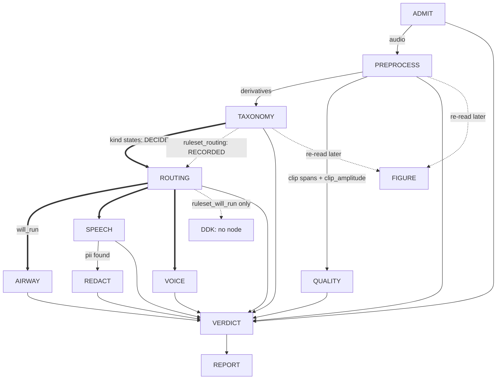
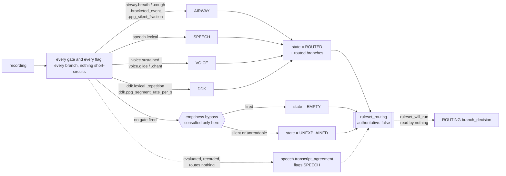

# The triage DAG, linearized from code, against its own goals

This document is generated by reading `run.py`, every node under `nodes/`, `vocabulary.py`'s
`fold_file_verdict`, `config.py`, and `data/config/default.yaml` directly — not from prior design
prose. Where an older spec doc disagrees with what is written here, the code is authoritative and
the older doc is stale. Re-verify against those files (not against this one) after any change to
them; nothing enforces that this stays current.

Regenerated 2026-09-07 at `f62f716e` from the code rather than by patching the previous text, and
brought forward to 2026-09-12 at `46f73787` — the posteriorgram and Praat preprocessing blocks, the
content-first ruleset, the fourth branch and the QUALITY edge. The glossary below is the first
thing to read: the document's vocabulary is exact, and the exactness is load-bearing.

Re-verified against the code at **`76fe6293`**, seventeen substantive commits on from the reading
above. Five of those changed what a section here asserts rather than only extending it, and each is
called out where it lands:

- **The ruleset now runs inside the graph** (`a8b15900`). TAXONOMY evaluates it over the store it is
  writing and records the result; ROUTING carries that selection beside its own. **It still decides
  nothing** — see step 3c, and `../20260912-ruleset-in-pipeline/design.md` for the two-stage
  staging.
- **QUALITY has a node** (`c3011de8`, `15fb5ece`, `29006b8a`, `a89c36af`, `9d5032f3`). The sentence
  "there is no `nodes/quality.py`" was true of every earlier reading of this document and is now
  false; step 5e is rewritten.
- **A finished run can be extended** (`bb63d659`, `29006b8a`, `44a2e241`, `9d5032f3`, `8b3b60bf`,
  `845651a7`). Five drivers append to — or, in one case, retire from — a completed store what the
  pass that produced it could not, over one shared module and one typed-absence rule; see step 9.
- **`words.onomatopoeic_tokens` is populated** (`77b247a1`), so PREPROCESS now brackets a
  transcribed cough — which removed 888 spurious SPEECH routings.
- **The corpus figures have a file** (`76fe6293`). Every corpus-wide number in step 3c is now read
  out of [`runs/ruleset-score-20260912/ruleset_score.json`](runs/ruleset-score-20260912/ruleset_score.json),
  the scoring run's own output, whose `config_hash` matches the packaged config at this commit. The
  figures that stood here before were an earlier, narrower measurement; step 3c says which is which
  and why both are correct for what they measure.

## Glossary

The vocabulary below is used precisely and its terms are not interchangeable. More than one defect
this week came from collapsing a pair of them, **detector into gate** most often of all. Every
example is read off the shipped ruleset (`taxonomy.ruleset` in `data/config/default.yaml`) or off
`routing_analysis/{detectors,ruleset,report,families,labels}.py`; none is invented.

**detector** — a named reading of **one** number out of a recording's evidence, with a polarity and
a sweep grid. **It decides nothing**: every threshold in its grid is scored and none is preferred
(`detectors.py:1-7`). There are **172** in the catalogue, `DETECTORS`. Example:
`airway.residual_energy_fraction` reads `("residual", "energy_fraction")` — the residual stream's
energy as a fraction of `plain` — polarity `above`, swept over a grid derived from that detector's
own distribution in the profile. A detector's `kind` (`airway`, `speech`, `voice`, `cough`, `glide`,
`ddk`) names the reference standard it is scored against, not a branch it commands.

**the three detector states** — a detector is in exactly one of three places and the difference is
what a new profile is allowed to do to it (`detectors.py`, `_check_staged`,
`_check_branch_detectors`):

- **catalogue** — `DETECTORS`, 172 of them, each with a grid derived from the profile.
- **staged** — `STAGED_DETECTORS`, declared before any sweep has profiled it, carrying an empty
  `thresholds` and outside the catalogue. There is **one**: `cough.words_onomatopoeic`. A profile
  that starts carrying its distribution makes the import raise until it is moved into the
  catalogue, which is the whole point of the state.
- **branch-held** — `BRANCH_DETECTORS`, a mapping from a branch to the detectors that branch reads.
  A held detector has been swept and **rejected as a gate**, deliberately; it also carries an empty
  grid, is outside the catalogue, and **no profile moves it anywhere**. That absence of a
  "now profiled" rule is the only thing distinguishing it from a staged one. There are **22**, all
  under `"VOICE"`: nineteen of kind `glide` and three of kind `voice`, every one reading
  `RecordingFeatures.phonation`. They lost to the incumbent singing union as router gates — recall
  0.624 against 0.749, absent on 7,157 recordings against 29 — and were kept because the direction
  they read separates the two glide families by roughly 100x when nothing in the catalogue separates
  them at all. `nodes/voice.py` does not read them yet.

The distinction is not bookkeeping. `UNPROFILED_DETECTORS` used to hold both meanings, and applied
to a measured-and-held detector it turns a recorded decision into an import error the next time the
corpus is profiled.

**gate** — a detector **plus one threshold**, named in `taxonomy.ruleset.gates`, that a branch
routes on. There are **11** declared: ten route and one only flags. **Every gate is a
detector-shaped reading; most detectors are not gates** — 172 catalogue readings, 11 of them pinned
to a cut, and the pinning is the whole difference. `airway.residual_energy_fraction` becomes the gate
`airway.breath` by being fixed at `>= 0.10`; `speech.words_lexical` becomes `speech.lexical` at
`>= 2`; `voice.longest_amplitude_span` becomes `voice.sustained` at `>= 3.0 s`;
`voice.yamnet_chant_peak.plain` becomes `voice.chant` at `>= 0.02`. Two gates happen to carry their
detector's own name — `airway.ppg_silent_fraction` and `ddk.ppg_segment_rate_per_s` — which is
spelling, not identity: the detector is the sweep, the gate is the one point taken off it. Two
others, `airway.bracketed_event` and `ddk.lexical_repetition`, read sources no detector reads
(`BRACKETED_SET`, `TRANSCRIPT_REPEAT` in `ruleset.py`) and carry cuts that were never swept.
A gate is evaluated on **every** recording and reports one of `FIRED`, `SILENT` or `UNAVAILABLE`;
`UNAVAILABLE` is a fact about the store, never a negative measurement.

**flag** — a gate listed in `taxonomy.ruleset.branch_flags` instead of `branch_gates`. It is
evaluated, recorded in `gate_outcomes` and named in `RouteEvaluation.flags`, and it **routes
nothing**: it annotates a branch already entered. There is one, `speech.transcript_agreement`
(`words.agreement >= 3`). `load_ruleset` refuses a configuration listing the same gate as both.

**branch** — `AIRWAY`, `SPEECH`, `VOICE`, `DDK`: `vocabulary.BRANCHES`. A gate firing routes the
recording to its branch, and a branch is the authority on its own kind and on no other. Any one of
a branch's gates firing is enough; they are OR'd, never conjoined.

**QUALITY** — in `GRAPH_ORDER`, after `VOICE` and before `REDACT`, and **not** in `BRANCHES`. Every
recording reaches it whatever routed, which is exactly why it cannot be a route: a gate firing on
everything selects nothing. It is a graph edge. It has no entry in `branch_gates`, `branch_flags` or
`reference_family_set`. Emptiness reaches it directly, bypassing the branches. **It now has a node**
(`nodes/quality.py`) and the runner calls it on every path PREPROCESS completed — see step 5e. The
four `quality.*` floors it was declared for are still null and still read by nothing; what it
implements is a consistency audit over PREPROCESS's own records.

**route state** — `ROUTED`, `EMPTY` or `UNEXPLAINED` (`ruleset.RouteState`), **exactly one per
recording**, replacing a pair of booleans that could both be false. `ROUTED` is a charge against
nothing, `EMPTY` is a charge against the recording, and only `UNEXPLAINED` — nothing fired and the
audio does not say why — is a charge against the ruleset. It is the number to drive the gates from.
Since `a8b15900` it is also a store fact: TAXONOMY writes it as the `state` of the
`ruleset_routing` measurement, and a **null** `state` there is a fourth thing again — the reading
was never made (see **recorded routing** below).

**recorded routing** — the `ruleset_routing` measurement TAXONOMY writes
(`vocabulary.RULESET_ROUTING`, `live_evidence.route_attributes`): route state, the routed branches
in `BRANCHES` order, every gate's outcome by name, the per-branch `unavailable` mapping, the flags,
the feature sources this configuration consumes, and the stem. It carries `authoritative: false`,
and `nodes/routing.py` stamps `ruleset_will_run` from it beside `will_run` on every
`branch_decision`. **Nothing reads either to decide anything.** The pair exists so the two
selections can be compared as one entity's two columns before one of them is deleted.

**typed absence** vs **failure** — a derivation that *cannot apply* to a recording against one that
*broke*. The typed absences are the exception classes in `extend.UNAVAILABLE`:
`AudioTooShortForAST`, `CrisperWhisperDecoderPositionsExceeded`, `F0RangeUnavailable`,
`PpgsPosteriorgramUnavailable`, `SpanTooShortForYAMNet`. `extend.attempt_derivation` records one of
those as `absent: <Class>: <message>` and **does not fail the row**; any other `OSError`,
`ValueError` or `LookupError` is recorded with its class and message and does. The distinction is
worth a glossary line because getting it wrong has cost a whole corpus pass: 613 of 60,202 rows
"failed" and every Slurm array task exited nonzero, and all 613 were `phonation_tracks` on unvoiced
audio — 271 harvard fragments and 243 airway recordings where no F0 range can be derived. That is
the correct answer to the question, not a failure to answer it. Inside PREPROCESS the same
separation is made by the per-block `try`/`except` (an absent derivative versus a collected hard
failure); inside the ruleset it is `GateOutcome.UNAVAILABLE` against `SILENT`; at the driver level
it is this rule. All three say the same thing and none of them is derivable from the others.

**bypass** — `taxonomy.ruleset.emptiness`: the max tracked-label peak of `enhanced|yamnet` and of
`residual|yamnet` both under `0.2`. It is consulted **only where no gate fired**, as the explanation
for that, never as a precondition that could stop a gate from running. A gate firing on a recording
the bypass would have called empty routes it normally, and that disagreement is a measurement of the
bypass rather than something the evaluation suppresses.

**family** — the elicitation group a BIDS stem's `task-` entity collapses into, by removing trailing
numeric segments only (`families.task_family`). There are **48** across the four declared sets in
`families.py`. Example: `..._task-harvard-sentences-list-10-3` collapses to
`harvard-sentences-list`; a `v2` marker is not numeric, so `respiration-and-cough-breath` and
`respiration-and-cough-v2-breath` stay two families.

**reference standard** — the declared families a branch is **scored** against,
`taxonomy.ruleset.reference_family_set`: `AIRWAY: airway`, `SPEECH: lexical_speech`, `VOICE: voice`,
`DDK: syllable_repetition`. **It routes nothing** — no gate is skipped, relaxed or tightened because
of it — and **it is a proxy, not ground truth**: a recording can genuinely contain content its task
never asked for. 938 of 1,258 `prolonged-vowel` transcripts open with `'One two three'` because the
protocol instructs the count-in, so SPEECH firing there is the gate reading content correctly and
the `extra` it scores is the proxy's error, not the gate's.

**held out by construction** — families dropped from a branch's scored population,
`taxonomy.ruleset.excluded_by_construction`, because they are **neither** positives **nor**
negatives for it. One branch declares one: `SPEECH: syllable_repetition`, **7,989** recordings.
Diadochokinesis *is* speech; it sits outside `lexical_speech` only because that set is the lexical
half. Counting a DDK recording SPEECH routed as a false positive charges the branch for behaving
correctly — over the whole SPEECH branch, holding them out takes specificity from **0.663** to
**0.895**, and for the single gate `speech.lexical >= 2` a threshold sweep puts **71.3%** of its
apparent false positives in DDK families and its DDK-excluded specificity at **0.855**. Those are a
branch figure and a gate figure and are not interchangeable; see step 3c. `score_branches` computes
both 2x2 tables rather than choosing, and `load_ruleset` refuses a branch that holds out families
its own reference set calls positive.

**polarity** — `above` or `below`: which side of the threshold fires. 152 of the 172 catalogue
detectors are `above` and 20 are `below`. A gate spells the same thing as `op: at_least` / `at_most`, which
`ruleset._POLARITY` maps back onto the polarity vocabulary the recall curve reads. It is not
cosmetic: `ddk.ppg_repetition_lag_segments` scored a flat line at every budget until its polarity
was corrected, which read as a measured null and was not one.

**sweep grid** — the candidate thresholds a detector is scored at (`Detector.thresholds`,
ascending via `sweep_points`). **A grid that fails to cover its feature's range makes a detector
look measured-and-weak when it was never measured.** `airway.praat_phonation_ratio` is the worked
case: 31,464 of its 60,048 readable values sat above the last point of the hand-written proportion
grid, so every threshold in it saw the same undivided block at the top and no cut could separate
anything inside it. The register of ten such grid/feature pairs is in
[`../20260911-praat-ppg-detectors/design.md`](../20260911-praat-ppg-detectors/design.md), "Grids
that may not cover their feature's range".

**No grid is a constant any more, and this failure mode is now refused rather than documented.**
`derive_thresholds` (`detectors.py:314`) builds each grid from that detector's own quantile ladder
in the dated profile under `data/detector_profile/`, unions in the ladders of ungated siblings
reading the same primary feature, and **raises** when the derived grid does not reach the profiled
extreme on the polarity's firing side. Two clamps follow from the same reading: the grid is cut to
`[min, max]` of what the contributing ladders attain, with the pinned cut points and — for a
`score`-unit detector — `taxonomy.consolidation_floor` unioned back in afterwards. Before that
clamp, integer enumeration started at zero whatever the feature reached, so
`ddk.ppg_distinct_phonemes` (polarity `below`, profiled minimum 1) swept a threshold at 0 that fired
on nothing and reported it as a measurement. A grid whose best threshold is its own last entry has
not been swept; it has been truncated.

**detector profile** — the dated table each grid is derived from, one row per detector, carrying
`n`, `availability`, `polarity`, `state`, `min`, `max`, `distinct` and the quantile ladder. It is
**parquet** as of `f73d2581` (`data/detector_profile/2026-09-12.parquet`, 25,224 bytes against the
129 kB JSON it replaced), with its sweep header in the file's key-value metadata rather than in a
row. It is generated, never hand-edited. Note that it is a record of a past sweep and not of the
current catalogue: the shipped profile carries **175** rows against the catalogue's 172, the three
extra being `{airway,speech,voice}.ast_peak.consensus`, which left the catalogue when
`PER_SPAN_CLASSIFIERS` was fixed at `{yamnet, hear}` and AST acquired no per-span pass. Rows the
catalogue does not name are ignored; rows it names and the profile lacks raise.

**availability** — the share of the population whose evidence a detector can read at all
(`RecallCurve.availability`), the complement of `n_unreadable`. **A detector absent on part of the
corpus has a recall ceiling below 1 whatever its threshold**, and `RecallCurve.recall_ceiling` names
that ceiling so a flat curve is not mistaken for a weak one. `airway.ppg_silent_fraction` is absent
on the 2,345 recordings with no consensus transcript and therefore no posteriorgram: availability
**0.963**, ceiling **0.875**. That is why it is OR'd beside `airway.breath`, whose own feature is
absent on 31, rather than replacing it — each reads a population the other cannot.

**over-routing budget** — the false-positive rate a threshold is allowed to spend
(`OVER_ROUTING_BUDGETS` = 2%, 5%, 10%, 20%). A threshold is chosen as **the loosest cut inside a
budget**, tightened back to the strictest cut reaching the same recall, **not** by maximising
Youden's J, **because a router's errors are asymmetric**: an over-routed recording costs a branch
some discarded work, an under-routed one is never seen by anything that could interpret it. J prices
the two the same. `airway.ppg_silent_fraction` shipped at 0.90 — recall 0.499 at a false-positive
rate of 0.042, well inside the 10% budget and so stricter than a router should be — and the criterion
moved it to **0.757**, for recall 0.761, 193 recordings that reached no branch now reaching one, at
1,929 additional branch invocations the branches discard. Each `BudgetPoint` records whether the
budget or availability is what bounds it (`LIMIT_BUDGET` / `LIMIT_AVAILABILITY`).

**kind**, **evidence line** — TAXONOMY's own vocabulary, older than the ruleset's and not the same
thing. A **kind** (`speech`, `airway`, `voice`) is folded to `present`, `absent` or `uncertain` from
named **evidence lines**, each counting stored elements against a `taxonomy.presence_floor`. A
branch has a kind; a gate does not. Nothing in the fold reads `taxonomy.ruleset`.

**node outcome** vs **file verdict** — `Outcome.PASS/FLAG/FAIL` is what one node concluded;
`Triage.PASS/FLAG/DISCARD` is what should happen to the recording. They are different axes and a
node's outcome is never a file result. Restated below where the fold is described, because this is
the second most-collapsed pair in the document.

## The goal this graph exists to serve

Stated by the project owner: **flag for review** a recorded voice task (coughing, breathing,
speaking, phonation) from people across the lifespan, potentially with voice, respiratory, or other
disorders. Concretely, a file should be flagged when:

1. **the recording is of bad quality** — low SNR, or clipping in task-relevant regions;
2. **it contains other speakers within target-speaker-specific spans**;
3. **the spoken speech contains PII not included in the task itself.**

Goal 2 is not airway/speaker-specific by construction: PREPROCESS's span block is one
foreground-acoustic-event detector for any duration carrying foreground acoustic energy — other
people talking, other sound sources, not only the target speaker — and `span_hear`/`span_yamnet`
attach classifier evidence to each one (`preprocess.py:_spans`, `_span_hear`, `_span_yamnet`).

The graph sorts every file into exactly one of three outcomes: **pass** it through, **flag** it (a
person should look), or **discard** it (unmeasurable, or acoustically empty). Every node below is
read against that.

**Headline finding, stated up front because everything else is downstream of it.** Today the graph
**flags every recording it can measure**, whatever that recording contains. `voice` has had no
evidence source since the phonation-span detector was retired on 2026-09-04, so its line is always
`unavailable` and its kind always `uncertain` (`_retired_voice_line`, `taxonomy.py:329`, folded at
`:720-726`). TAXONOMY's `fail` ("every kind is absent") and `pass` ("nothing uncertain") are
therefore both unreachable (`taxonomy.py:750-757`), TAXONOMY always writes `flag`, and that flag
reaches the file fold as a reason, so `Triage.PASS` and the acoustically-empty `Triage.DISCARD` are
unreachable too (`vocabulary.py`, `fold_file_verdict`'s ladder). `Triage.DISCARD` remains reachable
by one route only: an ADMIT `fail`, which is tested before the flag row. Two tests pin the
unreachability rather than asserting outcomes that cannot occur (`TestTheOutcome`,
`taxonomy_test.py:269`, at `:280` and `:309`). This lifts when voice is
reworked onto `consensus_taxonomy`; it is a consequence of the retirement, not of any recording.

**QUALITY is now a second, independent source of the same flag**, and it does not lift the finding
either — it adds to it. Its verdict enters `fold_file_verdict`'s `reasons` like any other node's
(`reasons = list(node_verdicts)`, `vocabulary.py:334`), so a clip contradiction flags the file on
its own. Its expected count is zero on a fresh run; see step 5e.

**The measured replacement now runs beside the path it will replace, and still decides nothing.**
`taxonomy.ruleset` and `routing_analysis/` carry a content-first ruleset scored over 62,547
recordings, which routes 99.2% of the corpus to a branch. Since `a8b15900` two nodes read it:
TAXONOMY evaluates it over the store it is writing and records the result as the `ruleset_routing`
measurement, and ROUTING stamps `ruleset_will_run` from that beside its own `will_run` on every
`branch_decision`. **What decides has not moved.** `kind_state` still selects the branches that run;
every `taxonomy.presence_floor` is still null (`data/config/default.yaml:180-187`, read at
`nodes/taxonomy.py:683-688`); `routing.BRANCH_FOR_KIND` and `KIND_STATES` are untouched; and
`vocabulary.BranchDecision` deliberately does not carry the new attributes, so `fold_file_verdict`
cannot see them.

**The deletion of the old path has not happened.** Both mechanisms are present, both run, and one is
inert. `../20260912-ruleset-in-pipeline/design.md` is the staging document and names, item by item,
exactly what stage 2 deletes once corpus agreement between the two selections has been measured.
Until that lands, the behaviour of the running graph is the one described above: every recording
flags. See step 3c.

## How to read this document

Each step states **what it does**, **what decides something and on which config parameters** (a
parameter is named whenever it changes a decision, not merely a measurement), and **which of the
three goals it serves, if any**. A dotted key like `taxonomy.presence_floor.speech.lexical` is a
path into `data/config/default.yaml`.

`null` there means declared but unmeasured. Which of two readers is used matters and is called out
throughout: `config.require(...)` **raises** on a null, and inside PREPROCESS that raise is caught
and recorded as an absent derivative (`preprocess.py:2617-2626`) while the node still returns
normally; `config.get(...)` returns `None` and the caller carries on **silently**. The second is
the more dangerous of the two. Its worst instance — a null silently deleting the whole ASR span
source — was closed on 2026-09-05 by deleting the key (see PREPROCESS below); the pattern survives
in `taxonomy.speech_labels`, read `get ... or []` by both its readers, where a null empties the
speech family without a word anywhere.

The config is **313 lines, 166 leaf keys, 39 of them null** — three of the thirty-nine are the
`excluded_by_construction` entries of the branches that hold nothing out, where null is the value
and not an absence of one. It carries a short `#` description per section and per key and nothing
longer. There is no `derivation:` key: it used to hold 50 kB of
prose, and because the loader hashes the merged mapping that prose sat inside `config_hash`, so
correcting a word of it made two behaviourally identical runs report different identities. The
derivations now live in [`config-derivations.md`](config-derivations.md), keyed by the same section
names, and `#` comments are not hashed.

## The call graph

**Both of TAXONOMY's edges into ROUTING are real and only the thick one decides.** `kind_state`
selects what runs; `ruleset_will_run`, read off the `ruleset_routing` measurement, is stamped on the
same `branch_decision` entity beside it and acted on by nothing. One entity, two columns, so corpus
agreement is a column pair rather than a join.

**DDK is still never selected and is now safe to name.** `routing.BRANCH_FOR_KIND` is
`{airway: AIRWAY, speech: SPEECH, voice: VOICE}`, so no `branch_decision` is written for DDK and
`will_run` cannot be true for it. The ruleset *does* route it, so `ruleset_runs` can carry it;
`run._drive_branches` therefore looks a branch up rather than indexing it, and a branch with no node
is recorded `SKIPPED` with the note `NO_NODE`. Before `a8b15900` that lookup was an index and naming
DDK in an execution set would have been a `KeyError` that killed the run.

**QUALITY's edge comes from PREPROCESS, not from the branches.** It is drawn after them in
`GRAPH_ORDER` and called after the branch loop, but it reads no branch output as evidence: its
inputs are ADMIT's `recording` stream entity, PREPROCESS's `clip` spans and PREPROCESS's
`clip_amplitude` measurement. What it takes from the branches is only the list of node names that
had concluded when it read the store, which it records as `preceded_by`. It is not guarded by
routing: a ROUTING that raised leaves every branch `SKIPPED` and QUALITY still runs.

`GRAPH_ORDER` is `("ADMIT", "PREPROCESS", "TAXONOMY", "routing", "AIRWAY", "SPEECH", "VOICE",
"QUALITY", "REDACT", "VERDICT")` and `BRANCHES` is `("AIRWAY", "SPEECH", "VOICE", "DDK")`
(`vocabulary.py:14-33`). **The two lists are not the same list and neither contains the other**:
`QUALITY` is a graph edge every recording reaches and not a branch, and `DDK` is a branch the graph
does not yet order — see step 5d. REPORT runs after VERDICT and is not in `GRAPH_ORDER` (`run.py:44`).
FIGURE is in neither: the in-tree runner never calls it, though the pipeline as actually run does,
right after TAXONOMY (see step 3b).

**Three places the graph stops short, each of a different kind** (`run.py:_drive_branches`). These
are dependency checks in the runner and are *not* gates in the ruleset's sense — nothing here reads
a threshold:

- **ADMIT** is the initial one. A `fail` leaves every other node `skipped` and only VERDICT runs,
  which is what makes "could not measure" distinguishable from "measured, found nothing".
- **PREPROCESS** cannot flag or fail, but it can raise, and everything after it reads what it
  measured — so a raise skips TAXONOMY, routing, every branch, QUALITY and REDACT.
- **ROUTING** is a dependency check: if it raises, no branch has an authorised decision, so every
  branch is `skipped`. **QUALITY is not behind this check** — it sits after the branch loop and runs
  whatever routing did, because its evidence is PREPROCESS's.

A branch that raises is recorded `errored` and its siblings still run: none reads another's output.

**The two short-stop paths do not record DDK, and the happy path does**, which is a small
inconsistency worth knowing before reading a `run.json`. On the ADMIT-fail and PREPROCESS-fail paths
the runner writes `SKIPPED` for a slice of `GRAPH_ORDER` (`run.py:432`, `:291-292`), and `DDK` is
not in `GRAPH_ORDER`, so it carries no outcome at all there and is absent from
`TriageRunResult.nodes`. On the happy path the branch loop records it `SKIPPED` with
`note: "no node implements this branch"`.

## The linear walk

### 1. ADMIT — is this file measurable at all

Decodes the recording and admits it. **The only rejections are decode failure, zero decoded
frames, all samples zero, and a constant signal** (`admit.py:1-6`; zero frames is its own case at
`:83`, distinct from all-samples-zero). No thresholds, no models, no derived audio, and **no
`flag` outcome** — `pass` or `fail` only (`admit.py:70`, `:102-107`). It reads **no config key at
all**, which it shares with VERDICT alone.

*Goals served*: none directly. It is the precondition for all three.

### 2. PREPROCESS — condition once, measure everything, decide nothing

The one conditioning pass. Every model answering a whole-file question runs here — YAMNet, AST,
HeAR, both recognizers, SQUIM, and FRCRN (a fourth model class, `FRCRN_ID`, `preprocess.py:129`) — and **no
later node re-runs one**, though YAMNet, AST and HeAR each run once *per stream* rather than once
per file (the six `{enhanced,residual}_{yamnet,ast,hear}` block entries) (`preprocess.py:1-16`).

It takes no pass/flag/fail decision, but it is not guaranteed to complete. Each block runs in its
own `try`/`except`: a block whose config value is null, or whose upstream prerequisite is missing,
records that derivative **absent** and the pass continues; any *other* exception is collected and,
after every remaining block has run, re-raised as one summary (`preprocess.py:2617-2631`). So
"unmeasured because unconfigured" and "unmeasured because broken" are different outcomes, and only
the second stops the graph.

The blocks, in execution order (`preprocess.py`, the `blocks` list):

`clip_spans`, `yamnet_scores`, `yamnet_windows`, `silence`, `ast_scores`, `ast_windows`,
`hear_scores`, `hear_windows`, `level`, `disruptions_file`, `asr_crisperwhisper`, `asr_qwen`,
`consensus_transcript`, `phonation_tracks`, `energy_envelope`, `normalized_envelope`,
`spectrogram_wideband`, `spectrogram_narrowband`, `continuity_trace`, `spans`, `residual`,
`enhanced_yamnet`, `enhanced_ast`, `enhanced_hear`, `residual_yamnet`, `residual_ast`,
`residual_hear`, `squim`, `span_hear`, `span_yamnet`, `gammatone`, `ppg_posteriorgram`,
`praat_features`. The six classifier blocks are
`_stream_yamnet`/`_stream_ast`/`_stream_hear` parameterised by stream prefix (`enhanced`,
`residual`); the last two are new and are described below.

**Two blocks read the `enhanced` stream and nothing else: `ppg_posteriorgram` and `praat_features`**
(`ppg_posteriorgram` at `preprocess.py:825`, `praat_features` at `:858`; block entries at
`:2614-2615`). They run last, after `residual` has written the stream they read, and both
are measurements with no boundary decided.

- **`ppg_posteriorgram`** runs `interactiveaudiolab/ppgs` over the enhanced stream resampled to
  `PPGS_SAMPLE_RATE` and writes the frame-major float16 array to
  `derivatives/ppg_posteriorgram.npz` with its phoneme order, seconds-per-frame, duration and
  sampling rate beside it. The entity carries the **path, its SHA-256, its size and its shape** and
  never the array. Its agent records `unresolved_reason` rather than a commit: ppgs ships its
  checkpoint inside the PyPI release, so there is no commit to resolve — the one model in the graph
  where recording nothing is the honest answer. It runs in the `ppgs` subprocess venv, so the run's
  environment record gains that venv's own row.
- **`praat_features`** is Praat/Parselmouth's whole-file set over the same stream, at
  `praat_features.time_step_s` and `praat_features.window_length_s`. Its **forty scalars are
  attributes of the measurement** rather than a sidecar — at that size a file would only add an
  indirection — and a non-finite scalar is written `null`, JSON's only representation of a number
  Praat could not place.

Neither block decides anything, and **no node reads either directly** — but both now reach a
decision-shaped reading, because `taxonomy.ruleset` has two posteriorgram gates and TAXONOMY
evaluates the ruleset (step 3). `RecordingFeatures.ppg` reduces the posteriorgram to
`PPG_SUMMARY_KEYS` (segment rate, segment duration statistics, distinct phonemes, silent fraction,
the repetition triple) and `RecordingFeatures.praat` carries the scalars.
`airway.ppg_silent_fraction` and `ddk.ppg_segment_rate_per_s` are the two gates.

**FIGURE draws neither.** `figure.py` mentions no posteriorgram and no Praat scalar anywhere. A PPG
lane exists — `_ppg_panel` / `plot_range_with_ppg` in `audio/tasks/plotting/plotting.py`, whose bars
were made full-height washed bands at `9e171ad0` precisely so that no bar edge could be read as a
probability — but `figure.py` imports no plotting API at all and `plot_range_with_ppg` has no caller
in `src/` or `scripts/`.

**They are no longer the only derivatives with no panel.** The clip work added two more: the
`clip_amplitude` measurement and the `clip_withdrawn` assertions. Live `clip` spans *are* drawn, in
the span lane, and `_clip_extents` keeps only the live ones — so on a fresh store a withdrawn
candidate was never a span entity at all, and on an extended one it is a superseded span the lane
correctly omits. Either way a reader of the PDF sees the clip spans that stand and no trace of the
candidates something denied. `figure._spans` derives each general span's `contains_clip` from those
live extents rather than from its own stored attribute, which is what lets a clip span be retired
later without re-minting every span that overlapped it.

**Residual.** FRCRN_SE_16K (`FRCRN_ID`, `preprocess.py:129`) runs on `plain`
(`_residual`, `preprocess.py:2298`), is cross-correlation lag-aligned via `compute_residual`
(`speech_enhancement/residual.py:176`), and both the aligned enhancement and `plain − g·enhanced`
are written as streams (`preprocess.py:2364`, `:2384`). One `residual` measurement records
`lag_ms`, `gain_db`, `energy_fraction`, `correlation_*`, `peak_dbfs`, `rms_dbfs`, per-band energy
fractions, and the speech preconditions `speech_present`/`n_consensus_words`/
`speech_coverage_fraction` (`preprocess.py:2394-2404`). It decides nothing. No meaning or energy
gate decides whether the streams are written: `speech_present`/`speech_coverage_fraction` are
preconditions on interpretation, not gates (`preprocess.py:2320-2323`, `:2394-2404`), and speech
regions come from `_speech_regions` (`:2280`) — the consensus's lexical words' per-source
timings when a consensus exists, else this pass's own amplitude-source spans, with
`speech_overlap_source` naming which.

`residual.enabled` is **true** in the packaged config (`data/config/default.yaml:209`), so the
block runs by default. When an operator sets it false, `_residual` raises
`ValueError("residual.enabled is false")` (`preprocess.py:2326`) and is recorded as an absent
derivative (`:2621-2623`), and the six stream-classifier blocks then raise
`LookupError(f"{prefix} is absent")` (`:2460`). That absence has a different cause from the
null-threshold absences below and is not the same kind of gap.

Name the twelve `{prefix}_{classifier}_summary_all` / `_summary_speech_free` derivatives
(`_stream_classifier_summaries`, `preprocess.py:2490`). `speech_free` is the windows with
`speech_overlap == 0.0` — no new threshold; each window carries a `speech_overlap` fraction.
The pair exists to separate the enhancer's speech-shaped artefact from real background.

**Streams.** The recognizers, aligner, SQUIM, level and the window classifiers read the plain
resampled signal; the envelope, spans, spectrograms, gammatone and the phonation tracks read the
pre-emphasised one; `disruptions_file` reads the original recording (`preprocess.py:3-7`); and
`enhanced` and `residual` are each read by their own three classifier blocks
(`preprocess.py:2457-2460`). Streams persist as FLAC through one shared writer —
`STREAM_SUFFIX = ".flac"` (`common.py:18`), `write_stream` with `out_of_range="normalize"`
(`common.py:301-323`) — whose returned gain every caller records as the stream entity's
`write_gain` (`preprocess.py:1141`, `:2364`, `:2384`). `plain` additionally records `peak_scale`
from a pre-write peak normalisation (`:1127-1129`); these are the only record that samples were
scaled.

Points that decide something, or that are currently deciding something by omission:

**`clip_spans` is the one block that withdraws a candidate it proposed, and it writes the
amplitudes the audit reads.** `_clip_spans` (`preprocess.py:1182`) runs first, over the
**original** recording before any normalisation. It detects clip events, merges them across
`clipping.merge_gap_ms`, and then applies `reject_contradicted_clips` (`preprocess.py:509`) before
writing anything:

- A clip span asserts *the signal reached its ceiling over this extent*. A sample outside every
  surviving candidate that is louder than a candidate's own peak by more than
  `quality.clip_contradiction_margin` (**0.005**) of that peak denies the assertion — a real ceiling
  truncates everything above it, at any scale.
- `quality.clip_edge_guard_samples` (**3**) excludes that many samples either side of a candidate as
  that run's own decay, so a clip's own shoulder cannot contradict it.
- Withdrawal only *enlarges* the unclipped set, so the split is re-read until it stops moving; each
  round removes at least one candidate, so it terminates within `len(extents)` rounds.
- A withdrawn candidate is written as an **assertion** with `verb: withdraw`, not as an invalidated
  span. A span written and invalidated in the same activity would put a live-looking `clip` entity
  over that extent into the store for any reader that keys by extent rather than by liveness. The
  ids land in the `clip_withdrawn` derivative.

`write_clip_spans` (`preprocess.py:671`) then writes the surviving spans **and**, beside them, one `clip_amplitude`
measurement: the loudest unclipped sample, where it sits, how many samples are unclipped evidence,
the guard used, and — keyed by span id — each span's own peak and how many unclipped samples exceed
it. It is a measurement and not a span attribute because the store is append-only and a finished run
must be able to gain it (step 9). **It exists because QUALITY reads no audio**; the waveform is in
hand exactly once, here.

Both keys live in the `quality:` section and are the only two of its six that anything reads.

**A transcribed cough is now a bracketed token.** `words.onomatopoeic_tokens` shipped null and is
now `[cough, coughs, coughing, 咳, 呵, ahem, hack, khh, kof, cof]`, read by `_consensus`
(`preprocess.py:2090`) with `config.get(...) or []` and handed to `align_sources`, which brackets
each match. The null was not inert: `words.lexical` counted a transcribed cough as speech, and 545
`respiration-and-cough-*` recordings carried `lexical >= 4`, 523 of them also tripping the DDK
repetition gate. The lexicon was measured at `>= 2` tokens over the corpus — sens 0.361, spec 0.999,
1,015 true positives against 81 false — but **PREPROCESS brackets at one token, and the firing rate
of the lexicon at `>= 1` was not measured**. The derivation is in
[`family-taxonomy-ruleset.md`](family-taxonomy-ruleset.md). Two consequences: `cough.words_onomatopoeic`
is staged (never swept, not in `branch_gates`), and **every corpus figure in this document that
involves `words.lexical` predates this change**.

**Raw scores and thresholded labels are two different things, and only one of them survives a
null.** `<classifier>_scores` persists every window's raw score and reads no threshold.
`_windows(classifier)` then folds a **membership rule** over those stored scores into per-window
label sets. The rule is one object, `LabelMembership` in `label_membership.py`, read from the three
`windows.<classifier>` keys — a label is carried when it is in the window's top `label_top_k`
**and** at or above `default_threshold` (or its own `label_thresholds` override). One
implementation, two callers: `_confident_labels` here and `_label_span_statistics` in
`routing_analysis/features.py`, so what PREPROCESS stamps and what the analysis re-derives cannot
drift.

The two loaders are not interchangeable and the difference is where the nulls land:

- `load_label_membership` **requires all three keys**, `label_thresholds` included, and
  `_windows(classifier)` uses it. `windows.{yamnet,hear}.default_threshold` are now **0.2** and
  `label_top_k` is 4 for all three — but `label_thresholds` is null everywhere, so
  **`yamnet_windows`, `ast_windows` and `hear_windows` are still all absent under the packaged
  config**, while the raw scores they were folded from are present. The absent-derivative reason has
  changed; the absence has not.
- `optional_label_membership` reads a null `label_thresholds` as *no override* — the overrides refine
  a floor that is already declared, so their absence is a complete rule rather than a missing one —
  and returns `None` only when `default_threshold` itself is null. `_span_hear` and `_span_yamnet`
  use it, so **both per-span passes now produce a membership** where they used to produce none;
  `windows.ast.default_threshold` is still null, and there is no per-span AST pass at all.

`_span_window_attributes` writes `raw_scores` unconditionally — the model ran, so its output is a
measurement — and writes `labels`/`scores` only when a rule existed, with a `labelled` flag
distinguishing **"no threshold was set"** (`labelled: false`, no labels) from **"nothing cleared the
bar"** (`labelled: true`, empty labels). **The 62,547-recording corpus was produced under the old
nulls**, so every per-span window in it is stamped `labelled: false`; the analysis re-derives
membership from the stored `raw_scores` either way, and nothing needs re-running to read it. A
future run stamps the same membership the analysis derives. The floors moving changes
`config_hash`.

A short span borrows from the whole-file YAMNet pass instead: `_covering_window_attribution`
(`preprocess.py:353`) computes `score[label] = Σ(score_w · overlap_w) / Σ overlap_w` over
whole-file `yamnet_scores` windows intersecting the span. A span shorter than the native window
(`SpanTooShortForYAMNet`) is scored this way and carries `attribution: "covering_windows"`,
`covering_windows_n`, `covering_seconds` (`:1227-1254`); a natively classified span carries
`attribution: "native"` (`:1291`). A short span with no covering window is marked
`no_covering_window`; a missing whole-file pass is `yamnet_scores_absent`. HeAR still centres a
short span in a silent 2 s buffer instead (`:1119-1121`, `span_hear_input`) and writes no
`attribution` field.

AST has the same shape of limit and is handled the same way. Its feature extractor asserts `window_size <= len(waveform)` inside `torchaudio.compliance.kaldi.fbank`, so a trailing window shorter than 400 samples at 16 kHz (25 ms) aborts the pass. `AudioTooShortForAST` (`classification/huggingface.py:23`, raised at `:238`) is a `ValueError`, so the block is recorded as an absence rather than a hard failure and the recording keeps its YAMNet and HeAR results. A file 10.2632 s long yields one full 10.24 s window plus a 371-sample remainder, which is how this arises; it hit 55 of 62,550 recordings before the guard.

**Per-span classification is batched.** Both passes build every span's input first, then make **one
call per classifier** (`_classify_spans_in_batch`, `preprocess.py:272`). A batch is used only
when it returns exactly one result per input — a short return is treated as a failure rather than
aligned by position, since misattributing one span's scores to another is worse than failing — and
a batch that raises falls back to one call per span, recording `"<Error> (after batch failed:
<BatchError>)"` so both facts survive. Input construction stays per span, so HeAR's 2 s buffering
can still refuse one span and have that recorded against it alone. This replaced one subprocess
venv per span: **949.7 s → 176.4 s** on a 79.51 s recording with 91 spans, 182 spawns down to two.

**The span algorithm** (`spans/api.py:propose_spans`), in order:

1. `spans.k_db` (6.0) **proposes**: every maximal run where the envelope has risen `k_db` above the
   floor is one candidate, directly — not a peak later expanded. Nothing crossing yields
   `NoContrast`.
2. `spans.min_separation_ms` (30) merges candidates closer than that into one proposal, **before**
   any walking, so one event's brief dips below `k_db` do not read as several.
3. The onset and offset **walk outward** from each candidate's own edges by an identical rule,
   continuing while the maximum over a `spans.transition_window_ms` (30) window still exceeds
   `floor + k_db`. The walk therefore closes when it finds 30 ms of continuously quiet envelope; a
   shorter dip does not close it. `transition_window_ms` is the *reach*, and it is load-bearing —
   30 ms gives 86 spans on the reference recording, 100 ms gives 45, 300 ms gives 18.
4. `spans.min_duration_ms` (50) discards a walked span shorter than that.
5. Overlapping survivors merge.

`spans.floor_margin_db` was **retired on 2026-09-04**. It had been the walk-stop threshold at 12.0
against a `k_db` of 6.0, and because the stop test was more permissive than the open test, any
sample failing the crossing automatically satisfied the stop — so it could not extend a span at any
value ≥ `k_db`. Substituting `k_db` is behaviour-preserving: 86 spans / 59.77 s before and after,
extents byte-identical on the reference envelope.

**`continuity_trace` is persisted** (`preprocess.py:_continuity_trace`), to
`derivatives/continuity_trace.npz`, with `cut_percentile` and the resolved `cut_level` on the
measurement. It was previously computed inside `_spans`' local scope and left there; writing it out
means a reader draws **the trace these spans were actually proposed from** rather than one
recomputed later against possibly-changed code. `_spans` reads the array back rather than
recomputing it, so the trace and the spans are the same object by construction.

**A null that deleted a span source in silence — resolved 2026-09-05.** `_spans` used to read
`speech.word_gap_ms` with `config.get` and, when it was `None`, simply omit the parameter: no
exception, no absent-derivative record, the ASR span source dropped and PREPROCESS still returning
`pass`. A **388-recording** run over ten subjects produced **7,651 consensus words and zero `asr`
spans**; SPEECH read the same key with `require`, so the same null errored that branch outright on
all **112** recordings of the earlier stage-0 collection
(`config-derivations.md:213-217`). The key is now **deleted outright** rather than given a value:
consensus words arrive
with their own timestamps, so grouping them needs no gap threshold, and
`group_extents_into_runs` merges on adjacency alone (`spans/api.py`). ASR spans exist again, and
the deletion also unblocked SPEECH, which had been `require`-ing the same null key.

**`phonation_tracks` runs under the packaged config.** It used to require a fixed
`voice.f0_range_hz`, which was null; it now requires `voice.f0_search_range_hz` — the wide
`[50.0, 600.0]` each recording's own `[floor, ceiling]` is narrowed from by `derive_f0_range` off
`plain` — and that key is populated, so the block completes and records the derived range on the
measurement. What it measures is F0 over the pre-emphasised stream and the first four formants over
`plain`, per frame: a measurement with no boundary decided. The five surviving `phonation_spans.*`
keys (`hop_s`, `max_formants`, `formant_max_hz`, `formant_window_s`, `formant_preemphasis_hz`) are
its Praat settings and are populated; the eight *detection* keys that used to sit beside them were
deleted with the detector. A fixed range is still expressible, per declared population, through
`voice.f0_range_by_population`, which is null.

*Goals served*: 1 (measures level, SQUIM, disruptions), 2 (the span set and its per-span classifier
evidence), 3 (the consensus transcript PII is scanned from). The posteriorgram and the Praat set
serve none of the three directly; they are routing evidence, and routing serves all three by
deciding which branch gets to look.

### 3. TAXONOMY — fold the evidence into speech/airway/voice, and consolidate the labels

Runs no model, reads no hint, and localises nothing (`taxonomy.py:1-27`). Each kind's rule reads
named **evidence lines**; each line counts stored elements against its own floor; a line whose
derivative never reached the store is `unavailable`, which makes its kind **uncertain, never
absent**.

| kind | lines | source | floor |
| --- | --- | --- | --- |
| `speech` | `acoustic` | whole-file pooled `yamnet_windows` + `ast_windows` | `taxonomy.presence_floor.speech.acoustic` (**null**) |
| | `lexical` | consensus words | `taxonomy.presence_floor.speech.lexical` (**null**) |
| `airway` | `health_acoustic` | per-span `span_hear` | `taxonomy.presence_floor.airway.health_acoustic` (**null**) |
| | `acoustic` | per-span `span_yamnet` | `taxonomy.presence_floor.airway.acoustic` (**null**) |
| `voice` | `phonation` | **none — retired** | n/a |

Which classifier labels count as speech at all is `taxonomy.speech_labels`, **null**, read as
`config.get(...) or []` in both readers (`taxonomy.py:680`, `speech.py:589`). So the speech family
is the empty set and the `acoustic` line has no label that could express its kind — a second,
independent reason it cannot report, on top of its own null floor. None of that decides the kind,
though: **speech's state is decided by the lexical line alone**. `_fold_speech_lines`
(`taxonomy.py:311`) is a thin wrapper over `_fold_authoritative_line(lines, "lexical")`, so the
acoustic line — and so `taxonomy.speech_labels` — has no effect on the state and is recorded as
corroboration only.

**Airway's lines read per-span measurements, not the pooled whole-file windows** that speech's
`acoustic` line uses. A span already carrying a live consensus word is excluded from both, since
ASR is strictly stronger content evidence and an ASR-explained span is not airway evidence whatever
HeAR or YAMNet also say about it. The two are **not** folded by equal-weight agreement:
`health_acoustic` (HeAR, the domain-specific detector) is authoritative and `acoustic` (YAMNet
alone) only corroborates — `_fold_authoritative_line` (`taxonomy.py:251`), the same
authoritative/corroboration shape as speech above. Corroboration count is never read as evidence
strength: a span's `corroborated_by` says other *sources* proposed something overlapping it, not
that its *content* is more certain.

**Airway's two lines now have something to read, and the fold is unchanged.**
`windows.{yamnet,hear}.default_threshold` moving off null means `_span_label_evidence` finds a
`labels` list on a future run's per-span windows where it used to find `labelled: false` and read
`unavailable`. The four presence floors are still null, so `_line_state` still returns `unavailable`
on every line and no kind's state changes. The evidence arrived; the floor deciding what it means
did not.

**Voice's line is a placeholder that says so.** `_retired_voice_line` (`taxonomy.py:329`)
returns `state: unavailable`, `evidence: 0`, and a `why` naming the retirement — "the phonation-span
source was retired; voice is pending a rework onto consensus_taxonomy". The `why` exists so a report
or figure prints a deliberate gap rather than a bare `uncertain` a reader would take for evidence.
`taxonomy.voice_min_duration_s` and `taxonomy.voice_uncertain_duration_s` are now read by nothing.

Two **file-scoped measurements** are written here, both `extent=None`:

- **`<classifier>_label_summary`** (`_write_label_summaries`, `taxonomy.py:582`) — per label, peak,
  median and window count over the whole file, read from the verbatim scores sidecar so it needs no
  threshold. A classifier that never ran gets no summary, which keeps "absent" distinct from
  "measured nothing".
- **`consensus_taxonomy`** (`_write_consensus_taxonomy`, `taxonomy.py:491`) — the per-span labels of
  every per-span classifier (`PER_SPAN_CLASSIFIERS` = `{yamnet: span_yamnet, hear: span_hear}`,
  `:398`) consolidated into one file-level taxonomy for downstream to read instead of re-deriving.
  One row per **ontology node** with `peak`, `peak_by_classifier`, `labels_by_classifier`,
  `classifiers` and `n_classifiers`, ranked by peak. A row is named by the AudioSet display name of
  the node its classifiers' labels denote, so HeAR `Throat Clear` and YAMNet `Throat clearing` are
  one row; `labels_by_classifier` holds each classifier's own spellings. **Disagreement is recorded, not resolved**: a label only one vocabulary contains is not a
  vote against it, so `n_classifiers` counts corroboration only. It is a measurement — no floor
  turning it into present/absent. Empty when no per-span classifier produced scores, so "no
  consensus" and "a consensus over nothing" stay distinguishable.

`taxonomy.consolidation_floor` (0.2, owner-directed) drops a label scoring under it in
`_consolidate` (`taxonomy.py:464`), for every classifier — a floor only, with no top-K of its own.
The per-span top-4 union that turns into a raster's rows is FIGURE's own choice
(`style.top_labels`, `figure.py:169`, used at `:1857-1858`), not something `_consolidate` does; with
521 labels, a span where nothing fires still contributes its four highest, and those are near-zero.

**A third file-scoped measurement, new at `a8b15900`: `ruleset_routing`.** `_write_ruleset_routing`
(`taxonomy.py:619`) evaluates the family taxonomy ruleset of step 3c over the store this node is
still writing, and records what it made of the recording. Five things about it are load-bearing:

- **It decides nothing here and nothing downstream.** `authoritative` is `false` on the
  measurement, the kind fold below does not read it, and no branch is selected by it.
- **It is written after the label summaries and the consensus taxonomy, and that order is a
  requirement.** `voice.glide` and `voice.chant` read `plain|yamnet`, which the feature reader
  populates from the `yamnet_label_summary` this node writes in the step before. Evaluated earlier,
  both gates would read `unavailable` and VOICE would never route. A test pins the ordering.
- **It reads the live store through the analysis module's own reader.** `live_evidence` hands the
  in-memory store to `ProvStore.write_jsonl` and the resulting file to `extract_features`, so both
  paths reduce the same bytes with the same code and no gate acquires a second definition. The
  serialisation is a `NamedTemporaryFile` **under `run_dir`** — a measurement naming a sidecar names
  it relative to the store's own directory, so a temp file in `/tmp` would silently turn both
  posteriorgram gates `unavailable` and the run would look healthy — and it is unlinked in a
  `finally`. Measured at 5.6 ms per recording on a 115 kB store, against a PREPROCESS pass that runs
  two recognizers, three classifiers, an enhancer and a posteriorgram.
- **It carries no declaration.** TAXONOMY reads no hint, and a BIDS stem's `task-` id *is* a
  declaration, so `task_id` and `family` are empty and `declared`/`agreed`/`missed`/`extra` are
  empty with them. `routed`, `state`, `unavailable`, `flags` and `gate_outcomes` are the fields this
  path fills. The `stem` is filled, off ADMIT's `recording` stream entity — an identifier for
  joining a row back to a run, not evidence.
- **A failure to evaluate is recorded, not raised.** TAXONOMY raising would skip routing, every
  branch and REDACT, and a non-authoritative reading must not have that power. The call is wrapped;
  a failure yields `state: null` and `error: "<Class>: <message>"` through the same
  `describe_exception` the runner uses, and the node concludes normally. **`state: null` and
  `state: "unexplained"` are different facts** — a reading that was never made against a recording
  nothing routed — and `routing._ruleset_selection` returns `((), None)` for the first rather than
  an empty routed set. This protection is itself staged: the moment the ruleset becomes
  authoritative, a failure to route *is* a failure to run the graph and must raise.

**TAXONOMY's own outcome** (`taxonomy.py:750-757`): `fail` when every kind is absent, `flag` when
any is uncertain, `pass` otherwise. As above, only `flag` is reachable today, and the ruleset
reading above changes nothing about that.

*Goals served*: 2, by deciding whether the airway/speech content is there at all. The floors that
would let it decide are all null.

### 3b. FIGURE — rendering, folded into the preprocessing sequence

`preprocess_figure(store, figure_dir, config, *, run_dir, style=None, stem=None)` (`figure.py:1782`).
Draws PREPROCESS's and TAXONOMY's output from the store: one multi-page PDF, one
`taxonomy_summary.json` always written alongside it, and per-page PNGs only when
`style.also_write_pngs` is set (`figure.py:1994-2003`).

**Two things are both true, and the pair is what matters here.** The owner's position is that
figure/PDF generation is part of preprocessing and belongs in the graph as such — every batch driver
that has actually processed a recording, including the recent 388-file batteries, calls
`admit -> preprocess -> taxonomy -> preprocess_figure` in that sequence, with rendering as the final
step (the owner's account of that driver; it lives on cluster scratch, outside this repository, and
its contents are not verifiable from here). Against that: `run_triage` (`run.py`) imports no figure
module and never calls `preprocess_figure` — grep for `figure` in `run.py` returns nothing — and
`scripts/triage_audio.py` calls only `run_triage`. The only caller of `preprocess_figure` inside
`src/`, `scripts/` and `specs/` is `figure_test.py`. **The in-tree runner is the component out of
step with the pipeline as it is actually run, not the other way around.**

**That account is no longer only the owner's: the corpus stores now testify to it.** The completed
62,547-recording pass ran exactly `ADMIT -> PREPROCESS -> TAXONOMY -> FIGURE` — `branch_decision`
and `QUALITY` appear in **0 of 150 sampled stores**. That is the measurement behind the extend
drivers of step 9: every one of them exists because a whole corpus stopped where FIGURE is, and
because the nodes after it read stored outputs and can therefore be run later.

It reads a finished store and **writes nothing back**, so it can be re-invoked over a completed run
directory, the same shape as re-running `report`. It **recomputes nothing**: everything it draws is
a store read or a display transform of one, which is why `continuity_trace` had to be persisted. A
structural AST sweep asserts FIGURE imports no measuring API (`figure_reads_only_test.py:79-92`),
and a second test asserts no `FigureStyle` field name can shadow a pipeline config key
(`figure_test.py:273-283`).

The pipeline configuration is **read and never overridden** — a threshold set to make a panel draw
would produce a picture of a pipeline that is not the one in production. A panel whose element is
absent names the missing derivative and prints the reason the producing node recorded.

**What the PDF contains, page by page:**

| panel | what it shows | store entity / derivative | config key(s) |
| --- | --- | --- | --- |
| cover — SOURCE | the recording's path, wrapped | ADMIT's recorded path (`_source_path`) | none |
| cover — CONSENSUS ALIGNMENT | `consensus_alignment_lines` (`:1576`): algorithm, per-source word counts and timing source, agreement/variant/insertion outcome counts, time-shift fit, word-timing uncertainty | `consensus_transcript` measurement and its word stream | none |
| cover — WHOLE-FILE CLASSIFICATION SUMMARY | built by `_summary_sections` (`:626`), assembled in `summary_panel_lines` (`:895`): each of YAMNet/AST/HeAR's highest-scoring labels over the whole file | `<classifier>_label_summary` (TAXONOMY's fold of `<classifier>_scores`) | none pipeline; `style.summary_labels` caps rows listed |
| cover — ENHANCED — SPEECH ISOLATED BY FRCRN, then RESIDUAL — BACKGROUND AFTER SPEECH REMOVAL | `summary_panel_lines` renders both streams in sequence (`_stream_classifier_block`, `figure.py:791`; titles at `:64`): a gain/enhanced-fraction/residual-energy line, a label summary per classifier over **YAMNet, AST and HeAR** (`_SUMMARISED_CLASSIFIERS`, `figure.py:61`), and a compact speech-free line per classifier (`_stream_speech_free_line`, `:831`, `style.speech_free_labels` at `:177`) | the `residual` measurement; `{enhanced,residual}_{yamnet,ast,hear}_summary_all` and their `_summary_speech_free` variants | none — all twelve stream summaries now reach the page |
| cover — KIND STATES AND EVIDENCE LINES | the last part of `summary_panel_lines`: each kind's folded state, its evidence lines against their floors, and the reason behind any `unavailable` | TAXONOMY's `kind` entities | none read directly here — reflects whatever `taxonomy.presence_floor.*` etc. already decided |
| per-page — wideband spectrogram | the speech-analysis spectrogram | `spectrogram_wideband` | `spectrogram.wideband_window_ms`, `spectrogram.hop_ms` (`:1849-1851`) |
| per-page — waveform | conditioned waveform, envelope dBFS trace, floor and `k_db` threshold lines, continuity trace and its rank-cut level | `energy_envelope` (`envelope_dbfs`, `floor_dbfs`), `continuity_trace` | `spans.k_db` (`:1939`) — read here, not by the span lane panel below it |
| per-page — span lane | every live general span (amplitude/continuity/asr/normalization/gap), plus clip-event extents | live `span` entities (`family` absent) and clip-family spans | none read directly — the span algorithm's own keys are already baked into the stored spans |
| per-page — YAMNet raster | the union of each span's top-K YAMNet labels, scored | `span_yamnet` per-span scores | `taxonomy.consolidation_floor` (`:1855-1856`) sets the row floor; `style.top_labels` (= 4, `:169`) caps labels per span (`_raster_rows`, `:456`, called `:1857-1858`) |
| per-page — HeAR raster | the same, for HeAR | `span_hear` per-span scores | same as the YAMNet raster above |
| per-page — SQUIM | per-span STOI/PESQ/SI-SDR | per-span `squim` assertions | none (`style.squim_ranges` only sets colour scaling) |
| per-page — consensus ASR / word lane (`_asr_lane_panel`) | each source's own per-word span under the derived extent; agreement words bold, insertions and variants marked | the consensus word stream (from `consensus_transcript`) | none |
| output — `<stem>.pdf` | the cover plus every per-window page above | all rows above | — |
| output — `<stem>__page<NN>.png` | one PNG per page, standalone | the same pages as the PDF | `style.also_write_pngs` (a `FigureStyle` field, not a pipeline config key) |
| output — `taxonomy_summary.json` | the machine-readable form of the whole-file classification summary and kind states — not the cover's SOURCE, CONSENSUS ALIGNMENT or residual lines | the same two blocks as the cover rows above, rebuilt by `taxonomy_summary_lines` (`:711`) | none |

Its own drawing choices live in a `FigureStyle` dataclass, disjoint from anything the pipeline reads.

---

### 3c. The ruleset — what routes a recording, measured, running, and deciding nothing

This subsection used to be a plan headed PROPOSED, then a measurement no node read. It is now data,
code **and a running reading**: `taxonomy.ruleset` in `data/config/default.yaml`, the evaluator in
`routing_analysis/ruleset.py`, and — since `a8b15900` — TAXONOMY evaluating it per recording and
ROUTING carrying the result. What has *not* changed is **what decides**.

**The staging, stated plainly, because "it runs" and "it decides" are the pair this document exists
to keep apart.** Two mechanisms are present and both execute on every recording:

| | the presence-floor path | the ruleset |
| --- | --- | --- |
| what it reads | `taxonomy.presence_floor.*` over TAXONOMY's evidence lines | eleven gates over `RecordingFeatures` |
| its state today | **every floor is null** (`data/config/default.yaml:180-187`), so every line is `unavailable`, every kind `uncertain`, every branch runs | scored sens 0.97 / 0.95 / 0.96 / 0.94 across the four branches over 62,547 recordings |
| what it selects | `will_run` on each `branch_decision` — **this is what executes** | `ruleset_will_run` on the same entity, and `ruleset_runs` on the result — **executed by nothing** |
| still present | `routing.BRANCH_FOR_KIND`, `KIND_STATES`, `_classifications`, `_why`, the whole kind-line machinery in `nodes/taxonomy.py` | — |

**The deletion of the old path has not happened, and nothing here is a half-deleted remnant.**
Stage 1 was explicitly "nothing is deleted": no new config key, no threshold in code, no corpus run.
The parallel columns exist so that agreement between the two selections can be counted on the corpus
before one of them goes.
[`../20260912-ruleset-in-pipeline/design.md`](../20260912-ruleset-in-pipeline/design.md) is the
staging document and its "What stage 2 must delete" section is the authoritative list — seven items,
including both presence-floor subtrees, `BRANCH_FOR_KIND` and `KIND_STATES`, the parallel columns
themselves, and the `try`/`except` that currently stops a failed evaluation from failing the node.
Until that lands, the behaviour of the running graph is the one described above: every recording
flags.

Everything below is a structural description. The operating points, the firing spreads they were
chosen against, the per-family tables and the enumerated disagreements are in
[`family-taxonomy-ruleset.md`](family-taxonomy-ruleset.md),
[`../20260910-taxonomy-routing-evidence/measurements.md`](../20260910-taxonomy-routing-evidence/measurements.md)
and [`../20260911-praat-ppg-detectors/design.md`](../20260911-praat-ppg-detectors/design.md), and
they are not restated here.

#### Routing is content-first

**Every branch's gates are evaluated on every recording.** The declared family no longer filters
which gates run; it is a reference standard and nothing else. The ruleset used to read the task
family first, resolve it to the branches that family declares, and evaluate only those branches'
gates, with one hand-cut exception for discovered speech. The reversal is the whole change, and the
evidence that forced it is a concrete defect: 74 unambiguous `harvard-sentences-list` read-speech
recordings routed to no branch on their own declared gate and were rescued only by the exception.
`confirming_gates` and `discovery_gates` are deleted, `branch_gates` replaces both, and
`declared_family_set` is renamed `reference_family_set` to say what it now is. Pre-alpha: no
aliases, no flag that restores instruction-first routing.

Three rules follow from it, and they are the ones a reader is most likely to violate:

1. **A reading is evidence.** No detector output is treated as a hallucination or an error because
   it failed some other cut. Where two readings of the same phenomenon disagree, both gates stay and
   the branch routes on either.
2. **The declaration is a prior, never ground truth.** A recording carries whatever the participant
   produced, which is not restricted to what the protocol asked for.
3. **The hint layer is deliberately deferred.** A hint would name which routed branch is the target
   of the elicitation and flag a `missed` or an `extra` as a contradiction. It may never suppress a
   routed branch and no gate's threshold may depend on the family — that would put the instruction
   back into the routing path through a side door.

#### The gates, the flag and the bypass

The diagram is the ruleset's own evaluation, end to end. **Nothing in it executes a branch**: its
output is the `ruleset_routing` measurement of step 3, and the only thing downstream of that is the
`ruleset_will_run` column beside `will_run`.

**Every gate reports one of three outcomes and all three are recorded**, so `gate_outcomes` on the
measurement distinguishes a gate that declined (`SILENT`) from one whose evidence was never written
(`UNAVAILABLE`), per branch and **whether or not another gate routed that branch anyway** — that is
a fact about the store, not about the recording.

**QUALITY is deliberately not in this diagram.** Every recording reaches it whatever routed, which
is exactly why it cannot be a route, and since it now has a node its position is a fact about
`run._drive_branches` rather than about the ruleset. See step 5e.

| branch | gates, any one of which routes it | what each reads |
| --- | --- | --- |
| AIRWAY | `airway.breath`, `airway.cough`, `airway.bracketed_event`, `airway.ppg_silent_fraction` | residual energy fraction `>= 0.10`; loudest cough-labelled span `>= 50 dB` over its own floor; one typed bracketed airway token from `taxonomy.airway_bracket_tokens`; posteriorgram frames whose argmax phoneme is `<silent>` `>= 0.757` |
| SPEECH | `speech.lexical` | live consensus words that are not bracketed, any outcome, `>= 2` |
| VOICE | `voice.sustained`, `voice.glide`, `voice.chant` | longest live amplitude span `>= 3.0 s`; YAMNet singing-subtree union peak on `plain` `>= 0.05`; YAMNet `Chant` peak on `plain` `>= 0.02` |
| DDK | `ddk.lexical_repetition`, `ddk.ppg_segment_rate_per_s` | largest repeat count of any normalised transcript token `>= 3`; contiguous argmax-phoneme segments per second `>= 10` |

**SPEECH routes on ASR words alone.** `words.total` is the wrong field — bracketed tokens fire
almost everywhere, so `total >= 1` scores specificity 0.075 — and the bracketed half is not noise
either: it is airway evidence, with a gate of its own. Two, not one, because a single spurious token
on a held vowel is an ASR artifact: `lexical >= 1` fires on 0.569 of the glide families and `>= 2`
collapses that to 0.065. Two is an artifact boundary, not a max-Youden point, and **3 is the
defensible alternative**; choosing between them is a judgement about which error costs more.

**Agreement is a flag, not a gate.** `speech.transcript_agreement` (`words.agreement >= 3`) is in
`branch_flags`. **It records doubt about *what* was said, not whether speech occurred.** Three
recognizers converging says the transcript is trustworthy; three diverging says it is doubtful. The
lexical count already said whether there was speech. Reading the same recording twice and keeping
only the cases where both readings match measures recognizer concordance, and gating on it was the
defect that discarded the 74 harvard recordings. No downstream consumer reads the flag yet.

**Emptiness is a bypass, not a precondition.** Owner's model: *everything reaches QUALITY after the
other branches, but emptiness reaches QUALITY directly*, and *emptiness is only evaluated if the
other rules have not found a route*. The previous pass asked it first and returned early, so no gate
ran on a recording it called empty and `gate_outcomes` came back empty. Now nothing short-circuits:
every gate and every flag runs, and the bypass is consulted only where none fired, as the
explanation for that. A gate firing on a recording the bypass would have called empty routes it
normally, and **that disagreement is a measurement of the bypass** — do not suppress it, and do not
add a rule letting emptiness veto a gate. The rule itself is unchanged as data: both stream names
and the 0.2 floor stay exactly as they were; only *when* it is consulted has changed.

**Emptiness is ADMIT-shaped and does not live there.** It is a statement that the recording should
not have entered the graph at all, which is ADMIT's question. It sits in the ruleset because that is
where it can be measured against the routed set without re-running the graph. Moving it must carry
the bypass ordering with it: ADMIT runs before any gate, so an ADMIT that discarded on emptiness
would restore the short-circuit this pass removed.

#### The four branches, and why diadochokinesis is one of them

`BRANCHES` gained `DDK`. Diadochokinesis is syllable repetition whose target is a syllable rather
than a word: it holds no lexical content for SPEECH to be the authority on, it is not sustained or
glided phonation for VOICE, and it is not an airway manoeuvre. What it *does* do is fire the lexical
detectors at 92–99%, because a recognizer asked for words on `pa pa pa pa` returns words. Routing it
through SPEECH does not fail loudly; **it succeeds for the wrong reason** and hands a branch a
subject it cannot assess.

`families.py` was not changed for it. `SYLLABLE_REPETITION` already existed and the DDK families are
already inside `DECLARED_KIND["speech"]`; the ruleset reads the narrower set by name, so
`declared_kinds("diadochokinesis-ka")` still returns `{"speech"}` and the existing sweep's reference
standards are unchanged.

`ddk.lexical_repetition` was called `ddk.declared` and is renamed because measurement shows it only
works when the elicited unit is a dictionary word: `diadochokinesis-buttercup` ("repeat the **word**
/buttercup/") falls through at 1.6%, `diadochokinesis-v2-puh` ("repeat the **syllable** /PA/") at
24.6%. `ddk.ppg_segment_rate_per_s` is the acoustic gate beside it — a rate of articulatory change
that never had to spell the unit — and it was fitted rather than assumed. The lexical cut of 3 has
never been swept.

#### Three outcomes, and only one of them indicts the ruleset

| state | what happened | a charge against | corpus |
| --- | --- | --- | --- |
| `ROUTED` | one or more branches claimed the recording | nothing | 62,023 (99.2%) |
| `EMPTY` | nothing routed, and the audio explains why | the recording | 187 (0.3%) |
| `UNEXPLAINED` | nothing routed, and the audio does not | **the ruleset** | 337 (0.5%) |

There is a fourth reading, and it is not a state. A `ruleset_routing` measurement carrying
`state: null` and a populated `error` is a reading that **was never made** — see step 3. It is a
count of broken evaluations, not of recordings nothing routed, and a corpus scorer that collapses
the two would report the ruleset as under-covering when the failure is its own.

`RouteState` replaced an `empty`/`fell_through` boolean pair that could both be false and then said
nothing about which of the three had happened. `FamilyTally.states` carries all three keys per family
whether or not the family reached one, and they sum to `recordings`.

**Every corpus-wide figure in this subsection is read out of one file**, the scoring run's own
output: [`runs/ruleset-score-20260912/ruleset_score.json`](runs/ruleset-score-20260912/ruleset_score.json),
`totals.states` for the three above and `branches.<BRANCH>` for the 2x2 below. It carries
`config_hash: 8b659c9d0a0ad97d`, which is the hash `load_triage_config()` returns for the packaged
config at this commit — so the run and the shipped gates are the same gates, and that is checkable
rather than asserted. Quote from this file or say where else you got it.

**Why an older number is still in circulation, and why it is not wrong either.**
[`../20260911-praat-ppg-detectors/design.md`](../20260911-praat-ppg-detectors/design.md) reads
`routed 62,027` / `unexplained 333` / `AIRWAY specificity 0.780` at the same `0.757` cut. That table
measures **one gate's threshold moving, in isolation**, and it predates three changes the run
includes: re-bracketing (which removed 888 spurious SPEECH routings), the label-conditioned cough
gate, and the ontology-identity consensus merge. Same cut, earlier tree. It is correct for what it
measures and must not be edited to match; it simply is not the corpus-wide reading.

The placeholder cut of `0.90` — `routed 61,815`, `unexplained 526` — is neither, and is **not** the
shipped operating point.

`GateOutcome` has three members for the same reason. **`UNAVAILABLE` is not `SILENT`**: an absent
residual measurement is not a residual energy fraction of zero, a run with no YAMNet summary is not a
run with no chant, and a recording with no consensus transcript is not a recording with no repeated
syllable. Collapsing them into a boolean would report a broken or partial store as a negative
measurement, which is the failure mode that makes a scored ruleset look better than it is.
`RouteEvaluation.unavailable` names the unread gates per branch **whether or not another gate routed
the branch anyway**, because that is a fact about the store and not about the recording.

Per-branch, against the reference family sets, from `branches.<BRANCH>` of the run named above:

| branch | sens | spec | spec-excl | held out by construction | reference set |
| --- | --- | --- | --- | --- | --- |
| AIRWAY | 0.972 | 0.779 | 0.779 | none | `airway` |
| SPEECH | 0.954 | 0.663 | **0.895** | `syllable_repetition`, n=7,989 | `lexical_speech` |
| VOICE | 0.957 | 0.736 | 0.736 | none | `voice` |
| DDK | 0.937 | 0.727 | 0.727 | none | `syllable_repetition` |

`spec` is `against_reference.specificity` and `spec-excl` is
`excluding_construction.specificity`; `score_branches` computes both 2x2 tables rather than choosing
between them, and both are in the file. The held-out count is the file's own
`n_held_out` beside `held_out_family_set` — it does not need deriving from a prevalence table. The
three branches that hold nothing out have identical columns, which is the point of printing both: a
reader given one number for SPEECH cannot tell which convention it follows.

**These are branch-level figures. Every gate of the branch is evaluated and any one of them routes
it.** That matters most for SPEECH, where a per-gate figure for the same corpus is in circulation
and is **not** a worse version of this one:

| quantity | sens | spec-excl | what it measures |
| --- | --- | --- | --- |
| SPEECH branch, this run | 0.954 | **0.895** | every SPEECH gate, any one routing |
| `speech.lexical >= 2`, the sweep in [`family-taxonomy-ruleset.md`](family-taxonomy-ruleset.md) | 0.954 | **0.855** | one gate at one point of a threshold sweep |

**Neither supersedes the other and they must never be paired.** The `0.855` is not a stale `0.895`;
they are answers to two different questions, and the difference between them is a category
difference before it is anything else. A branch-level specificity read against a per-gate
sensitivity, or the reverse, is the same shape of error as crossing two rows of a threshold sweep —
which this document has shipped once already. When quoting a specificity, say *whose* it is: a
gate's or a branch's. The sweep's own rows are internally consistent and must also be read whole —
`>= 2` is `0.954 / 0.855`, `>= 3` is `0.932 / 0.877`, `>= 4` is `— / 0.933` — and they additionally
predate re-bracketing, so they cannot be lifted onto this corpus even question-for-question.

**Read SPEECH's two specificities together or neither.** DDK sits outside `lexical_speech` by
construction, and at the shipped cut of 2 **71.3% of `speech.lexical`'s apparent false positives are
diadochokinesis recordings** — that percentage is the sweep's, per-gate. They are speech. Charging
the branch for routing them measures the reference set, not the gate. (Note that
[`family-taxonomy-ruleset.md`](family-taxonomy-ruleset.md) uses the opposite default to this
document and states it explicitly: "every specificity quoted in this section is the DDK-excluded one
unless it says otherwise".)

**The operating point behind every row**: AIRWAY's four gates at `0.10 / 50.0 dB / 1 token / 0.757`,
SPEECH's one at `>= 2`, VOICE's three at `3.0 s / 0.05 / 0.02`, DDK's two at `3 repeats / 10 per
second` — the packaged values, which the run's `config_hash` pins.

The run's `totals.unavailable` is worth reading beside the table, because it is a fact about the
corpus and not about the gates: at least one gate was **unreadable** on 56,505 recordings for
AIRWAY, 2,345 for DDK, 29 for VOICE and **0** for SPEECH. DDK's 2,345 is exactly the
no-consensus-transcript population that has no posteriorgram, and VOICE's 29 is the singing union's
own absence. A gate counted there is neither a positive nor a negative measurement.

An empty recording stays a reference positive for whatever its family declares, so it lands in
`missed` and counts as a false negative. That is the honest reading — a branch genuinely was not
recovered — but it means a corpus with many empties reports a depressed sensitivity for a reason
that has nothing to do with the gates, which is why `states` counts `empty` beside it.

#### What the earlier plan got wrong, corrected in place

| the plan said | what is true now |
| --- | --- |
| the AudioSet ontology is **not in this repository** and any subtree claim is unverified | it is vendored and pinned at `data/classifier_ontology/2026-09-10.json`, generated by `scripts/build_classifier_ontology_map.py` from three commit-pinned artifacts and never hand-edited |
| airway is the `Cough` and `Breathing` subtrees, with `Snoring`, `Sigh`, `Sniff`, `Wheeze`, `Gasp` dropped | airway is the closure of `taxonomy.airway_ontology_roots`, which is **`[Respiratory sounds]`**, minus the nodes no classifier can emit: `Breathing`, `Cough`, `Gasp`, `Pant`, `Sneeze`, `Sniff`, `Snoring`, `Snort`, `Throat clearing`, `Wheeze`. The subtree-minus-exclusion-list question is closed by taking the whole closure; naming a second root widens the AudioSet and the HeAR vocabularies at once |
| corroboration is a hand-written HeAR→AudioSet string map, and six of HeAR's eight labels have no entry | a HeAR label is corroborated by its mapped AudioSet node **or any descendant of it**, read from the profile; `airway.corroboration_overrides` replaces one label's derived set and raises on a label the profile does not map |
| voice should read the chant labels, or the duration, or their conjunction — open | all three VOICE gates ship and are OR'd: `voice.chant` was the best voice separator in the sweep and was sitting unrouted. It was added beside `voice.glide` rather than replacing it, because the two read different constructions of the same evidence |
| speech should not require `outcome: agreement` — proposed | done, and agreement is a flag |
| DDK is not a branch | it is the fourth |

**The second string-match is closed too, 2026-09-12.** `_write_consensus_taxonomy` (step 3) merged
the per-span classifiers on the **exact label string**, so of HeAR's eight labels only `Cough`,
`Sneeze` and `Speech` were spelled as YAMNet spells them; `Baby Cough`, `Breathe`, `Laugh`, `Snore`
and `Throat Clear` had only near-misses (`Breathing`, `Laughter`, `Snoring`, `Throat clearing`) and
could never reach `n_classifiers: 2`. The fold now resolves every label onto the AudioSet node it
denotes before consolidating, names the row by the ontology, and keeps each classifier's own
spellings in `labels_by_classifier`. The design is in
[`../20260910-classifier-ontology-mapping/design.md`](../20260910-classifier-ontology-mapping/design.md).

**And it immediately broke the one consumer that read those rows by name, which `170642d6` fixed.**
`routing_analysis/features.py` keys its consensus peaks on each classifier's own tracked spellings,
so naming a row by its AudioSet node took **four of HeAR's six airway labels** out of the peaks the
detectors look for. `_absorb_measurement` now reads the row's `labels_by_classifier` and records a
peak under **every** spelling that classifier tracks, falling back to the row's ontology name only
when the row carries none it tracks. The general shape is worth keeping in view: consolidating on a
shared identity is right, and every reader that had been keying on the pre-consolidation spelling is
a separate breakage that the consolidation does not announce.

#### What the classifiers cannot do, stated plainly

Unchanged and still measured. YAMNet `Speech` cannot route speech — at the consolidation floor it is
sens 0.997 / spec 0.217 and its per-family firing never drops below 0.560 in any of the 48 families.
AST is the best classifier for speech and still below the ASR rule, and it **cannot corroborate
anything through `consensus_taxonomy`**: `PER_SPAN_CLASSIFIERS` is `{yamnet, hear}` and no `span_ast`
measurement exists anywhere in the tree. The residual is not a speech input. The enhanced stream is
not an airway input — YAMNet's airway family on `enhanced` reaches Youden 0.357 against 0.674 on
`plain`, because enhancement removes the airway content with the noise.

#### Background, and the gap spans

Unchanged. PREPROCESS writes the complement of the proposed span set as `measure: "gap"` and
classifies it like any other span. **Background is neither a kind nor a branch**: the kinds answer
"is the content the protocol asked for present"; a mains hum is a property of the room. It belongs
to QUALITY, which is the node for questions of that shape. QUALITY now has an implementation, and it
is not this one: what it implements is a clip-consistency audit over PREPROCESS's own records. A
gap span's background content still reaches no decision.

#### What the ruleset still owes

| item | what is owed |
| --- | --- |
| `airway.cough` | its 50 dB cut is **carried over unswept** onto a population smaller and louder than the one it was fitted on. Re-fitting it from the corpus run is the first thing to do with that run |
| `ddk.lexical_repetition` | threshold 3 has **never been swept**: no J, no firing spread, no operating point |
| `airway.bracketed_event` | its J came off the 300-character-capped transcript and is a lower bound; the gate must be re-measured from the extracted `bracketed_types` counts |
| `speech.lexical` | 2 against 3 is a judgement no number here settles; a count-grid sweep with DDK held out of the negatives, reporting max- and median-family firing beside J, is what would inform it. The existing sweep predates re-bracketing, so it must be re-run before its `>= 3` and `>= 4` rows can be compared with the branch figures |
| `words.onomatopoeic_tokens` | **populated** at `77b247a1` with the measured cough lexicon, so this is no longer a null. Two things remain owed: the lexicon was fitted at `>= 2` tokens (sens 0.361, spec 0.999) and PREPROCESS brackets at **one**, whose firing rate was never measured; and only the cough set was measured — the manoeuvre transcribed as a word still leaks into SPEECH elsewhere, e.g. 145 `'E.'` in `glides-low-to-high` |
| `cough.words_onomatopoeic` | staged, not swept. It is the sole member of `STAGED_DETECTORS`, outside the catalogue and outside `branch_gates`. The next profile built from the corpus carries its distribution and the import will then demand it be promoted |
| the presence floors | the four `taxonomy.presence_floor.*` nulls and `taxonomy.speech_labels`. Nothing in TAXONOMY can decide while they stand. Adopting the ruleset retires the question rather than answering it, and stage 2 deletes the subtree outright rather than fitting it |
| the two selections' agreement | the whole point of stage 1. `will_run` and `ruleset_will_run` now sit on one entity per branch per recording; nobody has counted them against each other on the corpus, and that count is stage 2's precondition |
| the hint layer | designed above, not implemented |
| a DDK arm | there is no `nodes/ddk.py`; see step 5d |
| the branch-held detectors | 22 of them sit in `BRANCH_DETECTORS["VOICE"]`, swept and deliberately not gated. `nodes/voice.py` does not read one. What a branch would *conclude* from a pitch trajectory is decided nowhere |

### 4. routing — turn classification (+ hints) into an execution set

Measures nothing and classifies nothing: it reads TAXONOMY's `kind` elements and the caller's hints
and writes one `branch_decision` per branch (`routing.py:1-8`). **A hint forces a branch to run; it
never rewrites the classification, never removes a branch and never relaxes a threshold.** Its
verdict is always `pass` — an empty execution set is recorded on the decisions for VERDICT to read,
not flagged here.

The rule: `by_classification = state != absent`; `forced_by_hint` is true only when the hint named
the kind **and** classification did not already select it; `will_run` is the disjunction. Since no
kind can be `absent` while voice is uncertain and the floors are null, **every branch this node
knows about runs on every recording** today.

**This node knows about three branches, and `BRANCHES` has four.** It iterates `BRANCH_FOR_KIND`,
which is `{airway: AIRWAY, speech: SPEECH, voice: VOICE}` — there is no `ddk` kind, so `DDK` can
never be selected and **no `branch_decision` is written for it at all**. The branch the kind lines
do not decide is named: `routing.UNCLASSIFIED_BRANCHES` is `BRANCHES` minus the values of
`BRANCH_FOR_KIND`, which today is exactly `("DDK",)`. See step 5d.

**This node now reads one thing out of the ruleset of step 3c, and acts on none of it.**
`_ruleset_selection` reads TAXONOMY's `ruleset_routing` measurement and returns the branches it
routed in `BRANCHES` order together with its route state. Two attributes then go onto **every**
`branch_decision`, beside `will_run` and `kind_state`:

| attribute | what it is |
| --- | --- |
| `ruleset_will_run` | whether the ruleset routed this branch |
| `ruleset_route_state` | `routed` / `empty` / `unexplained`, or null |

and `RoutingResult` gains `ruleset_runs` and `ruleset_state` for the runner. Three properties of
that reading are deliberate:

- **`will_run` is untouched.** Nothing consults `ruleset_will_run` to decide execution.
- **`ruleset_runs` can carry a branch `BRANCH_FOR_KIND` has no kind for** — DDK — because it is the
  ruleset's selection and not this node's. That is why `run._drive_branches` looks a branch up
  rather than indexing it.
- **A reading that was never made is not a reading that routed nothing.** An absent measurement, or
  one whose `state` is null because the evaluation failed, gives `((), None)`, not an empty routed
  set with a state.

`vocabulary.BranchDecision` deliberately does **not** carry the two new attributes, so
`fold_file_verdict` cannot see them: the fold's `kinds`, its `agreement` table and its
`acoustically_empty` discard must not move under a reading that is not yet trusted. Both columns are
on stage 2's deletion list.

Hints reach it through `routing.hint_kind_map`, read with `config.get` and **null in the packaged
config** — so every declared tag maps to no kind, forces nothing, and is recorded `unmapped`.
Extraction exists (`runs/b2ai-v2/make_hints.py`) but the map it checks against lives only in that
campaign's override. The ruleset's deferred hint layer is a separate, later design (step 3c); this
one is the hint mechanism that exists, and it is inert.

*Goals served*: none directly; it selects the branches that serve them.

### 5a. AIRWAY — confirm or contest PREPROCESS's per-span HeAR labels

Reads the per-span HeAR labels over the general span set — excluding any span carrying a `family`
— and confirms or contests them (`airway.py:1`). It also reads PREPROCESS's `silence` windows
(`_inside_certified_silence`, `airway.py:26`; the windows are gathered at `:161-164` and the test
applied per span at `:232`), the lexical consensus words, which exclude an already-transcribed span
from the evidence set (`_is_transcribed`, `airway.py:64-79`, used `:216`, and again in the
lexical-contamination check at `:306-336`), and YAMNet's whole-file per-window labels, which drive
the confirm/contest verb (`_windows_covering`, `airway.py:46-61`, used `:258`). Config:
`airway.labels_of_interest` (`Cough`, `Breathe`), `taxonomy.classifier_ontology_profile` and
`airway.corroboration_overrides` (which AudioSet classes corroborate which HeAR label — derived
from the classifier-ontology profile, see
[`../20260910-classifier-ontology-mapping/design.md`](../20260910-classifier-ontology-mapping/design.md)),
`taxonomy.airway_ontology_roots`, and `airway.contest_labels` (**null**; when supplied it is
refused, at branch execution, if it intersects the AudioSet airway evidence derived from those roots
rather than the corroboration sets).

*Goals served*: 2.

### 5b. SPEECH — the branch carrying two of the three goals

Runs no ASR and never re-transcribes: PREPROCESS produced the consensus and this branch reads it
(`speech.py:1-16`). Speech spans come from consensus word timings, never the envelope, and pyannote
sees only `[first word start, last word end]`. The second diarizer runs only when pyannote's count
is not 1; separation runs only when `speech.separation_backend` names one (**null**). The target
speaker is identified by a caller-supplied **enrollment**, not by a per-file hint, and an enrollment
is refused rather than compared unless its model and resolved commit are both the probe's. **This
branch marks; it removes nothing.** The PII scan is one `scan_for_pii` call over the consensus
transcript and each recognizer's own transcript together (`speech.py:899-911`); a finding is marked
on every occurrence in the consensus stream.

Null keys that disable paths here: `speech.second_diarizer`, `speech.separation_backend`,
`speech.separation_sound_class`, `speech.target_match_cosine`, `speech.enrollment_model`,
`speech.speech_test_stoi_floor`, `speech.speech_test_si_sdr_floor`, and all three
`speech.nontarget.*` legs (read via an f-string at `speech.py:1058`). It used to `require`
`speech.word_gap_ms` as well, which is why this branch errored on every recording of the 112-file
collection; that key is now deleted and **SPEECH passes under the packaged config**.

*Goals served*: 2 and 3.

### 6. REDACT — a step of SPEECH, not a fourth branch

Runs only when SPEECH ran **and** its scan found live PII (`run.py:311-318`,
`_speech_found_pii` at `:230`). It reads **four** config keys, every one of them through a module constant
(`redact.py:53-56`) rather than a literal, so a grep for `config.require("redaction` finds none of
them: `redaction.padding_ms` (`require`, `:116`), `redaction.fill` (`require`, `:368`),
`redaction.bleep_hz` (`get`, `:369`) and `pii.required_detectors` (`require`, `:371`).

**`redaction.padding_ms` and `redaction.fill` are both null and both `require`d, so REDACT cannot
run at all — it raises on the first of them it reaches.** It is unreachable by configuration, like
the `pass` and `discard` rows of the fold's ladder. The raise is caught: the call is wrapped in
`_attempt` (`run.py:207`), which records the node `ERRORED` with the message and returns `None`
(`run.py:224`), so the failure is an operational fact about the run and changes no verdict.
`pii.required_detectors` and `redaction.bleep_hz` are populated (`[gliner, presidio, rules]` and
`1000.0`) and are not what stops it. The initial plan uses each PII finding's own extent
(`_extents_from_findings`, `redact.py:160-183`), computed upstream in SPEECH; the **re-plan** widens
to `word_hull(word)` (`redact.py:407`) — the union of the fitted extent and every source's own
reading (`common.py:253-258`) — a deliberate widening for safety. `word_hull` is also read by the
widening gate (`redact.py:279`) and by the verification transcript (`:307`), neither of which plans
an extent.

*Goals served*: 3, in intent. None reached, since the node cannot execute.

### 5c. VOICE — inert, and saying so

Its subject is a store read: every live `span` whose `family` is `phonation` (`voice.py:3-4`,
`_PHONATION_FAMILY` at `:38`). **The detector that proposed those spans was the one removed on
2026-09-04, and nothing proposes them now**, so in production this branch always takes the no-span
path and writes `Outcome.FAIL` with a `why` naming the retirement rather than the bare "no phonation
span in the store" a reader would take for a property of the recording (`voice.py:231-237`).

Its measurement machinery is intact and unreached: HNR, F0 and RMS tracks over the whole stream,
sliced per span. **Its F0 range is no longer a null that would stop it.** It reads
`voice.f0_search_range_hz` — the same populated `[50.0, 600.0]` PREPROCESS narrows from — through
`_f0_range`, which prefers a declared population's range from `voice.f0_range_by_population` when
the hint names one and derives the range off the stream otherwise. `voice.f0_range_ratio_max` and
`voice.task_duration_ranges` are read with `config.get` and null, so the period-doubling check and
the task-duration comparison are both skipped rather than raising. **Nothing but the missing span
source stops this branch now.**

**Twenty-two detectors are held for this branch and it reads none of them.**
`BRANCH_DETECTORS["VOICE"]` (glossary: *the three detector states*) carries the pitch-trajectory
readings off `RecordingFeatures.phonation` — monotonicity, semitone range and IQR, the swept
excursion's extent, duration, rate and direction bias, each signed pair at both polarities, plus
three voiced-fraction/seconds/strength readings. They have been swept over all 62,547 recordings and
the owner's decision was to hold them here rather than gate the router on them. `nodes/voice.py`
does not import `routing_analysis`, and what the branch would *conclude* from a trajectory is
decided nowhere. Until it is, "held for VOICE" means held, not used.

*Goals served*: none of the three; it was never one of them.

### 5d. DDK — declared, unbuilt

A branch with no node. `DDK` is in `BRANCHES` and in `taxonomy.ruleset` — a reference family set, a
construction exclusion on SPEECH, two gates and a scored 2x2 — and there is **no `nodes/ddk.py`**,
no `ddk` kind in `routing.BRANCH_FOR_KIND`, no `DDK` in `GRAPH_ORDER`, and no entry in `run.py`'s
dispatch table. The branch is consequently never selected and reported nowhere by VERDICT:
`verdict.py` orders through `GRAPH_ORDER`, which does not name it.

**It became expressible-but-unrunnable at `a8b15900`, and that was a fix, not a feature.** The
ruleset routes DDK, so `ruleset_runs` can name it. The runner used to index its dispatch table —
`branches[branch]` for every branch in `BRANCHES` — which would have been a `KeyError` that killed
the whole run the moment anything put `DDK` into a selected set. Three changes make naming it safe:

- `run._drive_branches` **looks the branch up**; a branch with no implementation is recorded
  `SKIPPED` carrying `note: "no node implements this branch"`, selected or not, and the note reaches
  `run.json` under a `notes` key.
- `routing.UNCLASSIFIED_BRANCHES` names the set, derived rather than written down.
- `TriageRunResult.nodes` is now built over `(*GRAPH_ORDER, REPORT, *BRANCHES)`; it was filtered to
  `GRAPH_ORDER`, so DDK's outcome was computed and then silently dropped.

**Adding `"ddk": "DDK"` to `BRANCH_FOR_KIND` is the obvious move and is wrong.** TAXONOMY writes no
`ddk` kind line, `routing` reads a missing line as `uncertain`, and `uncertain` runs the branch — so
DDK would be selected on *every* recording, VERDICT would flag every recording with "DDK was asked
to run and never ran", and a fourth `branch_decision` would enter the fold carrying a `ddk` kind
whose state is not `absent`, which alone would stop the `acoustically_empty` discard from ever
firing again. A branch with no node must not acquire a kind line by default, and must not acquire
one asserting absence without evidence either.

One artifact of the half-state is still visible: `report.py` builds `_EVIDENCE_BRANCHES = (*BRANCHES,
"REDACT")`, so `_branch_evidence` emits an always-empty `"DDK"` key in the report JSON. Its
`source_spans` table has no `DDK` entry, which is why that is empty rather than an error.

What an arm would need, none of it done: `nodes/ddk.py` on the shared node shape returning a verdict
with `kind="ddk"`, entries in `GRAPH_ORDER` and the dispatch table, a `ddk` kind line **or** — the
direction the staging points — the ruleset becoming authoritative so that `routing` reads routed
branches and DDK needs no kind line at all, and a subject. The acoustic syllable-repetition evidence
`ddk.ppg_segment_rate_per_s` reads is a routing feature; what a branch would *conclude* about a rate
is decided nowhere. The measurement behind it is 855 declared-DDK recordings that route somewhere
and never to DDK, of which the cut at 10 recovers 351.

*Goals served*: none yet.

### 5e. QUALITY — a graph edge every recording reaches, and now a node

In `GRAPH_ORDER` after `VOICE` and before `REDACT`, and **not** in `BRANCHES`. Every recording
reaches it whatever routed, which is precisely why it cannot be a route: a gate firing on everything
selects nothing. Emptiness reaches it directly, bypassing the branches (step 3c).

**`nodes/quality.py` exists** as of `c3011de8`…`9d5032f3`, and the runner calls it
(`run.py:310`). Earlier readings of this document say it does not; they are stale, not describing a
different configuration.

**When it runs.** After the branch loop, on every path PREPROCESS completed — whatever routing
selected, **and whether or not routing itself raised**. It is not behind the routing dependency
check, because its evidence is PREPROCESS's and not any branch's. It is still `SKIPPED` on the
ADMIT-fail and PREPROCESS-fail paths, with the rest of the graph.

**What it may read: stored outputs only.** It decodes no audio, opens no sidecar and re-derives
nothing. Its inputs are the `recording` stream entity's *id* (named, never loaded), PREPROCESS's
live `clip` spans over that signal, and PREPROCESS's `clip_amplitude` measurement. This constraint
is why `write_clip_spans` writes the measurement beside the spans in the first place (step 2), and
it is what makes the node runnable over a finished store (step 9).

**What it checks, and why the expected count is zero.** A clip span asserts the signal reached its
ceiling over that extent; an unclipped sample louder than that ceiling by more than
`quality.clip_contradiction_margin` of it denies the assertion. **`_clip_spans` now applies the same
comparison at detection and never writes a candidate it contradicts**, so on a fresh store this
check is the **audit of that rule** and should find nothing. It does not read whether the rule ran:
a store from the completed corpus, or one whose spans came from anywhere but `_clip_spans`, carries
spans nothing filtered, and an audit that assumed compliance would measure nothing on a fresh store
either. The margin and the edge guard it reports are the ones PREPROCESS recorded on the
measurement, not ones QUALITY chose.

**What it writes.** One `assertion` per contradiction, `verb: contest`, `claim: clip`,
`reason: clip_above_unclipped_sample`, derived from the span it contests. **PREPROCESS's spans are
never invalidated here**: the store is append-only and the span is PREPROCESS's reading, not
QUALITY's to withdraw. Its verdict is `FLAG` with the contradiction count when there is one, and
otherwise `PASS`, with two distinguishable `PASS` reasons — no clip span at all, against clip spans
that all held. A `FLAG` here is a file-level flag reason (step 7).

**What it refuses.** An absent dependency is an operational fact, not a finding: clip spans with no
`clip_amplitude` measurement beside them **raise**, and the runner records the node `ERRORED`. A
contradiction it *can* measure is always a finding and never a raise.

**And its own conclusion can be retired under it.** `extend_withdraw_clips.py` (step 9) supersedes
QUALITY's `contest` assertions over a span it withdraws, and the verdict drawn from them, writing no
verdict in their place — because a store whose spans no longer contradict anything should not
thereby acquire a positive finding it never measured. That is the one place a QUALITY verdict is not
final.

**What its verdict says about the run it read.** `preceded_by` lists the `node` of every live
verdict other than its own, measured off the store rather than asserted by whoever called it. A
fresh run reaches QUALITY after routing and the branches; the extend driver of step 9 reaches it
after whatever that run actually ran, which on a corpus run that never routed is neither. A
`preceded_by` naming `VERDICT` is how a reader tells that the file fold predates this verdict — the
file verdict is **not** re-folded by that driver, because `fold_file_verdict` folds the runner's
`ran` mapping, which is not a store fact.

**The four `quality.*` floors are still null and still read by nothing in `src/senselab`.**
`stoi_floor`, `pesq_floor`, `disruption_clipped_s_max`, `disruption_dropout_s_max`. **Implementing
the node did not adopt those values**, and the check it does implement is a consistency audit over
the store's own records rather than a quality judgement about the recording. The two keys of the
section that *are* read — `clip_contradiction_margin` and `clip_edge_guard_samples` — are read by
PREPROCESS, which applies them, and only reported by QUALITY. Goal 1 is the goal this node exists
for, and it remains the goal with the widest gap between what is measured and what decides.

*Goals served*: 1, in intent. One internal-consistency check reached; none of the four SQUIM or
disruption tolerances.

### 7. VERDICT — the file-level fold

Maps store facts onto `vocabulary.fold_file_verdict` and writes the result back (`verdict.py:1-6`).
Reads **no config key**. Two axes are kept apart: **triage** (pass/flag/discard) and **release**.

**A branch is the authority on its own kind and on nothing else**: its conclusion stands in `kinds`
whatever TAXONOMY classified, and disagreement is recorded in `agreement` rather than resolved by
precedence. **A branch `fail` is not a file `discard`.** PREPROCESS and ROUTING are folded from
`ran` rather than from a verdict entity, because a node that raised wrote none and would otherwise
be invisible — a silent, evidence-free `pass` would be worse than the flag reported instead.

The triage ladder, in order (`fold_file_verdict`):

1. **ADMIT `fail` → `discard`**, ground `unmeasurable`. The only reachable discard today.
2. **any reason is a `flag` → `flag`.** Always true at present.
3. every resolved kind `absent` → `discard`, ground `acoustically_empty`. **Unreachable.**
4. otherwise `pass`. **Unreachable.**

Reasons accumulate rather than being reduced to the deciding one. The list starts as **every node's
own verdict** (`reasons = list(node_verdicts)`, `vocabulary.py:334`) and the fold appends to it: a
PREPROCESS or ROUTING raise, a `bad_map_values` entry, an unread declaration, a
classification/branch mismatch, a branch asked to run that stayed silent, and a hint claim nothing
found. `_agreement` returns `resolved`, not `mismatch`, when TAXONOMY classified `uncertain` — so
today's `FLAG` comes from TAXONOMY's own verdict entity, not from this mismatch reason, which cannot
currently fire.

**QUALITY's verdict is a reason like any other**, because it arrives in `node_verdicts`. It carries
`kind=None`, so it never enters `by_kind`, never replaces a classification and never appears in the
`agreement` table — but a clip contradiction is a file-level `FLAG` on its own, independent of
TAXONOMY. A `PASS` from it contributes nothing, which is the expected case.

**`ruleset_will_run` and `ruleset_route_state` are invisible here, deliberately.**
`vocabulary.BranchDecision` does not carry them, so no part of this fold — `kinds`, `agreement`, the
`acoustically_empty` discard — can move under a reading that is not yet trusted.

### 8. REPORT — render only

Runs last, after VERDICT, on every file and every outcome, and is **the only node writing no
elements** (`report.py:1-8`). Reads the whole store and renders it: one summary and one summary
JSON. A rendering is not evidence, so nothing downstream reads either product to learn a fact the
store does not hold. Both carry element ids, a join key back into the store, so they sit beside it
and never under the release tree. Config: `report.format`, `spectrogram.hop_ms`. Its failure is
recorded beside every other node's and changes no verdict — and a failure carrying artifacts keeps
them, since REPORT writes its JSON before it draws.

### 9. Extending a finished run — not a graph step, and shaped by the graph anyway

Five drivers under `scripts/` change a **completed** run, in place, over one shared module
(`workflows/triage/extend.py`: the run layout, the store read, the atomic replace, the BEP028
re-export, and the manifest slicing a Slurm array shards on). They exist because the corpus pass ran
`ADMIT -> PREPROCESS -> TAXONOMY -> FIGURE` and nothing after it: `branch_decision` and `QUALITY`
appear in **0 of 150 sampled stores**. A sixth reason to run one is a rule that did not exist when
the corpus was written, which is the clip withdrawal below.

| driver | what it does | shape |
| --- | --- | --- |
| `extend_ppg_praat.py` | the `ppg_posteriorgram` and `praat_features` blocks | append; refuses to build the `ppgs` venv rather than racing every other array task for the lock |
| `extend_clip_amplitudes.py` | the `clip_amplitude` measurement QUALITY reads | append; **no clip span is touched and nothing is re-detected** |
| `extend_reprocessed_outputs.py` | `rebracket`, `phonation_tracks`, `consensus_taxonomy` | two rewrites and one append |
| `extend_quality.py` | QUALITY's verdict, by running the node itself | append; run **after** `extend_clip_amplitudes.py`, since spans with no amplitudes beside them are a refusal |
| `extend_withdraw_clips.py` | retires the ~266 clip spans written before the rejection rule existed | supersession; run **after** both of the two above |

**The last one is the rule of step 2 applied backwards, and it is the only driver that retires a
span.** `_clip_spans` has rejected contradicted candidates at detection since `a89c36af`, so a fresh
run never writes one; the stores written before that still do, and
`extend_clip_amplitudes.py` has already put every number the comparison needs into them — so the
withdrawal reads no audio, loads no model and needs no venv. `extend.withdraw_contradicted_clips`
supersedes each denied span, writes the withdrawal in exactly `write_withdrawn_clips`'s vocabulary
(it calls it), and rewrites `clip_amplitude` over the survivors. **Its cleanup is the interesting
part**: `extend_quality.py` has already run, so those ~266 stores are exactly the ones carrying a
QUALITY `flag`, and withdrawing a span without touching QUALITY's reading of it would leave a
`contest` derived from an invalidated span, a verdict counting it, and two live assertions over one
extent sharing `reason: clip_above_unclipped_sample` — a double count. So the contests and the
verdict drawn from them are superseded too, and **no verdict is written in their place**: a run that
no longer carries the finding does not now carry a positive one either. One round is read, not the
fixpoint loop `reject_contradicted_clips` runs, because the stored amplitudes are one round's.

`figure._spans` changed with it: `contains_clip` is now derived from the live clip extents rather
than read from each span's stored attribute, which is what lets a clip span be retired without
re-minting every general span that overlapped it — and so keeps every `span_hear`, `span_yamnet` and
`squim` record pointing at the span id it already had.

Four properties are worth stating, because each is a constraint the graph's own design imposed:

- **A rewrite is an invalidation edge, never a deletion.** The store is append-only, so a
  recomputed measurement retires its predecessor with `wasInvalidatedBy` naming why. Two live
  consolidations of one recording would contradict each other.
- **Re-bracketing a finished run's words does not re-align them.** `44a2e241` re-flags every
  consensus word against `words.onomatopoeic_tokens` from the recognizer readings each word already
  carries; a word whose surface moved is a new entity and the old one is retired, and the
  `consensus_transcript` listing them is retired and rewritten. The alignment is untouched **because
  the key a token groups on is invariant under bracketing** — that invariance is what makes the
  cheap pass correct, and it is the only reason the transcript does not have to be re-aligned.
- **Nothing re-folds the file verdict.** `fold_file_verdict` folds the runner's `ran` mapping, which
  is not a store fact, so a driver cannot honestly reproduce it. QUALITY's `preceded_by` naming
  `VERDICT` is how a reader tells the fold predates the verdict beside it.
- **A pass that changes nothing writes nothing.** Each driver compares the store's fingerprint
  before and after and skips the rewrite when it is unmoved, so a completed slice re-run is a read
  and a task that dies mid-slice restarts where it stopped.

**The typed-absence rule lives here** and is the reason these drivers report honestly. See the
glossary: `extend.UNAVAILABLE` and `extend.attempt_derivation`. Before it, each driver carried its
own list of words to treat as determinate, and that per-case form is what let one derivation's
absence read as the whole row's failure.

## Summary: the three goals against what actually decides them

| goal | measured | decides anything | where it stops |
| --- | --- | --- | --- |
| 1. bad quality | yes — SQUIM, level, `disruptions_file`, per-span SQUIM, forty Praat scalars, and now per-span and whole-file clip amplitudes | **one internal-consistency check, and nothing about the recording** | QUALITY exists and runs (step 5e), but what it decides is whether PREPROCESS's own clip spans contradict PREPROCESS's own amplitudes — a store-consistency audit whose expected count is zero. `quality.stoi_floor`, `quality.pesq_floor`, `quality.disruption_clipped_s_max` and `quality.disruption_dropout_s_max` are still null and still read by **nothing in `src/senselab`** |
| 2. other speakers | yes — the general span set, per-span HeAR/YAMNet, diarization | partially | every `taxonomy.presence_floor.*` is null, so no kind can be `present` or `absent`; `speech.target_match_cosine` and `speech.nontarget.*` are null, so the enrolled path is unreachable by design. The ruleset of step 3c is the measured replacement for the first half of that; two nodes now read it and none acts on it |
| 3. PII | yes — the consensus transcript and each recognizer's own transcript are scanned in one call | **yes** | the one goal fully wired to a decision, and the only one whose acting node cannot run: `redaction.padding_ms` and `redaction.fill` are null and both `require`d, so REDACT raises. SPEECH marks PII; nothing releases a redacted product |

## What each run records about itself

The store is `ProvStore` (`utils/prov_store.py`), modelled on W3C PROV: entities, activities, agents
and PROV's own relations, append-only, so merging two stores is a set union and order-independent.

Seven things it now records that a reader of an older run will not find:

- **Checksums.** Every entity carrying a `path` gets a SHA-256 with `size_bytes` and `mtime_ns`,
  computed in the process that wrote the file (`CHECKSUM_KEY`, `prov_store.py:41`). The input
  recording is digested **before and after** the decode; a mismatch fails ADMIT rather than
  recording a digest for bytes the pipeline never read. Detection, not prevention — the source tree
  is not ours to lock.
- **Environment.** One `environment` record per run for the host and one per subprocess venv
  actually used (`ENVIRONMENT_KIND`, `prov_store.py:33`), each with its Python version and the
  versions of a declared package set plus a digest of the full listing. This exists because the
  venvs do not agree: a 62,550-recording run recorded host torch 2.11.0 against `clearvoice-cpu`
  and `crisperwhisper-cpu` on 2.14.0+cpu and `qwen-asr-cpu` on 2.8.0+cpu, with `yamnet`/`hear` on
  TensorFlow 2.21.0 and no torch at all. The `ppgs` venv joins that list on every run that reaches
  `ppg_posteriorgram`.
- **An agent that says why it has no commit.** Every model agent records a resolved commit; the
  ppgs agent records `unresolved_reason` instead — its checkpoint ships inside the PyPI release, so
  no commit exists to resolve. Recording a SHA while loading through something that is not one is
  the only outcome worse than recording nothing, and this is the place the graph would have had to.
- **A BEP028 PROV-O JSON-LD projection.** `utils/prov_bep028.py` serialises a written `store.jsonl`
  into the four BIDS-Prov files (`_io`, `_act`, `_soft`, `_env`) without re-running anything.
- **A candidate the detector took back.** `clip_withdrawn` assertions, `verb: withdraw`, one per clip
  candidate an unclipped sample denied — over the extent it was proposed at. A proposal that was
  never written and never recorded is indistinguishable from one that was never made.
- **The amplitudes a later node reads instead of the signal.** The `clip_amplitude` measurement:
  whole-file unclipped peak and its position, the unclipped sample count, the guard applied, and
  every surviving span's own peak keyed by span id.
- **What the ruleset would have routed.** The `ruleset_routing` measurement, `authoritative: false`,
  and `ruleset_will_run` / `ruleset_route_state` on every `branch_decision`. This is the record a
  corpus comparison of the two selections is made from, and it is the one thing in this list that is
  staged for deletion rather than for keeping.

The store is written once, at the end of a run. A process that dies mid-recording therefore records
nothing at all, which is why a stalled task leaves no evidence of where it stopped. **A finished
store is not immutable, though** — the extend drivers of step 9 read it back, append, and replace
`run/store.jsonl` atomically before re-exporting `prov/`. Because the store is append-only and a
rewrite is an invalidation edge, that is a merge and not a mutation, and a driver whose derivations
change nothing leaves the file byte-identical.

## Cross-cutting tensions

**Every recording flags.** Restated because it subsumes the table above: until voice is reworked,
the verdict carries no discriminating information for any file that ADMIT accepts. Anything reading
triage verdicts downstream is reading a constant.

**Two routings now both run and only the weaker one decides.** The ruleset of step 3c routes 99.2%
of the corpus on content; `nodes/routing.py` routes on kind states that cannot become `absent` and
runs every branch it knows about on everything. Both are evaluated per recording and both are
recorded on the same `branch_decision` entity, `ruleset_will_run` beside `will_run`. That is
strictly more than before — the gap is now *measurable per recording* rather than only in a separate
sweep — and it is strictly not closed: the selection that executes is unchanged. This remains the
single largest open item in this document, and it is not a defect in either piece; it is the
deletion nobody has done yet. `../20260912-ruleset-in-pipeline/design.md` lists it item by item.

**`require` and `get` are not interchangeable, and the choice is currently inconsistent.** The
`windows.<classifier>` triple is read by two loaders on purpose now — `load_label_membership`
(`require` on all three keys, so the whole-file folds stay absent on a null `label_thresholds`) and
`optional_label_membership` (a null override is no override, so the per-span passes run). The
per-span behaviour is the intended one and the whole-file fold has not been brought to it.
`taxonomy.speech_labels` is `get ... or []` in both its readers (`taxonomy.py`, `speech.py`), so a
null empties the speech family without a word anywhere. `residual.enabled` is `require`d and true
by default, so an intentionally-off block reports through the same absent-derivative channel as an
unmeasured null.

**Eight keys are read by nothing**, re-checked by grep over `src/senselab` at `07ee6e90`: the four
`quality.*` floors, which **implementing** the node did not adopt any more than declaring it did;
`taxonomy.voice_min_duration_s` and `taxonomy.voice_uncertain_duration_s`, orphaned by the voice
retirement; and `voice.hint_tags` and `speech.hint_tags`, both self-described "unread as of v2" —
`routing.py`'s own `hint_tags` is a local built from `hint_kind_map`, not this key. Pre-alpha says
delete outright; they are the only written record of decisions nobody built. The two keys the
`quality:` section gained, `clip_contradiction_margin` and `clip_edge_guard_samples`, are **not**
among them: PREPROCESS reads and applies both.

**`taxonomy.ruleset` is no longer in that category, and the change is exactly one step.** It is read
by `routing_analysis/ruleset.py`, by `scripts/score_taxonomy_ruleset.py` and — since `a8b15900` — by
`nodes/taxonomy.py` through `live_evidence`. It is read *in the graph* and acted on nowhere in it.
Note that its mappings are **schema**, not data: `DATA_MAP_PATHS` does not name them, so a campaign
override may change a gate's threshold but may not add a gate.

**Hints are extractable but inert.** `routing.hint_kind_map` is null in the packaged config, so a
correctly extracted hint forces nothing. See [`benchmarks/open.md`](benchmarks/open.md), "Hints:
mapping, extraction and vocabulary". The ruleset's own hint layer is deferred by design, not by a
null.

**Three id namespaces stay distinct.** A gate's name, a detector's name and a branch's name are not
interchangeable even where two of them are spelled the same — `airway.ppg_silent_fraction` is both a
detector (a sweep) and a gate (one point off it), and `AIRWAY` is neither. See the glossary.

**An absence has three different spellings in three different layers, and none is derivable from the
others.** PREPROCESS's absent derivative against its collected hard failure; the ruleset's
`GateOutcome.UNAVAILABLE` against `SILENT`; and `extend.UNAVAILABLE` against everything else a
derivation may raise. Add a fourth and it must say which of the three it is. The cost of collapsing
one has been paid twice: a boolean gate outcome reports a partial store as a negative measurement,
and a driver without the typed-absence rule reported 613 correct answers as failures and exited
nonzero on every array task.

## Branch authority, not shown as edges

The mermaid graph shows execution order. It does not show that **each branch is the authority on
its own kind and no other** — AIRWAY on `airway`, SPEECH on `speech`, VOICE on `voice`, and DDK on
nothing yet, because it has no node. A branch's conclusion replaces TAXONOMY's classification for
its own kind in the file verdict, and the disagreement is recorded as a `mismatch` reason rather
than resolved by precedence. No branch reads another's output, which is why a branch that raises
does not stop its siblings.

It also does not show that **QUALITY is an edge rather than a branch**. It is the authority on no
kind — its verdict carries `kind=None` — it is reached by every recording including the ones the
emptiness bypass explains, and it is in `GRAPH_ORDER` for exactly that reason. Having a node has not
made it a branch: it enters the file fold as a flag reason and never as a kind.
