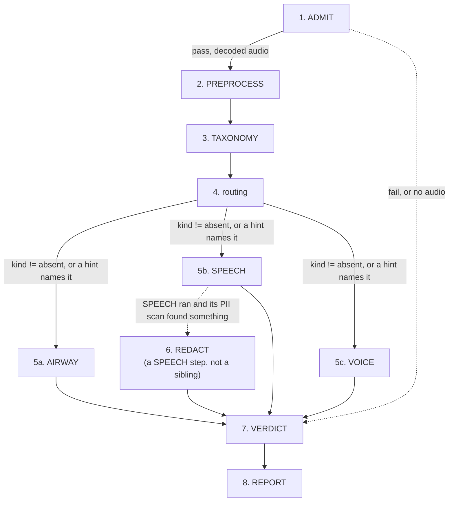
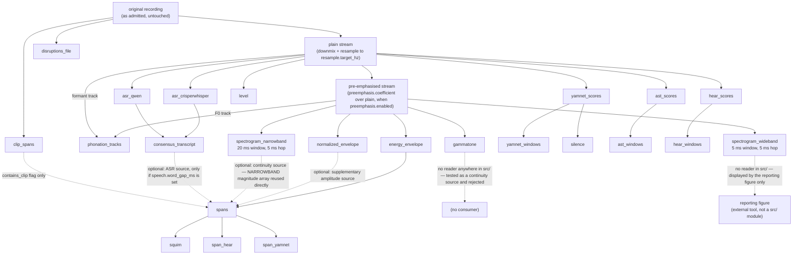

# The triage DAG, linearized from code, against its own goals

This document is generated by reading `run.py`, every node under `nodes/`, `vocabulary.py`'s
`fold_file_verdict`, `config.py`, and `data/config/default.yaml` directly — not from prior design
prose. Where an older spec doc disagrees with what is written here, the code is authoritative and
the older doc is stale. Re-verify against those files (not against this one) after any change to
them; nothing enforces that this stays current.

## The goal this graph exists to serve

Stated by the project owner: **flag for review** a recorded voice task (coughing, breathing,
speaking, phonation) from people across the lifespan, potentially with voice, respiratory, or other
disorders. Concretely, a file should be flagged when:

1. **the recording is of bad quality** — low SNR, or clipping in task-relevant regions;
2. **it contains other speakers within target-speaker-specific spans**;
3. **the spoken speech contains PII not included in the task itself.**

Goal 2 is no longer airway/speaker-specific by construction: PREPROCESS's span block (see node 2
below) is one foreground-acoustic-event detector for any duration carrying foreground acoustic
energy — other people talking, other sound sources, not only the target speaker — and `span_hear`/
`span_yamnet` attach classifier evidence to each one. Verified against `nodes/preprocess.py`'s
`_spans`/`_span_hear`/`_span_yamnet`.

The graph's job is to sort every file into exactly one of three outcomes: **pass** it through (needs
no further review), **flag** it (the workflow cannot determine cleanly, a person should look), or
**discard** it (should not be analyzed at all — unmeasurable, or acoustically empty). Every node
below is read against this: what role does it play toward one of the three flagging criteria, or
toward the pass/flag/discard sort itself, or toward neither.

**Headline finding, stated up front because it recurs below**: of the three flagging goals, only
goal 3 (PII) is fully wired to a decision today. Goal 1 (quality) is measured everywhere but gates
nothing — the code says so in its own comments. Goal 2 (other speakers) has a precise mechanism that
is currently inert under the packaged config, and falls back to a much cruder signal. See the summary
table at the end.

## How to read this document

Each step below states, in order: **what it does**, **what decides something and on what config
parameters** (a parameter is called out explicitly whenever it changes a decision, not just a
measurement), and **which of the three goals it serves, if any**. A config path like
`taxonomy.presence_floor.speech.lexical` is a dotted key into
`data/config/default.yaml`; `null` there means the parameter is declared but unmeasured, and reading
it via `config.require(...)` raises rather than silently defaulting — nothing in this graph runs on
an invented number.

## The call graph



Solid edges are unconditional; dashed edges are the two places the next step is genuinely optional.
The exact triggering conditions are in `run.py::run_triage`/`_drive_branches` and
`nodes/routing.py::routing` — see the earlier edge-by-edge account below the linear walk if you need
the precise code citation for each arrow.

**These are control-flow edges only.** Two nodes also read a PREPROCESS *derivative* back out of the
store as data, which this graph does not draw: TAXONOMY and VOICE both load `phonation_tracks`
(sections 3 and 5c). VOICE's is new — it used to recompute F0 itself — and it raises `LookupError`
rather than falling back, so it is a genuine data dependency and not only the control-flow arrow
shown above.

## The linear walk

### 1. ADMIT — is this file measurable at all

**Role:** gate. Three exact, structural checks against the decoded waveform: `shape[-1] == 0` (no
frames), `not any(x != 0)` (every sample exactly zero), `all(x == x[:, :1])` (every sample equals the
first — no variance). Any decode exception also fails.

**Decision parameters: none.** This is the only node in the graph with zero config keys — by design,
per its own module docstring ("No thresholds, no `flag` outcome"). Anything with genuine ambiguity
(near-silence, low SNR, heavy clipping — real recordings with real content that happens to be poor
quality) is deliberately **not** judged here; it passes through to be measured properly downstream.
ADMIT only rejects what is unambiguous by construction.

**Serves the stated goals:** none directly. It feeds the discard axis: an ADMIT `fail` is the only
path to `Triage.DISCARD` with `discard_ground: "unmeasurable"` (`vocabulary.py::fold_file_verdict`).

### 2. PREPROCESS — condition the audio, measure everything once, decide nothing

**Role:** the one conditioning pass. Every model that answers a whole-file question runs exactly
here (YAMNet, AST, HeAR, both ASR recognizers); no later node re-runs one. It takes no pass/flag/fail
decision of its own — but, since a real cross-block dependency exists (spectral continuity reuses the
narrowband spectrogram block's own output, below), it is not guaranteed to complete. A derivative
whose config value is unmeasured (a null default) or whose own upstream prerequisite is missing is
recorded `absent`, exactly as before; anything else accumulates instead, and once every block has
been attempted `preprocess` raises one exception summarizing all of them, rather than returning. That
raise is caught the same way any other node's is (`run.py::_attempt`), and `_drive_branches` responds
by skipping TAXONOMY, routing and every branch — none of them has anything to read — straight to
VERDICT, which records the failure as a `flag` reason rather than an evidence-free `pass`.

Each block below still runs in its own try/except, with its own config, but "independent" now means
only that a block's *soft* failure (the two kinds above) never reaches another block — one block's
unexpected exception does not stop the rest of the loop from being attempted, but it does end the
node's own run once the loop finishes:

**PREPROCESS's own internal dependency graph** — re-derived directly from `preprocess.py`'s block
list and every block's own `state` reads, not from the whole-workflow diagram above (which shows
PREPROCESS as a single node). The three source streams are themselves a linear derivation, built once
before the block loop runs: the *original* recording is downmixed and resampled into `plain`
(`mono = source.waveform.mean(...)`, then `resample_audios`), and `plain` is pre-emphasised into
`sharp` (`x[:, 1:] - coefficient * x[:, :-1]`) when `preemphasis.enabled` is true — verified by reading
`preprocess()`'s own conditioning code, not assumed from block names. Every block below reads exactly
one of these three, verified per block by tracing the actual audio argument each one passes to its
own computation (not its docstring or name): `clip_spans` and `disruptions_file` read the *original*
recording, unresampled — both explicitly reject running without a live `recording` stream and read
`source`/`recording_ids[-1]` directly, because clip detection and disruption detection want the
recording's own sample rate and untouched samples, before resampling or pre-emphasis could reshape a
transient. `yamnet_scores`, `ast_scores`, `hear_scores`, `level`, `asr_crisperwhisper`, `asr_qwen` all
read `plain`. `energy_envelope`, `normalized_envelope`, `spectrogram_wideband`, `spectrogram_narrowband`,
`gammatone` all read `sharp` (pre-emphasised) — including `normalized_envelope`,
which is easy to assume runs on `plain` since normalization is a distinct, later step conceptually,
but `dynamic_range_normalize` is actually called with `sharp` as its input directly.
`phonation_tracks` is the one block reading **two** streams: its F0 track comes from `sharp`, its
formant track from `plain`. That split is deliberate — `formant_track` passes `formant_preemphasis_hz`
into Praat's `to_formant_burg(pre_emphasis_from=...)`, which assumes an un-pre-emphasised input, so
feeding it `sharp` compounded the two and put roughly +12 dB/octave into the Burg LPC, biasing formant
frequencies and especially bandwidths. The block records both streams (`derived_from=(sharp_id,
plain_id)`) and names them per track in its own attributes (`f0_signal`, `formant_signal`), so a
reader never has to guess which stream a given track came from. The solid edges
below are the genuine cross-block `state` dependencies (a block that raises `LookupError` when the
upstream key is absent), and the dashed edges into `spans` are its four optional sources plus the
`contains_clip` annotation, each present only when its own upstream block succeeded. Two further
dashed edges are drawn to terminal nodes rather than to a block: one records that `gammatone` is
computed and persisted but read by nothing, and one records the reporting figure's consumption of the
wideband array from outside the package — the wideband spectrogram now has no `src/` reader at all.
See the wideband/narrowband note directly below the diagram:



**Which spectrogram feeds what — the wideband/narrowband split, stated explicitly because it is easy
to get wrong.** PREPROCESS computes two STFTs of the *same* pre-emphasised stream, differing only in
window length (`spectrogram.wideband_window_ms` 5.0 against `.narrowband_window_ms` 20.0) over a
shared `spectrogram.hop_ms` of 5.0. At the 16 kHz resample target that is an 80-sample versus a
320-sample window, so the wideband array carries ~41 frequency bins (~200 Hz each) and the narrowband
array ~161 (~50 Hz each) — the same recording at two resolutions, not two different signals.

**The two swapped roles on 2026-09-03**, so anything written before that date has them the other way
round.

- **`spectrogram_narrowband` is the one with a `src/` consumer.** `_spans`'s continuity source reads
  its magnitude array out of `state` directly (`state["spectrogram_narrowband_magnitude"]`, with
  `..._hop_s` alongside), rather than running an independent STFT at merely-matching parameters.
  Narrowband rather than wideband is measured, not stylistic: a 5 ms window is about one glottal
  period, so the wideband array resolves the pulse train *in time* and its frame-to-frame comparison
  swings on glottal phase during steady phonation, while the 20 ms window resolves the harmonics into
  stable bands *in frequency* instead. See
  [`preprocess-params.md`](benchmarks/preprocess-params.md#which-representation-feeds-continuity-and-why-the-gate-is-a-rank-cut).
- **`spectrogram_wideband` now has no reader anywhere in `src/`.** Only the reporting figure
  generator displays it — an external scratch tool, not a `src/` module, which is why it appears in
  the diagram as a consumer without being part of the package. Its npz and measurement are still
  written.
- **`gammatone` has no reader anywhere in `src/`**, and `_gammatone` writes no `state` key at all. It
  was the third candidate in the continuity comparison and it **lost**: its wide upper ERB channels
  do not resolve individual harmonics, so those channel envelopes pulse at F0 and its dips scatter
  through sustained phonation instead of concentrating at boundaries — the same failure as the 5 ms
  STFT, not a separate one. Retained rather than deleted, but no longer an open question.

Note the two arrays are stored differently: the npz holds the transform's **power** output, while
`state[f"{name}_magnitude"]` holds `sqrt(power)`. Anything reading the persisted file rather than
`state` has to square-root it to match what continuity is actually fed.

`level` and `disruptions_file` likewise write only their own measurement, nothing else in PREPROCESS
reads them back.

| derivative | config parameters |
|---|---|
| resample + downmix | `resample.target_hz` |
| pre-emphasis | `preemphasis.enabled`, `preemphasis.coefficient` |
| clip-event spans (`family="clip"`), ClipDaT over the *original* recording — an event opens where the extreme repeats across 2 consecutive samples, or on a single sample at digital full scale; see the note below this table | `clipping.near_threshold`, `clipping.leniency_samples`, `clipping.minimum_extreme` (the paper's own constants plus a near-zero guard), `clipping.merge_gap_ms` 30 — coalesces per-period plateaus into one span, conventional, not corpus-fitted. `clipping.min_duration_ms` retired: it compensated for a detector defect since fixed |
| primary energy envelope/floor (`energy_envelope`), over the pre-emphasised signal — always available, the default span source | `envelope.lowpass_hz`/`.filter_order` (`ButterworthSmoothing`, zero-phase); floor is `floor.percentile`, a single global value for the whole recording rather than a rolling window |
| dynamically-normalized signal + its own energy envelope/floor — on by default (all eight `normalization.*` keys now carry owner-directed, provisional values rather than null); its spans only ever add candidates the primary pass missed, never replace one, so it stays structurally optional (PREPROCESS's primary span pass does not depend on it) even though it now runs in the packaged config | `normalization.macro_smoothing.window_s`, `.micro_smoothing.window_s` (`MedianSmoothing`, chosen over Butterworth because a zero-phase Butterworth rings on a word's onset), `.envelope_smoothing.window_s`/`.percentile` (`PercentileSmoothing`, this envelope's own smoothing — distinct from the primary envelope's Butterworth above), `.target_dr_db`, `.compression_ratio`, `.macro_target_dbfs`, `.gain_smoothing.window_s` (`MedianSmoothing` — a resonant Butterworth could not settle to a short event's own gain within the event), `.floor_dbfs`, `.ceiling` |
| foreground-acoustic-event span proposals, flagged `contains_clip` on overlap with a clip span | `spans.k_db`, `spans.floor_margin_db`, `spans.transition_window_ms`, `spans.min_duration_ms`, `spans.min_separation_ms` for the amplitude sources (primary from the pre-emphasised envelope, always available; supplementary from the normalized envelope where it exists) — the threshold crossing itself generates each candidate directly (a maximal run where the envelope has risen `k_db` above the floor), not a peak later expanded outward; `spans.continuity_cut_percentile`/`.continuity_min_duration_ms` for a third source, spectral continuity over the **narrowband** spectrogram block's own already-computed magnitude array (reused directly, not recomputed — see the spectrograms row below; narrowband rather than wideband because a 5 ms window resolves the glottal pulse train in time and makes the trace swing on pulse phase during steady phonation, measured), smoothed with the same `envelope.lowpass_hz`/`.filter_order` `ButterworthSmoothing` the primary envelope uses (retired its own bespoke `spectral_continuity.smoothing.window_s` `MedianSmoothing`) — added for sustained tonal/harmonic production (glides, phonation) an amplitude gate alone can miss — measured directly to work for glides and phonation-like sustains and NOT to discriminate breath from background on the one breathing recording tested. This source is read for its **dips**, not its plateaus: continuity is a novelty function, and a high value only says nothing changed, which is equally true of steady silence and steady phonation. The lowest `continuity_cut_percentile` of trace samples **by rank** are change points and the runs between them are the spans, so this source alone has no floor, no margin and no walk — the retired `spans.continuity_margin`/`.continuity_floor_margin` were absolute values on a scale that changes with the input array, which is what blocked changing the representation at all. Absent whenever `spectrogram_narrowband` itself is, a real cross-block dependency (see PREPROCESS's own role note above). A fourth source, ASR, reads the consensus transcript's own word timings (see the consensus-transcript row below) and groups them into runs by `speech.word_gap_ms` — no threshold or floor at all, since a recognizer transcribing a stretch as speech is itself the evidence; absent whenever `speech.word_gap_ms` is unmeasured (null in the packaged config) or `consensus_transcript` itself is. Each source only adds a candidate no earlier source already covers; onset and offset walk by the identical rule for every threshold-based source (stop within the source's own margin of its own floor, sustained for `transition_window_ms`) — ASR's own extents need no such walk, and neither do continuity's, whose edges are the change points themselves. One span mechanism for any vocal task, no `family` distinguishing which downstream branch a span is "for" — `contains_clip` is the only per-span flag PREPROCESS itself asserts, alongside `measure` naming which source (`amplitude`, `continuity` or `asr`) proposed it. `contains_clip` can now be `True`: its input `clip_spans` runs, and since the detector's repeat criterion replaced the caller-side duration floor it covers per-period clipping of voiced speech as well as sustained saturation — see the note below this table |
| per-span quality: `squim` (STOI/PESQ/SI-SDR, on the *plain* signal) | none tunable; a span SQUIM refuses is recorded `unmeasured`, never padded |
| per-span quality: `span_hear` (on the *plain* signal, like `squim` — HeAR already carries its own internal preprocessing, so normalization on top would be redundant/distorting; AIRWAY's own per-span buffer/native-window split, raw scores only, no longer gated on normalization) | `windows.hear.default_threshold`, `windows.hear.label_thresholds` |
| per-span quality: `span_yamnet` (on the *plain* signal, same reasoning as `span_hear`; no buffering — YAMNet has no fixed-window constraint; no longer gated on normalization) | `windows.yamnet.default_threshold`, `windows.yamnet.label_thresholds`, `yamnet.top_k` |
| YAMNet / AST / HeAR window scores | `yamnet.top_k`; `windows.ast.win_length_s`/`hop_s`/`top_k`; `windows.hear.hop_s` — verified against `default.yaml`: `windows.ast.win_length_s`/`hop_s` are AST's owner-directed 10.24 s window, `windows.hear.hop_s` is HeAR's fixed 2 s window, both already model-native |
| per-window label membership | `windows.{yamnet,ast,hear}.default_threshold`, `windows.{yamnet,ast,hear}.label_thresholds` — **all six null in the packaged config**, so every window's label set is empty until an override supplies at least one |
| silence | `yamnet.silence_threshold` |
| **file-level quality: `level`** (peak/RMS dBFS, LUFS) | none — plain measurement |
| **file-level quality: `disruptions_file`** (clipping, dropouts, discontinuities), on the *original* recording | `disruptions.clip_headroom`, `disruptions.min_clip_run`, `disruptions.min_dropout_ms`, `disruptions.discontinuity_local_factor`, `disruptions.discontinuity_window_ms` |
| both ASR recognizers' own transcripts | none decision-relevant |
| consensus transcript (`fuse_consensus_words`) + `word`/`event` entities | `words.onomatopoeic_tokens` (null). A recognizer that brackets a non-lexical event (e.g. CrisperWhisper's `[COUGH]`) and one that transcribes it as a plain word (Qwen's `cough`) already vote as one word — `_normalize_word` strips brackets as punctuation — and the fused text now deterministically keeps the bracketed form regardless of which recognizer the fold visits first (`speech_to_text_ensemble/api.py`'s `_is_bracketed_token`); only a wholly-unbracketed reading still depends on `words.onomatopoeic_tokens` to become an `event` |
| F0/formant tracks (`phonation_tracks`) — measurement only, no boundary decided; sustained-phonation and glide span *detection* moved to TAXONOMY this session (owner-directed), which reads this measurement back — see TAXONOMY's own table below. **Two source streams**: F0 from the pre-emphasised `sharp`, formants from `plain`, because Praat's own `pre_emphasis_from` assumes an un-pre-emphasised input (see the stream prose above). VOICE now reads this measurement back too rather than recomputing F0 — see 5c | `voice.f0_range_hz` (**null in the packaged config**, so this block never runs there either), `phonation_spans.hop_s`/`.max_formants`/`.formant_max_hz`/`.formant_window_s`/`.formant_preemphasis_hz` (all five populated; the eight *detection* keys in `phonation_spans.*` that are null are read by TAXONOMY's proposal step, not by this measurement). These thirteen keys must be given values as one group or none: `_propose_phonation_spans` guards only on `phonation_tracks` being absent (`taxonomy.py:277`), so setting `voice.f0_range_hz` alone lets the measurement reach the store, the guard passes, and the eight `require()` calls at `taxonomy.py:282-291` raise on the nulls — out of `taxonomy()` itself, since the call site at `:549` has no `try`/`except` |
| spectrograms (wideband/narrowband), gammatone | fixed window/hop keys, none decision-relevant. **Narrowband** is the one with a `src/` consumer — its magnitude array is read directly out of `state` by the spans block's continuity source (so it runs before `spans` in block order), measured to beat wideband because its 20 ms window resolves harmonics in frequency rather than the glottal pulse train in time. **Wideband** now has no `src/` reader; it is only what the reporting figure displays. **Gammatone** has no reader either — it was the third candidate in that comparison and lost, by the same pulse-modulation mechanism as wideband. Both retained rather than deleted. See the wideband/narrowband note above the table |

Dynamic-range normalization is `envelope.dynamic_range_normalize` — a slow (`macro_smoothing`) and a
fast (`micro_smoothing`) envelope of the same signal, their difference
compressed toward `target_dr_db`, macro-leveled toward `macro_target_dbfs`, smoothed once more
(`gain_smoothing.window_s`, `MedianSmoothing`) and applied to the original waveform with a `ceiling`
safety clamp. The two envelopes now share **one** analytic transform: `envelope.api` splits the
rectified analytic magnitude (`analytic_magnitude` / `analytic_envelope`) from the smoothing-and-dB
step (`envelope_dbfs`), so a caller wanting N smoothing strategies over one signal pays one Hilbert
transform rather than N. `hilbert_envelope_dbfs` remains as the single-smoothing convenience wrapper
over that pair, and the split is output-identical — a refactor for cost, changing no value and
invalidating no cache. Clip detection
(`clipping.*`, ClipDaT) runs on the *original* recording before this, on the stated assumption that
gain was fixed during recording — normalization only redistributes level, so a genuinely clipped
sample stays clipped through it rather than being smoothed away.

**Clip detection was inert while `clipping.min_duration_ms`/`.merge_gap_ms` were both null, and the
`contains_clip` flag with it** — the block now runs, one key having been given a value and the other
retired outright (below). Both were `null` in `data/config/default.yaml`; `config.require`
raises on a null by design ("null because nobody has measured it"); the block loop caught that
`ValueError` as a cascading absence and recorded `clip_spans` `absent`. Because
`state["clip_span_extents"]` is only assigned at the *end* of `_clip_spans`, it was never set,
`_spans` reads `state.get("clip_span_extents") or []`, and every span's `contains_clip` was `False`
on every file — not because no clipping was found, but because the detector never ran.

**`min_duration_ms` has since been retired entirely, because it was compensating for a defect in the
detector rather than doing work of its own.** `detect_clip_events` documented that it returns nothing
when the file's extreme never repeats, but never implemented the check: it opened an event at *any*
sample equal to the global max or min, so a lone sample at a merely relative peak always produced a
short event, and the caller needed a duration floor to suppress the resulting noise. The repeat
requirement now lives in the detector where the contract always claimed it was, and the caller-side
floor is gone. What opens an event is decided per extreme:

- **Below digital full scale** — the extreme must repeat across at least `MINIMUM_EXTREME_RUN` (2)
  *consecutive* samples. Measured at 16 kHz across 100 Hz–2 kHz, amplitudes 0.15–0.9, float32 and
  int16, non-harmonic frequencies and noise: every clean signal's longest consecutive run at its own
  extreme is **1**, while every resolvable clipped signal's is **≥ 3**. The repeat must be
  consecutive — a periodic signal revisits the identical extreme once per period (a clean 200 Hz
  float32 tone hits its exact max 600 times in 3 s), so a whole-file count separates nothing.
- **At digital full scale** — a single sample opens an event, no repeat required, because reaching
  the representable ceiling is itself evidence of saturation and a single-sample clip is undetectable
  any other way. "At full scale" is `|extreme| >= 1.0 - 1/32768`, one int16 step, *not* an equality
  test against 1.0: int16 audio decodes to a positive full scale of `32767/32768 ≈ 0.99997` against a
  negative full scale of exactly `-1.0`, so an equality test would catch negative saturation and
  silently miss positive.

**This fixes the failure the duration floor could not.** Per-period clipping of voiced speech was
previously invisible — its plateaus are ~1.5 ms against a 50 ms floor — and is now detected: a
120 Hz sine hard-limited at 0.6 yields 720 raw events and a 200 Hz one 1200, where both previously
yielded zero.

**`merge_gap_ms` 30 survives, and its job is coalescing rather than suppression.** Those 720 and 1200
per-period events are one plateau per glottal cycle; merging within 30 ms collapses each to a
**single span covering the clipped region** (measured: 1 span, 2.999 s, for both), which is the
correct description of one clipped vowel — without it a single clipped vowel would render as hundreds
of adjacent spans. 30 ms comfortably exceeds one glottal period across the plausible F0 range while
staying well below the separation of distinct clipping episodes: a 2 Hz sine hard-limited at 0.6,
whose plateaus sit ~148 ms apart, still yields 12 separate spans totalling 1.778 s rather than being
bridged into one. The value is conventional, not corpus-fitted, and is still owed a corpus.

Clean signals stay at zero throughout: a half-scale 200 Hz sine, a 0.3-scale 440 Hz sine, noise
scaled below full scale, a 0.9-amplitude 120 Hz sine, and a lone sub-full-scale 0.77 sample all
yield no spans. A synthetic float signal whose samples *exceed* ±1.0 does open events, which is
correct — real audio cannot exceed the ceiling, and a float signal that does is out of range. None of
the three campaign recordings carries clipping (peaks 0.54, 0.26, 0.15), so they exercise only the
negative case.

Worth knowing while reading the above: **three different clipping detectors exist in this tree**,
answering different questions — `detect_clip_events` (ClipDaT, used by `clip_spans`) locates runs
pinned near the *file's own* extreme, which catches gain-reduced clipping but also fires on every
peak of a clean periodic tone; `detect_disruptions` counts samples at *absolute* full scale
(`disruptions.clip_headroom`), which is immune to clean tones but blind to gain-reduced clipping; and
`quality_control/metrics.py` carries a third. They are not interchangeable, and consolidating them is
not a plumbing exercise — the duration filter that makes ClipDaT safe on clean tones is exactly what
blinds it to per-period speech clipping, so the three cover genuinely different ground. Recorded here
only as context for that edge; the defect register at `specs/20260815-215106-analyze-audio-audit/register.md` is where a
claim like this belongs as a tracked item, and this document is not that register.

Still open, not implemented: the idea that PREPROCESS "could simply generate continuity signals"
instead of relying on consensus-transcript text for onomatopoeic detection — a larger architectural
question than the bracket-preservation fix above, and not pursued here.

**Serves the stated goals:** this is where **all** the raw evidence for goal 1 (`level`,
`disruptions_file`, per-span `squim`) is measured — but PREPROCESS itself makes no judgment on any of
it. It is where goal 3's substrate (the consensus transcript SPEECH will scan) is produced. Goal 2 is
served directly here too: `spans` and their `span_hear`/`span_yamnet` evidence are the
general foreground-acoustic-event mechanism referenced above — one span mechanism for any vocal task,
still unjudged (PREPROCESS decides nothing), never airway-only.

### 3. TAXONOMY — fold PREPROCESS's evidence into speech/airway/voice presence

**Role:** the first real classification. Pure fold over stored evidence — runs no model, reads no
hint — with one localising exception: sustained-phonation/glide span *detection*, moved here from
PREPROCESS this session (owner-directed). PREPROCESS measures F0 and formant tracks over the whole
stream and decides no boundary (`phonation_tracks`, see PREPROCESS's own table above); TAXONOMY reads
that measurement back and runs the same detector (`propose_phonation_spans`,
`propose_word_aligned_phonation_spans`, unchanged) over it, writing `family="phonation"` spans exactly
as PREPROCESS used to. VOICE reads those spans by `family` alone and does not care which node wrote
them. Every other kind reads named evidence **lines**, each line counting stored elements against its
own floor:

| kind | lines | decision parameters |
|---|---|---|
| speech | `lexical` (consensus word count) — **authoritative**; `acoustic` (YAMNet+AST windows carrying a speech-family label) — corroboration only | `taxonomy.presence_floor.speech.lexical`, `taxonomy.presence_floor.speech.acoustic`, `taxonomy.speech_labels` — **all three null** |
| airway | `health_acoustic` (PREPROCESS's own per-span `span_hear` labels, one shared span pool with speech and voice) — **authoritative**; `acoustic` (PREPROCESS's per-span `span_yamnet` labels) — corroboration only | `taxonomy.presence_floor.airway.health_acoustic`, `taxonomy.presence_floor.airway.acoustic`, `taxonomy.audioset_airway_labels`, `taxonomy.hear_airway_labels` |
| voice | `phonation` (longest phonation span duration alone, over the spans TAXONOMY itself just localised) | `taxonomy.voice_min_duration_s`, `taxonomy.voice_uncertain_duration_s` — **both null**; span detection itself reads `phonation_spans.*` (all eight detection keys null) |

A line whose derivative never reached the store, or whose floor is null, reads `unavailable` — which
makes the *line* uncertain, never absent; a kind is `absent` only when its **authoritative** line
genuinely counted evidence below floor, since that line's state is copied whole
(`_fold_authoritative_line`) and a corroborating line never changes the outcome either way.
`airway`'s two lines were an equal-weight AND-fold
(`_fold_two_lines`, both had to independently resolve) until this session; owner-directed, HeAR — the
domain-specific detector — now decides alone via the same authoritative-plus-corroboration shape
`speech` already gave its lexical/acoustic pair (`_fold_authoritative_line`, shared by both kinds).
Corroboration count is never read as evidence strength: a span's `corroborated_by` list says other
*sources* also proposed something overlapping it, not that its *content* is more certain, so it plays
no part in either fold. A span already overlapping a live consensus `word` is excluded from both
`airway` lines entirely (`_transcribed_span_ids`) — ASR outranks both classifiers, so a
transcribed span is lexical content, not airway evidence, whatever HeAR or YAMNet also say about it.

**TAXONOMY's own outcome — the first place "any uncertain kind flags the file" happens:**

```python
if all(state == ABSENT for state in states.values()):
    outcome = FAIL           # "every kind is absent"
elif any(state == UNCERTAIN for state in states.values()):
    outcome = FLAG           # "uncertain: <comma-joined list>"
else:
    outcome = PASS
```

Every uncertain kind is weighted identically here — speech, airway and voice each independently
trigger the same `FLAG` with no priority among them. Under the packaged config, with every presence
floor null, `_line_state` returns `unavailable` before it ever compares a count, so **every kind
reads `uncertain` on every file**, whatever evidence was measured. `all(ABSENT)` is therefore never
true and `any(UNCERTAIN)` always is: TAXONOMY's outcome is invariably `FLAG "uncertain: airway,
speech, voice"` until floors are fit.

**Serves the stated goals:** none of the three directly — this classifies *content type*, not
quality, speaker identity, or PII. It matters to this document because its uniform-uncertainty fold
is the mechanism behind an observed report where a "voice uncertain" reading flagged a file despite a
clean, unambiguous speech transcript — see "Cross-cutting tension" below.

### 4. routing — turn classification (+ hints) into an execution set

**Role:** decides **which of the three branches run**; classifies nothing itself, always `PASS`.

**Decision parameter:** `routing.hint_kind_map` (null by default) — maps a caller's declared
`may_contain` tags / `speech_type` to a kind. **The rule, per kind, independently:**

```
kind != absent  ->  branch runs
kind == absent  ->  branch runs only if a hint names that kind (forced_by_hint)
```

`present`, `uncertain`, an unreadable state string, and *no classification at all* all count as "not
absent" and run the branch — only an explicit `absent` withholds it. A `routing()` call that itself
raises withholds every branch (recorded `SKIPPED`), and VERDICT folds that into a `FLAG` naming the
routing failure.

**Serves the stated goals:** gates whether SPEECH (the branch carrying goals 1–3's machinery) runs at
all. If TAXONOMY classifies `speech` as `absent` and no hint claims it, SPEECH never runs and none of
the three goals can be evaluated for that file.

### 5a. AIRWAY — read PREPROCESS's own per-span HeAR labels, confirm or contest

**Role:** four steps — read PREPROCESS's per-span `span_hear` labels over the general span set
directly, ask YAMNet to confirm or contest the same extent, check for lexical contamination (a
consensus word inside the labelled interval), conclude.

**Decision parameters:** `airway.labels_of_interest`, `airway.confirmation_map` (which YAMNet labels
confirm which HeAR label), `airway.contest_labels` (null; refused at load if it ever overlaps
`taxonomy.audioset_airway_labels`).

Owner-directed this session: AIRWAY no longer derives a gate of its own. It used to select its input
by matching the stored `k_db` attribute value on PREPROCESS's spans (`airway.k_db`/
`airway.k_db_by_task`, falling back to the shared `spans.k_db`) and then re-run HeAR itself over each
selected span — a second, redundant model pass over exactly what PREPROCESS's own `span_hear` already
computed. Both are retired: AIRWAY now takes every span PREPROCESS proposed (`family is None`, no
`k_db` filter — continuity and ASR spans, which never carried a `k_db` at all, are eligible candidates
for the first time) and reads PREPROCESS's already-stored `span_hear` measurement for each one by
`span_id`, the same measurement TAXONOMY's `airway` kind now reads too. `_is_transcribed` (a live
consensus word overlapping the span) is unchanged and still the reason a span is skipped before HeAR
evidence is even consulted — ASR outranks HeAR regardless of what label it carries.

**Serves the stated goals: none.** AIRWAY is entirely about cough/breath event detection and
label-conflict resolution — a content-classification concern, orthogonal to quality, other speakers,
or PII.

### 5b. SPEECH — the branch that actually carries two of the three goals

**Role:** nine steps, reading the consensus transcript PREPROCESS already produced (re-transcribes
nothing). This is the only branch relevant to goals 1–3, so each step is mapped explicitly:

| step | what it does | decision parameters | goal |
|---|---|---|---|
| 1. transcript | reads the consensus words | — | — |
| 2. spans | groups words into speech spans by gap | `speech.word_gap_ms` (**null**) | — |
| 3. corroborate | YAMNet-coverage vote and SQUIM vote on "is this span really speech"; a disagreement flags | `yamnet.coverage_threshold`, `speech.speech_test_stoi_floor`/`speech_test_si_sdr_floor` (**both null** → SQUIM vote is `not_evaluated`, YAMNet alone decides) | content corroboration, not goal 1 |
| 4. diarize | pyannote over `[first word, last word]`; a second diarizer only if count ≠ 1 | `speech.second_diarizer` (null) | **goal 2** — the crude signal: `speaker_count != 1` flags unconditionally, whether or not any target/enrollment is known |
| 5. separation | measurement-gated; no backend runs by default | `speech.separation_backend`, `speech.separation_sound_class` (both null) | — |
| 6. identify | attributes each word to a diarized speaker by timing overlap; matches an optional enrollment by cosine similarity | `speech.enrollment_model`, `speech.target_match_cosine` (**null** — an enrollment is refused rather than compared while null) | **goal 2**, precise form |
| 7. pii | one scan of the consensus transcript; marks every occurrence | `pii.required_detectors` (populated: `[gliner, presidio, rules]`) | **goal 3** |
| 8. quality | SQUIM + `disruptions` **per speech span**, on the original recording | `quality.stoi_floor`, `quality.pesq_floor`, `quality.disruption_clipped_s_max`, `quality.disruption_dropout_s_max` — all four **declared, all four null, all four read by nothing in the codebase** | **goal 1 — measured, never decided** |
| 9. proximity / non-target axis | per-span level, spectral tilt, direct-to-reverberant ratio against the file's own reference level | `speech.nontarget.level_db`/`tilt_db_per_octave`/`d_to_r_db` (**all three null**) | **goal 2**, precise form |

**Goal 1, precisely:** step 8's own name and its parameters exist entirely for "is this recording bad
quality" — and the code's own comment reads *"reported, never gating."* No threshold on SQUIM or
disruption counts ever produces a flag here. The config file's own derivation text confirms this
independently: *"SPEECH's quality fail is unreachable by design until [`quality.*`] are measured.
Reserved: read by nothing yet; SPEECH step 8 reports without gating until these are measured AND
wired."* Verified by search: no file in this codebase reads `quality.stoi_floor`,
`quality.pesq_floor`, or either `quality.disruption_*` key. **Goal 1 has no implementation today** —
the evidence exists in the store, but nothing turns it into pass/flag/discard.

**Goal 2, precisely:** the *precise* mechanism the stated goal describes — "other speakers within
target-speaker-specific spans" — is steps 6 and 9 together: identify which spans belong to the
enrolled target, measure the *other* material's level/tilt/reverberance against the file's own
reference, and sum `nontarget_speech_s`. But `speech.nontarget.*`'s three cuts are all null, so
`nontarget_speech_s` is written `None` rather than computed (confirmed directly: this session's own
Rainbow-Passage run reported `nontarget_speech_s=` empty). What's actually live today is the cruder
step-4 signal — `speaker count != 1` — which flags *any* multi-speaker recording, with no reference to
whether the extra speaker falls inside a target-specific span, and regardless of whether an enrollment
was ever supplied. **Goal 2 is partially implemented**: real signal exists, but only the coarse form
is currently load-bearing.

**Goal 3, precisely:** step 7's `_decide_pii` flags whenever PII is found in the target speaker's
speech, in speech whose speaker cannot be resolved (nothing to exempt it), or when any required
detector didn't run. This *is* wired end to end into a decision. One gap against the stated wording:
**"not included in the task itself" is not implemented.** `_decide_pii` never reads `hint` or the
task token — every PII finding is treated identically regardless of whether the task legitimately
elicits it (e.g. a name given during a `Story-recall` task). Goal 3 is implemented for "any PII
found," not for "PII outside what the task called for."

### 6. REDACT — a step of SPEECH, not a fourth branch

**Role:** runs only when SPEECH ran **and** its PII scan found something (`run.py::_speech_found_pii`
gates it; it is not in `vocabulary.BRANCHES`). Plans padded/merged redaction extents, applies the
declared fill, re-scans the *redacted text* (no re-transcription) to verify nothing survived, and
only then releases an artifact pair.

**Decision parameters:** `redaction.padding_ms` and `redaction.fill` are both **required** — reading
either while null raises `ValueError` — and both are **null in the packaged config**. `pii.required_detectors`
governs completeness of both the original and the verification scan.

**This is goal 3's enforcement half**, and it is currently **blocked by config**: under the packaged
default, `redact()` cannot run to completion at all (it raises before doing anything) until a caller
supplies `redaction.padding_ms` and `redaction.fill` in an override. The b2ai-v2 campaign override
does supply both, so this is a config-completeness gap for the *packaged* default specifically, not a
missing mechanism.

**Serves the stated goals:** goal 3, exclusively — the physical redaction step.

### 5c. VOICE — phonation measurement, not one of the three goals

**Role:** measures HNR and glottal period marks over the phonation spans in the store, and reads F0
back rather than measuring it (TAXONOMY proposes the spans now, not PREPROCESS — see TAXONOMY's own
section above; VOICE reads by `family` alone and does not care which node wrote them); classifies
nothing new (it measures the `voice` kind TAXONOMY already classified). Runs no model AIRWAY/SPEECH
share.

**VOICE no longer recomputes F0 — a genuine cross-node data dependency.** It previously called
`f0_track(plain, ...)` on the plain stream, duplicating a track PREPROCESS had already computed on
the pre-emphasised stream; two F0 estimates for one recording, from two different signals, both
persisted, and reached through two separate config keys free to drift apart. VOICE now loads
PREPROCESS's `derivatives/phonation_tracks.npz` (`times_s`, `f0_hz`, `strength`), guarded by
`find_measurement` and raising `LookupError` if it is absent — the same pattern TAXONOMY already used
for the same derivative. HNR is still measured here on `plain` (`hnr_track`), which is VOICE's own
measurement and not a duplicate of anything.

Two consequences worth stating. First, PREPROCESS → VOICE is now a **data** edge, not only the
control-flow edge the call graph at the top shows: if `phonation_tracks` is absent, VOICE raises
where it used to proceed on its own recomputation. Second, that new failure mode is narrower than it
looks, because both endpoints are gated by the *same* key — `voice.f0_range_hz` is required by
`_phonation_tracks` and by VOICE's own `_required`, and it is **null in the packaged config**, so
neither runs there. VOICE can only reach the load in a configuration where `_phonation_tracks` could
also run, and the `LookupError` therefore fires only if that block failed for some *other* reason.
No config key was retired: `phonation.hop_s` is still legitimately read by `hnr_track`.

**Decision parameters:** `voice.f0_range_hz`/`voice.f0_range_by_population` (population-selectable —
`hint.metadata["population"]` picks an override key), `voice.f0_range_ratio_max` (refused at load,
not run-and-flagged, if the declared range would make the period-doubling check vacuous),
`phonation.period_doubling_factor`, `voice.task_duration_ranges` (null).

**Serves the stated goals: none.** This branch is entirely about characterising phonation quality
(jitter/shimmer/HNR-adjacent measures via period marks), not about recording quality, other speakers,
or PII.

### 7. VERDICT — the file-level fold; the second place "any flag flags the file" happens

**Role:** the only node that concludes a `Triage` (not an `Outcome`). Reads every other node's
verdict, `routing`'s decisions, and TAXONOMY's classification; writes nothing new to measure. No
config parameters of its own — a pure fold, in `vocabulary.py::fold_file_verdict`.

**The ladder, in order, exactly as coded:**

```python
if admit.outcome is FAIL:
    triage = DISCARD; ground = "unmeasurable"
elif any(reason.outcome is FLAG for reason in reasons):
    triage = FLAG                                   # uniform — every flag reason counts equally
elif all(kind_state == ABSENT for kind_state in resolved.values()):
    triage = DISCARD; ground = "acoustically_empty"
else:
    triage = PASS
```

`reasons` is every contributing `NodeVerdict` **plus** synthesized ones: a mismatch between what
TAXONOMY classified and what a branch concluded, a branch asked to run that never wrote a verdict
(errored or silently completed without one), a hint that claimed a kind the branch didn't find, a bad
`routing.hint_kind_map` entry, or an unread declaration. Every one of these — including TAXONOMY's own
"uncertain: voice" flag from step 3 above — is weighted identically in the `any(... is FLAG ...)` test.
**There is no priority among flag reasons anywhere in this fold.**

`Release` is folded separately and only from REDACT: `RELEASABLE` iff REDACT's own outcome was
`PASS`, `WITHHELD` on anything else, `NOT_ASSESSED` when REDACT never ran (no PII found, or SPEECH
itself didn't run).

**Serves the stated goals:** this is the sort itself — every upstream signal for goals 1–3 (where
implemented) lands here as a `FLAG` reason, with no goal-specific handling.

### 8. REPORT — render only

**Role:** runs after VERDICT on every outcome, including an ADMIT refusal; writes no elements. Not a
decision node. Out of scope for this document — see `report.md`.

## Summary: the three goals against what actually decides them

| Goal | Implementing step(s) | Decision parameters | Status |
|---|---|---|---|
| 1. Bad quality (low SNR, clipping in task-relevant regions) | SPEECH step 8 "quality" | `quality.stoi_floor`, `quality.pesq_floor`, `quality.disruption_clipped_s_max`, `quality.disruption_dropout_s_max` | **Not implemented.** Measured per span, never gates. Confirmed by grep: none of the four keys is read anywhere in the node code. The "clipping in task-relevant regions" half now has a region-localised signal at last — `clip_spans` runs, so per-span `contains_clip` can be `True`, and since the detector's repeat criterion replaced the caller-side duration floor it covers per-period clipping of voiced speech as well as sustained saturation — but nothing gates on it either way. `disruptions_file`'s whole-file absolute-full-scale count remains the other, non-localised signal. |
| 2. Other speaker(s) within target-specific spans | SPEECH steps 4, 6, 9 | Precise form: `speech.nontarget.level_db`/`tilt_db_per_octave`/`d_to_r_db` (all null → `nontarget_speech_s` is `None`). Live fallback: unconditional `speaker_count != 1` | **Partially implemented.** Only the coarse, target-agnostic signal is currently load-bearing. |
| 3. PII not included in the task | SPEECH step 7 + REDACT | `pii.required_detectors` (populated); `redaction.padding_ms`/`redaction.fill` (both required, both null in the packaged default) | **Implemented for "any PII."** No task-awareness (`hint` is never read by `_decide_pii`), so "not included in the task itself" is not distinguished. REDACT itself is config-blocked under the packaged default until an override supplies padding/fill. |

## Cross-cutting tension, surfaced this session

TAXONOMY (step 3) and VERDICT (step 7) both flag uniformly on **any** uncertain kind / **any** flag
reason, with no ordering between them. A file with an unambiguous, clean speech transcript can still
be flagged solely because `voice`'s single evidence line (`taxonomy.voice_min_duration_s`) reads
`uncertain` — observed directly in this session's own single-file run
(`task-Rainbow-Passage`: `TAXONOMY: uncertain: voice`, despite SPEECH concluding cleanly). A proposed
change — voice's uncertainty should only contribute to the file decision when airway *and* speech are
*also* uncertain, rather than independently — is not implemented anywhere in the code today; it would
require changing either TAXONOMY's `elif any(state == UNCERTAIN ...)` fold (step 3) or how VERDICT
weighs reasons in its `any(... is FLAG ...)` test (step 7). Not decided in this document — recorded
here as the open question it is.

## Branch authority, not shown as edges

Nothing routes data *between* AIRWAY, SPEECH and VOICE — there are no edges among them in the code.
Per `fold_file_verdict`'s own docstring: "a branch is the authority on its own kind and on nothing
else" — its conclusion stands in `kinds` whatever TAXONOMY classified, and a disagreement is recorded
in `agreement` (`mismatch`) rather than resolved by precedence between the two.
