# The triage workflow, as a graph

**This page is self-contained.** It is the picture of the proposed audio-triage workflow: what it
asks about a recording, in what order, what evidence each answer needs, and where it loops. Nothing
here depends on reading the prose in `design.md`; the prose exists to justify these diagrams, not to
explain them. Port tables for every task are in `ports.md`; the executable-shaped version is
`workflow.nf`.

Every box is a **task**. A task has named input ports and named output ports and nothing else — it
cannot read anything that is not wired to an input port. A task is either a plain function call or a
sub-workflow; from the outside these are indistinguishable, which is why the overview can show a
sub-workflow as one box and a later figure can open it up.

Edge labels are **port names**, so an edge reads `producer output → consumer input`. Where an edge
carries a parameter rather than a product, its label starts with `cfg.` and names the key in
`src/senselab/audio/workflows/audio_analysis/data/run_config/default.yaml`.

## Legend

| Shape | Kind | What it means |
| --- | --- | --- |
| `[[ double square ]]` | model inference | Loads a model and runs it. Cached, costs GPU or a subprocess venv. |
| `[ square ]` | pure computation | Deterministic function of its declared inputs. No model, no cache. |
| `{ diamond }` | decision gate | Turns measurements into a published `Estimate` under a named config threshold. Also the only thing that may filter a stream. |
| `([ stadium ])` | terminal product | Reaches the caller. Every one is an `Estimate` plus, where relevant, spans. |
| `[/ parallelogram /]` | sub-workflow | A task whose body is another graph. Same port contract as any other task. |

Colour repeats the shape so the figures stay readable in greyscale and for colour-blind readers.

---

## Figure 1 — Overview: the questions, in dependency order

Read top to bottom. Each box answers one question about the recording; the edges are the evidence
that has to exist before the next question is answerable. The boxes here are sub-workflows; the
figures after this one open each of them.

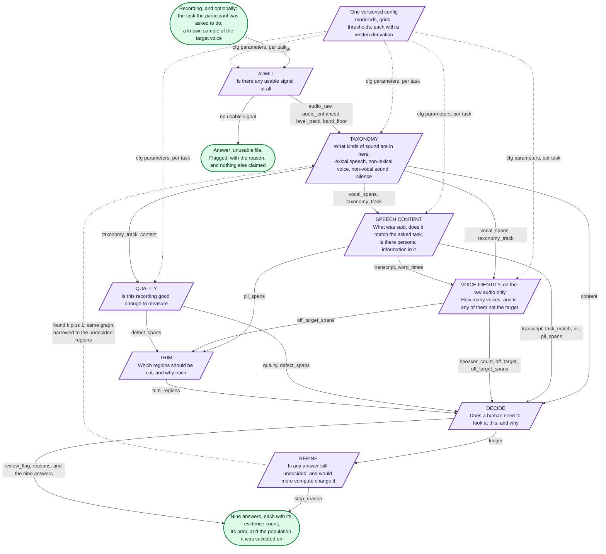

**What the dashed edge from REFINE means.** It is not a cycle in the data. Round *k*'s products are
distinct, immutable values from round *k+1*'s; the ledger that crosses the boundary is an input
product to the next round and is never written by it. Figure 8 shows the loop and its exit criteria.

**Why VOICE IDENTITY reads the raw audio only.** Enhancement exists to suppress background voices,
which is exactly the evidence an off-target check is looking for. The rule is structural here: the
enhanced variant has no wire into that sub-workflow, so it cannot be used by accident.

---

## Figure 2 — ADMIT: is there anything here, and which variants exist

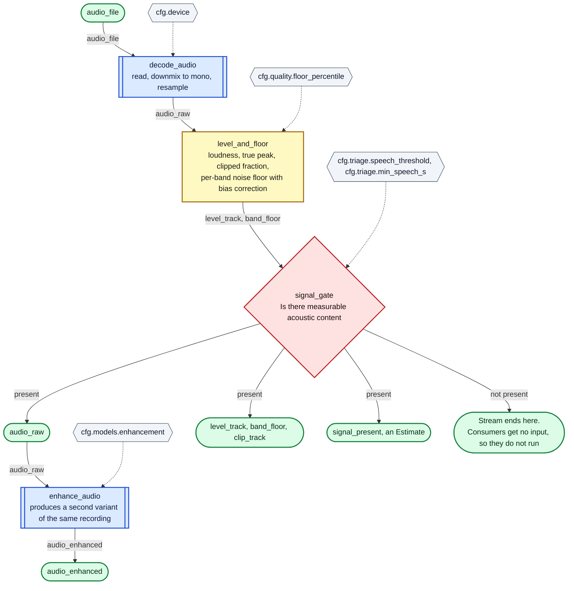

**The gate is the skip mechanism.** There is no `skip_stages` flag anywhere in this design. A gate
that decides the file is unusable emits no product on its downstream port, so every consumer has an
empty input and does not run. That is the only way a stage is ever skipped.

---

## Figure 3 — TAXONOMY: what kinds of sound are in here

This is the root answer of the whole workflow, and the part that today's pipeline does not have. It
replaces a binary "was there speech" with a four-way statement, because a cough, a cry or a groan is
neither speech nor background noise, and forcing it into either answer is wrong in a way that
propagates into trimming and into speaker attribution.

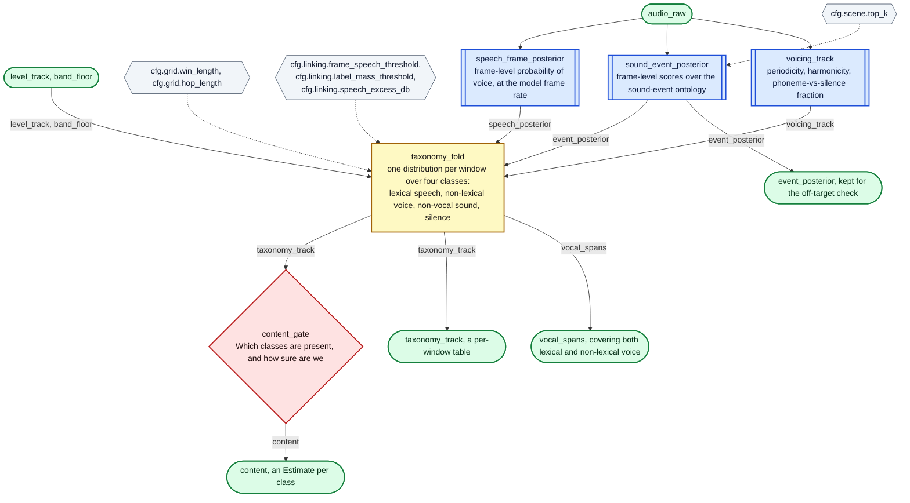

**`vocal_spans` is the product that everything about voices hangs on**, and it is word-independent
by construction: it comes from frame posteriors and periodicity, never from whether a recognizer
produced text. That is what makes it usable for a cry, and it is the reason the current pipeline's
"no words here, so clear the speaker evidence" rule has no equivalent in this design.

---

## Figure 4 — SPEECH CONTENT: what was said, and what is in it

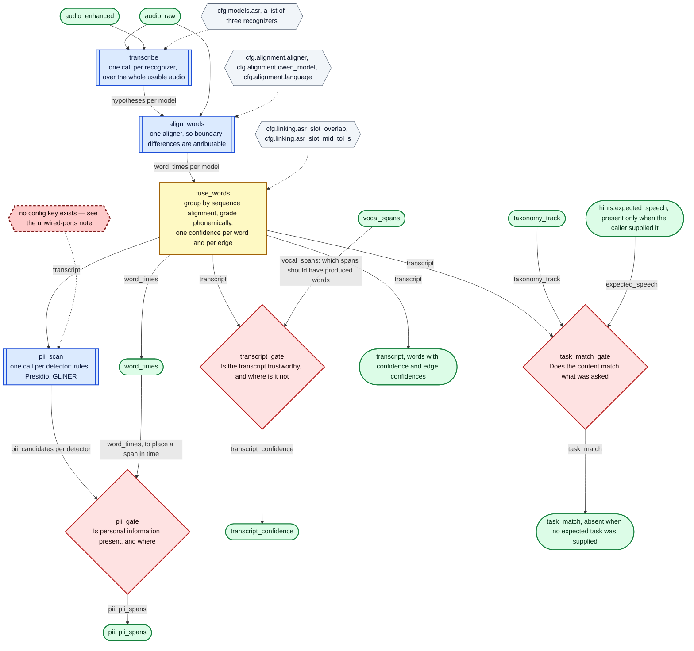

**Two things to notice.**

`task_match` has no default. When the caller supplies no expected task, the `expected_speech` port
has no producer, `task_match_gate` does not run, and the output is *absent*. It never becomes a
value meaning "unknown", because a consumer cannot tell a fabricated 0.5 from a measured one.

`transcript_gate` is where `vocal_spans` earns its place: a span the taxonomy calls voice and the
recognizers left empty is a *measured disagreement*, not a silence. Today that same situation is
read as "nothing was said here" and used to erase evidence.

---

## Figure 5a — VOICE IDENTITY as a single task, with its ports

The point of this figure is that a sub-workflow is a task. From the outside, `VOICE_IDENTITY` has
ports and nothing else; the parent graph neither knows nor cares that its body is another graph.

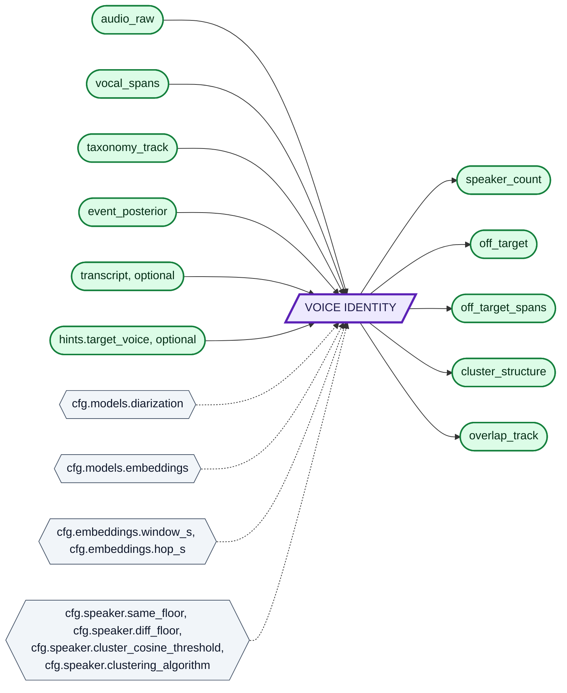

## Figure 5b — VOICE IDENTITY expanded

Same ports, opened up. The dangling names at the top and bottom are the ports from Figure 5a.

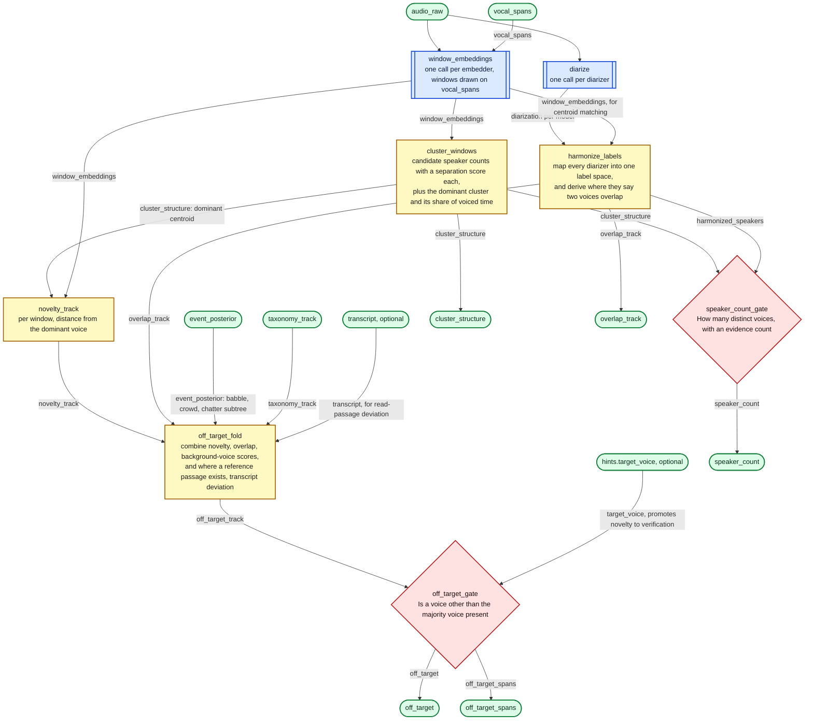

**The honest claim this sub-workflow makes.** With no enrolled sample of the target voice, "someone
other than the majority voice is present" is defensible and "that person is not the participant" is
not. So `off_target` is published as the former, and `hints.target_voice` — when a caller has one —
is what upgrades it from novelty detection to verification. The distinction is a wire, not a caveat
in prose.

---

## Figure 6 — QUALITY and TRIM

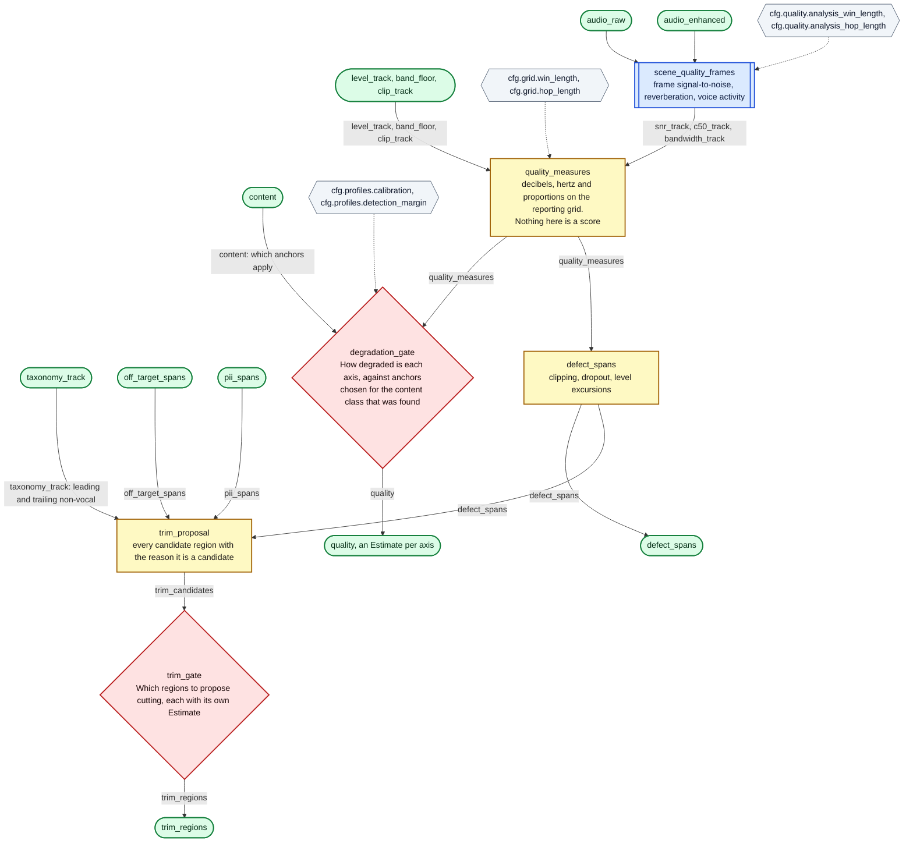

**Every trim region names its reason and carries its own confidence.** A region proposed because the
taxonomy found no voice there is a different claim from one proposed because a non-target voice was
found there, and a consumer that cannot tell them apart will eventually cut a participant's cough
out of a cough recording.

**The degradation anchors depend on the content class.** What counts as clean for fluent read speech
is not what counts as clean for a breathing task, so `content` is a declared input to that gate
rather than an assumption inside it.

---

## Figure 7 — DECIDE: the flag, and what it is allowed to say

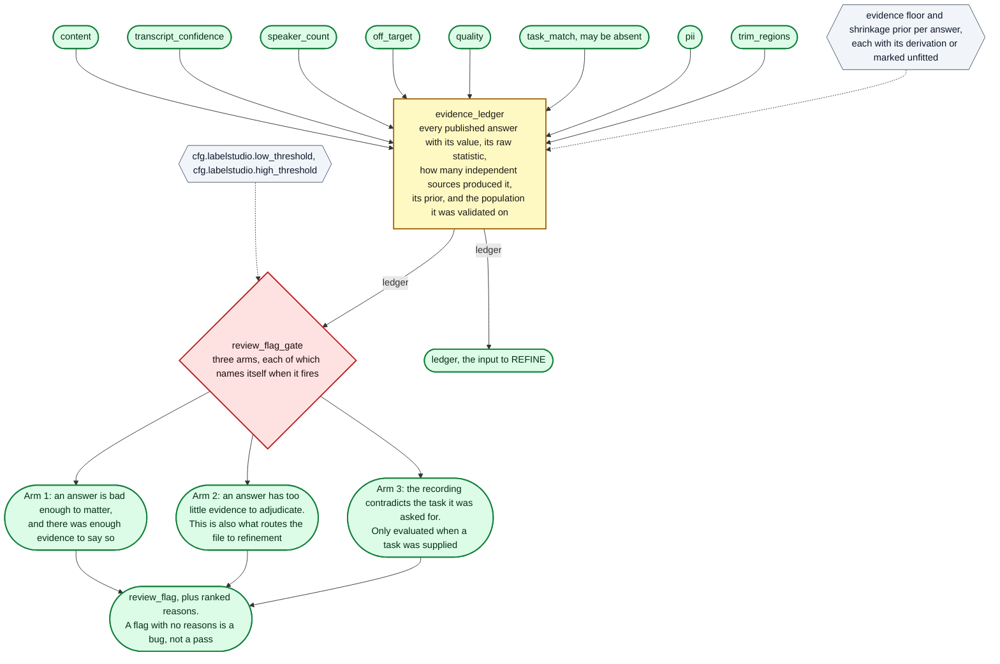

---

## Figure 8 — REFINE: the round loop as conditional re-entry

The loop is not an unrolled copy of the graph. It is one sub-workflow, `REFINE`, whose inputs
include the previous iteration's ledger, and which re-enters the same tasks over a narrower input.
The exit criteria are on the edges.

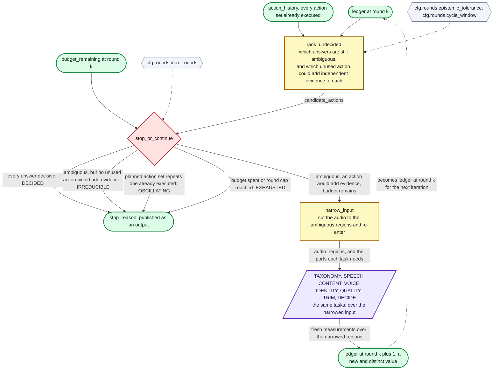

**What crosses the boundary, exactly:** the ledger, the remaining budget, and the list of action sets
already executed. Nothing else. No task reads a round index; only `rank_undecided` and
`stop_or_continue` see round state at all, and they see it as ordinary input ports.

**Why this is not a cycle in the data graph.** Products are versioned by round. `ledger@k` is an
input to round *k+1*'s tasks; round *k+1* writes `ledger@k+1`, a different value at a different
name. Nothing ever writes a product that one of its own ancestors read. The cycle exists only in the
graph over *task names*, and task names are not products.

**Stopping is an answer.** `stop_reason` is published, and `IRREDUCIBLE` combined with an ambiguous
answer is the honest terminal state: the tools available cannot decide this file, so a human must.

---

## Figure 9 — Where caching attaches

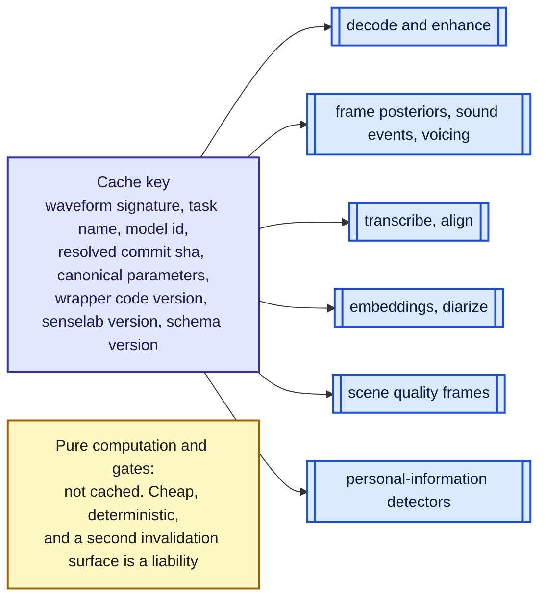

A round that narrows the audio to a region hands the inference tasks a **different waveform**, so it
gets a different signature and a different cache entry. That is the intended behaviour and it needs
no new key field — but it does mean the narrowed slice must be materialised as audio and its time
offsets restored on the way out, rather than passed as a span parameter alongside the whole file.

---

## Figure 10 — What today's code wires, and the ports with no producer

For contrast. This is the current pipeline's speaker-attribution path, drawn with the same
conventions. The dashed red box is a port that nothing writes, which is why three decisions
downstream of it have never once fired on a real run.

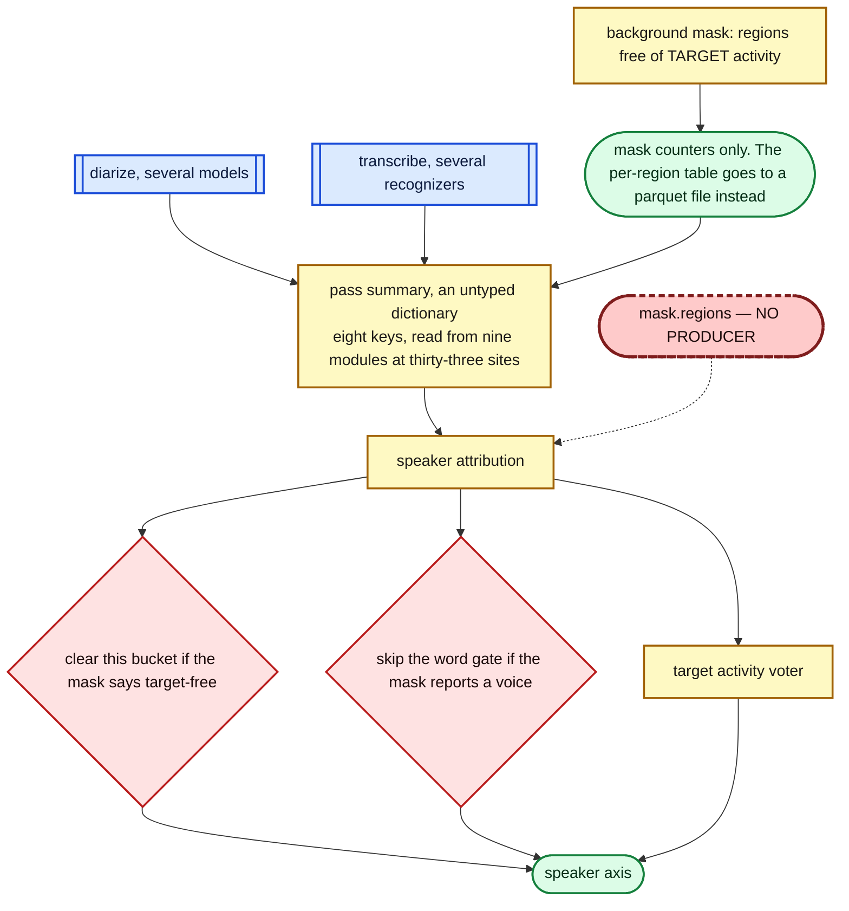

The proposed design has no equivalent of that dashed box, because `vocal_spans` is a declared output
port of a task that measures the audio, and a port with no producer stops the graph instead of
quietly reading an empty list. `design.md` section 7 works through what that means for the three
dead decisions.
