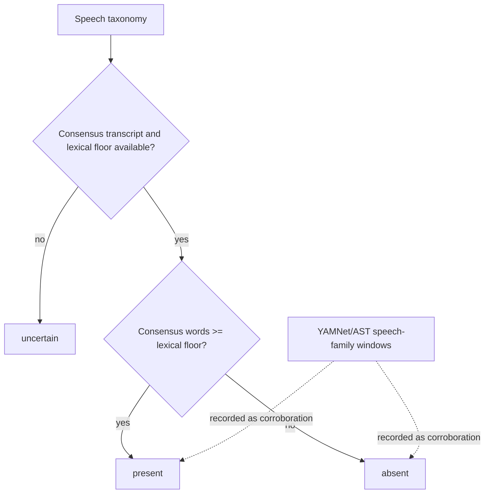
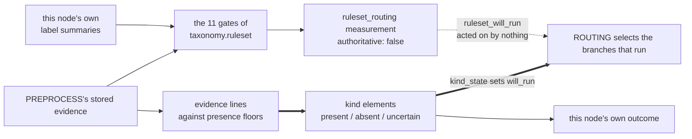

# TAXONOMY

Classifies which kinds are in the recording. [`routing.md`](routing.md) reads the classification and
decides which branches run.

It also evaluates the family taxonomy ruleset over the same store and records what that made of the
recording. **That second reading selects nothing** — the kind states below are still what decides.
See "The second reading, which decides nothing".

## Signature

```
taxonomy(store, source, config, hint=None, *, run_dir)
    -> fail(reason) | flag(reason, kinds) | pass(kinds)
```

Reads and writes the [element store](store.md). Writes one `kind` element per kind with its state and
the evidence behind it, plus the three file-scoped measurements under "Product". `hint` is accepted
for the shared node shape and is not read.

**TAXONOMY runs no models.** Every piece of evidence it reads was written by
[`PREPROCESS`](preprocess.md). It is a fold over stored classifications, not a detector committee.

**It infers; it classifies. It does not predict.** The word matters here because a branch may
subsequently refute the classification for its own kind ([`verdict.md`](verdict.md)), and a
classification that called itself a prediction would invite being scored as one.

**It localises nothing.** Which cough, which vocal task, and where, belong to the branches.

## What it reads

| element | author | used for |
| --- | --- | --- |
| `yamnet_windows` | PREPROCESS | speech-family labels in the pooled whole-file window sets |
| `ast_windows` | PREPROCESS | the same family, on AST's 10.24 s grid |
| `span_hear` | PREPROCESS | **per-span** HeAR labels — airway's authoritative line |
| `span_yamnet` | PREPROCESS | **per-span** AudioSet labels — airway's corroborating line |
| `consensus_transcript`, its lexical `word` elements | PREPROCESS | lexical evidence for the speech kind, and which spans are already explained |
| `<classifier>_scores` | PREPROCESS | this node's own whole-file label summaries |
| ~~`phonation_spans`~~ | — | **retired 2026-09-04; nothing proposes them and voice reads nothing** |

**Airway's lines are per-span, not the pooled whole-file windows.** `_span_label_evidence` reads
`span_hear` and `span_yamnet` directly — the same per-span classification AIRWAY's own branch
reuses — and excludes any span a live consensus word already explains, because ASR outranks both
classifiers and a transcribed span carries no airway content whatever either model says about it.
Only speech's `acoustic` line reads the pooled `*_windows`.

**Hints are not an input.** TAXONOMY classifies from PREPROCESS's stored evidence alone. A hint may force a branch to run
([`routing.md`](routing.md)) and may be compared against the branches' conclusions
([`verdict.md`](verdict.md)), but it never enters the classification, because a classification that
reads the declaration cannot disagree with it.

## The three kinds and their rules

| kind | what it is | classified from |
| --- | --- | --- |
| **speech** | lexical content | authoritative consensus words; YAMNet/AST speech-family labels are retained as corroboration |
| **airway** | non-voice, non-speech vocal-tract sound: cough, breath, throat clear | authoritative per-span HeAR labels; per-span AudioSet labels are retained as corroboration |
| **voice** | phonation that is neither: sustained vowels, humming, glides | **nothing — its source was retired and no replacement has been chosen** |

### speech

Two evidence lines, both read from the store:

| line | evidence |
| --- | --- |
| acoustic | a window whose set contains a member of `taxonomy.speech_labels`, from `yamnet_windows` or `ast_windows` |
| lexical | the consensus transcript's `word` entities with `bracketed: false`. **A bracketed word carries no lexical evidence** — see [`preprocess.md`](preprocess.md) |

The consensus transcript is the authoritative ASR product. When its lexical line is available, speech
is present when its word count reaches the lexical floor and absent when it does not. The acoustic line
is retained in the `kind` element as corroboration, but an isolated classifier label cannot overrule a
completed empty consensus. Speech is uncertain only when the lexical derivative or its floor is
unavailable.

#### Decision tree



### airway

| line | evidence |
| --- | --- |
| health-acoustic | a `span_hear` span whose label set contains a HeAR airway label, derived from `taxonomy.airway_ontology_roots` |
| acoustic | a `span_yamnet` span whose label set contains an AudioSet airway label, derived from the same roots |

**The two lines are not folded by agreement, and this doc used to say they were.** The rule is the
same authoritative-plus-corroboration shape as speech: `_fold_authoritative_line(lines,
"health_acoustic")`. HeAR is the domain-specific detector and decides alone; the AudioSet line is
recorded as corroboration and changes no state. Two sources agreeing is not stronger evidence than
one strong source — HeAR finding a clear cough does not need YAMNet's independent assent any more
than a consensus transcript needs an AudioSet speech label's.

Present when the health-acoustic line reaches its floor, absent when it is measured and does not, and
uncertain when it is `unavailable` — which is every recording under the packaged config, because both
floors are null.

A span an unretired consensus word already explains is excluded from **both** lines before either is
counted.

### voice

**Voice has no evidence source.** The sustained-phonation and glide detector that proposed
`phonation_spans` was removed on 2026-09-04: its criterion parameters had never been measured, so the
pass raised on every run, and its glide criterion was separately recorded as unfixable by fitting.
Nothing proposes those spans now.

`_retired_voice_line` is a placeholder that says so. It returns `state: unavailable`, `evidence: 0`
and a `why` naming the retirement, so a report or a figure prints a deliberate gap rather than a bare
`uncertain` a reader would take for evidence. The state folds to `uncertain` and **never to
`absent`** — which is what makes TAXONOMY's `fail` and `pass` outcomes unreachable today, and through
them the file verdict's `pass` and its acoustically-empty `discard`. See
[`dag.md`](dag.md), "Headline finding".

The rework is onto the file-level `consensus_taxonomy` and is a decision nobody has made: which
consolidated labels express the voice kind, and how they map to a state.
`taxonomy.voice_min_duration_s` and `taxonomy.voice_uncertain_duration_s` are read by nothing while
it stands.

## States

| state | meaning |
| --- | --- |
| **present** | the kind's rule is met |
| **absent** | the kind's authoritative line is measured and below its floor — speech's lexical line, airway's health-acoustic line. Unreachable for voice, which has no line |
| **uncertain** | the authoritative line is `unavailable`: its derivative is missing from the store, or its floor is null |

**A missing derivative is not absence evidence.** A classifier that wrote no windows, or a pass that
produced nothing because it did not run, leaves the line `unavailable`, and a kind whose
authoritative line is unavailable is `uncertain`, never `absent`.

**Corroboration is never read as strength.** A corroborating line raises no state and lowers none.
It is recorded so a reader can see what else was there.

## Every threshold is configurable

| key | governs |
| --- | --- |
| `taxonomy.speech_labels` | the speech label family. Vocabulary, not thresholds |
| `taxonomy.airway_ontology_roots` | the AudioSet ontology roots whose closure is the airway kind, for the AudioSet line and the HeAR line alike |
| `taxonomy.presence_floor.<kind>.<line>` | how much of a line's evidence a kind needs. **All four are null**, which is why no kind can be `present` or `absent` |
| `taxonomy.consolidation_floor` | the score a label needs to enter the consensus taxonomy, every classifier |
| `taxonomy.classifier_ontology_profile` | the one profile label identity, the airway closure and AIRWAY's corroboration all resolve through |
| ~~`taxonomy.voice_min_duration_s`~~, ~~`taxonomy.voice_uncertain_duration_s`~~ | read by nothing since the retirement |

Each key's derivation is in [`config-derivations.md`](config-derivations.md), keyed by config
section; `data/config/default.yaml` carries a one-line `#` description beside each. A key read with
`config.require` and left null raises; one read with `config.get` returns `None` and its caller
carries on silently, which is the more dangerous of the two.

## Outcome

| outcome | when | reachable today |
| --- | --- | --- |
| `fail` | every kind is absent | **no** — voice can never be `absent` |
| `flag` | any kind is uncertain | **always** — voice is always `uncertain` |
| `pass` | every kind is present or absent, and at least one is present | **no**, same reason |

Two tests pin the unreachability rather than asserting outcomes that cannot occur. It lifts when
voice gets an evidence source, and not before.

A `fail` here is not a file verdict: [`verdict.md`](verdict.md) decides what an all-absent
classification means, and [`routing.md`](routing.md) decides what still runs.

## Product

```
outcome:  fail(reason) | flag(reason, kinds) | pass
verdict:  { kinds: { airway: state, speech: state, voice: state } }
view:     each classifier's whole-file label summary, the consensus taxonomy,
          the ruleset_routing measurement, then the three kind element ids
```

Each `kind` element carries, per evidence line, what that line said, the elements it read, and the
score or duration behind it, so a reader can see why a kind is uncertain rather than only that it is.

**All three kinds are screened.** There is no `not_screened` state and no residual kind: `voice` has
its own rule and its own evidence, and nothing in this graph is a kind by virtue of what the other
kinds did not claim.

Three file-scoped measurements are written beside the kinds, all with `extent=None`:

| measurement | what it is |
| --- | --- |
| `<classifier>_label_summary` | per label, peak, median and window count over the whole file, off the verbatim scores sidecar, so it needs no threshold. A classifier that never ran gets no summary |
| `consensus_taxonomy` | the per-span labels of `span_yamnet` and `span_hear` consolidated into one file-level taxonomy, **one row per AudioSet ontology node** rather than per label string, each classifier's own spellings kept in `labels_by_classifier`. Disagreement is recorded, not resolved: a label only one vocabulary contains is not a vote against it |
| `ruleset_routing` | what the family taxonomy ruleset made of this recording. **It selects nothing** |

## The second reading, which decides nothing

TAXONOMY produces two independent readings of the same store and only one of them is acted on.



Four facts about the second reading, each of which a reader has got wrong at least once:

- **It is written last, and the order is a requirement.** Two VOICE gates read `plain|yamnet`, which
  the feature reader populates from the `yamnet_label_summary` **this node writes in the step
  before**. Evaluated earlier, both would read `unavailable` and VOICE would never route.
- **It reads no declaration.** The evaluation's `task_id` and `family` are empty, so `declared`,
  `agreed`, `missed` and `extra` are empty with them. A BIDS stem's `task-` id is a declaration, and
  this node does not read declarations — see "Hints are not an input" above, which is the same rule.
- **A failure to evaluate is recorded on the measurement, not raised.** `state: null` with a
  populated `error`. A reading that decides nothing must not be able to skip routing, every branch
  and REDACT. `state: null` and `state: "unexplained"` are different facts.
- **It changes this node's outcome not at all.** The outcome table below reads the three kind states
  and nothing else.

Both mechanisms are present on purpose, and the deletion of the first has not happened. The staging
is in [`../20260912-ruleset-in-pipeline/design.md`](../20260912-ruleset-in-pipeline/design.md), whose
"What stage 2 must delete" section names `taxonomy.presence_floor`, the kind-line machinery in this
node, and the parallel columns in `routing`.

## Out of scope

Running any model, localising anything, naming which airway event or which vocal task, reading
hints, and deciding which branches run. Evaluating the ruleset is **not** out of scope and deciding
on it is: this node records that reading and acts on none of it.

Derivations live in [`benchmarks/taxonomy.md`](benchmarks/taxonomy.md).

## Open derivations (v2)

| key | what is owed |
| --- | --- |
| `taxonomy.presence_floor.<kind>.<line>` | all four **null**. Fitting them is one option and deleting them is the other, and the staging points at the second: adopting the ruleset retires the question rather than answering it |
| `taxonomy.speech_labels` | **null**, and read `config.get(...) or []` by both its readers, so it empties the speech family without a word anywhere. It has no effect on any kind's state — speech folds on the lexical line alone — so what is owed is the vocabulary for a corroboration line, not for a decision |
| voice's evidence source | which `consensus_taxonomy` rows express the voice kind, and how they map to a state. `taxonomy.voice_min_duration_s` and `taxonomy.voice_uncertain_duration_s` are the retired detector's keys and are read by nothing; pre-alpha says delete them rather than carry them |
| the two selections' agreement | `will_run` and `ruleset_will_run` now sit on one entity per branch per recording and nobody has counted them against each other on the corpus. That count is what unblocks the deletions above |
